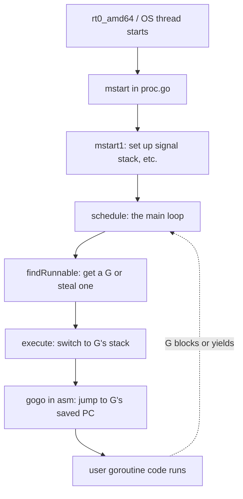

# Runtime Source Dive — Middle

## 1. From the map to the territory

Junior level was the map: you can name what `proc.go`, `chan.go`, `mheap.go` do, and you know there are three structs called G, M, P. Middle level is learning to *read* that code — not in the sense of "understand every line" (nobody does), but in the sense of opening `runtime/proc.go` and following a real call from user code into the scheduler without getting lost.

That's a different skill. The runtime is Go, but it's Go that's been bent into shapes you don't see in application code. There's no `interface{}` boxing on hot paths. There's no `append`. There's no `defer` in some functions, and the ones that do use `defer` often have a comment explaining why it's safe. Functions have names with underscores (`_g_`), some are written in assembly, and a lot of them are forbidden from triggering a stack growth or a write barrier.

This file is about the dialect. Once you can read it, the runtime stops being a wall of names and starts being a (very long) Go program.

---

## 2. The reading conventions

Open `runtime/proc.go` and scroll. You'll notice patterns that are not normal Go:

| Convention | What it means |
|------------|---------------|
| `getg()` | "Return the current goroutine pointer." Compiler intrinsic — reads the `g` register on amd64/arm64. |
| `_g_ := getg()` | Old-style local; modern code just writes `gp := getg()`. Both still appear. |
| `mp := getg().m` | Get the M (OS thread) that's currently executing. |
| `mcall(fn)` | "Switch to g0's stack and call `fn(curg)`." Used to call scheduler code that mustn't run on a user goroutine's tiny stack. |
| `systemstack(fn)` | "Run `fn` on the system stack." Like `mcall` but doesn't switch which goroutine is current. |
| `//go:nosplit` | Pragma. This function may not trigger stack growth. The compiler checks. |
| `//go:nowritebarrier` | Pragma. No write barriers in this function — critical during GC setup/teardown. |
| `//go:linkname local remote` | "This local symbol is actually the package-private `remote` from another package." The runtime's back door. |
| `//go:noescape` | Pragma on an assembly stub. Tells the escape analyzer "trust me, my arguments don't escape." |
| `//go:notinheap` | This type is never heap-allocated; the GC doesn't scan its pointers. |

When you see `getg()`, picture "read the thread-local that the scheduler maintains". When you see `//go:nosplit`, picture "this is going to be called somewhere a stack overflow check would be catastrophic — like the prologue of the function that *grows* the stack". The pragmas aren't decoration; they're constraints that make the surrounding code correct.

---

## 3. Why the runtime can't use parts of normal Go

The runtime is written in Go, but it can't use Go like you do. Three reasons:

**It's the thing implementing the feature.** `runtime/chan.go` *is* what `ch <- v` calls. So `chan.go` itself can't use channels for synchronization — it would be infinite recursion. It uses raw atomics, futex-style waits, and the scheduler's `gopark` primitive.

**Some code runs without a goroutine.** During scheduling, the M is on `g0` — a special "system" goroutine whose stack is the OS thread's stack (big, fixed). User-goroutine features like `defer`, stack growth, and goroutine-local state don't work there. If you `defer` on `g0`, you crash.

**The GC has rules.** A write barrier is a few extra instructions inserted around pointer writes during the marking phase. During *some* runtime operations, write barriers must be suspended (e.g., while you're in the middle of *changing* the GC's metadata). Functions with `//go:nowritebarrier` are checked at compile time.

So the runtime has its own informal subset:

```go
// What runtime code uses
- raw types (uintptr, unsafe.Pointer, fixed-size arrays)
- atomics from runtime/internal/atomic
- gopark / goready for blocking
- mcall / systemstack to switch stacks
- mallocgc directly (no `new`/`make` on hot paths)

// What runtime code avoids in hot paths
- interface{} (boxing allocates)
- append (may grow, allocates)
- defer in nosplit/nowritebarrier functions
- map literals (heap allocation, GC tracking)
- closures that capture pointers (escape)
```

The discipline goes "as deep as it needs to". `runtime/debug.go` is allowed to be relaxed Go. `runtime/asm_amd64.s` and the functions in `proc.go` adjacent to scheduling are not.

---

## 4. Following one call: `ch <- v`

The most productive way to read the runtime is to pick one user-level operation and trace it. Here's `ch <- v` end-to-end.

```go
// your code
ch <- 42
```

The compiler doesn't emit a `ch <- v` instruction. It rewrites the send into a function call. Which function depends on whether the value can be sent in one slot:

```
ch <- 42        →  runtime.chansend1(ch, &v)
select { case ch <- 42: ... }  →  runtime.selectnbsend or runtime.chansend (with block=false)
```

`chansend1` is a one-line wrapper in `runtime/chan.go`:

```go
func chansend1(c *hchan, elem unsafe.Pointer) {
    chansend(c, elem, true, getcallerpc())
}
```

So you follow into `chansend`. It's maybe 100 lines and it does, in order:

1. Sanity checks (nil channel + non-block → block forever; `c == nil` + blocking → `gopark` permanently).
2. Fast path: closed channel → panic.
3. If a receiver is parked on `c.recvq`, hand the value directly to them and `goready` them. No buffer copy.
4. Else if the buffer has room, copy the value into the buffer and return.
5. Else block: enqueue ourselves on `c.sendq`, `gopark` with the channel lock held.
6. After unparking: we've been handed off; return.

Each step is one paragraph of code. The whole thing is the channel "spec" in executable form. You don't need to memorize it; what you need is the *shape* — "send is a function, the function takes the channel lock, does direct-handoff if possible, otherwise buffers or blocks". Now `ch <- v` is not magic.

The same trace works for `close(ch)` → `closechan`, `<-ch` → `chanrecv1` → `chanrecv`, `len(ch)` → just reads `c.qcount` (no lock — it's a snapshot, deliberately racy).

---

## 5. The role of assembly

Open `runtime/asm_amd64.s`. It looks alien — Plan 9 assembly, not Intel or AT&T syntax. You don't need to read it line by line. You need to know *what's in there and why*.

| File | What it covers |
|------|----------------|
| `asm_amd64.s` | Entry point (`rt0_amd64`), `mcall`, `systemstack`, `gogo`, `morestack` |
| `sys_linux_amd64.s` | Raw syscall stubs (read, write, mmap, futex) |
| `memmove_amd64.s` | Optimized `memmove` (SSE/AVX paths) |
| `memclr_amd64.s` | Optimized `memclrNoHeapPointers` |
| `atomic_amd64.s` | CAS, atomic load/store with the right memory ordering |

The runtime uses assembly for four reasons:

- **Register conventions Go's calling convention doesn't expose.** On amd64, the runtime reserves register R14 to point at the current `g`. `getg()` is implemented as "read R14". You can't do that from Go.
- **Stack switches.** `mcall` and `gogo` literally swap stack pointers (`SP`). That can't be done in Go because Go's stack discipline would notice.
- **Syscall trampolines.** A Linux syscall is `SYSCALL` instruction with arguments in specific registers. There's no Go expression for that.
- **Hand-tuned `memmove`/`memclr`.** Go's compiler isn't going to emit AVX2-aligned loops for the general case, but the runtime can write one once.

The mental model: Go runs in Go, but at the **boundaries** — entry from the OS, switching between goroutines, talking to syscalls — there's assembly. The boundary is thin. Once you've crossed it, you're back in Go.

---

## 6. The scheduler entry path

This is the one trace every middle-level reader should do at least once. The entry sequence when a new OS thread starts running Go code:



Read it top-to-bottom in `proc.go`:

```go
// proc.go, abbreviated
func mstart() {
    // ... stack/signal setup ...
    mstart1()
    // mstart1 never returns under normal conditions
}

func mstart1() {
    _g_ := getg()
    if _g_ != _g_.m.g0 {
        throw("bad runtime·mstart")
    }
    // ... save SP, set up scheduler ...
    schedule()
}

func schedule() {
    _g_ := getg()
top:
    pp := _g_.m.p.ptr()
    // ... GC assist checks ...
    gp, inheritTime, tryWakeP := findRunnable() // blocks until something is runnable
    // ... preemption, profiling, tracing setup ...
    execute(gp, inheritTime)
}

func execute(gp *g, inheritTime bool) {
    mp := getg().m
    mp.curg = gp
    gp.m = mp
    casgstatus(gp, _Grunnable, _Grunning)
    // ... set up timeslice ...
    gogo(&gp.sched) // assembly: jump to gp's saved PC
}
```

Five functions, one per "phase". `gogo` is in `asm_amd64.s` and is a literal stack-pointer swap plus a jump. From the goroutine's perspective, it just woke up where it last yielded.

When the goroutine eventually calls `gopark` (e.g., waiting on a channel), the runtime saves its `sched` register state, marks it `_Gwaiting`, and falls back into `schedule()`. The loop continues with the *next* runnable G.

That's the whole user-mode scheduler in five functions. Everything else in `proc.go` is variation: work-stealing in `findRunnable`, sysmon preemption, GC coordination, locking around the global queue.

---

## 7. `g0` vs user `g`

Every M has two goroutines: its user one (`m.curg`) and its system one (`m.g0`). The distinction is constantly relevant when reading runtime code.

| Aspect | User `g` | `g0` |
|--------|----------|------|
| Stack | Small (2 KB initially), grows on demand | Large fixed (~8 KB on Linux), no growth |
| Created by | `runtime.newproc` (from `go f()`) | OS thread creation (`mstart`) |
| What runs on it | Your code | Scheduler, GC coordination, mallocgc slow path |
| Can `defer`? | Yes | Generally no — scheduler code avoids it |
| Stack-growth check | Yes (compiler inserts prologue check) | No — `//go:nosplit` everywhere |

When you see `mcall(schedule)` in runtime code, the meaning is: "from the current user goroutine, switch to this M's `g0`, and call `schedule` over there". After `schedule` picks the next G, it switches back. The user goroutine never sees that detour; it just feels like a context switch.

This is why some functions are split into a public version and an `_m` (or `1`) version:

```go
func gcStart(trigger gcTrigger) {
    // pre-flight: check on user g
    // ...
    systemstack(func() {
        gcStart_m(trigger) // does the real work on g0
    })
}
```

The pattern: "preflight on user g where defer/stack growth work, then jump to g0 for the dangerous part." Recognizing this idiom saves you minutes per function.

---

## 8. `//go:linkname` — the back channel

The `sync` package is in the standard library, not in `runtime`. But `sync.Mutex` blocks goroutines, which requires `gopark`. So how does `sync` call into the runtime without `sync` importing `runtime` (which would create cycles)?

The answer is `//go:linkname`. In `runtime/sema.go`:

```go
//go:linkname sync_runtime_Semacquire sync.runtime_Semacquire
func sync_runtime_Semacquire(addr *uint32) {
    semacquire1(addr, false, semaBlockProfile, 0, waitReasonSemacquire)
}
```

In `sync/runtime.go`:

```go
// runtime_Semacquire waits for *s > 0.
// Linkname to runtime; not for general use.
func runtime_Semacquire(s *uint32)
```

Note: no body in `sync`! The function is declared with no body, and `//go:linkname` in the runtime says "the symbol named `sync.runtime_Semacquire` is actually *this* function over here". The linker resolves the cross-package call.

This is the back channel that ties `sync`, `time`, `reflect`, `os`, and `net` into the runtime without polluting their public APIs. When you grep for `//go:linkname` in `$GOROOT/src/runtime`, you see the whole list of inter-package contracts.

Use this knowledge two ways:

1. When you see a function declared with no body in `sync` or `time`, search the runtime for `linkname <full.name>` to find the real implementation.
2. When the runtime has a function with the awkward name `sync_runtime_X`, you know `sync` is calling it.

> Third-party code can technically use `//go:linkname` too. It works. It's also fragile across Go versions — Go 1.23 tightened the rules and Go 1.24+ requires opt-in pragmas. Treat external `linkname` use as "this is a hack and the runtime team may break me".

---

## 9. Reading runtime tests

The single most underrated source of runtime documentation is `runtime/*_test.go`. Tests must run; they call public surface; they often demonstrate exact invariants.

Examples worth opening:

| Test file | What it teaches |
|-----------|-----------------|
| `runtime/proc_test.go` | Goroutine creation, `GOMAXPROCS`, work stealing — `TestGoroutineParallelism` and friends |
| `runtime/chan_test.go` | Channel semantics including the tricky races (closed-channel send, select on nil) |
| `runtime/mgc_test.go` | GC behaviour — when finalizers run, when sweep happens |
| `runtime/stack_test.go` | Stack growth — `TestStackGrowth` actually verifies the doubling behaviour |
| `runtime/select_test.go` | All the edge cases of `select` |

A test like:

```go
func TestChanSendSelectBug(t *testing.T) {
    // Reproduces issue 25997: send on closed channel was racing
    // with select default in the absence of a receiver.
    // ...
}
```

…is a more useful spec than the documentation. "Issue 25997 happened, here's the smallest program that triggers it, here's the invariant the runtime now upholds." When something seems wrong in your reading of the runtime, the test often clarifies whether the behaviour is intentional.

The Go team uses these tests as regression armor. You can use them as the most rigorous documentation Go has.

---

## 10. A sequence to follow with your editor

```mermaid
sequenceDiagram
    participant User as User code
    participant Compiler
    participant Runtime as runtime.chansend
    participant Sched as scheduler
    participant Recv as Receiver g

    User->>Compiler: ch <- 42
    Compiler->>Runtime: chansend1(ch, &v)
    Runtime->>Runtime: lock c.lock
    alt receiver waiting
        Runtime->>Recv: send direct (typedmemmove)
        Runtime->>Sched: goready(recvG)
        Runtime->>Runtime: unlock; return
    else buffer has room
        Runtime->>Runtime: copy to c.buf
        Runtime->>Runtime: unlock; return
    else blocking
        Runtime->>Sched: gopark (releases lock atomically)
        Sched-->>Recv: pick next runnable g
        Note over Runtime,Recv: send g sleeps here
        Recv->>Runtime: chanrecv direct-handoff later
        Sched->>Runtime: goready(sendG) → wake up
    end
```

If you can read `chansend` in `runtime/chan.go` and produce this diagram from memory, you've internalized the channel send path. That's a real, transferable skill — the same shape (lock → fast-path peers → buffer → block) shows up in `runtime/sema.go`, `sync/mutex.go`, `runtime/select.go`.

---

## 11. Tooling that helps

A few things make reading the runtime less painful:

- **Editor "go to definition" that crosses into stdlib.** VS Code + gopls does this out of the box. Without it, you'll be `grep`-ing constantly.
- **`git log -- runtime/proc.go`** in a clone of `github.com/golang/go`. Commits link to design docs and issues. The *why* of a region is often in a 3-paragraph commit message.
- **`go tool objdump -s 'runtime\.chansend$' $(go env GOROOT)/bin/go`** — see the actual disassembly. Sometimes the only way to understand `//go:nosplit` is to see what the prologue looks like.
- **GOSSAFUNC=runtime.chansend go build** in a tiny repro, then open `ssa.html` — the optimizer's view of the function.
- **`runtime.Stack`** in your own programs — it dumps every goroutine's stack with `[chan send]`, `[select]`, `[GC sweep wait]` annotations. Those tags are defined in `runtime/proc.go` as `waitReason*` constants. Matching them up is the fastest way to learn what blocks where.

---

## 12. Common middle-level mistakes

- **Reading top-to-bottom.** `proc.go` is 6000 lines. You'll bounce off. Pick *one* call (channel send, mutex lock, defer chain) and follow it. Ignore everything else.
- **Treating pragmas as comments.** `//go:nosplit` is enforced by the compiler. Ignoring it when you're trying to understand a function leads to wrong conclusions about what the function may or may not do.
- **Confusing `g` and `m`.** `g` is a goroutine (lots of these). `m` is an OS thread (a handful). `getg().m.curg == getg()` for a user goroutine; `getg() == getg().m.g0` for the system stack. Memorize this or you'll be lost.
- **Assuming `runtime` is C-like and pessimistic.** It's not. It's heavily commented and the comments are usually accurate. Trust them more than blog posts.
- **Pinning to `master`.** Internals shift. Always pin your reading to a specific Go tag (`go1.22.0`, `go1.23.0`) and note which tag in any notes you keep.
- **Skipping the tests.** When a function's behaviour is confusing, find its test. The test will exercise the exact edge case you're worrying about.
- **Trying to learn the GC first.** The GC is the hardest part of the runtime by an order of magnitude. Read the scheduler, the channel code, and the allocator first. Approach `mgc.go` with humility, ideally after reading Rick Hudson's design docs.

---

## 13. Summary

Middle-level runtime reading is fluency in a dialect: `getg()`, `mcall`, `g0`, `//go:nosplit`, `//go:linkname`. It's the discipline of following *one* call from user code into the runtime (`ch <- v` → `chansend1` → `chansend`) and stopping there. It's recognizing the entry-point assembly without trying to write any. It's reading `proc.go`'s five-function scheduler core and seeing how everything else hangs off it. It's using `runtime/*_test.go` as the most rigorous documentation Go publishes.

You don't need to understand every line. You need to be able to open the file, find the function, recognize the pragmas, and produce a one-paragraph summary of what it does. Once you can do that consistently, the senior-level material — concrete-typed scheduler internals, GC pacing, stack scanning — stops being "Go arcana" and starts being "more of the same dialect, applied harder".

---

## Further reading

- `runtime/HACKING.md` in the Go source tree — the runtime team's own onboarding doc; mandatory reading
- `runtime/proc.go` — `mstart`, `schedule`, `findRunnable`, `execute`
- `runtime/chan.go` — full channel implementation, ~700 lines
- `runtime/sema.go` — the `//go:linkname` back channel into `sync`
- `runtime/asm_amd64.s` — `mcall`, `systemstack`, `gogo` (read for shape, not detail)
- `runtime/runtime2.go` — every important struct definition (`g`, `m`, `p`, `hchan`, `sudog`)
- Dmitry Vyukov, "Scalable Go Scheduler Design Doc" (2012) — the proposal that introduced `P`
- Austin Clements, "Go 1.5 concurrent GC pacing" — the design behind `mgc.go`'s knobs
- Kavya Joshi, "The Scheduler Saga" (GopherCon 2018) — best video walkthrough of the scheduler entry path
- Rhys Hiltner, "An Introduction to go tool trace" — pairs runtime reading with what the trace actually shows
