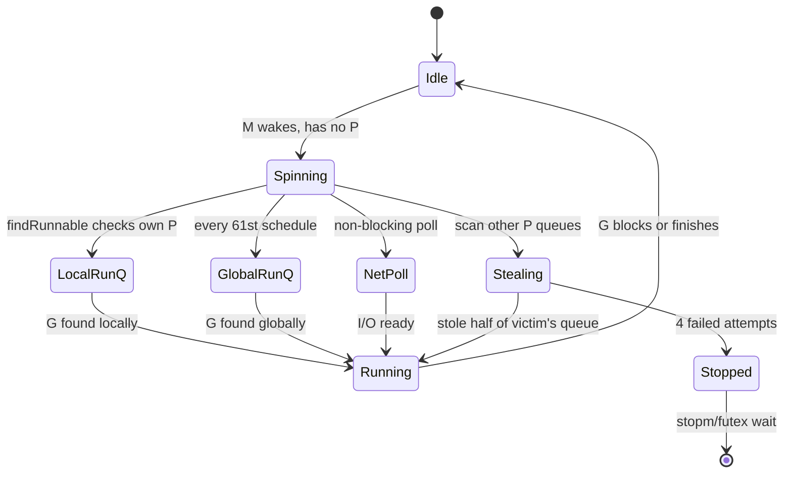

# Runtime Source Dive — Senior

## 1. Mental model — reading the runtime as the system under debug

At senior level the runtime is not "internals you might one day study". It is a piece of infrastructure that *fails on your service* and the postmortem terminates inside `$GOROOT/src/runtime`. The question is not whether to read it; it is **which 80 lines to read when production is on fire**. Junior knows the file map. Middle knows the conventions (`g0`, `mcall`, `//go:nosplit`, `//go:linkname`). Senior reads a 4 MB `SIGQUIT` dump and points at the line in `proc.go` that explains it.

Three habits separate the senior reader from the curious one:

**Read by symptom, not by section.** You do not open `proc.go` and read top-to-bottom. You see `runtime.gopark` at the top of every goroutine in a stuck dump, grep `gopark`, find the four call sites that matter (channel send, channel recv, `sync.Mutex`, `netpoll`), and decide which one this is. The runtime is enormous but the *failure surface* is small — most production incidents trace back to fewer than twenty functions.

**Pin to a Go version.** Runtime evolves fast. `findRunnable` in 1.14 is unrecognizable in 1.21 (work-stealing changed, `runtime.preempt` landed, timers moved out of `P`). Read `runtime/proc.go` at the *tag your binary was built with*, not at HEAD. A senior debugging a 1.19 service who reads 1.22 source is reading a different program.

**Trust the trace, verify in source.** `go tool trace` shows GC pauses, scheduler latency, goroutine state transitions — every event in the trace maps to a `traceEvent` call in the runtime. When a trace looks wrong (a 50 ms gap with no event), the explanation is in the source: either no instrumentation point in that region, or a `nosplit` path that suppressed tracing. The trace is the symptom; the source is the diagnosis.

| Reader profile | Opens runtime to... | Time spent in source per year |
|----------------|---------------------|------------------------------|
| Junior | Out of curiosity | 0–2 h |
| Middle | Understand one feature (`linkname`, `g0`) | 5–20 h |
| Senior | Decode a real outage | 50–200 h, mostly during incidents |

The senior bar is not "I have read all of `proc.go`". It is "given a stack of 4000 goroutines, I can tell you which 50 are interesting and why, with the runtime source open beside me".

---

## 2. Decoding a stuck program — `SIGQUIT` dumps from runtime stacks

`SIGQUIT` (Ctrl-\) makes a running Go process dump every goroutine and exit. `GOTRACEBACK=all` makes panics do the same. The dump is hundreds to millions of lines, but the *shape* of each goroutine is fixed:

```
goroutine 47 [chan receive, 12 minutes]:
main.worker(0xc000098060, 0xc0000a4000)
        /app/worker.go:88 +0xb2
created by main.main in goroutine 1
        /app/main.go:42 +0x115
```

Four pieces matter: the **state**, the **wait duration**, the **top frame**, and the **creator frame**. The state tells you *why* the goroutine is parked; the wait duration tells you *whether it has been stuck since boot*; the top frame is where to look in the source; the creator frame is who to blame.

The states (`g.atomicstatus` in `runtime2.go` → string in `runtime/traceback.go`) you will see in production:

| State string | g status | Source function | Meaning |
|--------------|----------|-----------------|---------|
| `running` | `_Grunning` | currently on M | Burning CPU |
| `runnable` | `_Grunnable` | on run queue | Waiting for a P |
| `chan send` | `_Gwaiting` | `chansend` → `gopark` | Blocked sending on a channel |
| `chan receive` | `_Gwaiting` | `chanrecv` → `gopark` | Blocked receiving |
| `select` | `_Gwaiting` | `selectgo` → `gopark` | All cases blocked |
| `IO wait` | `_Gwaiting` | `netpollblock` | Network read/write |
| `semacquire` | `_Gwaiting` | `runtime.semacquire1` | `sync.Mutex.Lock`, `sync.WaitGroup.Wait` |
| `sleep` | `_Gwaiting` | `timeSleep` → `gopark` | `time.Sleep` |
| `sync.Cond.Wait` | `_Gwaiting` | `runtime.notifyListWait` | `sync.Cond.Wait` |
| `GC worker (idle)` | `_Gwaiting` | `gcBgMarkWorker` | Idle GC mark worker |
| `GC assist wait` | `_Gwaiting` | `gcParkAssist` | Mutator paying mark-assist debt |
| `syscall` | `_Gsyscall` | inside a syscall | Blocked in kernel |
| `preempted` | `_Gpreempted` | async preemption (1.14+) | Stack-scanned; will resume |
| `runnable, locked to thread` | `_Grunnable` + `lockedm` | `runtime.LockOSThread` | Pinned, queue starvation possible |

When you see 3,000 goroutines in `chan receive` with the same top frame and wait duration `>30m`, you are looking at a leak. When you see 200 in `semacquire` on the same mutex address, you are looking at lock contention. When you see one in `running` and everything else in `runnable`, you are looking at a single goroutine that has held a P for too long without yielding — pre-1.14 this was permanent; 1.14+ it is a signal that async preemption may not have landed (tight loop without function calls, `//go:nosplit`, or CGo).

**The grep-and-bucket recipe.** Save the dump to a file and bucket:

```bash
# Count goroutines by state
grep -E '^goroutine [0-9]+ \[' dump.txt | sed 's/.*\[//;s/,.*//;s/\]//' | sort | uniq -c | sort -rn

# Bucket by top function (first frame after the header)
awk '/^goroutine [0-9]+ \[/{getline; print}' dump.txt | sort | uniq -c | sort -rn | head -20
```

The first command tells you the *distribution of waits*. The second tells you *where the goroutines are blocked in your code*. Five minutes of shell against a `SIGQUIT` dump localizes 80% of production hangs.

**`netpollblock` deserves its own paragraph.** Every blocked network read or write parks in `runtime.netpollblock`. The runtime calls `epoll_wait` (Linux), `kqueue` (BSD/macOS), or `IOCP` (Windows) on a dedicated thread and `goready`s the goroutine when the fd is ready. If you see thousands of goroutines in `IO wait` on the same connection target with no progress, the *remote* is slow or hung — not your process. The fix is upstream, not in the runtime.

**A worked dump.** Here is a real `SIGQUIT` excerpt from a service in trouble:

```
goroutine 1 [chan receive, 47 minutes]:
main.main()
        /app/cmd/server/main.go:122 +0x3c5

goroutine 17 [select, 47 minutes, locked to thread]:
runtime.gopark(0x..., 0x..., 0x1d, 0x12, 0x1)
        /usr/local/go/src/runtime/proc.go:381 +0xe6
runtime.selectgo(0x...)
        /usr/local/go/src/runtime/select.go:328 +0x7bc
github.com/x/cgolib.(*Bridge).pump(0xc00..)
        /app/vendor/cgolib/bridge.go:88 +0x16d

goroutine 88..3214 [chan receive, 12-47 minutes]:
        /app/pkg/work/pool.go:73
```

Three signals in eight seconds of reading: (1) `goroutine 1` parked since boot in `chan receive` — the main goroutine is waiting for a shutdown signal that arrived 47 minutes ago and was lost, or never sent; (2) `goroutine 17` is `locked to thread` — `runtime.LockOSThread` was called, which means whoever uses this G must release the M before any GC can fully proceed; (3) thousands of workers blocked in `chan receive` on a pool that is not refilling. The runtime did not break — your shutdown path did, and the worker pool's owner is gone. The diagnosis took longer to write than to make.

---

## 3. Scheduler under contention — `findRunnable`, work stealing, spinning M

Under load the scheduler is a state machine over `P`s, `M`s, and `G`s. The hot path lives in `runtime.schedule` → `runtime.findRunnable` in `proc.go`. At senior level you need to know what `findRunnable` does because *its cost dominates scheduler latency when most P are idle*.

`findRunnable` searches in roughly this order:

1. **Local `runnext`** — the most recent G ready on this P (priority slot).
2. **Local run queue** (`p.runq`, 256-entry ring buffer with atomic head/tail).
3. **Global run queue** (`sched.runq`) — checked occasionally to avoid starvation (every 61st schedule on a given P).
4. **Network poller** — non-blocking poll for ready I/O.
5. **Work stealing** — try to steal half the local queue of a random other P. Up to 4 attempts.
6. **Wait** — `stopm` parks the M.

The interesting senior insight is the **spinning M problem**. An M that runs out of work does not immediately park. It enters a *spinning* state — searching for work without holding a P — to absorb the latency of new work appearing on some other P. If a new G becomes ready, a spinning M can grab it within microseconds. The cost is CPU burn during the spin. The benefit is that a `go f()` does not have to wake a parked thread (a futex syscall, tens of microseconds) before `f` runs.

```
Idle M lifecycle:
  running G → no work in local queue
            → become "spinning" (no P held, scanning queues)
            → spin for ~ schedDelay (a few iterations)
            → either find work and resume, or stopm (futex wait)
```

**`wakep` and handoff.** When a goroutine becomes ready, the runtime decides whether to wake a parked M. The rule in `wakep`: do not wake if there is already a spinning M (it will find the work) or if all P are busy (nowhere to put it). A bug class lives here — if `wakep` is called from `nosplit` context or after the spinning M has just decided to park, a wake can be missed. The runtime has had several bug fixes around this (search the issue tracker for `wakep`, `lostwakeup`).

**`findRunnable` cost when many P are idle.** A scaled-down service with `GOMAXPROCS=32` but only 5 active goroutines pays *work-stealing taxes*: every quantum, idle M scan 31 other P queues. On a synthetic benchmark this is invisible (microseconds of overhead per second). In production, a process with very bursty load and high `GOMAXPROCS` can spend 5–10% of CPU on work stealing that finds nothing. The fix is either lower `GOMAXPROCS` (match it to *peak* concurrency, not core count) or `GOEXPERIMENT=newinliner`-style updates that have improved this in 1.21+.



**Reading the contention story in `runtime/trace`.** `go tool trace` colors goroutine states. A trace dominated by orange (`GCWait`) means GC mark-assist is starving mutators; a trace with long blue (`Syscall`) bars indicates blocking syscalls keeping G off P; a trace with many short colored bars and gaps between them indicates scheduler latency — the runtime is finding work but slowly. Each of these has a source-level explanation:

| Trace symptom | Source line | Fix direction |
|---------------|-------------|--------------|
| Orange `GCWait` dominance | `gcAssistAlloc` → `gcParkAssist` | Reduce allocation rate, increase `GOGC` |
| Long blue `Syscall` bars | `entersyscall_*` paths | Move to non-blocking, use channels |
| Gaps between events on a P | `findRunnable` failure paths | Lower `GOMAXPROCS`, batch work |
| Spinning M visible | `mspin` state in scheduler trace | Lower `GOMAXPROCS` or accept latency benefit |

---

## 4. Memory model implications in runtime source — `atomic`, `runq`, `mcache` publication

The Go memory model is concise but the *implementation* is visible in the runtime. Three patterns repeat:

**Lock-free `runq` with atomic head/tail.** `p.runq` is a 256-entry ring buffer. `runqget` and `runqput` use atomic load/store of `head` and `tail` to avoid locking on the common case. From `proc.go`:

```go
// Simplified — actual code has more atomic ordering details.
func runqput(pp *p, gp *g, next bool) {
    if next {
        // Try to swap into the priority runnext slot.
        oldnext := pp.runnext
        if !pp.runnext.cas(oldnext, guintptr(unsafe.Pointer(gp))) {
            // Lost the race; fall through to the queue path.
        } else {
            if oldnext == 0 { return }
            gp = oldnext.ptr()
        }
    }
    h := atomic.LoadAcq(&pp.runqhead)
    t := pp.runqtail
    if t-h < uint32(len(pp.runq)) {
        pp.runq[t%uint32(len(pp.runq))].set(gp)
        atomic.StoreRel(&pp.runqtail, t+1) // Store-release publishes the write.
        return
    }
    // Queue full — push half to the global queue.
    runqputslow(pp, gp, h, t)
}
```

The `StoreRel` pairs with `LoadAcq` on the steal path. *This is the publication barrier*: the slot write (`pp.runq[...]`) must be visible before the tail update is. Without acquire-release ordering, a thief could see the new tail but read garbage from the slot. This is the kind of code that looks innocent and is actually load-bearing — the comment is two lines but the correctness argument is a chapter.

**`mcache` per-P publication.** Each P has an `mcache` — a per-P allocator cache, so allocations under `GOMAXPROCS` cores do not contend. When the GC resets `mcache` state, every P's mcache must publish its updated state before any mutator on that P resumes. The runtime does this via `mcache.releaseAll` under a stop-the-world (STW), so no atomics are needed — STW is the synchronization barrier. Reading the GC pause logic without recognizing this is how people propose "remove STW from `mcache.releaseAll`" without understanding why it is there.

**Spinning loops with `procyield`.** When two M race on a mutex, the loser sometimes spins briefly before parking — better cache locality if the holder is about to release. The runtime calls `procyield(n)` which emits PAUSE on x86 — a hint to the CPU that this is a spin. Reading `procyield` in `asm_amd64.s` (5 lines of assembly) reveals an entire chapter of CPU memory ordering.

**Channel send end-to-end.** A senior reader should be able to trace `ch <- v` from user code to the parked goroutine in source. The sequence:

```mermaid
sequenceDiagram
    participant U as User code
    participant CH as runtime.chansend (chan.go)
    participant HC as hchan struct (lock, queues)
    participant SC as scheduler (proc.go)
    participant R as Receiver G

    U->>CH: ch <- v
    CH->>HC: lock(&c.lock)
    alt receiver waiting (recvq non-empty)
        HC-->>CH: dequeue sg from recvq
        CH->>R: send direct (typedmemmove to sg.elem)
        CH->>SC: goready(sg.g) — receiver runnable
        CH->>HC: unlock(&c.lock)
        CH-->>U: return (fast path, no copy to buffer)
    else buffered and buffer not full
        HC->>HC: copy v into c.buf[c.sendx]
        HC->>HC: c.sendx++, c.qcount++
        CH->>HC: unlock(&c.lock)
        CH-->>U: return
    else buffered full or unbuffered, no receiver
        CH->>HC: enqueue sender on sendq with v
        CH->>SC: gopark(unlockf=chanparkcommit)
        Note over CH,SC: G status _Gwaiting; scheduler picks next G
        SC-->>R: (later) receiver does chanrecv, wakes us
        R->>U: goready(sender)
        CH-->>U: return after resume
    end
```

Every box is a function in `runtime/chan.go`. Every arrow is a line of source. The "wait, why does my channel send block?" question evaporates the moment you can read this diagram off the source.

The senior insight: **the Go memory model gives you happens-before; the runtime source shows you what that costs**. Every channel send has an acquire-release pair. Every mutex lock has a memory fence. Every GC barrier has an atomic load. The runtime makes these explicit because *the runtime cannot be wrong* — application code can paper over a missed ordering with `sync.Mutex`, but the runtime *is* the implementation of `sync.Mutex`. There is no layer below it.

---

## 5. Reading-the-source-as-debugging — a goroutine leak example

A real shape: a service ramps from 500 to 5,000 goroutines over 6 hours, then OOMs. `pprof goroutine` shows 4,700 of them parked in `chan receive` at `myapp/worker.go:88`. Each call to `pool.Get()` spawns a worker; the pool never reuses. Where do you go in the runtime to confirm?

**Step 1: read the goroutine state.** `chan receive` ⇒ `chanrecv` in `runtime/chan.go` parked in `gopark`. So far that confirms the goroutine *is parked on a channel*. Not yet a runtime bug — could be your code.

**Step 2: identify the channel.** In a heap profile with `runtime.SetBlockProfileRate`, every park records the channel address and stack. Multiple goroutines parked on the *same* `hchan` address but *different* sender stacks means many readers, one writer — fan-in. Many on *different* `hchan` addresses, one each — fan-out leak.

**Step 3: trace the lifecycle in source.** `chanrecv` calls `gopark`. `gopark` calls `mcall(park_m)` which switches to `g0` and runs `dropg` (detach G from M) + `schedule()` (run something else). For the parked G to wake, *somebody* must call `goready` with that G's pointer. The `goready` call site is in `chansend` (when a buffered channel becomes non-empty) or `closechan` (when the channel is closed). If your code never sends or closes, the G *cannot* wake. The runtime is not buggy — your code is.

**Step 4: confirm with `pprof`.** `go tool pprof -goroutine` clusters goroutines by stack. 4,700 in `chanrecv` from `worker.go:88` says: 4,700 worker goroutines parked waiting for work that the producer is not sending and the channel is not being closed.

Senior shape: **the runtime source is a debugging tool because it documents the contract**. "If your G is parked on a channel, only `chansend` or `closechan` can wake it" is a *proof obligation* on your code. The runtime source is the proof.

**A second class — mark assist amplification.** A service with high allocation rate (e.g., decoding 1 GB of JSON per second) experiences p99 latency spikes. Trace shows long orange `GCWait` bars on the affected requests. Source: `gcAssistAlloc` in `runtime/mgcmark.go` makes mutators that allocate during a GC cycle *participate* in marking proportional to their allocation. The math: assist debt = (bytes allocated since cycle start) × `assistRatio`. When `assistRatio` is high (GC behind), mutators get drafted as mark workers. The fix: reduce allocation (sync.Pool for hot allocations), raise `GOGC`, or stay below the GC's pacing limit. The diagnosis came out of reading `gcAssistAlloc` and seeing that mutators *can* be drafted — not from documentation that hides this.

---

## 6. `runtime/trace` ↔ source — reading a trace as "the source executed"

`go tool trace` is the runtime's self-instrumentation: every scheduler decision, GC phase, syscall, and goroutine state change emits a `traceEvent`. The events are listed in `runtime/trace.go` (or `runtime/traceback.go` in older versions; restructured in 1.21). The senior skill is **mapping a visual element of the trace to the source function that emitted it**:

| Trace event | Source function | What you're looking at |
|-------------|-----------------|------------------------|
| Goroutine start | `traceGoStart` in `schedule` | A G was picked from a run queue |
| Goroutine block | `traceGoPark` in `gopark` | A G called `gopark` (channel, mutex, etc.) |
| Goroutine unblock | `traceGoUnpark` in `goready` | Somebody called `goready` |
| GC start | `traceGCStart` | `gcStart` in `mgc.go` |
| GC STW start | `traceSTWStart` | Stop-the-world began |
| GC mark assist | `traceGCMarkAssistStart` | Mutator drafted into marking |
| Syscall enter | `traceGoSysCall` | `entersyscall` |
| Syscall exit | `traceGoSysExit` | `exitsyscall` |
| Heap alloc / free | `traceHeapAlloc` | GC heap pressure curve |

Reading a trace without knowing this map is like reading X-rays without knowing anatomy. With the map, a 50 ms gap between "G unblock" and "G start" on a P means *somebody scheduled this G but it took 50 ms before a runnable P was available* — scheduler latency, almost certainly `GOMAXPROCS` saturation. A trace with frequent `traceGCMarkAssistStart` on a mutator means *that mutator is allocating fast enough to be drafted* — its latency is partly your allocation rate, not the GC's STW.

**Reading a trace in source-level vocabulary** changes the conversation. "GC pause was 8 ms" becomes "STW mark termination ran for 8 ms; the dominant cost in `gcMarkTermination` is `gcRescanStacks` because we have 50,000 goroutines". That is the level at which fixes are actionable.

---

## 7. Cooperative vs async preemption — where the runtime protects you

Pre-Go 1.14, preemption was *cooperative*: the compiler inserted preemption checks at function call boundaries. A tight loop without function calls could hold a P forever. The textbook example:

```go
// Pre-1.14: this loop never yields, blocking GC and other goroutines.
for {
    if atomic.LoadInt32(&done) != 0 { break }
}
```

A single such goroutine on a 1-core machine froze the whole runtime — GC could not stop-the-world because that one goroutine never reached a safe point. The fix in 1.14 was **asynchronous preemption** via signals: the runtime sends `SIGURG` to the M, the signal handler walks the goroutine's stack to a safe point, and the runtime resumes it. Issue: golang/go#10958 (the proposal); commit `4d5005bb05e` landed it.

Post-1.14, the same loop is preemptible. But the runtime *still cannot* preempt:

- **A G in a Cgo call.** Until cgo returns, the runtime cannot deliver a signal that walks the G's Go stack. Long C calls (a big regex, a sleep) stall scheduling on that M (not the whole runtime, but that thread).
- **A G in a `//go:nosplit` function.** Preemption requires stack-growth checks; `nosplit` disables them. Used for low-level runtime primitives.
- **A G holding the runtime's `m.locks` count.** Locks > 0 means "we are in the middle of a runtime operation; do not preempt me here". Released as soon as the operation completes.
- **A G with `runtime.LockOSThread`** is not impervious to preemption, but it pins the M, which has cascading effects on scheduling.

**Senior implication.** A Cgo-heavy service can still exhibit "frozen goroutine" symptoms post-1.14 — not because preemption is broken but because Cgo opts out by construction. The fix is structural: short Cgo calls, or release the goroutine before the long call (`runtime.UnlockOSThread`, finish before the Cgo). The runtime protects you *cooperatively*; it cannot save you from Cgo.

---

## 8. Reading bug-fix commits — preemption, scavenger, parallel mark

The runtime's git history is the best Go internals course nobody markets. Every major behavior change has a commit message, a linked proposal, and benchmark numbers. The senior skill is **reading commits as case studies**.

A short list of commits and their lessons:

| Change | Commit / Issue | Lesson |
|--------|---------------|--------|
| Async preemption (1.14) | golang/go#10958; commit `4d5005bb05e` | Signal-based preemption; safe-point requirements |
| Scavenger improvements (1.13–1.16) | golang/go#30333 | Background return of unused pages to OS |
| Parallel GC mark workers | golang/go#11970 | Mark phase parallelism; mutator assist |
| GC pacing rewrite (1.18) | golang/go#44167 | New GC pacer for predictable allocation behavior |
| Soft memory limit (1.19) | golang/go#48409 | `GOMEMLIMIT`; how GC adapts |
| Timer rewrite (1.14) | golang/go#27707 | Per-P timer heaps; not a global lock |
| Channel improvements (various) | search "runtime: channel" | Many small wins; chan path is hot |

**Reading method.** Pick a runtime function that surprises you. Run `git log -p $GOROOT/src/runtime/proc.go | less` and search for changes to that function. Each commit has a one-line subject and a multi-paragraph body. The body links to the issue. The issue has the design discussion. Forty minutes of reading replaces forty hours of guessing.

**A concrete example: the scavenger.** Before the 1.13 rewrite, Go returned memory to the OS via a periodic background sweeper that was slow and conservative — long-lived processes held RSS well above their working set. The 1.13 commit (golang/go#30333) introduced a *paced* scavenger that targets a heap-growth ratio and returns pages continuously. Reading this commit explains why a service that upgraded 1.12 → 1.13 saw its RSS drop 30% with no code change. Without the commit history, this is magic; with it, it is a design decision with explicit trade-offs.

The professional level on this topic goes further — actually contributing to runtime, reviewing CL on gerrit. At senior, the bar is *reading commits as documentation*.

---

## 9. The two clocks — `nanotime` vs wall time

The runtime measures time with `runtime.nanotime`, not `time.Now`. `nanotime` is a *monotonic* clock (`CLOCK_MONOTONIC` on Linux, `mach_absolute_time` on macOS); `time.Now` includes wall-clock time, which can jump (NTP, daylight savings, manual `date` changes).

Why this matters in production:

- **GC pacing uses `nanotime`.** If wall time jumped, GC pacing would whipsaw. Monotonic time is a precondition for stable behavior.
- **Timers (`time.Timer`, `time.After`) use `nanotime`** internally. A `time.Sleep(1*time.Second)` waits one *monotonic* second, immune to clock jumps. This is a Go correctness property that `time.Now()` does *not* have.
- **`time.Time` (since Go 1.9) carries a monotonic reading alongside wall time.** Subtraction (`t2.Sub(t1)`) uses the monotonic reading; comparison and formatting use wall time. Reading `time.Time.Sub` source reveals why a `t1` deserialized from JSON (loses monotonic reading) and a `t2.Sub(t1)` produces a wrong duration if wall clock changed between t1 and t2.

**The senior heuristic.** For *latency* and *intervals*, the runtime uses monotonic time. For *human-presentable timestamps*, it uses wall time. Conflating them in your own code is a class of bug that becomes a postmortem: a benchmark that ran during DST transition reported negative durations; a circuit breaker that used `time.Now()` as a deadline expired prematurely after an NTP adjustment.

**`runtime.nanotime` is not in the public API**. It is exposed via `//go:linkname` from `time.runtimeNano()`. If your code wants raw monotonic nanoseconds for a high-cardinality timing histogram, the path is `time.Now().UnixNano()` and accept the wall-clock dependency, or hop the `linkname` bridge — covered in `middle.md`. Senior judgement: do not hop into runtime for a 5% perf win; pay the public API cost.

---

## 10. Postmortems — failure shapes traced to runtime mechanics

**Incident 1: the 90-second pause every 10 minutes.**

A trading service ran fine for hours, then froze for ~90 s every 10 min. CPU dropped to zero. Traces showed STW for the full duration. Cause: a long-running goroutine on an M that was *in Cgo* invoking a third-party library performing a 90 s I/O operation. The GC needed to stop the world; it could stop every G except the Cgo-bound one. Pre-1.14, this would have been permanent. 1.14+ tolerated short Cgo calls; this one was longer than any sane threshold. The runtime source path:

- `stopTheWorld` in `proc.go` iterates Ps; for each P, finds the M; for the M in Cgo, waits via `_PSyscall` until `exitsyscall` runs.
- The wait is unbounded; Go does not yank a thread out of a syscall. If your code does, the entire runtime is held.

Fix: rewrite the call to use Go-native I/O (eliminating Cgo) or budget the call (move it off the hot path so a GC-induced pause does not coincide with active trading windows). Either way, the diagnosis required reading `stopTheWorld`.

**Incident 2: the mysterious p99 cliff at 800 req/s.**

A service with `GOMAXPROCS=8` ran clean at 700 RPS, hit a p99 cliff at 800 RPS. p50 stayed flat. CPU was at 60%. The cliff was scheduler latency: `findRunnable` started returning slowly when run queues backed up. Cause: a handler had a tight CPU loop (matrix math) that ran ~3 ms without yielding. Pre-1.14 this loop never yielded; 1.14+ it preempted every ~10 ms via `SIGURG`, but only after holding a P for that long. With 8 Ps and ~50 concurrent such handlers in flight, P contention queued G's behind 10 ms preemption boundaries. The diagnosis came from the trace showing 10 ms gaps between G unblock and G run.

Fix: chunk the loop (`runtime.Gosched()` every 1000 iterations) so preemption is *cooperative* on a 1 ms boundary, not async on 10 ms. The runtime source path:

- `runtime.Gosched` calls `mcall(gosched_m)` → puts the G on the *global* run queue → `schedule` picks the next G immediately.
- Cooperative yield is faster than waiting for `SIGURG` because no signal cost, no stack walk, no atomic-status transition.

**Incident 3: the goroutine count that went to one million.**

A WebSocket gateway accumulated goroutines: 500 → 50K → 1M over 18 hours. Heap was modest (each goroutine ~8 KB stack); the OOM was from goroutine metadata in the runtime, plus the GC mark cost scaling with goroutine count (each goroutine's stack must be scanned at GC time). The leak: every connection spawned a "read pump" and a "write pump" goroutine; on connection drop, only the read pump exited; the write pump parked in `chan receive` on a `messageOut` channel that was never closed. From `runtime/proc.go` and `chan.go`:

- `gopark` registered the G as parked on `hchan.recvq`.
- `goready` from `chansend` or `closechan` was the only wake path. Neither was called.

Fix: defer-close `messageOut` from the connection lifecycle owner. Diagnostic process: `pprof goroutine` showed 950K G's in `chanrecv`. Each was 8 KB of stack plus G overhead. GC pause walked all of them on every cycle — a separate latency cost.

---

## 11. Senior code review checklist — runtime-adjacent code

When reviewing PRs that touch the runtime boundary, the line between "subtle correctness" and "production hang" is thin. The questions below catch the common failure modes:

1. **`runtime.LockOSThread`** — Is the corresponding `UnlockOSThread` deferred? Has the author considered that this G now cannot move between Ms (so syscall blocking on this G blocks the M, which leaves a P idle)?

2. **`runtime.SetFinalizer`** — Is the finalized object referenced elsewhere? Finalizers run on a special goroutine; if the object holds a reference back to itself, it never becomes unreachable. Has the author considered that finalizers are *best-effort* and may not run before exit?

3. **`runtime.KeepAlive`** — Is it actually needed? `KeepAlive` is a compiler instruction, not a runtime operation; it prevents the optimizer from concluding a value is dead. The usual case is around Cgo or `unsafe.Pointer` where the GC could collect a backing object during a call. Missing it is a use-after-free bug.

4. **`//go:linkname` into runtime** — Is the target a stable symbol? `runtime.nanotime` has been stable for years; `runtime.gcPercent` has not. Has the author pinned a Go version and documented the fragility? Has the author considered an explicit comment for future maintainers?

5. **`unsafe.Pointer` with runtime structures** — Layout depends on Go version. `g`, `m`, `p` fields move. Reading them via `unsafe` is a time bomb. Is there a Go version check? Better: stop reading runtime structs from user code.

6. **CGo calls in hot paths** — Each CGo call traverses `entersyscall_*`/`exitsyscall_*`, costs ~150 ns minimum, prevents preemption for the call duration. Is the CGo call inside a loop? Can it be batched?

7. **`recover()` not at goroutine top level** — `recover` must be called directly inside a deferred function on the panicking goroutine. Has the author wrapped goroutine launches in a panic-recovery helper?

8. **Panic in a goroutine without recover** — Crashes the whole process. Every `go func()` in long-lived code should have either a `defer recover()` or be considered a deliberate let-it-crash signal.

9. **Spawning goroutines without bounded lifecycle** — Every `go func(...)` must have an owner who knows when it will exit. Without that, you are signing up for a goroutine leak. PR should explain the termination condition.

10. **Channels without owners** — A channel without a defined "who closes it" is a leak waiting to happen. Reviewer asks: who closes? When? What if that owner crashes?

11. **Tight loops without function calls** — Even in 1.14+, async preemption has overhead. Cooperative `runtime.Gosched()` in a CPU-bound loop is cheaper than waiting for `SIGURG`. Worth flagging on any loop > 1 ms expected duration.

12. **`time.Now().Sub(other)` after deserialization** — `other` loaded from JSON lost its monotonic reading. The subtraction now depends on wall clock. Use `time.Since` only on monotonic-bearing `time.Time`. For deadlines that survive serialization, store relative durations, not absolute timestamps.

13. **`runtime.GC()` calls in non-test code** — A red flag. Explicit GC ruins pacing. The only legitimate uses: benchmarks, memory-leak tests, deliberate latency control in batch jobs.

14. **`debug.SetGCPercent` / `debug.SetMemoryLimit` in init** — These globally tune GC. A library should never call them. Only application code should.

15. **Calling exported runtime functions in a hot path** — `runtime.NumGoroutine`, `runtime.Caller`, `runtime.GC` all have non-trivial cost. `runtime.Caller(0)` walks the stack. Once per request: fine. Once per log line: not fine. Profile before adding.

16. **Assumption that `GOMAXPROCS == NumCPU`** — In containers, `GOMAXPROCS` defaults to the host's CPU count, not the container's quota. `automaxprocs` (Uber) or Go 1.25+ container-aware GOMAXPROCS may be needed. Reviewer checks: is the binary aware of its cgroup CPU limit?

---

## 12. When NOT to dive in + closing principles

### 12.1 When the runtime source is not the answer

- **You have not read the trace.** `go tool trace`, `pprof`, `runtime/metrics` answer 90% of questions without opening source. Open source only when the trace says something the docs do not explain.
- **You have not pinned the Go version.** Reading HEAD when your binary is 1.19 produces a confident wrong diagnosis. Always `git -C $GOROOT log --oneline | head -1` first.
- **The bug is in your application.** A goroutine leak is usually `worker.go:88`, not `runtime/proc.go:1234`. Confirm your code is innocent before blaming the runtime.
- **The "fix" requires monkey-patching runtime.** If your conclusion is "I need to call into a private runtime symbol via `linkname` to fix this", step back. The runtime is not a customizable layer. The fix is structural.
- **You are reading for cool-factor, not for a question.** Curiosity is fine; treating runtime source as a substitute for design thinking is not. The reader who asks "what should this code *do*" outperforms the reader who recites what it *does*.

### 12.2 Closing principles

**Read runtime source under symptoms, not by section.** A goroutine state, a trace event, a `pprof` cluster — these are the entry points. The runtime is far too large to read cover-to-cover for value; it is well-sized for symptomatic reading.

**Pin to the Go version your binary was built with.** `go env GOVERSION` on the failing host, then `git checkout` on a runtime clone. Reading 1.22 source about a 1.19 incident is wrong by construction.

**Treat the trace as the source executed.** Every visual element of `go tool trace` maps to a `traceEvent` call. Knowing the map turns the trace from a colorful picture into a stack trace through time.

**Monotonic time is a runtime gift, not a default.** The runtime measures durations with `nanotime`. Application code that re-derives durations with `time.Now()` after serialization loses that guarantee. Pass durations, not timestamps, across serialization boundaries.

**The runtime protects you cooperatively.** Async preemption (1.14+) closes most of the gaps. Cgo, `nosplit`, and `m.locks` are the remaining holes. A senior reviewer flags long Cgo calls before they become incidents.

**Bug-fix commits are documentation.** The fix for "why does my service do X" is often a single commit message on `runtime/proc.go` from three years ago. Learn to `git log -p` on the runtime as a primary research tool, not a last resort.

**The runtime is not customizable.** `linkname`, `unsafe.Pointer` into `g`/`m`/`p`, `SetFinalizer` — these are escape hatches with sharp edges. If your fix relies on one of them, your fix is fragile across Go versions. Senior taste prefers structural fixes to runtime monkey-patching.

**Goroutine leaks are runtime-visible bugs in application code.** The runtime tells you exactly how many goroutines exist, in which states, on which stacks. There is no excuse for missing one in production. Wire `runtime.NumGoroutine()` to a metric; alert when it grows monotonically.

**STW costs scale with goroutine count.** A million parked goroutines makes every GC cycle scan a million stacks. The runtime is not the bottleneck; your design is. Reading `gcMarkTermination` reveals the cost; the fix is fewer goroutines.

**Read the runtime when the trace lies.** If `pprof` says one thing and your dashboard says another, the truth is in the source. The trace is a sampled abstraction; the source is the ground truth.

**A senior is fluent in three Go runtimes: the one in production, the one at HEAD, and the one in the commit log between them.** Production tells you what is happening now. HEAD tells you what is coming. The commit log tells you why the runtime is the shape it is.

The runtime source dive at senior level is not a one-time exercise. It is a habit — open `runtime/` during incidents, read commits during quiet hours, follow proposals and design docs to anticipate the next major change. Done well, it is the difference between "the runtime is magic" and "the runtime is a program I can debug like any other".

---

## Further reading

- **Design docs** —
  "Scalable Go Scheduler Design Doc" (Dmitry Vyukov, 2012) — introduced `P`
  "NUMA-Aware Scheduler for Go" (Vyukov) — never landed but explains the model
  "Go GC: Latency Problem Solved" (Hudson, 2015) — concurrent GC design
  "Getting to Go: The Journey of Go's Garbage Collector" (Rick Hudson, ISMM 2018)
- **Talks** —
  "How the Go Runtime Implements Maps" — Keith Randall, GopherCon 2016
  "Inside the Go Playground" — Brad Fitzpatrick — production runtime in practice
  "The Scheduler Saga" — Kavya Joshi, GopherCon 2018
  "Go Execution Tracer" — Dmitry Vyukov, GopherCon
- **Source artifacts** —
  `$GOROOT/src/runtime/HACKING.md` — internal style and conventions
  `$GOROOT/src/runtime/mprof.go` — what `pprof` actually measures
  `$GOROOT/src/runtime/trace*.go` — what `go tool trace` emits
- **Commits / issues to read** —
  golang/go#10958 — async preemption proposal
  golang/go#44167 — GC pacer rewrite
  golang/go#48409 — `GOMEMLIMIT` (Go 1.19)
  golang/go#27707 — timer rewrite (per-P heaps)
  golang/go#30333 — paced scavenger
- **Blog posts** —
  "Go's work-stealing scheduler" — Jaana Dogan
  "Why Go's design is the future" — Dave Cheney
  "Scheduler tracing in Go" — Bill Kennedy / Ardan Labs
  Go runtime profiling cookbook — Felix Geisendörfer (felixge.de)
- **Tools** —
  `GODEBUG=schedtrace=1000,scheddetail=1` — per-second scheduler dump
  `GODEBUG=gctrace=1` — per-GC summary
  `GODEBUG=allocfreetrace=1` — every alloc/free (slow)
  `runtime/metrics` package — stable runtime telemetry
  `go tool trace`, `pprof`, `delve` — the senior toolbox
