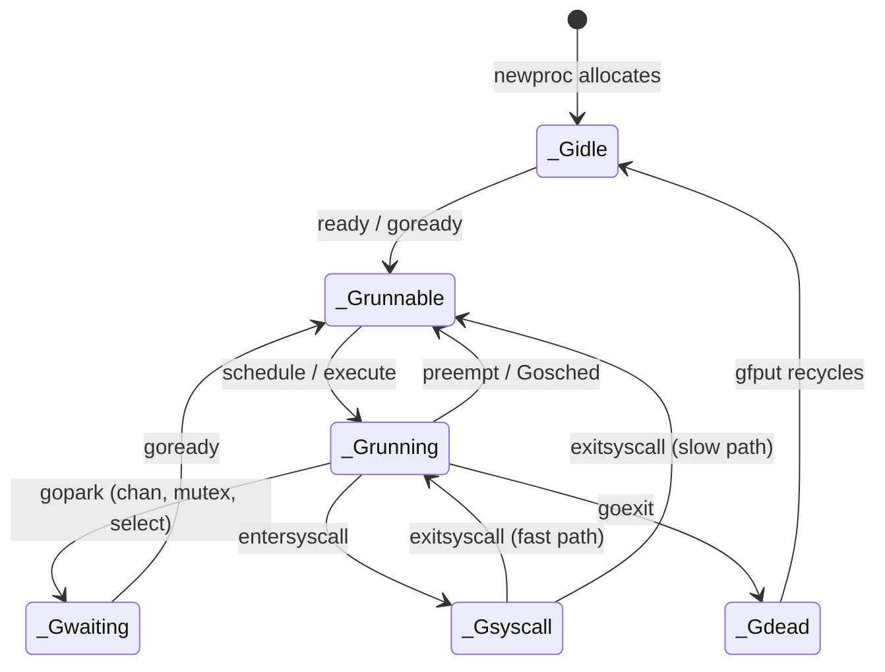
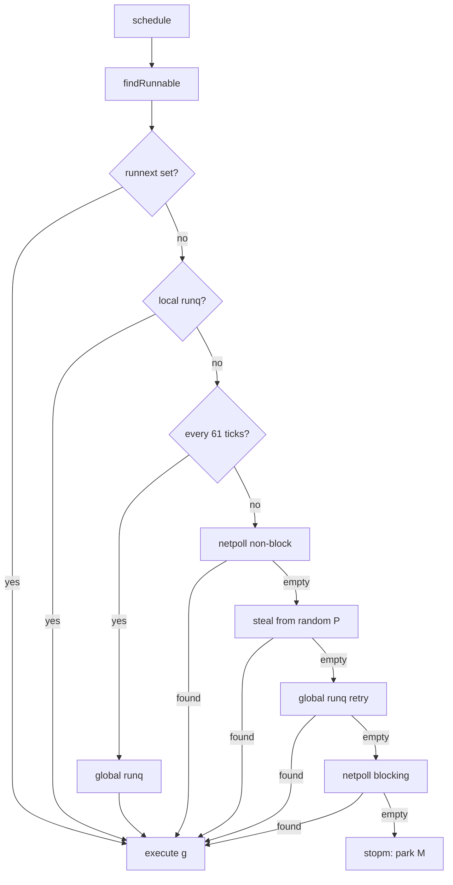

# Scheduler Source — Middle

## 1. What the junior view leaves out

The junior summary of the scheduler is roughly: "G's run on M's, P's hold the runnable queue, the scheduler shuffles G's between P's". That description is correct and useless for anything beyond a whiteboard answer. The middle-level view is: *how* the scheduler picks the next G, *when* it wakes another thread, *how* a blocked G stops eating a thread, and *how* a long-running G eventually yields. All of those are decisions made by a small set of functions in `runtime/proc.go` — `schedule`, `findRunnable`, `wakep`, `handoffp`, `sysmon`, `retake`, `preemptone`, `asyncPreempt`. Reading those is the only way to graduate from "GMP diagram" to "I understand why my service spends 4% of CPU in `runtime.findrunnable`".

Everything below maps onto code you can `grep` for in the Go source.

---

## 2. The big loop: `schedule`

Every M (machine, i.e. OS thread) runs a tiny loop on its `g0` stack:

```
schedule:
    g := findRunnable()   // blocks until something is runnable
    execute(g)            // switches to g's stack and runs it
    // g eventually returns to schedule (via goexit or a park)
```

That's literally what `runtime.schedule` does, minus the bookkeeping. The interesting function is `findRunnable`: it never returns nil. It either finds work or parks the M.

The state diagram of a single G:



Anything that ever looks at the scheduler — tracer, profiler, debugger — uses these state names (`_Grunnable`, `_Grunning`, `_Gwaiting`, `_Gsyscall`, `_Gdead`). Worth memorizing.

---

## 3. `findRunnable`: priority order

`findRunnable` is the heart of the scheduler. Stripped of edge cases, it tries these sources, in this order:

| Step | Source | Why this order |
|------|--------|----------------|
| 1 | `_p_.runnext` | Just-readied G; running it next preserves cache locality and producer-consumer pairs |
| 2 | Local runq (`_p_.runq`) | LIFO/FIFO ring buffer of up to 256 G's on this P |
| 3 | Global runq (`sched.runq`) | Shared queue under a global lock; touched only every 61 ticks or on miss |
| 4 | Netpoller (non-blocking) | Drain ready FDs into runqs |
| 5 | Steal from another P | Random victim, take half of their local runq |
| 6 | One more global+netpoll check | Last chance before parking |
| 7 | Stop the M (`stopm`) | Park on `sched.idle` until woken |

The "61 ticks" rule (`schedtick%61 == 0`) is a fairness valve: every P occasionally checks the global runq even when its local queue has work. Without it, a P producing work for itself could starve the global queue forever.



Three details that matter:

- **`runnext` is a single G slot, not a queue.** When `go f()` runs, the new G goes to `runnext`. The previously-`runnext` G (if any) gets pushed to the tail of the local runq. This is what makes `go func() { ch <- v }()` followed by `<-ch` cheap — the goroutine you just spawned is the very next one scheduled.
- **The local runq is a fixed-size 256-entry ring**, accessed lock-free for the owning P. Overflow spills half to the global runq.
- **`findRunnable` only parks the M if every source is empty.** Parking is expensive; the scheduler does work to avoid it.

---

## 4. Work-stealing: half from a random victim

When the local runq is empty, the M tries to steal. The algorithm in `runtime.stealWork`:

1. Pick a random other P (with a randomized walk order to avoid all M's piling on P0).
2. Try to drain half of that P's local runq into ours.
3. If that fails, try the next P in the random order.
4. Up to 4 full passes over all P's before giving up.

Why half? Stealing one G means the victim immediately gets stolen from again. Stealing all means the victim becomes idle and the thief is overloaded. Half is the standard work-stealing balance — both sides leave with usable work.

The cost is real:

- An atomic CAS on the victim's runq head/tail.
- Cache-line bouncing — every steal pulls the victim's runq into the thief's cache.
- The randomized walk means high `GOMAXPROCS` values produce O(P) idle-time scans.

A program with bursty parallelism (many short goroutines spawned briefly) spends measurable time in `runtime.findrunnable`/`runtime.stealWork`. A program with long-lived goroutines that rarely block doesn't.

`runnext` is **not** stealable for the first run (a brief 3μs grace), to preserve the producer-consumer locality benefit. After the grace period it becomes stealable like any other queue entry.

---

## 5. `wakep` and the spinning-M dance

When a goroutine becomes runnable (e.g. via `goready` from a channel send), the scheduler may need a thread to run it. `wakep`:

```
wakep:
    if there is an idle P AND no spinning M already:
        start or resume a spinning M
```

A **spinning M** is one that has no G but is *actively* looking for work — running `findRunnable` in a tight loop rather than parking. Spinning costs CPU; spinning M's are why an idle Go process can still show 5-10% CPU on `top`.

Why allow it? Because **waking a parked thread is expensive** (futex syscall, ~5-10μs). If a G is about to be readied in the next microsecond, it's cheaper to have one M spin briefly than to park and re-wake. The scheduler caps the number of spinning M's at `GOMAXPROCS/2` so the cost stays bounded.

The handshake works like this:

1. Code does `goready(g)` → puts `g` on a runq.
2. `wakep` is called.
3. If a spinning M exists, it will find `g` on its next iteration of `findRunnable` — *no syscall*.
4. If no spinning M, `wakep` starts one (either resumes a parked M or creates a new one).
5. The new spinner sees `g`, becomes non-spinning, runs it.

So the spinning M is a **batched wake**: one spinner absorbs many quick wake events.

Common confusion: spinning is **not** a busy-wait on a lock. It's the scheduler hunting for runnable G's. You see it in profiles as `runtime.findrunnable` cost.

---

## 6. Syscall handoff: keeping P's busy when M's block

When a goroutine enters a blocking syscall, the M doing the syscall is stuck in the kernel and useless for scheduling other G's. If nothing else happened, that P would sit idle until the syscall returned.

The scheduler avoids this with `handoffp`:

```
entersyscall:
    detach P from M  (P state: _Psyscall)
    record start time on P
    (M proceeds into the kernel)

if syscall takes too long (>20μs detected by sysmon):
    handoffp: P is given to another M (started or resumed)
    P state: _Prunning under a new M

exitsyscall:
    M tries to re-acquire its original P (fast path)
    if that P is now owned by another M:
        M parks itself, G goes onto global runq (slow path)
```

The fast path is what happens when a syscall returns quickly — the M re-grabs its P and resumes. The slow path triggers when `sysmon` (see §10) noticed the syscall taking too long and reassigned the P. In that case, the M becomes idle and the G goes to the global runq for someone else to pick up.

This is why Go can have `GOMAXPROCS=8` and 5000 goroutines doing `os.ReadFile` simultaneously without dying — each blocked M is just a parked thread; the 8 P's are constantly being handed off to fresh M's. (The OS does need to actually create those threads. `pprof` will show them under `runtime.newm`.)

| Operation | What happens to the M | What happens to the P |
|-----------|-----------------------|-----------------------|
| Channel block (`gopark`) | M keeps the P, runs another G | Stays with M |
| Mutex contention | M keeps the P, runs another G | Stays with M |
| Blocking syscall (short) | M is stuck in kernel | Stays with M, fast re-acquire on return |
| Blocking syscall (long) | M is stuck in kernel | Handed off via `handoffp` to a new M |
| Cgo call | M is dedicated to the cgo call | Handed off (cgo is treated like a syscall) |
| `runtime.LockOSThread` | M is pinned to this G | P released only when G blocks |

---

## 7. Netpoll integration

The other reason Go scales is that network I/O doesn't block the M at all.

When you call `conn.Read` on a non-ready FD:

1. `net` package puts the FD in non-blocking mode (it always is, internally).
2. The `read` syscall returns `EAGAIN`.
3. The runtime registers the FD with the netpoller (epoll on Linux, kqueue on BSD, IOCP on Windows) and `gopark`s the goroutine.
4. The G is now `_Gwaiting`; the M moves on to find another G.
5. When the FD is ready, `netpoll` (called from `findRunnable`, `sysmon`, and GC) returns the list of woken G's.
6. Those G's get pushed onto runqs and become schedulable again.

The crucial property: **a goroutine waiting on the network does not occupy a thread.** A million network-blocked goroutines cost ~8 KB of stack each (~8 GB of memory) but zero OS threads. This is the structural difference between Go and "one-thread-per-connection" runtimes.

`netpoll` is called in three places:

- Inside `findRunnable` as a non-blocking poll (step 4 in §3).
- Inside `findRunnable` as the **blocking** call right before parking the M (step 6/7) — better to wait inside epoll than to park and re-wake.
- From `sysmon` every 10ms-ish, so even idle M's don't leave FDs un-noticed.

---

## 8. `LockOSThread`: pinning a G to an M

`runtime.LockOSThread()` pins the current G to the current M until `UnlockOSThread`. While locked:

- The G never migrates to another M.
- The M never runs another G (it sits idle when this G is blocked).
- When the G `gopark`s, the M can release its P (via `handoffp`) so other M's can use it.
- When the G exits without unlocking, the M is destroyed (preventing leaked thread-local state).

Why? Some OS APIs are thread-local — GUI main loops on macOS/Windows, certain pthread state, OpenGL contexts, `setuid` on Linux (which is thread-local in Linux despite POSIX saying otherwise). `LockOSThread` lets you guarantee a goroutine sees the same kernel thread for its lifetime.

Cost: the M can't be reused. If you lock 1000 goroutines, you have 1000 OS threads. Use sparingly. The `cgo` integration uses this internally for some calls.

Common mistake: locking a goroutine and forgetting to unlock. The thread leak is invisible in your code but shows up as RSS growth.

---

## 9. Preemption: cooperative, then signal-driven

Pre-1.14, the scheduler could only preempt G's at function-call boundaries — the compiler inserted a check at every function prologue (`morestack_noctxt`) that the `sysmon` thread could trip. A tight loop with no calls was uninterruptible. The classic demo:

```go
func busy() { for {} }     // pre-1.14: pinned a P forever
```

Go 1.14 added **async preemption** via signals (`SIGURG` on Linux). `sysmon` periodically scans for G's that have been running too long (>10ms) and calls `preemptone`:

- Sets `gp.preempt = true` and `gp.stackguard0 = stackPreempt` (the cooperative bit, in case the G reaches a function call).
- Sends `SIGURG` to the M running it.
- The signal handler in the runtime (`runtime.sigtramp` → `runtime.asyncPreempt`) saves the G's registers, switches to `g0`, and re-enters `schedule`.

The G goes back to the local runq and gets rescheduled later. From the G's perspective, it pauses mid-instruction and resumes.

This is why `for {}` no longer hangs the program on modern Go. It's also why a stack trace can land on an arbitrary instruction, not just a function boundary.

Subtleties:

- Async preemption is disabled inside the runtime itself (signals during GC or write barriers would be a nightmare).
- Some CPU instructions are unsafe to preempt (atomic sequences, certain SIMD operations); the runtime checks for those and defers preemption.
- `sysmon` only preempts G's running for more than 10ms — Go does **not** preempt every quantum like a kernel scheduler.

---

## 10. `sysmon`: the monitor thread

`sysmon` is a single, special M started at runtime initialization. It runs no G's and never holds a P. It loops roughly every 10-20μs (sleeping longer when the program is idle), and on each tick it can:

- **Retake P's from long syscalls** — call `handoffp` on any P that's been in `_Psyscall` for too long.
- **Preempt long-running G's** — `retake` calls `preemptone` on G's running >10ms.
- **Drive the netpoller** — call `netpoll` if no one else has lately.
- **Force GC** — trigger `runtime.forcegchelper` if it's been >2 minutes since the last GC.
- **Scavenge** — return unused heap memory to the OS.

`sysmon` is the only goroutine-like thing in the runtime that has no goroutine — it's a dedicated thread that bypasses the scheduler. Without `sysmon` you could not have async preemption, you could not retake P's, and long-idle programs would never return memory to the OS.

You can see it in `runtime/debug.SetGCPercent(-1)` debugging — `sysmon` is also what notices the goal-vs-actual heap mismatch and triggers GC pacing.

---

## 11. The `g0` system goroutine

Every M has two G's associated with it:

- The **user G** currently running (or none).
- A **`g0`** — a special G with a large (~64KB) system stack used to run scheduler code, GC, signal handlers, and other runtime work.

When `schedule` runs, it runs on `g0`'s stack. When a user G calls `runtime.gopark`, the runtime swaps off the user G's stack, onto `g0`'s stack, and `findRunnable` happens there. When `g0` finds the next G, it swaps stacks again into the user G.

This is the source of the famous "goroutine 0 [running]" entry in stack traces — `g0` is goroutine 0 on the main thread (other M's have their own `g0`s, numbered separately).

Why a separate stack? Because the user G's stack can be tiny (2KB initially), and running the scheduler/GC requires more space. Switching to a known-large stack guarantees runtime code can't blow its own stack.

Implication: a panic in the scheduler is "fatal error: ...", not a recoverable panic. The runtime is running on `g0`, which has no `defer`-able recovery context.

---

## 12. The global runq and its lock

The global runq (`sched.runq`) is a `gQueue` — a doubly-linked list of G's protected by `sched.lock`. It's used for:

- G's that overflowed a local runq (200+ already queued locally).
- G's returning from a slow-path `exitsyscall` whose original P was reassigned.
- New G's spawned when `runtime.GOMAXPROCS == 0` (rare edge case).
- The 61-tick fairness drain.

`sched.lock` is the biggest scalability bottleneck in the scheduler. Most well-behaved programs never touch the global runq under steady state — work stays in local runqs. Programs that hammer the global runq (lots of overflow, lots of slow-path syscall exits) show up as `runtime.lock2` in profiles.

You generally do not need to do anything about this — keeping per-P work below 256 G's keeps you out of the global queue automatically. If you have *millions* of goroutines spawning at once, expect global-runq contention.

---

## 13. Common misconceptions

- **"P = OS thread."** No. M = OS thread. P = scheduling context. P's outnumber M's only briefly (during syscall handoff transitions). M's outnumber P's commonly (each blocking syscall ties up an M).
- **"`GOMAXPROCS` limits the number of goroutines."** No, it limits the number of P's and therefore the number of G's running *simultaneously*. You can have a million goroutines with `GOMAXPROCS=1`.
- **"Spinning M's are bugs."** No. They're a deliberate optimization for fast wake. They should not exceed a few percent CPU; if they do, that's a sign of too-fine-grained goroutine churn.
- **"Goroutines are scheduled fairly."** Mostly, but not always. `runnext` is a deliberate unfair-but-cheap optimization. The 61-tick global drain provides eventual fairness, not per-tick fairness.
- **"`go func(){}()` is free."** ~200 ns of allocation + scheduler bookkeeping + an 8KB stack reservation (virtual). Free at one per ms, expensive at one per μs in a hot loop.
- **"Preemption is per-tick like the kernel."** It's per-10ms-ish, only on G's that have been running that long, only since 1.14, and via signal. Far less precise than kernel scheduling.
- **"Network I/O blocks the goroutine *and* the thread."** Only the goroutine. The thread keeps doing work via the netpoller integration.

---

## 14. Summary

Middle-level scheduler knowledge is about the *mechanism* behind the GMP diagram. `findRunnable` runs a priority order: `runnext` → local runq → global runq → netpoll → steal half from a random P → park. `wakep` and spinning M's exist to absorb fast wake events without the cost of a thread-park syscall. Blocking syscalls trigger `handoffp` so the P stays busy under another M. Network I/O routes through the netpoller, so blocked goroutines cost only stack memory, not threads. `sysmon` is a dedicated monitor thread that preempts long-runners, retakes P's, drives netpoll, and triggers GC. `g0` is the system goroutine that scheduler code runs on. `LockOSThread` pins a G to an M for thread-local state. All of this together is why Go can scale to a million goroutines with `GOMAXPROCS=8` and still preempt a `for {}` loop.

---

## Further reading
- `runtime/proc.go` — `schedule`, `findRunnable`, `wakep`, `handoffp`, `sysmon`, `retake`
- `runtime/runtime2.go` — `g`, `m`, `p`, `schedt` struct definitions
- `runtime/preempt.go` — async preemption machinery
- `runtime/netpoll.go` and `runtime/netpoll_*.go` — per-OS netpoll backends
- Dmitry Vyukov, "Go scheduler" design doc (2012) — the original work-stealing proposal
- Austin Clements, "Proposal: Non-cooperative goroutine preemption" (Go 1.14)
- Ardan Labs, "Scheduling in Go" (Bill Kennedy) — three-part series
- `GODEBUG=schedtrace=1000,scheddetail=1` — live scheduler tracing
