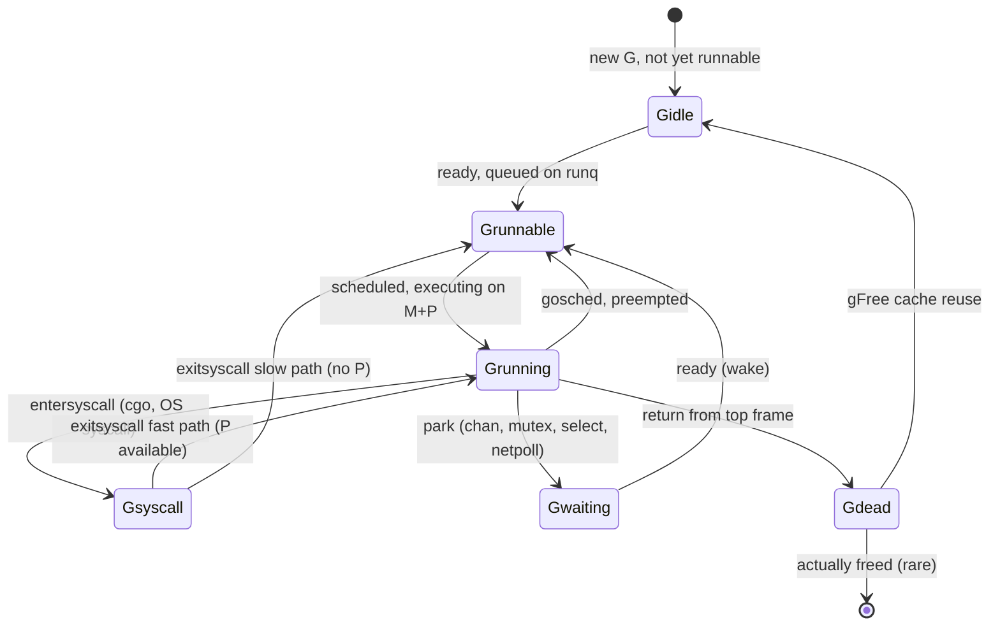

# Scheduler Source — Senior

## 1. Design goals — Vyukov's 2012 proposal re-read in 2026

The Go scheduler that ships in `runtime/proc.go` is the descendant of Dmitry Vyukov's "Scalable Go Scheduler Design Doc" (2012), and every line of it is a compromise between four goals stated explicitly in that document: **scalability, fairness, low overhead, low latency**. Reading the source without that framing produces an endless stream of "why this constant?" — every magic number resolves to which goal it was bought from and which it was paid for.

**Scalability** means the number of CPUs (`GOMAXPROCS`) can rise from 1 to a few hundred without throughput collapsing. The pre-1.1 scheduler had a single global runq behind one mutex; throughput plateaued near 4 cores and regressed past 8. Vyukov's M:P:G model added a **P** (logical processor) between the kernel thread M and the goroutine G; each P owns a local runq and steals from peers when empty. The global `sched.lock` exists but is touched on slow paths only.

**Fairness** means no goroutine starves. A scheduler that always drains its local runq before touching the global one will let a CPU-bound goroutine on P0 monopolize forever while a fresh goroutine on the global queue waits. The fix is the **fairness tax**: every 61st schedule on a P drops the local runq and pulls from the global one. The constant 61 is prime, deliberately not 60 or 64 — to avoid resonance with periodic timer wheels and external schedulers that tick on round numbers.

**Low overhead** means the cost of `go f()` and of a goroutine-to-goroutine switch must stay in tens of nanoseconds. The price of full per-P queues, work stealing, and preemption is paid in code complexity; the scheduler's hot path is hand-tuned assembly (`runtime/asm_amd64.s`, `runtime/asm_arm64.s`) and explicit cache-line layout (`runtime/runtime2.go`).

**Low latency** means a runnable goroutine starts running quickly even under load. The 1.14 async-preemption rework is almost entirely about tail-latency: a goroutine running a tight loop without function calls used to be uninterruptible, blowing p99 scheduler latency to seconds.

| Goal | Mechanism | Source artifact | Cost paid in |
|------|-----------|-----------------|--------------|
| Scalability | Per-P local runq, work stealing | `runqput`, `runqsteal` | Memory, code complexity |
| Fairness | Every-61st global pull, async preempt | `schedule()` line "if sched.runqsize > 0" gated on `_p_.schedtick%61==0` | Throughput on hot loops |
| Low overhead | 256-slot fixed local runq, lock-free CAS | `runqhead`/`runqtail`, `gFree` cache | Latency on overflow |
| Low latency | Async preempt via `SIGURG`, hand-off on syscall | `preemptone`, `handoffp` | Cgo cost, signal complexity |

The senior reading of the source starts with this table. Every line in `proc.go` is one of those four goals; finding which one explains every constant.

---

## 2. M:P:G — the three structs that run Go

```
   ┌──────────┐ owns ┌──────────┐ runs ┌──────────┐
   │    M     ├──────►    P     ├──────►    G     │
   │ (kernel  │      │ (logical │      │(goroutine│
   │  thread) │      │  proc)   │      │  stack)  │
   └──────────┘      └──────────┘      └──────────┘
        │                  │                  ▲
        │ blocked on       │ local runq       │
        ▼ syscall          ▼ 256 slots        │
   ┌──────────┐       ┌──────────┐            │
   │   M' or  │       │ global   │ overflow   │
   │  netpoll │       │   runq   ├────────────┘
   └──────────┘       └──────────┘
```

**M** (`runtime.m`) is the OS thread. Pinned to a P when running Go code; unpinned during syscalls and cgo. Its critical fields: `g0` (the scheduler's own stack), `curg` (the goroutine currently running on this M), `p` (the P it owns), `oldp` (the P it left during a syscall).

**P** (`runtime.p`) is the logical processor — a resource limiting parallel Go execution to `GOMAXPROCS`. Owns the local runq, the timer heap, a cache of free Gs, a defer pool, an mcache for per-P allocation. There are exactly `GOMAXPROCS` Ps, allocated once at startup or on `runtime.GOMAXPROCS(n)`.

**G** (`runtime.g`) is the goroutine. Stack, instruction pointer, status word, parking reason. Note: the G is *not* the unit of CPU ownership — the P is. A G that wants to run becomes runnable; it is the *scheduler* that decides which P and M run it.

The senior detail: **a runnable G is just an entry in a runq, owned by a P**. There is no thread of execution waiting for it. When `go f()` runs, the new G is pushed onto the current P's runq via `runqput`. Throughput hinges on the rate of `runqput` and `runqget`, and both are tuned to avoid touching the global structure.

### The local runq is 256 slots — why?

`runtime.p.runq` is a fixed-size circular buffer of 256 G pointers, with `runqhead` and `runqtail` as 32-bit atomic indices.

```
// runq fields in runtime/runtime2.go
runqhead uint32
runqtail uint32
runq     [256]guintptr
```

256 is not arbitrary. Three properties paid for it:

1. **Cache locality.** A `[256]guintptr` is 2 KB on 64-bit, fitting in L1 (32 KB typical). The producer and consumer manipulate adjacent slots; the cache line containing `runqtail` stays hot on the local CPU.
2. **Simple memcpy on steal.** Work-stealing copies half the victim's runq to the thief. With a fixed array, the copy is `memmove(thief.runq, victim.runq[head:], n*8)` — branch-free, vectorizable. A linked list would force a per-node traversal.
3. **Overflow signals genuine queue saturation.** If 256 fresh goroutines exist locally and none can be stolen quickly, the system is over-subscribed; spilling to the global runq is correct. A larger local queue would let one P hoard work, defeating fairness.

The trade is paid on overflow: `runqputslow` moves 128 Gs to the global runq, which requires taking `sched.lock`. A burst of `go f()` calls (think: an HTTP server fanning out 10K requests in microseconds) overflows immediately. The senior fix at the application layer is a worker pool sized to `GOMAXPROCS` plus a bounded channel, not unbounded `go`.

---

## 3. The global runq, the fairness tax, and the 61 constant

The global runq (`sched.runq`, an intrusive linked list of Gs through `g.schedlink`) is the spillover and the fairness equalizer. It is protected by `sched.lock`, a single global mutex. Three paths touch it:

1. **Overflow.** `runqputslow` moves Gs out of a full local runq.
2. **`go f()` from a P with no local space.**
3. **The fairness tax.** Every 61 schedules on a P, `schedule()` checks the global runq first.

```go
// approx. logic from runtime/proc.go: schedule()
if _g_.m.p.ptr().schedtick%61 == 0 && sched.runqsize > 0 {
    lock(&sched.lock)
    gp = globrunqget(_g_.m.p.ptr(), 1)
    unlock(&sched.lock)
    if gp != nil {
        execute(gp, false)
    }
}
```

**Why 61?** A prime, near 60 (one minute of seconds), avoiding alignment with timer ticks, GC cycles, and metric scrapes. If the constant were 64, every 64th schedule would tend to coincide with cache-line refills and other 64-aligned events; the prime breaks that resonance.

**Lock contention on `sched.lock` is the canonical scheduler bottleneck on big machines.** A 64-core service that bursts goroutines hammers the global runq via `runqputslow` and the fairness path; `perf` shows `runtime.lock2` and `runtime.futex` dominating. Mitigations:

- Reduce burst rate — worker pool with bounded channel instead of `go` per task.
- Increase `runq` saturation tolerance by *not* spawning faster than P count.
- Lower `GOMAXPROCS` when sharing the box (avoid runaway Ps fighting for `sched.lock`).
- For latency-sensitive code, pin critical goroutines and avoid spawning peers.

Visibility: `runtime.SchedTrace` (set `GODEBUG=schedtrace=1000`) emits per-second snapshots of runq sizes; `globrunqsize` consistently high under load is the smoking gun.

---

## 4. Work stealing — `findrunnable`, half-steal, randomized victim

When a P's local runq is empty, it does not park; it tries to find work elsewhere. The procedure is `findrunnable` — one of the most-studied functions in `proc.go`, ~400 lines, deliberately structured as an ordered search:

```
findrunnable():
  1. local runq                                  // hot path
  2. global runq                                 // 1-in-61 also
  3. netpoll (non-blocking)                      // pending I/O
  4. work-steal from random P (up to 4 rounds)   // grab half
  5. check timers on all Ps                      // any expired?
  6. recheck global runq + netpoll under lock
  7. stop the P (park M, mark P as idle)
```

Step 4 is the star. The thief picks a victim P at random — not round-robin, randomized to avoid pathological convoying. It steals **half** the victim's runq (`runqsteal` calls `runqgrab(half, true)`), then runs the first one and queues the rest locally.

```go
// runtime/proc.go: runqsteal
func runqsteal(pp, p2 *p, stealRunNextG bool) *g {
    t := pp.runqtail
    n := runqgrab(p2, &pp.runq, t, stealRunNextG)
    if n == 0 { return nil }
    n--
    gp := pp.runq[(t+n)%uint32(len(pp.runq))].ptr()
    if n == 0 { return gp }
    // ... advance pp.runqtail
}
```

**Why half, not all?** Stealing all empties the victim, who then steals back — ping-pong. Stealing half balances; both Ps have work afterward.

**Why up to four rounds?** Empirically, four randomized attempts cover the case where most Ps are busy but a few have work. Beyond four, the cost of randomized probing exceeds the marginal benefit, and the thief gives up and parks.

**`runnext` slot.** Each P also has a `runnext *g` — a single-slot priority hint for "the most recently woken G". A goroutine that calls `ch <- v` and the receiver was waiting goes into `runnext` of the sender's P. The receiver runs immediately next on the same P, preserving cache locality of the just-passed message. Work-stealing reads `runnext` last (and only if `stealRunNextG=true`), so quick send/recv loops stay on one core.

---

## 5. G status states — the state machine

A G's status word (`atomic.Uint32` named `atomicstatus`) holds one of about a dozen values. The senior subset:



**`_Gidle`** — allocated but unstarted; brief.
**`_Grunnable`** — on a runq, waiting for a P to run it.
**`_Grunning`** — owned by an M+P, running user code.
**`_Gsyscall`** — entered a syscall via `entersyscall`; the P is detached and can be acquired by another M.
**`_Gwaiting`** — parked, off any runq, reason in `g.waitreason` (`chan receive`, `select`, `sync.Mutex.Lock`, `netpoll`).
**`_Gdead`** — finished or never started; stack reclaimed; G itself is cached in `gFree` for reuse.

Transitions use `casgstatus` (CAS) with explicit "from"/"to" expectations; the runtime panics on unexpected state, which is the primary defense against scheduler bugs.

**`g.waitreason`** is the senior observability hook. `runtime/trace` records it; in `go tool trace` you see "chan receive (nil chan)" or "GC mark assist" against the parked goroutine. When investigating "why is this G not running?", `waitreason` answers in one word.

---

## 6. Channel block path — G to scheduler, step by step

A goroutine that does `v, ok := <-ch` on an empty channel walks through a precise sequence. Senior reading of `runtime/chan.go` + `proc.go`:

```mermaid
sequenceDiagram
    autonumber
    participant User as Goroutine G (running on P)
    participant Chan as ch (hchan)
    participant Sched as scheduler (M)
    participant Other as next runnable G'

    User->>Chan: <-ch
    Chan->>Chan: lock(&hchan.lock)
    Chan->>Chan: buf empty, no senders
    Chan->>User: enqueue sudog on recvq
    Chan->>Sched: gopark(reason="chan receive")
    Sched->>User: casgstatus(_Grunning -> _Gwaiting)
    Sched->>Sched: dropg() — detach G from M.curg
    Sched->>Sched: schedule() — pick next G
    Sched->>Other: execute(G')
    Note over Other: time passes...<br/>another G' sends on ch
    Other->>Chan: ch <- v
    Chan->>Chan: lock; pop sudog from recvq
    Chan->>Chan: copy v into G.sudog.elem
    Chan->>Sched: goready(G)
    Sched->>Sched: casgstatus(_Gwaiting -> _Grunnable)
    Sched->>Sched: runqput(P', G) — into runnext if hot
    Note over Sched: P' will execute(G) on its next schedule call
```

Key details:

- **`gopark`** is the universal "I am parking" entry. It takes a `waitReason`, calls `mcall(park_m)` which switches to the m's g0 stack, marks the G `_Gwaiting`, calls `dropg`, then enters `schedule`. The G is **not** on any runq — it is referenced only from its parking structure (in this case, `hchan.recvq`).
- **`goready`** is the reverse. The sender pops the sudog, copies the value, and calls `goready(g, traceskip)` — which CASes the G to `_Grunnable` and pushes it via `runqput` to the *current* P (the sender's P, with `next=true` so it lands in `runnext`).
- **The wakeup is on the sender's P, not the original parker's P.** This is intentional — the value is hot in the sender's cache, and the receiver can consume it without a cache-line bounce. Trade: if the sender's P is saturated, the wake stalls.
- **No mutex roundtrip on receive.** The G is parked under `hchan.lock`; the sender holds the same lock when waking. Lock-free fast paths (buffered channel with space, value-shaped paths) are in the hot path of `chan.go`; the parked path is the slow path.

This sequence is the canonical "goroutine blocked on channel → scheduler" path that interview questions probe. Senior interpretation: the channel send is *not* a function call into the receiver — it is a runq insertion that the receiver's P will discover on its next `schedule` call. Latency between send and receive is "send cost + schedule call from receiver's P + first instruction of resumed G", typically 100-400 ns.

---

## 7. Async preemption — `SIGURG`, the 1.14 redesign

Pre-1.14, Go scheduled cooperatively: a goroutine could only be preempted at a function call (the compiler inserted a stack check that doubled as a preemption point). A tight loop without function calls was uninterruptible. Famous failure: `for { x++ }` on `GOMAXPROCS=1` would deadlock a GC, because the STW collector could not pause that goroutine. Fix in 1.14: **asynchronous preemption** via OS signals.

### How it works

1. The sysmon goroutine (`sysmon`, runs on its own thread, no P) checks every 10 ms whether any P has been running the same G for longer than ~10 ms. If yes, `preemptone(p)` is called.
2. `preemptone` sets `g.preempt = true` and sends `SIGURG` to the M owning that P via `signalM`.
3. The M's signal handler (`runtime.sigtramp` → `runtime.sighandler`) sees `SIGURG`, calls `doSigPreempt(gp, ctxt)`, which checks whether the G is at a safe point (no `nosplit` frame, no locked-OS-thread, etc.).
4. If safe, it pushes `asyncPreempt` onto the G's stack — a runtime function that calls `mcall(gopreempt_m)` on the next instruction, which yields cooperatively.

`SIGURG` was chosen because Go does not otherwise use it, it has no default kernel behavior that interferes, and most application code does not catch it.

### Consequences

**Cgo.** A goroutine in C code cannot be preempted (the signal arrives, but the C code is not Go-safe-pointable). The scheduler tolerates this: `entersyscall` releases the P, so a stuck cgo goroutine does not block other goroutines from running. STW must wait for the cgo call to return — long cgo calls cause GC pause stretches. Senior diagnosis: a 200 ms GC pause spike where the GC is "waiting for goroutines" usually means a long cgo call.

**`//go:nosplit` functions.** Frames marked nosplit cannot grow the stack and cannot be safely preempted. The runtime skips preemption when any frame in the goroutine's stack is nosplit. Most application code does not use `//go:nosplit` — the directive is for the runtime itself and very-low-level libraries (e.g., parts of `sync/atomic`).

**Signal handlers and cgo.** If your cgo library installs its own `SIGURG` handler, Go's preemption breaks. Defensive: register Go's handler with `runtime.LockOSThread` or use `signal.Ignore(syscall.SIGURG)` with care. The pkg-site `os/signal` documents the chain; most production Go avoids overriding `SIGURG`.

**The cost.** Each preemption is a signal delivery (~1-3 µs), a stack check, and a context switch back to the scheduler. Under heavy preemption (e.g., a compute-heavy job at GOMAXPROCS=128), the overhead is measurable but bounded — single-digit percent throughput cost in pathological cases, invisible in normal workloads.

---

## 8. Cgo, syscalls, and the scheduler

A cgo call or a blocking OS syscall is a special transition. The relevant pair: `entersyscall` / `exitsyscall`.

```go
// approx. semantics from runtime/proc.go
func entersyscall() {
    // current G goes to _Gsyscall
    // current P is detached: m.p = nil, m.oldp = p
    // sysmon will reclaim p after ~10us if M does not return
}

func exitsyscall() {
    // try fast path: reacquire m.oldp
    // if oldp is taken, slow path: find an idle P or
    //   put G on global runq and park M
}
```

The mechanism: when a goroutine is about to block in the kernel, the runtime detaches its P. Another M can pick up that P (`handoffp`) and run other goroutines. The kernel-blocked M sits idle until the syscall returns; on return, it tries to grab its old P back. If the old P has been claimed by another M, the returning M parks the G on the global runq and sleeps in the idle-M pool.

**The 10 µs threshold.** `sysmon` looks for Ps in `_Psyscall` state for >10 µs and calls `retake(p)` to hand them off. Very short syscalls (most `read`/`write` on a hot fd) complete before sysmon notices, so the P never leaves the M — zero overhead. Long syscalls (file I/O on disk-bound paths, DNS, anything blocking) trigger handoff and pay the M-spawn cost.

**Cgo is a syscall as far as the scheduler is concerned.** Every `C.foo(...)` enters `entersyscall` before the call and `exitsyscall` after. Implications:

- **GC and STW** can proceed while cgo is in flight — the P is free, the G is parked at the cgo boundary.
- **Stack scan during STW** must wait for cgo to return because the C frame is not Go-safe-scanned. Long cgo calls during a GC mark phase stretch the pause.
- **Cgo overhead** is non-trivial: ~100-200 ns per cgo call on amd64 just for the syscall transition, on top of whatever C does. Tight loops over cgo are an anti-pattern; batch the work.

**File I/O on Linux pre-io_uring is blocking.** `os.Read` on a regular file does *not* go through netpoll; it blocks the M. Under high file-I/O load, every Read spawns a new M, eventually hitting the `GOMAXTHREADS` limit (default 10000) and crashing the runtime. Senior workaround: limit concurrent file ops via a semaphore, or move to `io_uring` via third-party libraries.

| Operation | M behavior | P behavior | Cost |
|-----------|-----------|------------|------|
| Goroutine-to-goroutine on same P | Stay | Stay | ~50 ns |
| `chan` send/recv across Ps | Stay (sender) | Wake on receiver's P | ~200 ns |
| Network syscall (epoll/kqueue managed) | Park into netpoll | Stay, run others | ~1-5 µs |
| File syscall (blocking) | Block in kernel | Handed off to new M | ~10 µs + new M cost |
| Cgo call (short) | `_Gsyscall`, P stays | Detached after 10 µs | ~100-200 ns + work |
| Cgo call (long, >10 µs) | `_Gsyscall`, M spawned for P | Handed off | M-spawn + work |

---

## 9. Netpoll integration — "free" async I/O

Go's `net` package gives you sync-looking calls (`conn.Read`) with async semantics under the hood. The mechanism is `netpoll`: a thin wrapper over `epoll` (Linux), `kqueue` (BSD/macOS), `IOCP` (Windows).

```
// approx. flow on conn.Read
1. user goroutine calls conn.Read
2. nonblocking read syscall — returns EAGAIN
3. pollDesc.wait("r") — runtime registers G on the netpoller, parks G (_Gwaiting, waitreason "IO wait")
4. M continues running other goroutines on its P
5. scheduler runs netpoll() during findrunnable
6. when fd is readable, epoll returns; runtime injects ready Gs into runqs
7. G wakes, repeats nonblocking read — succeeds
```

`netpoll(delay)` is called from `findrunnable` and from `sysmon`. With `delay=0`, it polls non-blockingly; with `delay>0`, it blocks waiting for events. The result: **one OS-level epoll for all connections** — there is no per-connection thread, no per-connection poller.

**The "netpoller goroutine"** is not really a goroutine — it is the runtime's scheduler periodically calling `netpoll(0)` from `findrunnable`. When the runtime decides to park an M (no work anywhere), it calls `netpoll(blockingDelay)` instead of parking, so the M wakes on I/O readiness.

**Why Go's networking feels "free".** The application writes blocking-looking code; the runtime turns every read/write into nonblocking + park + netpoll + wake. The cost per connection is one G stack (initially 2 KB) plus a sudog entry — no kernel thread, no buffer pool per connection. Compared to thread-per-connection servers (classic Java), Go scales to 100K connections on a single box.

**Comparison with thread-per-core servers.** `io_uring`-based servers (Tokio's `tokio-uring`, `glommio`, `monoio`) pin one OS thread per core and use `io_uring` for ultra-low-overhead async I/O. They beat Go's netpoll on tail latency at extreme concurrency but lose Go's universal "write sync, get async" ergonomics. Senior take: Go's model trades a few µs of overhead for a programming model that fits 95% of network code; `io_uring` matters when you are inside that 5%.

---

## 10. Comparing schedulers — Go vs Tokio vs BEAM vs Java pools

| System | Unit | Scheduler | Preemption | Strength | Weakness |
|--------|------|-----------|------------|----------|----------|
| Go | goroutine (G) | M:P:G work-stealing | Async via signals (1.14+) | Sync-looking async, low ceremony | Cgo cost, file I/O blocks M |
| Tokio (Rust) | async Task | Multi-thread work-stealing | Cooperative only | Zero-cost async, no GC | `await` everywhere, function color |
| BEAM (Erlang) | process | Reductions-counting scheduler | Cooperative, per-reduction | True fairness, hot-code reload | Per-message copy cost |
| Java fixed pool | Task | Pool + queue | None (preempt at JVM safepoints) | Predictable, tunable | Manual sizing, blocking-aware |
| Java virtual threads (Loom) | virtual thread | Continuations on ForkJoinPool | Cooperative + JVM safepoint | Same model as Go | New (JDK 21+), still maturing |
| Thread-per-core (io_uring) | future | Pinned per core, no stealing | None | Lowest tail latency | No cross-core balancing, careful sharding |

**BEAM's reduction counter** is the model Go's fairness tax echoes. Each Erlang process gets ~2000 reductions (function calls, message sends) before yield. The unit is finer-grained than Go's "61 schedules" — every call decrements the counter. Trade: BEAM pays a per-call decrement; Go pays only per-schedule. Go's choice is faster per-call, less precise on fairness.

**Tokio's "no preemption" model** means a CPU-bound future blocks the scheduler thread it ran on. Go's async preemption removes this footgun entirely. Tokio docs explicitly say "avoid blocking in tasks; use `spawn_blocking`"; Go says "do whatever, we will handle it". This is the senior trade-off: Go is more forgiving, Tokio is faster on perfectly-shaped code.

**Java's virtual threads (Loom)** are convergence on Go's model — userland threads parked on a fork-join pool. Loom's mechanism (continuations) is more general than Go's stack-switching (goroutines are full stacks, growable; Loom uses heap-allocated continuations). Practical effect: Loom virtual threads are slightly cheaper to spawn, slightly more expensive to switch.

The senior framing: **all modern userland-scheduler designs are converging on M:N work-stealing with cooperative or signal-based preemption**. The differences are in tax structure (BEAM's per-call, Go's per-61, Tokio's none) and in I/O integration (Go's netpoll, Tokio's reactor, BEAM's port).

---

## 11. Code review red flags — scheduler-aware critique

**`runtime.LockOSThread` without justification.** Pins a G to its M permanently. The M can never run other Gs. Legitimate uses: graphics contexts, syscalls that mutate per-thread state (Linux capabilities, signal masks). Illegitimate: "I want this G to be fast". Pinning loses work-stealing balance and is invisible until you have 50 pinned Gs eating Ms.

**`runtime.Gosched` "fixing" a bug.** `Gosched` yields the current G; it does *not* fix concurrency bugs. Inserting it to "make the race go away" hides a data race that will resurface under different scheduling. If `Gosched` changes correctness, the code has a missing synchronization primitive.

**Busy loops.** `for { if condition { break } }` without `time.Sleep`, `<-ch`, or a yield burns a core. Pre-1.14 it also blocked GC. Post-1.14 it gets preempted but still wastes CPU and inflates power draw. Replace with channel-driven wake.

**Spawning goroutines unbounded.** `for _, x := range items { go process(x) }` on `len(items) = 1M` overflows the local runq, hammers `sched.lock`, and inflates heap with 1M G stacks. Worker pool with bounded channel: `GOMAXPROCS` workers consuming from `chan Task`, channel size 2x workers.

**Blocking syscalls without netpoll.** `os.Open` + `Read` on a disk file is M-blocking. 1000 concurrent file reads = 1000 Ms. Cap concurrency with `semaphore.NewWeighted` or use mmap.

**Long cgo calls without batching.** Each cgo call is ~100-200 ns of overhead. A loop calling cgo 1M times wastes 200 ms in transitions. Batch into one C function that processes N items.

**`go` inside a request handler without lifecycle.** The handler returns; the spawned G outlives the request, possibly with a stale `ctx`. Use `errgroup.WithContext` or pass an explicit cancellable context.

**Channel ping-pong as task queue.** Two goroutines sending small messages back and forth N times — each send is a park + wake = ~200 ns. A direct function call is 5 ns. Use channels for coordination, not as a function-call replacement.

**`time.Tick` in long-running code.** `time.Tick` cannot be stopped; the underlying timer fires forever, parking the timer-keeping G. Use `time.NewTicker` and `defer ticker.Stop()`.

**Mutex in the hot path of a fanout.** A single `sync.Mutex` protecting per-request state defeats parallelism. Per-P state (`sync/atomic` counters, `sync.Pool`, sharded maps) avoids contention.

**`runtime.SetMaxThreads(n)` reduced below default.** Default is 10000. Lowering it caps OS-thread spawning during file I/O bursts — looks safe, actually crashes the runtime when hit.

**Pinning critical work to G0.** `runtime.LockOSThread` plus signal handling on the same M. The signal handler runs on G0; userland Go runs on userland Gs. Mixing leads to "signal handler reads partially-updated state". Use `signal.Notify` + a chan, not direct signal handling.

---

## 12. Production incident pattern — scheduler latency during GC

A common senior incident: p99 request latency spikes from 5 ms to 200 ms for ~50 ms windows, every minute or so. Profiles show no slow code. `go tool trace` reveals: **goroutines are runnable but not running** — they sit in `_Grunnable` while CPU is "busy" doing GC mark-assist.

### Mechanism

`runtime.gcMarkWorker` runs at 25% CPU during GC by design (the `gcBackgroundUtilization` constant). When mark-assist is triggered (allocator hits the assist threshold), the allocating G is conscripted to mark — pausing the user code that goroutine was running. On a `GOMAXPROCS=8` machine, 25% utilization is ~2 cores dedicated to GC during a cycle; the other 6 run user code but with degraded throughput.

The scheduler-latency spike appears because:

1. GC mark workers run on Ps, competing with user Gs.
2. User Gs that allocate during mark phase do mark-assist work synchronously.
3. The local runqs fill faster than they drain; `runqputslow` engages; `sched.lock` contention rises.
4. Goroutines sit `_Grunnable` for milliseconds — *scheduler latency*.

### Detection

`runtime/metrics`:

- `/sched/latencies:seconds` — histogram of "time from `_Grunnable` to `_Grunning`". The p99 tells you scheduler delay directly.
- `/gc/pauses:seconds` — STW pause distribution.
- `/gc/cycles/total:gc-cycles` — frequency.
- `/sched/goroutines:goroutines` — live G count.

```go
import "runtime/metrics"

samples := []metrics.Sample{
    {Name: "/sched/latencies:seconds"},
    {Name: "/gc/pauses:seconds"},
}
metrics.Read(samples)
// samples[0].Value.Float64Histogram() has buckets + counts
```

Export to Prometheus via `prometheus/client_golang`'s `collectors.NewGoCollector` with `WithGoCollectorRuntimeMetrics(collectors.GoRuntimeMetricsRule{Matcher: ...})`.

`go tool trace`:

- The "Scheduler latency" graph (View Trace → search "scheduler latency") shows runnable-to-running time. A flat distribution with occasional 50-ms spikes that align with GC bars on the timeline is the canonical signal.

### Mitigation

- **Lower allocation rate.** Mark-assist scales with allocation; halve allocations and the assist load halves. `pprof` heap profile to find offenders, `sync.Pool` for repeated short-lived structs.
- **Raise `GOGC`** to make GC cycles less frequent (default 100). Trade: more peak memory.
- **`GOMEMLIMIT` (Go 1.19+)** sets a soft memory cap; the GC paces itself to stay under it, smoothing rather than spiking.
- **Run GC manually at quiet moments** (`runtime.GC()`) before a known-heavy phase, so the heavy phase does not trigger an in-band cycle.
- **Increase `GOMAXPROCS`** if you have headroom — more Ps absorb the 25% mark-worker tax.

The senior framing: **scheduler latency and GC pressure are the same incident**, observed from two angles. Profile both; mitigations target allocation rate, not the scheduler.

---

## 13. Source-reading map — where to look in `runtime/`

`runtime/proc.go` — the scheduler core. ~5000 lines. The critical functions, ordered:

- `schedule()` — the main loop body. Read top-down to understand the order: local runq → fairness → global → netpoll → steal → park.
- `findrunnable()` — work-stealing and parking decisions.
- `runqput`, `runqget`, `runqsteal`, `runqgrab` — local runq operations. Lock-free CAS-based; the comments are mandatory reading.
- `entersyscall`, `exitsyscall`, `handoffp` — syscall/cgo transitions.
- `gopark`, `goready`, `goparkunlock` — universal park/wake primitives.
- `preemptone`, `doSigPreempt`, `asyncPreempt` — async preemption.
- `startTheWorld`, `stopTheWorld` — STW for GC and stack scans.
- `sysmon` — the unowned monitoring thread (no P) that handles preemption, syscall handoff, netpoll, scavenging, deadlock detection.

`runtime/runtime2.go` — type definitions for `g`, `m`, `p`, `sched`. Read once to know what fields exist and which are atomic.

`runtime/chan.go` — channel send/recv interacts with the scheduler via `gopark`/`goready`. The "park" path is the senior-relevant ~50 lines in `chansend`/`chanrecv`.

`runtime/netpoll.go` and platform-specific `netpoll_epoll.go` / `netpoll_kqueue.go` — netpoller integration.

`runtime/asm_amd64.s` (or arm64) — context switches. The `gogo` function is the goroutine-to-goroutine context switch — ~20 assembly instructions; reading it teaches what a "switch" actually costs.

`runtime/trace.go` and `runtime/traceback.go` — tracing hooks. Understand them and `go tool trace` becomes legible.

The senior reading discipline: clone Go source at the tag for your runtime version, open `proc.go` next to the running binary in `dlv`, set breakpoints in `schedule()`, watch transitions on a toy program. Twenty minutes of single-stepping the scheduler is worth a book.

---

## 14. Code review checklist — scheduler awareness

1. **Goroutine lifecycle is bounded.** Every `go` has a clear termination condition — `ctx` cancellation, channel close, or natural function return. No "fire and forget" without a supervisor.
2. **Goroutine count is bounded.** Either a worker pool sized to `GOMAXPROCS`, or a `semaphore` cap, or a bounded channel. No unbounded fanout per request.
3. **`runtime.LockOSThread` has a documented reason.** Comment explains why (graphics context, signal mask, syscall constraint). Without justification, remove.
4. **No `runtime.Gosched` as a bug fix.** Each call is documented as a fairness aid in a known-pathological loop. If it "fixes" a race, the race is the real bug.
5. **No busy loops.** Polling without sleep or channel-wait is a CPU burn. Replace with `<-ch`, `time.After`, or `sync.Cond`.
6. **Blocking syscalls are bounded.** File I/O, DNS, and other M-blocking syscalls are gated by a semaphore. `os.Open` in a fanout loop is rejected.
7. **Cgo calls are batched.** Hot loops calling cgo N times collapse to one cgo call that processes N items.
8. **Channel use matches the cost model.** Channels for coordination, fanout, cancellation; *not* as a function-call substitute. Hot paths use direct calls or `sync.Pool`-backed structures.
9. **`time.Tick` is `time.NewTicker` + `defer Stop`.** No leaked timer goroutines.
10. **Mutexes do not dominate the hot path.** Profile shows `sync.Mutex.Lock` < 5% of CPU. If higher, switch to per-shard locks, `sync/atomic`, or `sync.Pool`.
11. **Goroutines spawned from handlers respect the request context.** They take `ctx` (cancellable) and exit when it is done. `errgroup.WithContext` or explicit selection.
12. **Allocation in hot paths is profiled and minimized.** GC mark-assist appears in `runtime/metrics`; the team alerts on `/sched/latencies:seconds` p99 > 1 ms.
13. **`runtime.SetMaxThreads` is unchanged** unless there is a documented kernel-thread limit and a stress-tested cap.
14. **No direct manipulation of G state.** No `runtime.GoroutineProfile` parsing for control flow, no scheduler-internal package use (`runtime`, `runtime/debug`, OK; `runtime/internal/*` never).
15. **Signal handling does not collide with `SIGURG`.** No custom handler installed for `SIGURG`. If the program is a cgo embedding (Go in a host C process), the runtime's signal claim is documented.
16. **Tests run with `-race`** in CI; scheduler-sensitive code also runs with `GOMAXPROCS=1` and `GOMAXPROCS=4` to flush out fairness assumptions.
17. **Observability is wired.** `runtime/metrics` exported to Prometheus; `go tool trace` runs are part of the perf-regression playbook; the team can pull a 5-second trace from prod on demand.
18. **`GOMAXPROCS` is set deliberately.** On Kubernetes, `GOMAXPROCS` is set to the CPU limit via `automaxprocs` or explicit code. Default `runtime.NumCPU()` on a 64-core node with a 2-core cgroup limit is a P0 anti-pattern.

---

## 15. Closing principles

**The scheduler is a triple — M, P, G — and every reasoning step names which one is moving.** "A goroutine is blocked" is ambiguous; "G is `_Gwaiting` on chan recv, P is running G', M is the same" is precise. Senior debugging speaks in the triple.

**Every constant in the scheduler trades against another goal.** 256-slot runqs are cache locality vs overflow rate; 61-prime fairness tax is fairness vs hot-loop throughput; 10 µs sysmon wakeup is responsiveness vs sysmon CPU. The numbers are not magic; they are empirical compromises.

**Cooperative + signal-based preemption is *and*, not *or*.** Pre-1.14 was cooperative-only and pathological loops broke GC; post-1.14 adds signal preemption *on top of* cooperative yields. Reading proc.go without this layering produces confusion.

**Netpoll is the reason Go feels different from threaded servers.** The "free async I/O" property is the runtime turning sync calls into park-on-readiness. Networking-heavy Go code is mostly the netpoller doing work; debugging requires understanding it.

**Cgo is a syscall.** Every cgo call is `entersyscall`/`exitsyscall`. GC, STW, and scheduler all behave accordingly. The cost is small per call (~100-200 ns) but multiplies in hot loops; the GC interaction is the surprise.

**`sched.lock` contention is the high-load failure mode.** On big-core machines with goroutine bursts, the global runq becomes the bottleneck. Worker pools and bounded queues are not just "good style" — they are the only way to avoid `sched.lock` saturation.

**Scheduler latency is a first-class metric.** `runtime/metrics` `/sched/latencies:seconds` is to userland-scheduler what `iowait` is to disk. Alert on it; profile when it spikes; correlate with GC.

**`go tool trace` is the senior-debug tool.** A 5-second trace shows every G, every P, every GC, every netpoll. The "Scheduler latency" view is the highest-leverage diagnostic Go offers. Use it before profilers when latency is the symptom.

**Read `proc.go` once a year.** The scheduler evolves — async preemption (1.14), `GOMEMLIMIT` interaction (1.19), `sched.lock` cleanups (1.21), per-P timers (1.21+). The version you read three years ago is not the version running today.

**Senior is the engineer who knows when *not* to think about the scheduler.** 95% of Go code is fine with default `GOMAXPROCS`, unbounded `go` for small fan-out, and `chan` for coordination. The senior shift is recognizing the 5% where scheduler behavior dominates — high-concurrency network servers, low-latency RPC, big-machine batch jobs — and engineering for it deliberately rather than blaming the runtime.

Done well, scheduler awareness is invisible: code that scales linearly to `GOMAXPROCS`, latency that does not spike under GC, no `LockOSThread` in production, no `Gosched` voodoo. Done badly, the scheduler shows up in every postmortem as "the runtime is unpredictable" — when in fact the runtime is precisely what its source says it is, and the unpredictability was upstream.

---

## Further reading

- Vyukov, "Scalable Go Scheduler Design Doc" (2012) — `golang.org/s/go11sched`
- Vyukov, "Go Preemptive Scheduler Design Doc" (2019) — proposal for the 1.14 async preempt
- `runtime/proc.go`, `runtime/runtime2.go`, `runtime/chan.go`, `runtime/netpoll.go` — the source itself
- Russ Cox, "Go's Memory Model" — interacts with scheduler ordering guarantees
- Felix Geisendörfer, "Go scheduler" series — practical debugging walkthroughs
- `go tool trace` and the OpenTelemetry Go runtime tracing exporter
- `runtime/metrics` — `/sched/latencies:seconds`, `/gc/pauses:seconds`, `/sched/goroutines:goroutines`
- `GODEBUG=schedtrace=1000,scheddetail=1` — text-mode scheduler snapshots
- `GODEBUG=asyncpreemptoff=1` — disables async preemption for diagnosis
- "Scheduling In Go" — Ardan Labs three-part series; canonical M:P:G introduction
- Loom JEP 444 (Virtual Threads) — comparative reading for the Java equivalent
