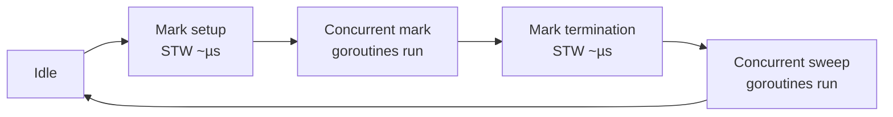

# GC Source — Junior

## 1. What is garbage collection?

In any program that allocates memory, somebody has to give that memory back when nobody is using it anymore. In C you do it by hand with `free`. In Go (and Java, C#, Python, JavaScript…) a piece of the runtime does it for you. That piece is the **garbage collector** — the **GC**.

The GC's job is one sentence: *find memory that the program can no longer reach, and reclaim it.* "Reachable" means there's still some chain of pointers — from a local variable, a global, a goroutine stack — that leads to the object. If nothing can reach it, it's garbage.

---

## 2. Why does Go have a GC?

Two reasons, in order of importance:

1. **Memory safety.** Manual `free` is the source of a famously enormous fraction of real-world bugs: use-after-free, double-free, dangling pointers, leaks. A GC eliminates the entire class.
2. **Ergonomics.** You don't think about ownership. You write `x := &User{}`, hand `x` around, and forget about it. The GC cleans up when nobody can reach it anymore.

Go could have shipped without a GC (some early talks even debated it), but a systems language with no GC and no `unsafe` everywhere is basically C++. Go picked memory safety. The tradeoff: a small runtime cost and a bit of latency.

---

## 3. The big picture of Go's GC

Four adjectives describe it:

- **Concurrent** — the GC runs *alongside* your goroutines most of the time. It does not freeze the whole program for the duration of a collection.
- **Tri-color mark-and-sweep** — the algorithm. Objects are conceptually painted white (unreached), grey (reached, children not yet scanned), or black (fully scanned). Sweep reclaims whites.
- **Non-generational** — Go does *not* keep young/old generations. Every collection looks at the whole live heap. (Java's G1 and ZGC are generational; Go isn't.)
- **Non-compacting** — Go does *not* move objects in memory. Pointers stay stable across GC cycles. (This makes interop with C and `unsafe` simpler, at the cost of fragmentation.)

> If you've used Java, the closest cousin is the original CMS collector — concurrent, non-compacting. Go's is simpler and tuned harder for **low pause times** rather than peak throughput.

---

## 4. The three phases, simplified

A single GC cycle has these stages:

1. **Mark setup (STW)** — a very brief stop-the-world. Turn on the write barrier, prepare root scanning. Microseconds.
2. **Concurrent mark** — goroutines keep running. The GC walks the object graph from roots (globals, stacks) and paints reachable objects black. Your code can still allocate and mutate; the **write barrier** records any new pointers so the GC doesn't miss them.
3. **Mark termination (STW)** — another brief stop-the-world. Finish up any leftover greys, turn off the write barrier. Microseconds.
4. **Concurrent sweep** — goroutines keep running. The sweeper walks through memory spans and reclaims whites lazily as new allocations need them.

Between cycles the GC sits idle until the heap grows enough to trigger another cycle.



The two STW windows are the *only* moments your program is fully paused. Everything else runs in parallel with mutator code.

---

## 5. What is a "GC pause"?

A **pause** (or "stop-the-world", STW) is a moment when *every* goroutine is suspended so the GC can do something that requires a consistent view of memory.

In modern Go (1.5+ rewrote the GC; 1.8+ removed most of the remaining STW work), the pauses are **sub-millisecond** on typical workloads — often tens of microseconds. The total *CPU* the GC consumes can still be significant on allocation-heavy programs, but you almost never see a long single freeze.

> Go's GC design optimizes for **latency**, not throughput. A throughput-optimized GC (older Java defaults) might pause for 100ms once a minute. Go would rather pause for 100µs ten times a second.

---

## 6. `GOGC` — the trigger knob

`GOGC` is the main environment variable that controls *when* the GC runs.

| `GOGC` value | Behavior |
|------|----------|
| `100` (default) | Trigger a collection when the live heap has doubled since the last collection ended |
| `200` | Wait until the heap is 3x last cycle's live size — fewer GCs, more memory used |
| `50` | Trigger at 1.5x last cycle's live size — more GCs, less memory used |
| `off` | Disable GC entirely (used in some short-lived batch jobs; almost never in production) |

```bash
GOGC=200 go run main.go     # collect less often
GOGC=50  go run main.go     # collect more often
GOGC=off go run main.go     # don't collect at all
```

Higher `GOGC` = more memory, less CPU on GC. Lower = less memory, more CPU. Default 100 is a balanced starting point.

---

## 7. `GOMEMLIMIT` (1.19+) — the soft cap

`GOGC` is a *ratio*; it doesn't say "use at most 4 GB". `GOMEMLIMIT`, added in Go 1.19, does.

| `GOMEMLIMIT` value | Behavior |
|------|----------|
| Unset (default `math.MaxInt64`) | No cap; only `GOGC` controls collection |
| `4GiB` | Try hard to keep total runtime memory ≤ 4 GiB by collecting more aggressively as the limit approaches |
| Used together with `GOGC=off` | "Only collect when we're about to hit the limit" — a memory-target mode |

It is a **soft** limit. If live memory legitimately exceeds it, Go will overshoot rather than OOM-loop. It's a hint to the pacer, not a hard wall.

```bash
GOMEMLIMIT=4GiB go run main.go
```

Use it when you run inside containers with a memory limit and want Go to stay friendly with the cgroup.

---

## 8. Observing the GC: `GODEBUG=gctrace=1`

The cheapest way to see the GC in action:

```bash
GODEBUG=gctrace=1 ./mybinary
```

You'll get one line per cycle on stderr:

```
gc 12 @0.450s 2%: 0.018+1.2+0.020 ms clock, 0.14+0.51/1.1/2.4+0.16 ms cpu, 14->14->7 MB, 15 MB goal, 0 MB stacks, 0 MB globals, 8 P
```

Decoded:

| Field | Meaning |
|------|---------|
| `gc 12` | 12th GC cycle since program start |
| `@0.450s` | Time since program start |
| `2%` | Percentage of CPU spent on GC since start |
| `0.018+1.2+0.020 ms clock` | Wall-clock: mark-setup STW + concurrent mark + mark-termination STW |
| `14->14->7 MB` | Heap size: at cycle start → at mark end → live after sweep |
| `15 MB goal` | Pacer's target heap size for this cycle |
| `8 P` | Number of processors |

If the two STW numbers (`0.018` and `0.020` ms here) are small, your pauses are fine. If the `%` is high (say >25%), you're allocating too much.

---

## 9. `runtime.GC()` — when to call it

`runtime.GC()` forces a full cycle right now. You almost never want this in production.

```go
import "runtime"

runtime.GC() // blocks until a cycle completes
```

Legitimate uses:

- **Tests** that want to measure allocations cleanly.
- **Benchmarks** between phases.
- **One-shot CLI tools** before a `runtime.ReadMemStats` reading for accurate numbers.

Bad uses:

- "After this batch, let's reclaim memory." The GC already runs when needed. Forcing it just adds pauses and CPU.
- Calling it on every request. You'll cripple your service.

---

## 10. `runtime.ReadMemStats` — peeking at the heap

```go
import (
    "fmt"
    "runtime"
)

func main() {
    var m runtime.MemStats
    runtime.ReadMemStats(&m)
    fmt.Printf("Alloc       = %d KB\n", m.Alloc/1024)
    fmt.Printf("HeapAlloc   = %d KB\n", m.HeapAlloc/1024)
    fmt.Printf("NumGC       = %d\n",   m.NumGC)
    fmt.Printf("PauseTotal  = %v\n",   m.PauseTotalNs)
}
```

Key fields at this level:

| Field | What it tells you |
|------|------------------|
| `Alloc` / `HeapAlloc` | Bytes currently allocated and reachable |
| `TotalAlloc` | Bytes allocated *over the whole program lifetime* (only grows) |
| `Sys` | Total bytes obtained from the OS |
| `NumGC` | Number of GC cycles run so far |
| `PauseTotalNs` | Total STW time in nanoseconds since start |
| `PauseNs[(NumGC-1)%256]` | Most recent STW pause |

`runtime.ReadMemStats` itself does a brief STW — don't call it in a hot loop.

---

## 11. Where this lives in the source

Inside `$GOROOT/src/runtime`:

| File | What it covers |
|------|----------------|
| `mgc.go` | GC entry points, cycle orchestration, `GC()` |
| `mgcmark.go` | The marking phase: root scan, object scan, write barrier helpers |
| `mgcsweep.go` | The sweep phase: reclaiming spans |
| `mgcpacer.go` | The **pacer**: decides *when* the next GC should start based on `GOGC` / `GOMEMLIMIT` |
| `mbarrier.go` | The write barrier implementation |
| `mheap.go` / `malloc.go` | The allocator the GC works with |

Read `mgc.go`'s top comment first — it's a long, well-written overview of the design. Don't try to read the code linearly; use it as a map.

---

## 12. Common confusion at this level

- **"Go's GC is non-blocking." Mostly true, not fully.** It has two STW phases per cycle. They're short — typically <1 ms — but they exist.
- **"Go has a generational GC." No.** Go's GC scans the entire live heap every cycle. It is non-generational. (There's a long-running research effort around generational ideas, but production Go is not generational.)
- **"`runtime.GC()` frees memory back to the OS." Not directly.** Sweeping marks memory as available for reuse inside Go. Returning it to the OS happens lazily and is governed by other mechanisms (the scavenger, `madvise(DONTNEED)`).
- **"Higher `GOGC` always makes my program faster." Not always.** Less GC CPU, yes. But also a bigger working set, more cache misses, possible OOM. Measure both directions.
- **"GC pause = total GC cost." No.** Pause is the STW slice. GC also consumes CPU during the concurrent phases — that work is *parallel*, but it's still work.
- **"The write barrier is on all the time." No.** It's enabled only during the concurrent mark phase, and disabled the rest of the time.

---

## 13. A tiny experiment

```go
package main

import (
    "fmt"
    "runtime"
)

func main() {
    var m runtime.MemStats

    // Allocate a lot of garbage.
    for i := 0; i < 5; i++ {
        _ = make([]byte, 10<<20) // 10 MB, immediately unreferenced
    }

    runtime.ReadMemStats(&m)
    fmt.Println("Before GC, NumGC =", m.NumGC, "HeapAlloc =", m.HeapAlloc)

    runtime.GC()
    runtime.ReadMemStats(&m)
    fmt.Println("After  GC, NumGC =", m.NumGC, "HeapAlloc =", m.HeapAlloc)
}
```

Run it with `GODEBUG=gctrace=1 go run main.go` and you'll see a gctrace line for the forced cycle. The HeapAlloc after should be tiny — all those 10 MB slices were garbage by the time the GC looked.

---

## 14. Summary

Go's GC is **concurrent, tri-color mark-and-sweep, non-generational, non-compacting**, with **sub-millisecond pauses** as a design target. A cycle has four phases: a brief STW mark setup, concurrent marking with a write barrier, a brief STW mark termination, and concurrent sweeping. You tune *when* it runs with `GOGC` (ratio) and `GOMEMLIMIT` (soft cap). You watch it with `GODEBUG=gctrace=1` and `runtime.ReadMemStats`. You almost never call `runtime.GC()` in production. The source lives in `runtime/mgc.go`, `mgcmark.go`, `mgcsweep.go`, `mgcpacer.go`. At this level the goal is to recognize the shape of a cycle, read a gctrace line, and stop being afraid of opening those files.

---

## Further reading
- "Getting to Go: The Journey of Go's Garbage Collector" — Rick Hudson, 2018
- `runtime/mgc.go` top comment in the Go source (pinned to a release tag)
- "A Guide to the Go Garbage Collector" — Michael Knyszek, on go.dev
- "Go 1.5 concurrent garbage collector pacing" — design doc
- Go blog: "Go runtime: 4 years later" — high-level overview of GC evolution
