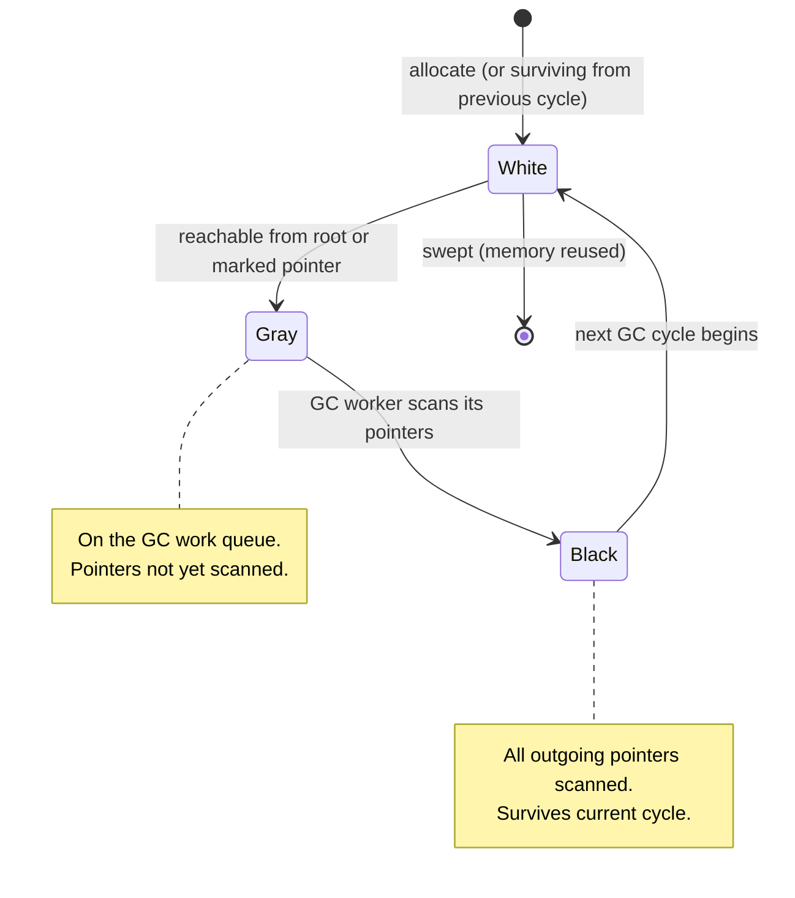

# GC Source — Middle

## 1. From "concurrent mark-sweep" to the actual algorithm

At a junior level, Go's GC is "concurrent mark-and-sweep with low pause times". At a middle level, you have to be able to answer: *how* does it stay concurrent while the program is busy creating and overwriting pointers, and what does the runtime do to keep the cost bounded?

The honest answer is three interlocking ideas: **tri-color marking** (the algorithm), a **hybrid write barrier** (how concurrency is kept safe), and the **pacer** (how the runtime decides when and how hard to run). Everything in `runtime/mgc.go`, `runtime/mgcmark.go`, `runtime/mgcsweep.go`, and `runtime/mgcpacer.go` is in service of those three.

---

## 2. Tri-color marking — the core invariant

Every heap object, at any moment during a GC cycle, is in one of three logical sets:

| Color | Meaning | What happens to it |
|-------|---------|--------------------|
| **White** | Not yet proven reachable | Candidate for sweep at end of cycle |
| **Gray**  | Reachable, but its outgoing pointers haven't been scanned | On the GC work queue |
| **Black** | Reachable, all outgoing pointers already scanned | Done; will survive this cycle |

The cycle is "drain the gray set": repeatedly take a gray object, scan its pointers, push any white targets onto the gray set, then mark the source black. When no gray objects remain, every reachable object is black and every white object is unreachable, so the whites can be reclaimed.

The whole concurrent design rests on a single property:

> **Tri-color invariant:** No black object points to a white object.

If you can guarantee that invariant while the mutator is running, you can do the marking concurrently with the program and still reclaim only truly-dead objects.

The catch: the mutator can break the invariant. It can run a line like `black.field = white` — a pointer write from an already-scanned object to an unscanned one — and now there's a path the GC will never find.

That's exactly what the write barrier exists to prevent.

---

## 3. The object's lifetime through a cycle



A few subtleties worth holding in your head:

- Newly allocated objects during the mark phase are allocated **black** in current Go. They can't make the invariant fail because they have no scanned-yet ancestor — but they also can't be collected this cycle.
- "Colors" aren't bytes on the object. Mark bits live in per-span metadata (`gcmarkBits`) so the heap stays compact and cache-friendly.
- "On the gray set" really means "queued in a GC work buffer" — there are local per-P queues plus a global queue, much like a goroutine runqueue.

---

## 4. Why a write barrier — the concurrency hazard, spelled out

Imagine the mark phase has already scanned object `A` (now **black**) and hasn't yet reached `C` (still **white**). `B` is **gray** and currently points to `C`. Now the mutator runs:

```go
A.next = B.next   // copy pointer from gray B to black A
B.next = nil      // drop B's pointer to C
```

After these two lines:

- `A` (black) points to `C` (white).
- `B` (gray) no longer points to `C`.

When the GC drains `B`, it won't find `C`. Nothing else will find `C` either, because all paths now go through `A`, and `A` was already scanned. `C` ends up swept while still reachable — a use-after-free.

The write barrier is the runtime code, injected by the compiler, that runs around every heap pointer write to prevent that scenario. It "shades" the relevant object gray so the GC sees it.

---

## 5. Two classical barrier styles

| Barrier | Triggered on | What it shades | Trade-off |
|---------|--------------|----------------|-----------|
| **Dijkstra (insertion)** | `*p = q` (storing a new pointer) | `q` (the target) | Cheap; but requires re-scanning stacks at mark termination because stacks aren't barriered |
| **Yuasa (deletion / snapshot-at-beginning)** | `*p = q` (overwriting old pointer) | the **old** value at `*p` | No stack re-scan needed; floats more garbage (objects whose only reference was deleted survive the cycle) |

Pre-1.8 Go used Dijkstra-only. It worked, but to be safe the runtime had to **rescan every goroutine's stack** at mark termination with the world stopped. On a server with tens of thousands of goroutines that re-scan was the main contributor to pause time — easily 10–100 ms.

Since 1.8 Go uses a **hybrid Dijkstra + Yuasa** barrier (the design comes from Austin Clements's "Eliminate STW stack re-scanning" proposal). It snapshots the stack at the start of mark — implicit Yuasa for stacks — and adds a Dijkstra-style barrier for heap-to-heap writes. The result: no full stack re-scan, much shorter STW.

The hybrid is conceptually: *shade the overwritten value, and also shade the new value when the source is on the stack of a yet-unscanned goroutine.* The exact code lives in `runtime/mwbbuf.go` (write barrier buffer) and `runtime/mgcmark.go`.

In source, a pointer assignment doesn't go through a CALL on each write. The compiler emits an inline check that compares a global `writeBarrier.enabled` flag; when the barrier is on, the new pointer is buffered to a per-P `wbBuf` and only flushed in batch. This amortizes the cost.

---

## 6. Mark assists — paying back the allocation debt

Concurrent GC has an inherent race: the **mutator is allocating** at the same time as the **GC worker is marking**. If allocation outpaces marking, the heap grows faster than the GC can keep up, and you end up needing a longer cycle than you budgeted — defeating the whole point.

Go's solution: **mark-assist**. Every goroutine that allocates while a GC is in progress is charged for the bytes it allocates and must pay back that debt by doing scan work itself before it's allowed to continue.

The accounting lives in `gcController` (in `mgcpacer.go`). Each goroutine carries a small `gcAssistBytes` field. When it allocates `n` bytes during mark phase:

1. It debits `n × assistRatio` bytes from `gcAssistBytes`.
2. If the credit goes negative, the goroutine must either *steal* credit from the global pool, or *do scan work itself* (call into the GC scanner inline) until the debt is repaid.

This is the answer to the surprising "my allocation-heavy goroutine paused for milliseconds" — it didn't pause; it was conscripted into the marking effort. It's also why allocation profiles matter as much as goroutine profiles when you're chasing latency.

The fractional `gcBackgroundUtilization` (≈25%) is the target: GC should consume about a quarter of available CPU during a cycle. When assists kick in, that's the system saying "background workers can't keep up, so we're charging the mutator".

---

## 7. The pacer — when to start, how hard to run

The pacer's only job is to start the next GC cycle at the right heap size so that marking finishes *just before* the heap reaches its target. Start too early and you waste CPU on GC; start too late and you blow past the budget and pay in assist.

The user-visible knob is `GOGC` (default 100). At GC end, the runtime computes the **trigger heap**:

```
trigger ≈ live_heap × (1 + GOGC / 100)
```

So with `GOGC=100` and a live set of 100 MB, the next GC starts when the heap reaches ~200 MB. `GOGC=50` would trigger at ~150 MB (more frequent, less RSS, more CPU on GC). `GOGC=off` disables it.

Since Go 1.19 there's a second knob: `GOMEMLIMIT` (soft memory limit). The pacer treats `GOMEMLIMIT` as a hard ceiling — as the heap approaches the limit, GC becomes more aggressive regardless of `GOGC`. This solved a long-standing operational problem: services that had plenty of memory headroom but still OOM'd on transient allocation spikes because `GOGC` alone couldn't react fast enough.

The full pacer model is in `runtime/mgcpacer.go`; it's a PID-style controller. The key inputs: heap growth rate, mark CPU consumption, time spent in assists. Outputs: when to trigger, how aggressively to assist.

---

## 8. GC mark workers and CPU budgeting

The runtime maintains three kinds of mark workers:

| Worker type | When it runs | How much CPU |
|-------------|--------------|--------------|
| **Dedicated** | Always running for the duration of a cycle, one per P | Counts fully against the 25% budget |
| **Fractional** | Runs only when needed to hit the 25% target; preempts itself | Variable |
| **Idle** | Runs only on Ps that have no runnable goroutines | Doesn't count against budget; free work |

Why three? Because the simple model "use 25% of CPU" doesn't fit cleanly into the integer count of Ps. On a 4-core machine, 25% = 1 dedicated worker exactly. On a 6-core machine, you want 1.5 — so you use 1 dedicated + 1 fractional that runs 50% of the time. And whenever a P is idle anyway, an idle worker scoops up free marking with zero cost to the application.

The numbers come from `gcMarkWorkAvailable` and `findRunnableGCWorker` in `runtime/mgc.go`. The 25% target is **`gcBackgroundUtilization` = 0.25**, a tunable constant.

---

## 9. Roots — where marking starts

Marking begins from the **root set**: everything the program is currently using outside the heap proper.

| Root source | Contents | Scanned where |
|-------------|----------|---------------|
| **Goroutine stacks** | Live local variables, function args, registers spilled to stack | `runtime/mgcmark.go: scanstack` |
| **Globals** | Package-level variables, BSS, data segments | Read from compiled metadata |
| **Finalizer queue** | Objects with `SetFinalizer` pending or running | Walked once at start |
| **Special slots** | `runtime.KeepAlive` references, `unsafe.Pointer` reachable via runtime | Bespoke per-slot logic |

Globals are easy: their layout is known at compile time and recorded by the linker as bitmaps the GC reads directly. Stacks are the hard part because they're per-goroutine, growing, and the goroutine might be running.

---

## 10. Stack scanning and safe points

A goroutine's stack can only be scanned at a **safe point** — a place in the code where the runtime knows exactly which words on the stack are pointers and which are not.

Pre-1.14, safe points were **cooperative**: a goroutine had to reach the function-prologue check that says "have I been asked to yield?". A tight loop with no function calls could avoid that check indefinitely and starve the GC of root scanning — the infamous "GC can't preempt this loop" problem.

Since 1.14, Go has **asynchronous preemption**: the runtime sends a signal (`SIGURG` on Unix) to the goroutine's M, the signal handler checks PC against a precomputed safe-points map (the compiler emits these), and if the PC is safe-pointable the goroutine is paused and scanned right there. If not, the runtime tries again shortly.

The practical effect: every goroutine can be stack-scanned within a few hundred microseconds of being asked, no matter what it's doing.

---

## 11. The two STW phases — what actually stops

People say "Go GC has sub-millisecond pauses". That's measured at the **STW phases**, of which there are exactly two per cycle:

**STW 1 — GC start:**
- Set `writeBarrier.enabled = true`.
- Switch all Ps to a mode where allocation goes via the GC-aware path.
- Snapshot stacks for the Yuasa-style portion of the barrier.
- Empty the gray queue and seed it with the root set.

**STW 2 — Mark termination:**
- Drain any remaining gray work that the concurrent workers couldn't quite finish.
- Flush per-P assist credits.
- Disable the write barrier (`writeBarrier.enabled = false`).
- Compute heap statistics, decide the next trigger.
- Transition to the sweep phase.

Each STW is microseconds-to-low-milliseconds on a modern Go (1.20+) with a healthy heap. Everything else — including all the actual scanning — happens concurrently with the mutator. The third "phase" people sometimes describe (sweep) is **not** stop-the-world.

---

## 12. Incremental sweep

After mark, every span knows which of its objects are reachable. Reclamation could happen as a big batch — but that would mean a long pause. Instead, Go sweeps **incrementally and lazily**:

- A goroutine asking for a fresh allocation from a span first sweeps that span if it hasn't been swept this cycle.
- A background sweeper drains the rest in the background.
- An allocation that needs a span that hasn't been swept yet pays the sweep cost for that span — bounded, small.

This spreads sweep cost across allocations rather than concentrating it in a pause. The bookkeeping is in `runtime/mgcsweep.go`.

---

## 13. Finalizers and `KeepAlive`

A finalizer is a function attached to an object via `runtime.SetFinalizer(obj, fn)`. The runtime promises to call `fn(obj)` after `obj` becomes unreachable — *not before, not synchronously, and not guaranteed at all if the program exits first.*

Mechanics:

- Setting a finalizer creates a special association in the runtime's finalizer table.
- During mark, an object with a pending finalizer is treated as a root (it has to survive long enough to be finalized). The runtime "resurrects" it for one more cycle.
- After the cycle, the finalizer is queued for the dedicated **finalizer goroutine** (`runfinq` in `runtime/mfinal.go`), which calls them one by one.
- The object only becomes truly collectable on the *next* GC cycle after its finalizer has run.

This is why `SetFinalizer` is not a destructor. It's:

1. Delayed by at least one full GC cycle.
2. Run on a single goroutine, so a slow finalizer blocks all others.
3. Not guaranteed at program exit.
4. Lethal if the finalizer captures `obj` itself in a closure — the resurrection never resolves, leak forever.

The legitimate use is releasing non-Go resources (file descriptors held by C code via cgo, OS handles) as a backstop when explicit `Close()` was missed. For Go-only state, prefer explicit cleanup.

`runtime.KeepAlive(x)` exists because the compiler's escape analysis is *aggressive*: once it proves a variable's last use, it may free the underlying memory immediately, even before the function returns. If you have a finalizer on `x` that releases a file descriptor, and you pass the underlying fd into a syscall while `x` is no longer "used" by the Go code, the finalizer might run mid-syscall and close the fd.

```go
file, _ := os.Open("foo")
fd := file.Fd()
syscall.Read(fd, buf)         // file is no longer "used" by Go — finalizer may fire here
runtime.KeepAlive(file)       // tell the compiler: file is still live up to this point
```

Without `KeepAlive`, the program has a race between the syscall and the finalizer that closes the fd. With it, the compiler is forced to keep the reference live across the call. This isn't a workaround — it's the documented contract.

---

## 14. Common middle-level mistakes

- **Confusing "concurrent" with "no pauses".** There are still two STW phases per cycle. They're short, but they exist.
- **Tuning `GOGC` without measuring.** Lower `GOGC` reduces RSS but raises GC CPU. The "right" value depends on the workload and the cost of the CPU you'd spend.
- **Believing the heap shrinks immediately.** Go's runtime is reluctant to return memory to the OS; spans are reused for future allocations. `MADV_DONTNEED` / `MADV_FREE` decisions are made by `runtime/mheap.go`, not by the GC cycle itself.
- **Relying on finalizers for cleanup.** They're a backstop, not a primary lifecycle hook.
- **Ignoring assists in latency budgets.** Allocation-heavy code paths *will* be charged when GC is running. P99 latency hides under here.
- **Using `runtime.GC()` in production code.** It forces a full STW + cycle. The pacer almost always does better.
- **Forgetting `KeepAlive` around cgo / syscall boundaries** when the Go object has a finalizer that releases the underlying resource.

---

## 15. Summary

Middle-level GC understanding is about three pieces working together. The **tri-color algorithm** marks live objects with a single invariant; the **hybrid write barrier** keeps that invariant safe while the mutator runs; the **pacer + assists + mark workers** make sure the cycle finishes on time without consuming the machine. STW exists only at the start and the end of mark, briefly. Sweep is lazy. Finalizers are best-effort and run later. Stack scanning is now async-preemption-driven, so no goroutine can hide. None of this is magic — it's all in `runtime/mgc*.go` if you want to read it. The skill is knowing which lever (GOGC, GOMEMLIMIT, allocation patterns, KeepAlive) matters for the problem you're solving.

---

## Further reading
- `runtime/mgc.go`, `runtime/mgcmark.go`, `runtime/mgcsweep.go`, `runtime/mgcpacer.go` — the implementation
- Austin Clements, "Proposal: Eliminate STW stack re-scanning" (Go issue 17503)
- Austin Clements, "Go 1.5 concurrent garbage collector pacing" (the original pacer doc)
- Michael Knyszek, "Proposal: Soft memory limit" (GOMEMLIMIT, Go 1.19)
- Rick Hudson, "Getting to Go: The Journey of Go's Garbage Collector" (2018)
- `runtime.SetFinalizer`, `runtime.KeepAlive` documentation
- Dmitry Vyukov's notes on write barriers and tri-color in the Go runtime
