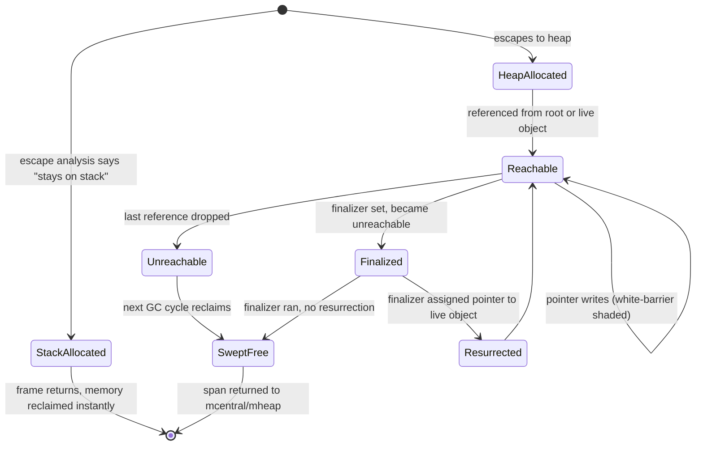

# GC Source — Senior

## 1. Mental model — design goals, the no-compaction trade, why Go is not generational

The Go garbage collector is not a balanced engineering compromise; it is a **deliberate optimization for one variable — pause time — at the explicit expense of throughput, memory headroom, and algorithmic sophistication**. Austin Clements, Rick Hudson and the runtime team have repeated the same goal since the 1.5 redesign: keep stop-the-world (STW) under 1 ms regardless of heap size, with throughput "acceptable" rather than maximal, and with a design simple enough that the whole team can hold it in their heads. Every senior conversation about Go GC starts from that ordering.

The design choices that fall out of it:

- **Concurrent, tri-color mark-sweep**, not stop-the-world. The mutator runs alongside the collector for almost the entire cycle. The two STW phases (mark setup and mark termination) are short and bounded by goroutine count and stack depth, not heap size.
- **No compaction.** Compaction shortens free-lists, fixes fragmentation, and lets allocators bump-pointer; in exchange it requires moving live objects and rewriting every pointer to them. Pointer rewriting requires either a global STW or a read barrier on every load. Go's design rejected both: STW would blow the 1 ms budget; a read barrier would slow every pointer load forever. The cost: some fragmentation in long-running heaps with mixed object sizes — handled by the size-class allocator (`mcache`, `mcentral`, `mheap`) instead of compaction.
- **Not generational.** This is the most-asked design question. Generational GCs (Java HotSpot, V8, .NET) bet on the *generational hypothesis*: most objects die young, so segregate them into a "nursery" and collect it frequently with a small STW. The hypothesis is true on Java-style code where every value is heap-allocated. In Go, **escape analysis and value types push the short-lived objects onto the stack**. By the time an object reaches the heap, it has already survived escape analysis — it is more likely to be long-lived than a Java object of equivalent age. The generational hypothesis is weaker here, and the engineering cost (write barriers between generations, remembered sets, generational pointer tracking) is high. The team's stance: until profile data shows a generational design would beat the current one *for typical Go workloads*, it is not worth the complexity.
- **Write barrier, no read barrier.** Concurrent mark needs to know when the mutator stores a pointer to a not-yet-scanned region. The Yuasa-style deletion barrier plus a Dijkstra-style insertion barrier (the "hybrid write barrier" since Go 1.8) handles this without read barriers, so reads stay free. Writes pay a small constant cost — typically 2–6 ns per pointer write.

The architecture in one diagram:

```
┌──────────────────────────────────────────────────────────────────┐
│                     Mutator goroutines (G)                       │
│                  allocations + pointer writes                    │
│                          │                                        │
│                          │ write barrier on heap pointer stores   │
│                          ▼                                        │
│                  ┌────────────────┐                               │
│                  │ Pacer (decides │◄──── /gc/heap/goal:bytes      │
│                  │ when to start) │      /gc/heap/live:bytes      │
│                  └───────┬────────┘      GOGC, GOMEMLIMIT         │
│                          │                                        │
│  STW1  ─── mark setup ──►│                                        │
│                          │                                        │
│  ┌───────────────────────┴──────────────────────┐                 │
│  │ Concurrent mark (gcBgMarkWorker goroutines)  │                 │
│  │ + mark assist (mutator-driven, on alloc)     │                 │
│  └───────────────────────┬──────────────────────┘                 │
│                          │                                        │
│  STW2  ── mark term. ───►│                                        │
│                          │                                        │
│  ┌───────────────────────┴──────────────────────┐                 │
│  │ Concurrent sweep (lazy; per-span on demand)  │                 │
│  └──────────────────────────────────────────────┘                 │
└──────────────────────────────────────────────────────────────────┘
```

Senior heuristic: **think of Go GC as a control loop, not an algorithm**. The pacer is the controller; heap growth is the plant; pause budget is the setpoint. Most production GC problems are control-loop problems (misconfigured target, mutator outrunning the controller, mark assist saturating) rather than algorithmic problems (mark/sweep bugs).

**Tri-color invariant in one paragraph.** Objects are conceptually colored white (not yet reached), grey (reached, children not yet scanned), black (reached and scanned). Mark begins by greying roots. Workers pop grey objects, scan their pointers, blacken them, and grey newly-discovered whites. When the grey set is empty, all remaining whites are unreachable. The write barrier preserves the invariant: when a mutator overwrites a pointer or stores into a black object, the barrier shades the affected object grey so it gets re-scanned. The hybrid barrier (Go 1.8+) handles both *new* writes (Dijkstra-style: shade the pointee) and *deletions* of stack-resident pointers (Yuasa-style: shade the pointer being overwritten), without read barriers. Read the source: `src/runtime/mbarrier.go`.

---

## 2. The Pacer — equation, GOGC, GOMEMLIMIT, mark-assist amplification

The pacer decides **when to start the next GC cycle** so that mark finishes before the heap grows past the soft target. Get this wrong by 5% and pauses are fine; get it wrong by 50% and the application burns CPU on mark assist or OOMs.

**The classic GOGC=N equation.** With `GOGC=100` (the default), the trigger is at **roughly 2× the live heap after the previous GC**:

```
heap_goal = live_heap_after_previous_gc * (1 + GOGC/100)
          = live_heap * 2          when GOGC=100
          = live_heap * 1.5        when GOGC=50
          = live_heap * 3          when GOGC=200
```

The pacer does not start exactly at the goal; it starts earlier so that mark *finishes* near the goal. The earlier-start margin depends on:

1. **Allocation rate** estimated from the previous cycle's mark cost and mutator allocation speed.
2. **Mark scan rate** — bytes scanned per CPU-second of dedicated mark workers, also from the previous cycle.
3. **CPU available** to mark workers — by default 25% of `GOMAXPROCS` (the `gcBackgroundUtilization` constant).

Solving for the trigger point gives the equation behind the pacer (Clements, 2018):

```
trigger_ratio ≈ goal_growth_ratio − (scan_work_estimate / mutator_alloc_rate * mark_workers)
```

In plain words: **start mark with enough lead time that 25% of cores can finish scanning before the mutator allocates the rest of the budget**. Increase `GOGC` → larger budget → more lead time → less frequent GC, larger heap, fewer pauses but higher peak memory. Decrease `GOGC` → smaller budget → tighter pacing → more frequent GC, smaller heap, higher CPU.

**`GOMEMLIMIT` (Go 1.19+).** A *soft* memory cap. The pacer treats `GOMEMLIMIT` as a hard ceiling and adjusts the goal to keep total runtime memory under it:

```
heap_goal = min(
  live_heap * (1 + GOGC/100),       // GOGC-based goal
  GOMEMLIMIT - non_heap_memory      // memory-cap goal
)
```

Once the cap-based goal is tighter than the GOGC-based one, the pacer becomes aggressive — collecting more often, shrinking the budget between cycles, asking mutators to assist mark. **The intent is graceful degradation**: instead of OOM-killing a containerized process at 4 GiB, the runtime burns CPU mark-assisting and tries to keep the heap under 4 GiB. The trade-off is *throughput collapse near the cap* — application CPU drops as mark CPU climbs. Senior rule: **`GOMEMLIMIT` is a safety net, not a target**. Setting it to your container's full memory and running steady-state at 95% of it is a recipe for stalls. Pick `GOMEMLIMIT` ≈ 90% of the container limit and tune `GOGC` so steady-state heap sits well below it.

To turn off GOGC-based pacing and rely only on the cap (Twitch's pattern), set `GOGC=off` and a `GOMEMLIMIT` — the runtime will only GC when approaching the limit. Useful when the application has bursty allocation and steady working-set size.

**Mark-assist amplification.** When the pacer is wrong (too late to start, too slow to scan), the runtime forces mutator goroutines to perform mark work proportional to their allocation rate. The accounting:

```
each goroutine has an "assist credit" of bytes it can allocate without helping mark.
On allocation: credit -= bytes
If credit < 0 and GC is active:
  goroutine performs mark work for ~(deficit * assistRatio) ns
  then continues allocating
```

When pacing is good, assist is rare — background mark workers cover the work. When pacing fails, **every allocation in every goroutine pays a mark tax**, and that tax is variable, unpredictable, and the source of mysterious p99 latency spikes. A goroutine that normally allocates and returns in 100 µs starts taking 5 ms because it was asked to scan 50 KB of pointers mid-allocation.

How to detect:

1. **`GODEBUG=gctrace=1`** prints a line per cycle. The `assist` field shows percent of CPU time mutators spent on mark assist. > 5% is a smell; > 20% is a fire.
2. **`runtime/metrics`**: `/gc/scan/total:bytes` and `/gc/scan/heap:bytes` against `/gc/cycles/automatic:gc-cycles` show whether scan work is dominated by background or assist (compare with `/sched/goroutines:goroutines` allocating concurrently).
3. **`go tool trace`** "GC" rows. Assist appears as colored bars on mutator goroutine timelines, not just on `gcBgMarkWorker` rows.

Fix: increase `GOGC`, increase `GOMEMLIMIT` headroom, reduce allocation rate (object pooling), or increase `GOMAXPROCS` so background mark has more CPU.

**Runtime hooks.** Two functions in `runtime/debug` modify the pacer at runtime, no restart needed:

- `debug.SetGCPercent(n)` — equivalent to setting `GOGC=n`. Returns the previous value. Passing `-1` disables GOGC-based pacing (the equivalent of `GOGC=off`). Useful for ops endpoints: an SRE can dial GC up during an incident, dial back when stable.
- `debug.SetMemoryLimit(bytes)` — equivalent to `GOMEMLIMIT`. Passing `math.MaxInt64` removes the cap. Useful for binaries that learn their container limit at runtime (cgroups v2 file reads, K8s downward API).

Both are safe to call from a `/admin/gc` HTTP endpoint behind auth. The senior rule: **expose the knobs, do not hard-code them**. Production tuning happens in incidents, not at compile time.

---

## 3. `runtime/metrics` vs `MemStats` — the right way to read GC

`runtime.ReadMemStats` is the historical API. It works but it **acquires a global lock and triggers an STW** to walk per-P caches into a consistent snapshot. On a busy server, polling MemStats every 10 seconds for Prometheus quietly introduces millisecond pauses that show up as p99 noise.

`runtime/metrics` (Go 1.16+) is the senior replacement. It exposes the same data (and more) via a versioned, lock-free, no-STW API.

```go
import "runtime/metrics"

samples := []metrics.Sample{
    {Name: "/gc/heap/allocs:bytes"},      // total bytes allocated, including freed
    {Name: "/gc/heap/live:bytes"},        // live bytes at the end of the last cycle
    {Name: "/gc/heap/goal:bytes"},        // pacer's target heap size
    {Name: "/gc/heap/objects:objects"},   // live object count
    {Name: "/gc/pauses:seconds"},         // histogram of all STW pauses
    {Name: "/gc/cycles/automatic:gc-cycles"},
    {Name: "/gc/cycles/forced:gc-cycles"},
    {Name: "/gc/scan/heap:bytes"},        // bytes scanned in the heap last cycle
    {Name: "/gc/scan/total:bytes"},       // includes globals + stacks
    {Name: "/memory/classes/heap/free:bytes"},
    {Name: "/sched/latencies:seconds"},   // scheduling latency histogram
}

metrics.Read(samples)
```

| Question | Metric |
|----------|--------|
| Are pauses meeting the 1 ms target? | `/gc/pauses:seconds` p99/p999 |
| Is GC frequency healthy? | `/gc/cycles/automatic:gc-cycles` rate |
| Is allocation rate rising? | `/gc/heap/allocs:bytes` first difference |
| Did the goal change? | `/gc/heap/goal:bytes` |
| Is the live set growing? | `/gc/heap/live:bytes` over time |
| Are forced GCs happening? | `/gc/cycles/forced:gc-cycles` > 0 is a smell |
| Is mark-assist saturating? | Compare `/gc/scan/*` rate to background CPU |
| Are goroutines starving on the scheduler? | `/sched/latencies:seconds` p99 — GC tail correlates |

Senior pattern: scrape `runtime/metrics` every 1–5 seconds, store histograms as histograms (not as p99 numbers — Prometheus does the quantile math at query time). Stop using `runtime.GC()` in production. Stop polling `MemStats`.

**`/sched/latencies` is the secret weapon.** GC pauses lengthen scheduling latency for all goroutines, not just the ones running during STW. A spike in `/sched/latencies` p99 that does not appear in `/gc/pauses` p99 means the cost is in mark-assist time slicing, not in STW.

**Histograms not gauges.** Many teams export `/gc/pauses` as `last_pause_seconds` — a gauge. This loses every pause that did not happen at scrape time. Always export the full histogram (`metrics.Float64Histogram`) and let Prometheus compute quantiles. The same applies to `/sched/latencies`. A 1 s scrape interval will miss every pause that did not land on a scrape boundary; the histogram captures all of them.

**`GODEBUG` dial-up for incidents.** Beyond `gctrace=1`, two more are senior-level diagnostics:

- `GODEBUG=gcpacertrace=1` — verbose pacer state per cycle. The exact estimates the pacer is computing, the trigger ratio, the goal, the actual vs predicted scan rate. Useful when the pacer is mispredicting.
- `GODEBUG=allocfreetrace=1` — prints every allocation and free. **Extremely expensive**; use only on a single replica during a controlled experiment to attribute allocation hotspots.

---

## 4. STW costs at scale — stack scanning, mark setup, mark termination

The two STW phases sound short — "≤ 1 ms" — but the budget is *per phase*, and on large workloads neither is free.

**Mark setup STW.** The runtime must:

1. Stop every goroutine at a safe point.
2. Enable the write barrier globally.
3. Initialize the work queue with root scan tasks (stacks, globals, finalizers).

Steps 1 and 3 scale with goroutine count. With 100K goroutines, even atomic preemption requests take milliseconds to propagate. The runtime has progressively optimized this — async preemption (Go 1.14) replaced cooperative-only preemption that could be blocked by tight CPU loops; the safe-point machinery now uses signals on Linux. But on a 200K-goroutine service, mark setup still takes 200–400 µs even on idle cores.

**Stack scanning.** Every goroutine's stack is a GC root. The runtime scans them concurrently after STW1, but the *initialization* (recording the set of stacks to scan) is STW. A goroutine with a 16 KiB stack and 50 frames pays ~2 µs of scan time during concurrent mark; with 100K goroutines that is ~200 ms total, spread across mark workers but contending for the work queue. Mitigation:

- **Reuse goroutines** via worker pools instead of `go func()` per request — caps the goroutine count.
- **Avoid deep recursion** in long-running goroutines; iterative loops scan faster than 1000-frame stacks.
- **Pre-allocate large structures** so they live in fewer goroutine stacks and reduce escape.

**Mark termination STW.** The runtime must:

1. Flush per-P mark state into the global state.
2. Confirm there is no remaining mark work (drain check).
3. Disable the write barrier and start sweep.

The drain check is a synchronization point — it races against any mutator that might still be writing pointers. On a heap with 1B+ objects and high pointer-mutation rate, mark termination occasionally takes several hundred microseconds because the drain check has to retry. Modern Go (1.21+) bounded this with finer-grained accounting, but on adversarial workloads (lots of pointer churn during mark) it remains the dominant pause.

**The take-away.** STW pause budget is **proportional to root set + draining work + goroutine count**, not heap size. The 1 ms target is achievable for typical web services (10K goroutines, 1 GB heap); it is harder for caches with millions of small objects (lots of pointer roots) and harder still for services with massive goroutine pools (lots of stacks).

Senior diagnostic: if `GODEBUG=gctrace=1` shows wall-clock STW > 1 ms, **the culprit is almost always goroutine count or stack depth, not heap size**. Reduce goroutines first, optimize heap second.

---

## 5. Object sizing — size classes, large objects, noscan, tiny allocator

The allocator is a senior-level lever. The runtime divides allocations into three regimes:

**Tiny (< 16 B, no pointers).** Allocated from a per-P "tiny allocator" — multiple objects packed into one 16 B block. Reduces overhead for things like 8-byte timestamps, small `[2]byte` headers, etc. The packed objects all share a single GC bit; freeing requires all of them dead.

**Small (≤ 32 KiB).** ~70 size classes. Each class has a free-list per `mcache` (per-P, lock-free), backed by `mcentral` (per-class, locked), backed by `mheap` (global, locked). Allocations are O(1) bump-pointer in the common case. The size classes are designed to minimize internal waste — typically < 12% wasted bytes per class.

**Large (> 32 KiB).** Skips the size-class machinery, allocated directly from `mheap` in spans rounded up to 8 KiB. **Each large object is its own GC unit** — scanned independently, marked individually, has its own per-object cost in the mark phase. A 1 MB `[]byte{}` allocation is one GC root with one mark bit; a slice of 1M `*Node` pointers is one mark bit but scanning visits 1M pointers.

**Noscan classes.** Half the size classes are duplicated — one set is "scan" (contains pointers), the other "noscan" (no pointers, never scanned by GC). A `[]byte` of any size, an `[N]int64`, a struct of only primitive fields → noscan → **completely skipped during mark**. The runtime decides at allocation time based on the type's pointer bitmap.

This makes struct layout a GC concern:

```go
// noscan — scanned in O(0)
type Coords struct {
    X, Y, Z float64
}

// scan — scanned for one pointer; that pointer scanned recursively
type Node struct {
    Coords
    Next *Node
}

// scan — every Item visited for its Name pointer
type Bag struct {
    Items []Item
}
type Item struct {
    Name string  // string has 1 pointer
    Qty  int
}
```

**Why this matters in production.** A cache of 10M `Item` values means GC walks 10M pointers per cycle to verify each `Name`'s backing string is live. The same cache as `[]byte` blobs (with names interned via integer IDs into a single string table) means GC walks zero pointers in the cache and 1 pointer for the table. Same data, very different GC pressure.

Senior layout rules:

1. **Eliminate pointers from hot containers.** Replace `*T` with `T` if `T` is small and not shared.
2. **Use integer keys to interned string tables** instead of strings in big slices.
3. **Pre-allocate large `[]byte`** (one allocation, one mark bit, scan-skipped) instead of many small strings.
4. **Embed when you can.** `type X struct { Y; ... }` is one allocation; `type X struct { Y *Y; ... }` is two.
5. **Beware boxed primitives.** `map[string]interface{}` stores every value boxed — each box is a scanned pointer.

**Tiny object cost.** Many tiny allocations sound cheap but mark cost is *per object*, not per byte. 10M `*int8` is 10M GC roots. 10M `int8` packed into a `[]int8` is one. The same memory, one or two orders of magnitude difference in mark cost.

**Pointer bitmap economics.** Each heap span carries a bitmap with one bit per word: 1 = "this word contains a pointer to scan", 0 = "skip". Scan cost is `popcount(bitmap)` per object, not `sizeof(object)`. A 1 KiB struct of `[128]int64` has a zero bitmap → scan cost is essentially zero. A 1 KiB struct of `[128]*Node` has 128 set bits → scan cost is 128 pointer follows plus 128 reachability marks. Looking at the type's pointer bitmap (`go tool compile -d=gcprog`) is the senior way to predict scan cost.

**`runtime.KeepAlive` and finalization races.** When a struct holds a `*C.struct_handle` and a finalizer that frees it, escape analysis may decide the struct is dead before its last C call returns — the runtime frees the handle mid-call. `runtime.KeepAlive(p)` after the C call defeats this. Senior rule: any `SetFinalizer` for a C resource needs a `KeepAlive` at the end of every method that uses the resource.

---

## 6. Object lifecycle and one full GC cycle



The stack→heap transition happens at the *escape* decision (compile time, observable with `go build -gcflags=-m`). The heap→reclaimed transition spans one or two GC cycles depending on finalizers.

A full GC cycle, in sequence:

```mermaid
sequenceDiagram
    participant M as Mutator (goroutines)
    participant P as Pacer
    participant W as gcBgMarkWorker
    participant S as Sweeper

    Note over M,P: heap grows toward goal
    P->>P: live + alloc_estimate ≥ trigger?
    P->>M: gcStart() — STW1 (mark setup)
    Note over M: stop at safepoints, enable write barrier
    M-->>W: roots queued (stacks, globals, finalizers)
    P->>M: resume (STW1 ends, ~100µs–1ms)
    par concurrent mark
        W->>W: drain work queue, scan objects, shade pointers
    and mutator runs
        M->>M: allocates (assist if credit < 0)
        M->>W: write barrier shades overwritten/new pointers
    end
    Note over W: queue drained
    P->>M: gcMarkTermination() — STW2
    Note over M: drain check, flush per-P state, disable barrier
    P->>M: resume (STW2 ends, ~100µs–500µs)
    par concurrent sweep
        S->>S: walk spans, free unmarked objects (lazy on alloc)
    and mutator runs
        M->>M: allocates from swept spans
    end
    Note over P: cycle complete; pacer updates estimates
```

Two STWs, two concurrent phases. On a tuned service: STW1 + STW2 < 500 µs total; concurrent mark and sweep happen alongside traffic with measurable but acceptable CPU overhead (target 25%, often less).

---

## 7. Hot fixes for GC pressure — pools, pre-allocation, value containers

When profiling shows GC CPU > 10% or assist > 5%, these are the levers, in order of leverage:

**Pre-allocate slices and maps.** `make([]T, 0, expectedN)` once is one allocation. A growing slice doubles 5–10 times in its lifetime, leaving five abandoned backing arrays for the GC to scan and free.

```go
// bad
items := []Item{}
for r := range rows { items = append(items, parse(r)) }

// good
items := make([]Item, 0, len(rows))
for r := range rows { items = append(items, parse(r)) }
```

For maps, `make(map[K]V, expectedN)` avoids rehashing — same logic.

**`sync.Pool` for transient objects.** A request-scoped buffer that is allocated, used, and dropped at every request is a textbook pool candidate:

```go
var bufPool = sync.Pool{
    New: func() any { return bytes.NewBuffer(make([]byte, 0, 4096)) },
}

func handler(...) {
    buf := bufPool.Get().(*bytes.Buffer)
    defer func() { buf.Reset(); bufPool.Put(buf) }()
    // use buf
}
```

Rules for `sync.Pool`:

- Pool only items with *expensive allocation* (large slices, complex structs). Pooling 16-byte structs is pessimization.
- Always `Reset` before `Put`. Old data leaks across requests otherwise.
- Pool items can be reclaimed by GC between `Get` calls — never rely on persistence.
- Never use `sync.Pool` as a cache for non-shared state. `sync.Pool` is a *recycler*, not a key-value store.

**Reduce pointers in containers.** A `[]Order` of value types is one mark bit. A `[]*Order` is one mark bit plus N pointer scans. For containers that hold values not shared across the program, prefer value-typed slices.

**Intern strings.** Repeated strings (`"GET"`, `"POST"`, status codes, log labels) bloat string-typed columns. Use a single canonical string per value, or — for hot paths — an integer enum with a `String()` method.

**Use scratch buffers.** Per-goroutine scratch space (a 64 KiB byte buffer attached to a request struct) lets parsers, serializers, and template renderers reuse memory across the request.

**Avoid `interface{}` for primitives.** Every primitive stored as `any` is boxed — allocates an `eface` and the primitive separately. `map[string]any` allocates 2N for N entries.

**Bound goroutine counts.** Worker pools with bounded concurrency cap stack scan work. A naive `go func()` per request leaves the runtime with O(N) stack roots.

**`runtime.GC()` is not a fix.** Calling it manually forces a full cycle, fights the pacer, and almost always makes things worse. The legitimate uses: benchmarks (measure with a clean heap), tests (assert no leaks), shutdown (run finalizers). Never in a request handler.

**Ballast (legacy pattern).** Pre-`GOMEMLIMIT`, Twitch popularized the "memory ballast": allocate a large `[]byte` at startup and never use it. The pacer treats it as live → goal becomes `(live + ballast) * 2`, effectively raising the GC trigger and reducing cycle frequency. Modern equivalent: `GOMEMLIMIT` + `GOGC=off`. The ballast pattern still works on Go ≤ 1.18 codebases and is occasionally useful for binaries that need to support multiple Go versions. Do not introduce new ballasts in fresh code — `GOMEMLIMIT` is strictly cleaner.

**Arena allocators (experimental, Go 1.20+, gated).** The `arena` package — currently behind `GOEXPERIMENT=arenas` — lets a program allocate from a region that is freed all at once, bypassing the GC for those objects. Designed for short-lived request-scoped allocations: parse, use, free arena at end of request. Status as of 2026: still experimental, not on by default, API may change. Senior take: watch the proposal; the *technique* (region-based memory) is the right answer for the Discord-shape problem and worth understanding even if the standard-library API lands later.

---

## 8. Production case studies — Discord, Twitch, Cloudflare patterns

**Discord's "Why we switched a service from Go to Rust" (2020).** The famous one. Discord's `Read States` service held a multi-GB in-memory map of unread message state per user. Even with carefully-tuned GC, p99 latency spikes correlated 1:1 with GC cycles every 2 minutes. The Go GC was scanning the entire huge live set every cycle — billions of pointers — and even concurrent mark cost was high enough to show in tail latency. The rewrite in Rust eliminated the GC entirely and dropped p99 from spikes of 100+ ms to flat sub-millisecond.

**Senior reading of the story.** This is *not* "Rust > Go". It is "managed GC has a cost proportional to live pointer count, and at a few billion live pointers, that cost shows up in p99". The fix for Go was available — reshape the data structure to noscan (e.g., a `[]byte` arena with offset-based references instead of `*T`) — but the team judged the rewrite easier in Rust. The takeaway: **if your hot path holds N pointers and N grows unboundedly, GC will eventually find you**.

**Twitch's `GOGC` tuning (2019).** Twitch's video-chat service ran with `GOGC=100` and saw 30% of CPU in GC, with p99 spikes. They increased to `GOGC=1200` (collect at 12× the live heap), accepting larger memory footprint for far less frequent GC. Result: GC CPU dropped to ~5%, p99 latency stabilized. Later, with `GOMEMLIMIT` (Go 1.19+), they switched to `GOGC=off` and a hard memory limit, letting the pacer collect only when approaching the cap.

**Senior reading.** `GOGC=100` is a default tuned for "average" workloads. Steady-state services with large stable working sets and bursty allocations are better with high `GOGC` or `GOMEMLIMIT`-only pacing. The cost is memory; the benefit is fewer cycles and predictable tails.

**Cloudflare's `[]byte` pools.** Cloudflare's HTTP edge processes huge buffer churn — every request reads bytes, writes bytes, parses headers. Their public Go work emphasizes `sync.Pool` of `*bytes.Buffer` and size-class-aware buffer reuse (4 KiB, 32 KiB, 128 KiB pools). The wins are not in any single allocation but in the GC pressure removed across millions of RPS.

**Common thread.** All three teams hit GC limits not by writing inefficient code, but by holding *too much live state with too many pointers*. The fix patterns: reshape the data (Discord, partially), tune the pacer (Twitch), pool what churns (Cloudflare). Senior teams know which lever to pull from the symptom shape.

---

## 9. Failure modes — death spiral, finalizer abuse, postmortems

**The GC death spiral.** The classic catastrophic failure:

1. Allocation rate exceeds what mark can keep up with.
2. Pacer falls behind; assist activates; every mutator allocation triggers mark work.
3. Mark assist slows mutators; the work they were doing finishes more slowly.
4. The heap they would have freed (by completing requests and dropping references) is held longer.
5. Heap grows; pacer's goal grows; more mark work; more assist.
6. CPU saturates at 100% doing mark; throughput collapses; nothing makes progress.

Symptom: `top` shows 100% CPU, application logs show no errors, but latency goes to infinity. `gctrace` shows `assist` near 100%. `runtime/metrics` `/gc/cycles/automatic:gc-cycles` rate skyrockets.

Fixes (in order of intrusiveness):

1. **Reduce request concurrency** (load shed). Less concurrency → less allocation per second → mark catches up.
2. **Increase `GOMEMLIMIT`** (if not already at container max). Buys headroom.
3. **Profile and remove the allocation source.** Often a hot loop that allocates per iteration.
4. **Reduce `GOGC`**. Counterintuitive — smaller heap means smaller mark work per cycle, faster cycles, mark might catch up.
5. **Restart.** When the spiral is in progress, restart is faster than fixing.

Detection: alert on `/gc/heap/goal:bytes` consistently rising above stable baseline. Spiral is "goal grows because mark cannot finish before allocation pushes through the goal".

**Manual `runtime.GC()` cargo cult.** A team adds `runtime.GC()` to a handler thinking it "clears memory between requests". It forces a full cycle every request, evicting the live working set, fighting the pacer's estimates. Throughput halves. Treatment: remove every manual `runtime.GC()` not in a benchmark, test, or shutdown path.

**Finalizers misused.** `runtime.SetFinalizer` lets code run when an object becomes unreachable. Two problems:

1. **Finalizers extend object lifetime by at least one cycle** — the object is unreachable, then the finalizer is enqueued, then runs, then on the next cycle the object is freed.
2. **Finalizers can resurrect** — if the finalizer assigns the object to a live reference, it survives. This is almost always a bug.

Senior rule: **use finalizers only for releasing non-Go resources (file descriptors, C handles) as a safety net, and always pair them with an explicit `Close`**. Never use finalizers for normal Go memory cleanup.

**`sync.Pool` abuse.** A team uses `sync.Pool` as a request cache, putting request-specific data in via `Put` and retrieving later via `Get`. The pool can evict between `Get` calls (the runtime sweeps pools each GC), so the data vanishes randomly. Use a real cache (`sync.Map`, `lru`, an external store) for non-recyclable state.

**Large struct in `sync.Pool`.** Pools hold one item per P; a 100 MB buffer in a pool on a 64-core machine becomes 6.4 GB of memory. Pool only what fits the workload.

**Postmortem pattern — GC pause misdiagnosed as network latency.** Real production shape: a service shows p99 latency spikes of 150 ms every ~60 seconds. The first three days, the team blames network — "TCP retransmits", "upstream blip". `tcpdump` shows clean packets at the timestamps. Then someone enables `gctrace=1` and sees STW termination at 145 ms every cycle. Root cause: 800K goroutines from a misconfigured worker pool, stack scanning saturated mark termination. Fix: bounded pool, goroutines drop from 800K to 5K, STW drops to 200 µs, p99 stabilizes. Lesson: **GC pause is invisible to the network and looks like network. Without `runtime/metrics` and `gctrace`, you blame the wrong layer for days**.

**Postmortem pattern — OOM with `GOMEMLIMIT` set.** Team sets `GOMEMLIMIT=8GiB` on an 8 GiB container, expecting graceful degradation. The container OOM-kills regardless. Reason: `GOMEMLIMIT` accounts for Go runtime memory only — `cgo` allocations, `mmap`'d files, stack memory, and kernel overhead live outside. The 8 GiB cap was effectively 9 GiB total. Fix: set `GOMEMLIMIT` to ~85% of container limit. Lesson: `GOMEMLIMIT` is a Go-side accounting limit, not a system-side one.

**Postmortem pattern — `sync.Pool` retaining tenant data.** Multi-tenant service pools `*Request` structs to reduce allocation. A field on `Request` holds tenant-specific auth context. Code at `Put` time clears `req.Body` but forgets `req.Auth`. Across requests, tenant A's auth occasionally leaks into tenant B's handler when the pool returns a recycled object. Incident: tenant B sees data from tenant A in audit logs for ~20 minutes before someone notices. Root cause: `sync.Pool` requires a *complete* reset — every field. Fix: a single `Reset()` method on every pooled type, called in `defer` immediately before `Put`; CI lint that flags `Put` calls not preceded by `Reset`. Senior lesson: **`sync.Pool` is a cross-tenant data hazard if Reset is incomplete**. Treat it as a security-sensitive boundary, not a performance optimization.

**Postmortem pattern — escape analysis regression on Go upgrade.** Service upgrades from Go 1.20 to 1.21. p99 latency jumps 40%. No code change. Investigation: a function that returned a small struct by value used to be inlined and stack-allocated; the 1.21 inliner cost model changed slightly, the function no longer inlines, and the struct now escapes to the heap on every call. 10K RPS × per-call escape = 10K extra heap allocations/sec; pacer reacts; mark cycles double. Fix: `//go:inline` hint, or restructure so the escape is impossible. Lesson: **Go runtime upgrades are GC upgrades too**. Benchmark allocation rate (`/gc/heap/allocs:bytes` first difference) before and after every minor-version bump.

---

## 10. Code review checklist + closing principles

### 10.1 Senior GC code review checklist

1. **Are large structs passed by value in hot paths?** Every call copies; every escape allocates. Check escape analysis (`-gcflags=-m`); accept by pointer when struct is large.
2. **Is `sync.Pool` used for non-shared, recyclable state only?** No request-scoped caching; always `Reset` before `Put`; pooled item is large enough to justify pool overhead.
3. **Are slices and maps pre-allocated with expected capacity?** Avoid `[]T{}` then `append` in loops with known length.
4. **Are there `runtime.GC()` calls outside tests/benchmarks/shutdown?** Remove them.
5. **Are finalizers used only for non-Go resources?** Pair every `SetFinalizer` with an explicit `Close`; document why memory finalization is needed (almost always: nothing).
6. **Does the hot path contain `map[string]any` or boxing into interfaces?** Each value box is a separate heap allocation and a scanned pointer.
7. **Are big containers `[]T` or `[]*T`?** If `T` is small and not shared, value slice wins on GC cost.
8. **Is the goroutine count bounded?** No `go func()` per request without a pool — stack scanning is per-goroutine.
9. **Are `regexp.MustCompile`, `template.Must`, and other heavy constructors at package init, not per-call?** Per-call construction allocates and escapes; init-time once is free at request time.
10. **Are timers and tickers stopped explicitly?** `time.NewTimer`/`Ticker` not `Stop`'d retain the goroutine and the channel for a full cycle minimum.
11. **Are `[]byte` ↔ `string` conversions in hot paths?** Each conversion allocates and copies. Use `unsafe.String`/`unsafe.Slice` (Go 1.20+) only when lifetime is provably safe.
12. **Are pprof hooks deployed?** `net/http/pprof` available behind auth in production; `runtime/metrics` exported to Prometheus.
13. **Is `GOMEMLIMIT` set on containerized binaries?** With ~10–15% headroom below the container's cgroup limit.
14. **Is `GOGC` tuned for the workload?** Default 100 is good; large stable working sets often want 200–1200; never below 50 without measurement.
15. **Are there observability dashboards for `/gc/pauses`, `/gc/heap/live`, `/gc/heap/goal`?** Alert on pause-time p99, heap-growth rate, forced GC count > 0.

### 10.2 Closing principles

**The GC is a control loop; tune it as one.** Set the target (`GOGC` and/or `GOMEMLIMIT`) for the workload's working set. Observe `/gc/heap/goal`, `/gc/pauses`, `/gc/scan/total` over time. Adjust the target, not the algorithm.

**Pause time is bounded by roots, not heap.** Most pause issues are goroutine count or stack depth. Pool goroutines, flatten recursion, intern hot strings — these cut STW more reliably than reducing heap.

**Mark work is proportional to live pointers, not live bytes.** A 1 GB `[]byte` is one scan; 100M `*Node` is 100M scans. Choose data structures with GC in mind from the start; retrofitting is expensive.

**Allocation rate is the input to the pacer.** Every per-request allocation in a 10K RPS service is 10K allocs/second of pressure. Pre-allocate, pool, reuse — not because each allocation is slow, but because rate drives cycle frequency.

**`runtime/metrics` and `pprof` are the only sources of truth.** `MemStats` is legacy; `runtime.GC()` is for tests. Read the same metrics the runtime reads.

**Init-time validation includes GC-relevant constants.** Compile your regexes at init. Pre-build your size-class tables. Pre-allocate your worker pools. Every cycle of work moved from request-time to init-time is free at p99.

**Containers need `GOMEMLIMIT`.** Without it, a Go process happily grows toward the cgroup limit and gets OOM-killed. With it, the process burns CPU mark-assisting and at least logs the approach. Set it to 85–90% of the cgroup limit; never to 100%.

**`sync.Pool` is a recycler, not a cache.** Use it for transient buffers; never for stateful objects that should not be re-used between requests; never for non-pooled state.

**Generational pressure rises in services that hold huge live state.** Discord-shape problems. The fix is rarely "GOGC=1000"; it is *reshape the data so live pointers shrink by orders of magnitude*. Arena allocation, integer keys, value-typed containers, off-heap storage.

**Postmortems must include GC traces.** Any latency incident over 100 ms needs `gctrace` and `runtime/metrics` snapshots from the period. Without them, GC pause looks identical to network blips, scheduler delays, and contention — and the wrong root cause locks in.

**Read the source.** The Go runtime is the only Go GC source of truth. `src/runtime/mgc.go`, `mgcmark.go`, `mgcsweep.go`, `mgcpacer.go`, `mheap.go`, `malloc.go` are readable, commented, and updated each release. Senior Go engineers have at least skimmed `mgcpacer.go` once; the equations and the comments together are the canonical pacer specification.

The Go GC is opinionated: it optimizes pauses, accepts memory and throughput cost, refuses to be generational, refuses to compact. Working with it at scale means working *with* the design — shape data to scan cheaply, pace allocation to match the controller, observe the right metrics, and intervene at the right layer. Working against it produces death spirals, p99 spikes, and rewrites.

---

## Further reading

- Austin Clements, "Go 1.5 concurrent garbage collector pacing" (design doc, 2015)
- Austin Clements, "Proposal: Soft memory limit" (GOMEMLIMIT design, Go 1.19)
- Rick Hudson, "Getting to Go: The Journey of Go's Garbage Collector" (ISMM 2018 keynote)
- `src/runtime/mgcpacer.go` and `mgc.go` in the Go source — the canonical specification
- `runtime/metrics` package docs — the supported, no-STW metric API
- `GODEBUG=gctrace=1` — per-cycle trace output, the first thing to enable in any GC investigation
- "Why Discord is switching from Go to Rust" — Discord engineering blog, 2020
- "Go's Memory Ballast" — Twitch engineering, 2019 (predecessor pattern to `GOMEMLIMIT`)
- `golang.org/x/tools/cmd/benchcmp`, `pprof`, `go tool trace` — the working toolchain
- `runtime.SetFinalizer` docs — read the warnings, then read them again
