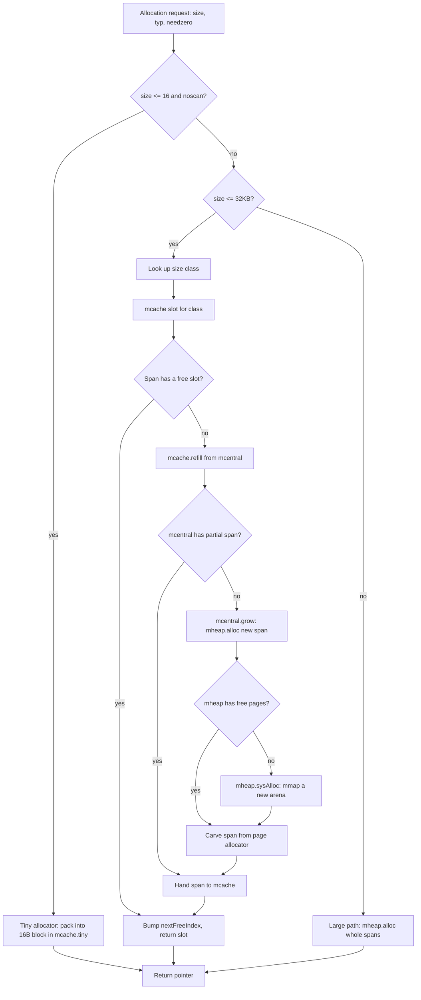
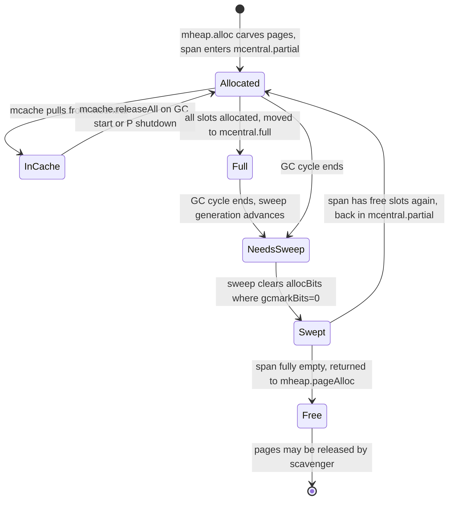

# Memory Allocator — Middle

## 1. From "there's a hierarchy" to "what actually happens"

Junior covered the shape: object → size class → `mspan` → page → arena → OS, with `mcache` → `mcentral` → `mheap` as the lock hierarchy. Middle is about *mechanism*. When you write `x := &T{}` and `T` escapes, exactly what code runs, in what order, and what does it read and write?

Almost everything funnels through one function: **`mallocgc`** in `runtime/malloc.go`. It is the single, central entry point for heap allocation. Every `new`, every `make`, every implicit boxing of a closure capture eventually lands there. Read it once and the rest of the allocator falls into place.

---

## 2. `mallocgc` — the central function

The signature, simplified:

```go
func mallocgc(size uintptr, typ *_type, needzero bool) unsafe.Pointer
```

- **`size`** — bytes requested.
- **`typ`** — the type being allocated. May be nil for raw byte buffers. Used to set the pointer bitmap and pick the right size class.
- **`needzero`** — should the returned memory be zeroed? Almost always yes; `make([]byte, n)` says no for the trailing capacity in some cases.

What `mallocgc` does, in order:

1. **GC assist.** If the GC is running, charge the allocating goroutine some scan work proportional to `size`. This is the **`gcAssistAlloc`** payback that keeps allocators from outrunning the collector.
2. **Sweep credit.** Sweep a few unswept spans to keep the background sweeper honest.
3. **Pick a path** by size:
   - `size <= maxTinySize` (16 bytes) and `typ` is pointer-free → **tiny allocator** path.
   - `size <= maxSmallSize` (32 KB) → **small** allocator path (`mcache` slot for the right size class).
   - `size > 32 KB` → **large** allocator path (straight to `mheap`).
4. **Populate the pointer bitmap** for the allocated range (skipped for `noscan` size classes).
5. **Return** the pointer.

You'll spend a lot of time in steps 1, 3, and 4 if you ever read this file. Steps 2 and 5 are bookkeeping.

---

## 3. Size classes — the catalogue

`runtime/sizeclasses.go` is generated by a Go program (`runtime/mksizeclasses.go`) and contains a table of ~67 small size classes, from 8 bytes to 32 KB. A snippet of the early classes:

| Class | Bytes/obj | Bytes/span | Objects/span | Tail waste | Max waste |
|-------|-----------|------------|--------------|------------|-----------|
| 1     | 8         | 8192       | 1024         | 0          | 0%        |
| 2     | 16        | 8192       | 512          | 0          | 0%        |
| 3     | 24        | 8192       | 341          | 8          | 33%       |
| 4     | 32        | 8192       | 256          | 0          | 0%        |
| 5     | 48        | 8192       | 170          | 32         | 33%       |
| 6     | 64        | 8192       | 128          | 0          | 0%        |
| ...   | ...       | ...        | ...          | ...        | ...       |
| 66    | 32768     | 32768      | 1            | 0          | 12.5%     |

The columns matter:

- **Bytes/obj** — the size every object in this class occupies, even if you asked for fewer bytes. A 17-byte struct rounds up to 24.
- **Bytes/span** — the span holding this class. Always a multiple of the 8KB page.
- **Objects/span** — how many objects one span can serve.
- **Max waste** — worst-case internal fragmentation, percentage. The class layout is *designed* to keep this below ~12.5% for most classes.

Why these specific numbers? They're chosen by a search procedure (`mksizeclasses.go` runs at Go build time) that minimizes worst-case waste while keeping the count small. A finer-grained set of classes wastes less memory per object but inflates the per-P cache (`mcache` has one slot per size class). 67 is the empirical sweet spot.

The lookup is constant-time: `size_to_class[size]` is a precomputed table that maps a byte count to its size class.

---

## 4. `mspan` and pages

A **page** in Go's allocator is 8 KB on all platforms (this is the `_PageSize` constant — distinct from the OS page size which may also be 4KB or 16KB; Go's allocator uses its own page abstraction). An **`mspan`** is a contiguous run of one or more 8KB pages used to serve **exactly one** size class.

```go
type mspan struct {
    next, prev *mspan       // doubly-linked list pointers
    startAddr  uintptr      // first byte of the span
    npages     uintptr      // number of 8KB pages
    spanclass  spanClass    // size class + noscan bit
    nelems     uintptr      // total objects this span can hold
    allocCount uint16       // how many are currently allocated
    allocBits  *gcBits      // bitmap: which slots are in use
    gcmarkBits *gcBits      // bitmap: which slots are marked by current GC
    // ... ~30 more fields
}
```

Key insight: a span is the *unit of ownership*. You don't have "objects on the heap"; you have spans, and spans hold uniform objects. That's why `mallocgc` can answer "where in memory is this thing?" in O(1): it finds the span, divides offsets by `bytes/obj`, and gets a slot index.

---

## 5. The full hierarchy in motion



Read top to bottom. Most of the time you stop at **G** — `mcache` has a span, the span has a free slot, allocation is a few instructions. Falling through to **H**, **K**, **O** is progressively more expensive (locking, then OS calls).

---

## 6. `mcache` — the per-P fast path

Each P has its own `mcache`:

```go
type mcache struct {
    nextSample int64
    scanAlloc  uintptr
    tiny       uintptr   // current tiny block pointer
    tinyoffset uintptr   // offset into tiny block
    tinyAllocs uintptr   // counter
    alloc      [numSpanClasses]*mspan // 2 * 67 entries
    // ... stack span cache, etc.
}
```

The `alloc` array has **2 × 67 ≈ 134 slots** — one for the scan and one for the noscan variant of each size class. (`spanClass` packs the class index and a noscan bit into one byte.)

Why "per-P"? Because a goroutine running on P can access P's `mcache` without any lock. A P only runs one G at a time, so there is no contention. When the M (OS thread) switches to a different P during a syscall handoff, the new M inherits *that P's* `mcache`. The allocator state moves with the P, not the M.

Allocation is essentially:

```go
// pseudocode
span := mcache.alloc[spanClass(class, noscan)]
if span.freeindex < span.nelems {
    v := span.startAddr + span.freeindex * size
    span.freeindex = nextFreeBit(span)
    return v
}
// slow path: refill from mcentral
```

This is the lock-free, fast bump-allocation path — typically under 10 instructions on the happy path.

---

## 7. `mcentral` — one per size class

When the local span runs out, `mcache` calls `mcentral.cacheSpan` to get a fresh one. `mcentral` lives in `runtime/mcentral.go`:

```go
type mcentral struct {
    spanclass spanClass
    partial   [2]spanSet // spans with free slots (two halves for sweep epoch)
    full      [2]spanSet // spans with no free slots
}
```

There are **134 mcentrals** in total (one per `spanClass`), each guarded by its own lock. When `mcache` refills, it:

1. Locks the appropriate `mcentral`.
2. Pops a span from `partial`.
3. Sweeps it if needed (lazy sweep — see §13).
4. Returns it to the `mcache`.

If `partial` is empty, `mcentral` calls `mheap.alloc` to grow.

Why one per size class? Because size-class 5 (48-byte) allocations and size-class 20 (576-byte) allocations contend for completely different memory. Sharding the central lock by size class lets two Ps allocating different-sized objects proceed in parallel.

---

## 8. `mheap` — the global heap

`mheap` (in `runtime/mheap.go`) is the singleton at the bottom. It owns:

- The **page allocator** (`pageAlloc`), which tracks free pages across all arenas.
- The set of all live arenas (the `arenas` map).
- The **scavenger** state (released-to-OS bookkeeping).
- A global lock protecting most operations.

When `mcentral` needs a new span, it asks `mheap.alloc(npages, spanclass)`. `mheap` carves `npages` worth of free pages out of an arena, initializes an `mspan`, and hands it back. If no arena has enough free pages, `mheap` calls `sysAlloc` to get more from the OS.

---

## 9. Arenas — talking to the OS

On 64-bit Linux, an **arena is 64 MB**. The runtime keeps a sparse `arenaHint`-driven layout of where future arenas might land. When the page allocator needs more memory, it calls `sysAlloc`, which on Linux maps a 64 MB chunk with `mmap(PROT_READ|PROT_WRITE, MAP_ANON|MAP_PRIVATE)`.

Each arena has metadata stored next to it:

- **`heapArena.bitmap`** — two bits per word: "is pointer" and "is scanned". This is the pointer bitmap the GC walks.
- **`heapArena.spans`** — a page → `mspan*` index, so any pointer can be reverse-mapped to its owning span.

Lazy mmap matters: a 64 MB `mmap` doesn't cost 64 MB of physical RAM. Pages are touched only as the allocator hands out objects in them. The kernel back-fills with real frames on first touch.

On 32-bit systems arenas are smaller (4 MB) because the address space can't be sparse. On 64-bit, the runtime treats the address space as effectively unlimited.

---

## 10. The tiny allocator

For objects ≤ 16 bytes that contain no pointers (`noscan`), Go uses a special **tiny allocator** that packs multiple small objects into one 16-byte slot:

```go
// inside mallocgc
if size <= maxTinySize && noscan {
    off := mcache.tinyoffset
    // align off to size's alignment
    // if size fits in the remaining 16-byte block, hand out & advance
    if off + size <= 16 {
        x := unsafe.Pointer(mcache.tiny + off)
        mcache.tinyoffset = off + size
        return x
    }
    // otherwise grab a fresh 16-byte block from size class 2 (16B noscan)
}
```

Why it matters: small strings, short `[]byte`, small numeric buffers all fit. Without the tiny allocator, every 2-byte string header would consume a full 16-byte slot, wasting 14 bytes. With it, eight 2-byte allocations share one 16-byte block — 87.5% savings on that workload.

The cost: tiny-allocator chunks can't be individually freed. The whole 16-byte block stays "alive" until *all* its sub-allocations are unreferenced. That's fine in practice because tiny allocations are short-lived and the GC reclaims the whole block at once.

---

## 11. Large objects — the bypass

Objects strictly larger than 32 KB skip `mcache` and `mcentral` entirely and go straight to `mheap.alloc`:

```go
// pseudocode for large path
npages := (size + _PageSize - 1) / _PageSize
span := mheap.alloc(npages, makeSpanClass(0, noscan))
return span.base()
```

Each large object gets its own span. No bucketing, no sharing. The motivation: at 32 KB+ you allocate one object per call anyway, so the `mcache`-bucket optimization buys nothing — you'd just be locking the central for one slot.

This is also why a `make([]byte, 1<<20)` is a heavier operation than a million 1-byte allocations *in terms of OS contact* — it goes through the global page allocator and may force an arena grow.

---

## 12. The pointer bitmap and `noscan`

For every word of heap memory, the runtime stores 2 bits in the arena bitmap:

- **`pointer` bit** — does this word hold a pointer?
- **`scan` bit** — should the GC scan past this word?

The bitmap is written by `mallocgc` based on `*_type` (the type descriptor passed in). The GC reads it during marking to know which words to follow.

If a type contains **no pointers at all**, its size class is **`noscan`** — bit cleared. `mallocgc` skips the bitmap-write step entirely, and the GC skips the whole span during marking. This is a real performance win for big pointer-free structs.

Implications for struct design:

```go
// Has a pointer — scan class. GC must walk it.
type WithStr struct {
    id   int64
    name string  // string header has a pointer
    age  int32
}

// No pointers — noscan class. GC never reads its contents.
type Numeric struct {
    id  int64
    age int32
    pad int32
}
```

Sometimes worth converting `[]byte` to a fixed-size array or shaving a single `*T` field if you allocate millions of these per second.

---

## 13. mspan lifecycle



The two interesting transitions:

- **`InCache` ↔ `Allocated`** — a span moves from a P's `mcache` back to the central when `mcache.releaseAll()` runs at the start of a GC cycle (so the GC sees up-to-date allocation bits).
- **`NeedsSweep → Swept`** — happens incrementally. Whenever a goroutine pulls a span out of `mcentral`, if the span's sweep generation lags the current GC's, the goroutine sweeps it before using it. This spreads sweep work across many goroutines instead of stalling the world.

---

## 14. `gcAssistAlloc` — paying for what you allocate

When the GC is in the **mark phase**, every allocation accrues a debt:

```go
// roughly
assistG.gcAssistBytes -= int64(size)
if assistG.gcAssistBytes < 0 {
    gcAssistAlloc(assistG) // do scan work to cancel the debt
}
```

If a goroutine allocates fast enough that its debt grows beyond a threshold, it's *forced* to do scan work itself before its next allocation succeeds. This is the runtime's mechanism for **mutator assist**: applications that allocate aggressively pay back in marking, preventing the GC from being out-paced.

You can sometimes see this in pprof traces as time spent in `runtime.gcAssistAlloc`. It's not a bug — it's the system self-regulating.

---

## 15. Background sweeper credit

Sweep happens lazily, but the system can't let unswept spans accumulate forever — that would cause an unbounded gap before next GC's free pages are available. So `mallocgc` does a small chunk of sweep work on every call:

```go
// pseudocode
if deductSweepCredit(size) {
    sweepone()
}
```

Each allocation buys some sweep work proportional to its size. By the time the next GC starts, the previous cycle's sweep has fully completed without any global stop-the-world sweep phase.

---

## 16. The scavenger — returning memory to the OS

After spans are freed, their pages sit in `mheap`'s page allocator. They're free for future allocations, but they're not given back to the OS until the **scavenger** runs (in `runtime/mgcscavenge.go`).

The scavenger:

1. Runs as a background goroutine.
2. Walks `pageAlloc`'s tree-of-bitmaps for free runs.
3. Calls `madvise(addr, len, MADV_DONTNEED)` (Linux) or `MADV_FREE` (newer Linux/macOS) to tell the kernel "these pages can be reclaimed".
4. The pages stay mapped (same virtual address) but their physical frames are returned to the OS.

`GOMEMLIMIT` (introduced in Go 1.19) is the lever that controls scavenger aggressiveness. As the heap approaches the limit, the scavenger and GC both run more often to keep RSS in check. Without `GOMEMLIMIT`, the scavenger is relaxed — it prefers to keep memory around in case you allocate it again.

---

## 17. Why `*_type` matters to `mallocgc`

The `typ *_type` parameter looks innocuous but drives three decisions:

1. **Pointer bitmap setup.** Without `typ`, the allocator can't tell the GC which words hold pointers. Calls with `typ == nil` (rare, e.g. `runtime.newobject` for raw bytes) treat the whole allocation as scalar.
2. **Write barrier choice.** Some types need a write barrier on every assignment. The runtime checks `typ.ptrdata > 0`.
3. **Size class selection for noscan.** A 24-byte struct with no pointers goes to a `noscan` span; a 24-byte struct *with* pointers goes to the scan variant of the same size class. Both are 24-byte size class 3, but different `spanClass`.

You'll see compilers emit `runtime.newobject(unsafe.Pointer(&typeDesc))` for `&T{}` — the type descriptor is baked into the binary.

---

## 18. Where types route — a quick table

| What you wrote | Where it ends up |
|----------------|------------------|
| Local `var x int` that doesn't escape | Stack — no allocator call |
| `&T{}` where `T` doesn't escape | Stack — no allocator call |
| `&T{}` that escapes, `sizeof(T) <= 16`, no pointers | Tiny allocator |
| `&T{}` that escapes, `sizeof(T) <= 32KB` | Small path — `mcache` slot |
| `make([]byte, 8)` returned from function | Tiny allocator (noscan, ≤16) |
| `make([]int, 100)` (800 bytes) | Small path — class for 832B |
| `make([]byte, 1<<20)` (1 MB) | Large path — straight to mheap |
| `new(struct{ a, b, c int64 })` (24B noscan) | Small path, noscan class 3 |
| Closure capturing one heap variable | Small path |

Stack vs heap is the most important row. The allocator's fastest path is the one you don't take.

---

## 19. Escape analysis — the gate before the allocator

Most heap allocations are decisions made at compile time. The compiler's escape analysis pass decides whether a value can live on the goroutine's stack or must go to the heap. You can see its decisions:

```bash
go build -gcflags="-m" ./...
```

Output looks like:

```
./main.go:10:9: &User{} escapes to heap
./main.go:14:13: ... argument does not escape
```

The rules of thumb:

- A pointer returned from a function escapes.
- A pointer stored in an interface escapes (interfaces are heap pointers).
- A pointer passed to a `chan` escapes.
- A pointer assigned to a global escapes.
- Large stack frames force heap allocation (the stack would otherwise grow too much).

The compiler is conservative — it errs on the side of "escape" if it can't prove otherwise. Reading `-m -m` output for a hot function is one of the most effective performance habits in Go.

---

## 20. Common middle-level mistakes

- **Returning a pointer to a local variable.** `func New() *T { return &T{} }` forces heap allocation. Sometimes correct, sometimes you wanted a stack `T` returned by value. Measure first.
- **Capturing large values in closures.** `go func() { use(bigStruct) }()` boxes `bigStruct` onto the heap so the goroutine can outlive the caller.
- **`interface{}` boxing.** Passing a small int through `any` allocates an `iface` with a heap-stored value. Hot paths beware.
- **`strconv.Itoa` on a hot loop.** Builds a small string allocation per call. `strconv.AppendInt(buf, ...)` reuses a buffer.
- **`fmt.Sprintf` for cheap formatting.** Each call allocates the format machinery, the `[]any` for arguments (boxing each!), and the result string. `strconv.Append*` is dramatically cheaper for hot paths.
- **Pointers in noscan-eligible structs.** One `*string` field in an otherwise-numeric struct moves the whole struct to a scan size class. The GC now walks it.
- **Allocating in a tight loop when you could pool.** `sync.Pool` is built exactly for this — `make([]byte, 4096)` per iteration vs `pool.Get().(*[]byte)` is often a 10× allocation-rate difference.

---

## 21. Inspecting what really happens

Three commands to keep nearby:

```bash
# What escapes and why
go build -gcflags="-m -m" ./...

# Live allocator stats
go test -bench=. -benchmem ./...
# allocs/op and B/op are reported per benchmark

# pprof of allocations
go test -bench=. -memprofile=mem.prof
go tool pprof -alloc_objects mem.prof
```

In a running process:

```go
var ms runtime.MemStats
runtime.ReadMemStats(&ms)
fmt.Printf("heap inuse %d, mcache %d, mspan %d, mallocs %d\n",
    ms.HeapInuse, ms.MCacheInuse, ms.MSpanInuse, ms.Mallocs)
```

`ms.Mallocs` — total `mallocgc` calls since program start. Divide by uptime for "allocations per second", a vital sign for any latency-sensitive service.

---

## 22. Summary

At middle level the allocator stops being "there's a hierarchy" and starts being a chain of decisions you can read in the source. Every allocation enters `mallocgc`, picks tiny/small/large, finds an `mcache` slot (or refills from `mcentral`, or grows the heap from `mheap`, or `mmap`s a new arena), pays its GC assist, sweeps a bit, sets the pointer bitmap, and returns. Spans cycle through `Allocated → InCache → Full → NeedsSweep → Swept → Free`. The scavenger gives idle pages back. Size classes are chosen by a build-time search. `noscan` is the most underrated lever in struct design. And the *fastest* allocation is the one that escape analysis kept on the stack in the first place.

---

## Further reading
- `runtime/malloc.go` — the `mallocgc` function (start here)
- `runtime/sizeclasses.go` — generated table, plus `mksizeclasses.go` that produces it
- `runtime/mcache.go`, `runtime/mcentral.go`, `runtime/mheap.go` — the three tiers
- `runtime/mgcscavenge.go` — the scavenger
- "Getting to Go: The Journey of Go's Garbage Collector" — Rick Hudson, 2018
- "Allocation efficiency in high-performance Go services" — Segment engineering blog
- TCMalloc design doc (Google) — the ancestor allocator Go's is modelled after
- `GOMEMLIMIT` documentation in the Go 1.19 release notes
