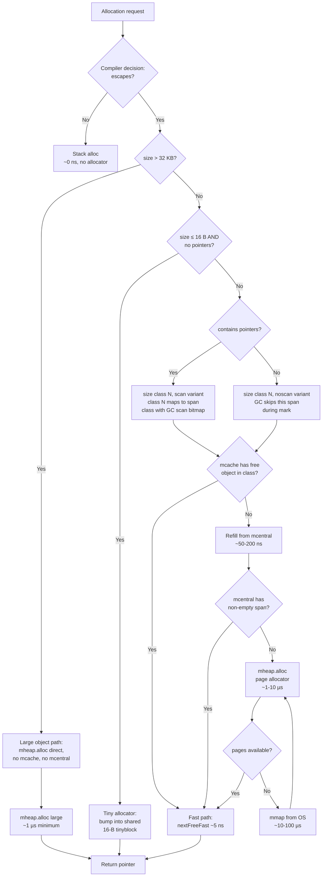

# Memory Allocator — Senior

## 1. Mental model — design goals, what the allocator optimizes for, what it gives up

At senior level the Go allocator is not "how does `make` work" — it is **a set of trade-offs deliberately chosen for a specific workload shape**: millions of small short-lived objects, concurrent goroutines on many cores, a tracing GC that needs per-object pointer metadata, and binaries that must run on machines from a Raspberry Pi to a 256-core server without retuning. Every design choice in `runtime/malloc.go` falls out of those constraints.

The explicit goals:

| Goal | How it is paid for | Consequence |
|------|--------------------|-------------|
| **Low per-allocation overhead** | Size classes + per-P caches + bump pointers in tiny path | ~5 ns fast path; no syscall, no lock, no compaction |
| **GC integration** | Per-span pointer bitmap; size-class-aware scan; type info at allocation site | Scan cost is proportional to *pointer fields*, not bytes |
| **P-locality** | `mcache` per P, not per thread; refill from `mcentral` only when empty | Most allocations are lock-free; cache lines stay warm |
| **Fragmentation control** | Fixed size classes, span-per-class, page-aligned spans | Internal fragmentation (up to 12.5% per class); no external fragmentation within a class |
| **Many-core scalability** | Sharded `mcentral` (per size class); page allocator with radix-tree index (`pageAlloc`) | `mcentral` lock is class-local, not global; large-heap scans parallel |
| **No stop-the-world for allocation** | Allocation can happen during concurrent GC; mark-assist piggybacks on alloc | Allocation rate becomes GC pacing input |

The explicit non-goals (what Go's allocator deliberately does *not* do):

- **No compaction.** Objects never move. Pointers stay stable, FFI is safe, but external fragmentation across size classes is possible — the heap can be 50% live with 50% wasted across many partially-full spans.
- **No per-allocation OS release.** Pages return to the OS on the **scavenger**'s schedule, not on `free`. RSS does *not* shrink immediately after a GC; this surprises every senior engineer once.
- **No NUMA awareness.** Go does not pin spans to NUMA nodes. On large multi-socket machines, you pay cross-socket memory latency invisibly.
- **No per-goroutine allocator.** P-local, not G-local. A goroutine migrating between Ps changes which `mcache` it uses.
- **No size-class auto-tuning at runtime.** Size classes are baked in at Go release; if your workload's modal allocation is at the unlucky edge of a class, you eat the rounding tax forever.

The senior shift is treating the allocator as a **system with a workload contract**: it is fastest for Go-shaped programs (lots of small structs, modest pointer density, GC-tolerant lifetimes). Push outside that envelope — multi-GB arenas, sub-µs latency budgets, pathological pointer-heavy graphs — and you need to *help the allocator*, not fight it.

---

## 2. TCMalloc origins and Go's adaptations

Go's allocator descends from Google's TCMalloc ("Thread-Caching Malloc") via Russ Cox's port in 2012-2014. The bones are the same; the joints are different.

**TCMalloc structure (inherited).** Three tiers: per-thread cache for fast path, central free lists for refill, page heap for large blocks and OS interaction. Size classes bucket allocations to amortize bookkeeping. Each tier hands work to the next only when local resources are exhausted.

**Go's adaptations (the interesting parts):**

- **Per-P, not per-thread.** TCMalloc caches per OS thread (`pthread_self()`). Go caches per scheduler P. Why: a Go process has typically `GOMAXPROCS` Ps but thousands or millions of goroutines and a fluctuating number of OS threads. Per-thread caching would either be wasteful (thousand-thread programs each holding a cache) or thrash (caches transferred on every M re-attach). Per-P bounds the cache count to `GOMAXPROCS`, and Ms swap caches in/out via `acquirem`/`releasem` cheaply.
- **GC metadata co-located.** TCMalloc has no GC. Go's allocator writes a pointer bitmap into the span's metadata at allocation time; the GC reads it during mark. The allocator *is* the GC's data source.
- **Tiny allocator.** A separate sub-path for `<16-byte, pointer-free` allocations packs them into a 16-byte block. TCMalloc has no equivalent; Go added it because Go has many such allocations (small strings, small interfaces, tiny structs).
- **Size class re-tuning across versions.** TCMalloc's classes were tuned once. Go re-tunes — Go 1.0 had ~60 classes, Go 1.5 tuned them after escape analysis matured, Go 1.12 added the page allocator with a radix tree, Go 1.21 retuned the large-object boundary. The classes are not sacred; they are profile-driven.
- **No `malloc_trim` equivalent that callers invoke.** TCMalloc exposes `MallocExtension::ReleaseFreeMemory()`. Go has `runtime/debug.FreeOSMemory` but de-emphasizes it — the scavenger and `GOMEMLIMIT` are the senior tools. Manual release is for emergencies.
- **Span class encodes object kind.** Each span has a "noscan" or "scan" variant. Noscan spans hold pointer-free objects — the GC skips them entirely during mark. This is a 2-3x mark-phase speedup for buffer-heavy workloads.

| Aspect | TCMalloc | Go allocator |
|--------|----------|--------------|
| Cache key | OS thread | Scheduler P |
| Cache count | Thread count (unbounded) | `GOMAXPROCS` (bounded) |
| GC integration | None | Pointer bitmap per span |
| Tiny path | No | Yes (≤16 B, no pointers) |
| Class tuning | Static | Per-release |
| OS release | Caller-driven | Scavenger background |
| Compaction | No | No |
| Large objects | `>256 KB` | `>32 KB` |

The senior lesson: **Go's allocator is TCMalloc with the GC baked into the data structures**. You cannot separate "the allocator" from "the GC" — they share the bitmap, the span metadata, the pacing decisions. Tuning one without thinking about the other will surprise you.

---

## 3. Allocation cost breakdown — fast path, refill, mheap

The allocator's whole point is making the common case cheap and the rare case bounded. Three tiers, three orders of magnitude:

| Path | When | Cost (approx) | What happens |
|------|------|---------------|--------------|
| **Tiny path** | ≤16 B, no pointers | ~2-3 ns | Bump pointer into a shared 16-byte tiny block in `mcache` |
| **mcache fast path** | Size matches a class, `mcache` has a free object | ~5-10 ns | Pop head of free list in `mcache.alloc[class]` |
| **mcentral refill** | `mcache` empty for this class | ~50-200 ns | Lock `mcentral.spanLock`, take a span, refill `mcache` |
| **mheap allocate** | `mcentral` empty | ~1-10 µs | Lock `mheap.lock`, ask page allocator for pages, possibly trigger sweep |
| **OS allocation** | `mheap` out of pages | ~10-100 µs | `mmap` from OS; may trigger GC |
| **GC mark-assist** | Allocation during active GC | + variable | Caller pays mark debt before continuing |

The fast path is the allocator's entire reputation. Five nanoseconds means an allocation costs about as much as a function call. The implementation is a tight loop in `runtime.mallocgc`:

```go
// roughly, edited for readability
func mallocgc(size uintptr, typ *_type, needzero bool) unsafe.Pointer {
    if size <= maxSmallSize {
        if noscan && size < maxTinySize {
            // tiny path
        }
        // small path
        c := getMCache()
        spc := makeSpanClass(sizeclass, noscan)
        span := c.alloc[spc]
        v := nextFreeFast(span)
        if v == 0 {
            v, span, _ = c.nextFree(spc) // slow path: refill
        }
        // ...
    } else {
        // large path: straight to mheap
    }
}
```

`nextFreeFast` is a single bitmap scan, no lock, no allocation of metadata. Hot.

**mcache refill (the 50 ns cost).** When the free list for a size class is empty, `mcache.refill` grabs a fresh span from the *non-empty* list at `mcentral` for that size class. This requires `lock(&c.partial[sweepgen%2].spineLock)` — a mutex, but on a class-local mutex, not a global one. With 67 size classes, the contention is sharded 67 ways. On 64-core machines this is still occasionally the hot spot; runtime/trace shows it as `mcentral.cacheSpan`.

**mheap traffic (the 1-10 µs cost).** When `mcentral` for a class is fully drained, it asks `mheap` for a new span. `mheap` consults the **page allocator** (radix tree of free pages, Go 1.12+) to find a run of pages, marks them as belonging to this size class, and returns. The `mheap.lock` is global — this *is* a contention point, but it should be rare (refill of refill).

**OS calls (the 10-100 µs cost).** When `mheap` is short on pages, it grows via `sysAlloc` (`mmap` on Linux). This is also where the **scavenger** lives: it `madvise(MADV_FREE)`s pages back to the OS, but it does so asynchronously.

**GC mark-assist (variable, can dominate).** During concurrent GC, every allocator call may be charged "mark debt" proportional to the bytes allocated. The caller does scan work *before* the allocation returns. This is how Go enforces pacing — if you allocate fast, you pay fast. A symptom: p99 allocation latency spikes during GC are mark-assist, not allocator cost. Look at `runtime/trace` "MARK ASSIST" bars.

The senior model: **allocation cost is a step function**. Most allocations are 5 ns; a small fraction are 50-200 ns; a tiny fraction are microseconds. The mean is 10-20 ns. The p99 depends entirely on how often you cross tiers — and on whether GC is concurrently running.

---

## 4. Allocation sequence diagram

```mermaid
sequenceDiagram
    autonumber
    participant User as User code
    participant Compiler as Compiler / escape
    participant Mcache as mcache (per P)
    participant Mcentral as mcentral[class]
    participant Mheap as mheap
    participant PageAlloc as pageAlloc (radix)
    participant OS as OS (mmap)
    participant GC as GC mark-assist

    User->>Compiler: new(T) / make / &T{}
    Compiler->>Compiler: escape analysis
    alt does not escape
        Compiler->>User: alloc on stack (free)
    else escapes to heap
        Compiler->>Mcache: runtime.mallocgc(size, type)
        Note over Mcache: lock-free path
        alt GC running
            Mcache->>GC: pay mark-assist debt
            GC-->>Mcache: debt cleared
        end
        alt size class has free object
            Mcache->>Mcache: nextFreeFast (~5 ns)
            Mcache-->>User: pointer
        else mcache empty for class
            Mcache->>Mcentral: cacheSpan(class)
            Note over Mcentral: lock(spanLock), 67-way sharded
            alt mcentral has non-empty span
                Mcentral-->>Mcache: span (~50-200 ns)
            else mcentral drained
                Mcentral->>Mheap: alloc(npages, class)
                Note over Mheap: lock(mheap.lock), GLOBAL
                alt pageAlloc finds free run
                    Mheap->>PageAlloc: alloc(npages)
                    PageAlloc-->>Mheap: pages (~1-10 µs)
                else heap out of pages
                    Mheap->>OS: sysAlloc / mmap
                    OS-->>Mheap: arena bytes (~10-100 µs)
                    Mheap->>PageAlloc: register pages
                    PageAlloc-->>Mheap: pages
                end
                Mheap-->>Mcentral: span
                Mcentral-->>Mcache: span
            end
            Mcache-->>User: pointer
        end
        Note over User: pointer bitmap written;<br/>span knows scan vs noscan
    end
```

The diagram is the senior mental model in one picture. Steps 1-3 (escape analysis on the stack) are by far the most common — most "allocations" never become heap allocations. Steps 5-9 (`mcache` fast path) are the second most common. Steps 10-16 (refill and mheap) are rare. Step 18 (OS allocation) is rarer still and is the only point where the program can block.

---

## 5. Size class routing flowchart



Two pieces of senior intuition fall out of this:

1. **The "noscan" branch is the biggest single performance lever the allocator gives you for free.** A `[]byte` (no pointers) and a `[]*T` (full of pointers) take the same time to allocate, but the GC mark phase treats them very differently. A 1 MB `[]byte` is one byte to scan (the slice header); a 1 MB `[]*T` is 128K pointers to chase. Replacing `[]*T` with a denser representation (interned IDs, a slab of structs) collapses scan cost.

2. **The 32 KB cliff is real.** Objects ≤32 KB go through `mcache`. Objects >32 KB go straight to `mheap` and contend on the global lock. A workload that constantly allocates 33 KB buffers is dramatically more expensive than one allocating 32 KB buffers. If you can shape your buffer sizes below the cliff, do.

---

## 6. Escape analysis as the first line of defense

The fastest allocation is the one that does not happen. Escape analysis is the compiler pass that decides, per allocation site, whether the lifetime is bounded by a function frame (stack) or potentially longer (heap). Stack-allocated values cost ~0 to allocate, never touch the GC, never count toward `GOGC` pacing, and die for free when the frame returns.

Inspect with:

```bash
go build -gcflags="-m=2" ./... 2>&1 | grep -E "escapes|moved to heap"
```

`-m` prints decisions; `-m=2` prints reasons. Senior reading:

```
./svc.go:42:6: moved to heap: req            <- &req returned or captured
./svc.go:51:23: ... argument does not escape <- inlined, stays on stack
./svc.go:64:14: leaking param content: data  <- pointer reachable beyond return
./svc.go:78:22: parameter content leaks to ...
```

Common escape causes, in roughly the order you will encounter them:

| Cause | Example | Fix |
|-------|---------|-----|
| **Return a pointer** | `func New() *T { return &T{} }` | Often unavoidable; accept the cost |
| **Interface conversion** | `var any interface{} = i` | Avoid `interface{}` in hot path; use concrete types |
| **Captured by closure** | `go func() { use(x) }()` | Pass by value if closure outlives caller |
| **Stored in heap object** | `m[k] = &v` | Reconsider whether map should hold values |
| **Passed to `fmt.Sprintf`** | `fmt.Sprintf("%v", i)` boxes `i` | Avoid `fmt` in hot paths; use specific formatters |
| **Slice grows past capacity** | `s = append(s, x)` past cap | Pre-allocate with `make(T, 0, n)` |
| **Send to channel** | `ch <- &v` | Channels frequently force escape |
| **`go func(x)`** when x is large | goroutine arg passed by value but heap | Use channel of indices instead of values |

**The interface-boxing trap.** Methods called through an interface frequently force the receiver to escape, because the compiler does not know at the call site what the implementation does with it. Hot-path code that goes through an interface dispatch typically allocates per call. The fix is concrete types in inner loops; reserve interfaces for boundaries.

**`fmt` is an allocation factory.** Every argument to a `fmt.*` function is converted to `interface{}` — boxing every primitive into a heap allocation. A logger that does `slog.Info("count", "n", n)` where `n` is `int` allocates. The fix: avoid `fmt` in hot paths; pre-compute strings; use `strconv` for known types; use `[]byte` and `append` for byte building.

**Closure capture.** `go func() { count++ }()` forces `count` to heap because the goroutine outlives the caller. `go func(c int) { ... }(count)` passes by value — but if `c` is large, you pay copy cost. Senior trade: small captures by value, large captures by pointer with awareness of the escape cost.

The senior workflow: when a profile shows allocations dominating, **read `-m=2` for the hot functions first**. Most allocation pressure comes from a handful of escape sites that can be rewritten.

---

## 7. Pools, arenas, and the stack-vs-heap mental model

When escape analysis cannot help, the next tools are *manual lifetime management*: pools, arenas, and value-typed APIs.

**`sync.Pool` semantics.** A `sync.Pool` is a free list with per-P shards and a victim cache.

```go
var bufPool = sync.Pool{
    New: func() any { return new(bytes.Buffer) },
}

func handle(req *Request) {
    buf := bufPool.Get().(*bytes.Buffer)
    defer func() { buf.Reset(); bufPool.Put(buf) }()
    // use buf
}
```

Internally each pool has a per-P local stack (`poolLocal`) plus a "victim" (last generation's local). On GC, the local is moved to the victim and the victim is dropped — so **every pooled object lives at most two GC cycles**. This is intentional: pools should bound memory, not retain it. If your workload pauses for a minute, the pool empties.

When pools help:

- **Bounded-size buffers with consistent shape.** `bytes.Buffer`, `[]byte` of stable capacity, `*json.Decoder`, `*sha256.New`. Allocation cost is amortized over many uses.
- **High allocation rate, GC pressure dominant.** Pooling cuts the allocation rate; pacing relaxes; mark-assist disappears.

When pools hurt:

- **Wide capacity distribution.** Pooling `bytes.Buffer` where requests vary from 1 KB to 10 MB causes 10 MB buffers to be reused for 1 KB requests — RSS grows, never shrinks.
- **Pointers retained inside pooled objects.** Forgetting to `Reset` leaves references to last request's data, blocking GC of much larger graphs. Classic incident shape: pool holds 100 buffers; each buffer's underlying slice has `[]*User` pointers; pool keeps 100 user graphs alive forever.
- **Cold pools.** Low-traffic services get nothing — the pool empties on every GC, allocation rate is fine without it.

**The Reset contract.** Anything you `Put` back must be in a known initial state. `buf.Reset()` zeros the buffer. For custom types, write a `Reset()` that explicitly nils pointer fields. Add a test that `Put` is always preceded by `Reset`.

**Manual arenas (`arenas` proposal).** Go 1.20 shipped an experimental `runtime/arena` package behind `GOEXPERIMENT=arenas`. The idea: allocate within an arena, free the entire arena in O(1) at the end, bypassing GC for that memory. Targeted at request-scoped allocation in high-throughput services. The proposal was reverted in Go 1.22 because:

- **Safety holes.** A pointer into an arena that escapes after the arena is freed is a use-after-free. The proposal could not guarantee containment without compiler changes deeper than the team wanted.
- **GC integration cost.** Arena memory still had to participate in stack scanning, which negated some of the savings.
- **Better alternative.** Improvements to escape analysis and `sync.Pool` covered most of the use cases.

The lesson: **Go is unwilling to introduce manual memory management as a primary API**. If you need arena-like behavior today, the tools are `sync.Pool` + careful API design (return values instead of pointers, prefer slices of structs over slices of pointer to struct, batch allocations).

**Stack-vs-heap as a mental model.** A goroutine stack is a contiguous region that starts at 2 KB and grows by copying (doubling) up to `runtime/debug.SetMaxStack` (default 1 GB). Stack allocation is bump-pointer cheap. Stack values disappear when the frame returns — no GC, no scan, no metadata. The price: anything that escapes a frame cannot live on the stack, and once on the heap it lives there forever (in GC terms) until reachability says otherwise.

The senior reframe: **the GC does not "collect" stack values; they cease to exist**. Optimizing allocation in Go usually means: *make more things stack-allocatable*. That is escape analysis, value semantics, and avoiding the patterns that force escape.

---

## 8. Profiling: alloc_space, alloc_objects, inuse, MemProfileRate

Allocation profiling has four distinct views and getting them confused wastes hours.

**`pprof -alloc_space`.** Cumulative bytes allocated, across the entire program lifetime, per call site. Answers: *which code is responsible for allocation pressure?* Includes objects that have long since been freed. This is the view for GC tuning.

**`pprof -alloc_objects`.** Cumulative object count, same scope. Answers: *which code allocates the most objects?* A site allocating 1M tiny objects shows differently here than one allocating 100 huge objects — the GC mark cost scales with object count, not bytes.

**`pprof -inuse_space`.** Currently live bytes. Answers: *what is keeping memory resident right now?* Useful for memory leak hunts, but not for GC pressure.

**`pprof -inuse_objects`.** Currently live object count.

| View | Question | Use for |
|------|----------|---------|
| `alloc_space` | Who churns the most bytes? | GC tuning, allocation reduction |
| `alloc_objects` | Who churns the most objects? | Mark-phase cost, tiny-alloc tracking |
| `inuse_space` | What is live now? | Leak diagnosis |
| `inuse_objects` | How many objects are live? | Object-count leaks |

**`runtime.MemProfileRate`.** Sampling rate, in bytes. Default 512 KB — one in every 512 KB allocated is sampled. The default is a CPU/coverage trade: cheap enough to leave on in production, coarse enough to miss tiny allocations.

```go
// Sample every allocation (test only; production-hostile)
runtime.MemProfileRate = 1

// Disable (rare, sometimes for benchmarking)
runtime.MemProfileRate = 0
```

For diagnosis of small-object pressure, lower the rate temporarily — set it at startup, run for the diagnostic window, restore. Setting it after allocations have happened only affects future samples.

**Workflow.** Profile with `net/http/pprof`:

```go
import _ "net/http/pprof"
go http.ListenAndServe("localhost:6060", nil)
```

Collect:

```bash
go tool pprof http://localhost:6060/debug/pprof/allocs?seconds=30
(pprof) top -cum
(pprof) list HotFunc
(pprof) web    # graph
```

Senior interpretation:

- **High `alloc_space`, low `inuse_space`** — churn. The allocator is fine; the GC is the cost. Look at the rate and use mark-assist + GC frequency to confirm. Fix with pooling or escape-analysis-friendly rewrites.
- **High `inuse_space`, low `alloc_space`** — leak or cache growth. Find what holds references; consider TTLs, bounded caches, weak references.
- **High `alloc_objects` disproportionate to `alloc_space`** — tiny-object pressure. The mark phase suffers because it has many small things to scan. Consider packing into larger contiguous blocks.

---

## 9. Large objects, fragmentation, and the 32 KB cliff

Objects larger than 32 KB skip `mcache` and `mcentral` entirely. They allocate as **large spans** directly from `mheap`. Implications:

- **Every large allocation touches the global `mheap.lock`.** A workload allocating 100 K large objects per second on a 64-core box can show `mheap` lock contention in `runtime/trace`.
- **No size-class rounding for large objects.** A 33 KB allocation gets an 8-page (40 KB) span — internal fragmentation comes from page rounding, not class rounding.
- **Large object death triggers immediate sweep cost.** Reclaiming a large span is more expensive than reclaiming a small object inside a partially-full span.
- **The scavenger releases large spans first.** Large free spans are the easiest to `madvise(MADV_FREE)` because they are contiguous.

The 32 KB boundary is set by `_MaxSmallSize`. A workload that allocates 32 KB buffers (page-friendly, mcache-routed) is meaningfully faster than one allocating 64 KB buffers (mheap, lock).

**Fragmentation, the senior view.** Go has internal fragmentation (size-class rounding within a class) but not external fragmentation in the classical sense (the allocator cannot fail to find a slot for a fitting object). What it has instead is **span-level waste**: a size-class span that contains one live object pins all of its other slots and all of its pages.

```
Span (size class 24 bytes, 8 KB span, 339 slots):
[X . . . . . . . . . . . . . . . . . . . . . . . . . . . . . . . . . . . . . . . . . . . . . .]
                                              ^ 1 live, 338 empty
```

The page cannot be returned to the OS, and the span cannot be repurposed for a different size class, until that one live object dies. In long-running services with diverse, sticky lifetimes, this is the dominant source of "heap is small but RSS is huge" surprises.

**Mitigation.** No compaction means you cannot fix this at runtime. You can fix it at design time:

- Allocate batched. A slice of struct allocates one span-friendly block, not N small ones.
- Avoid mixing lifetimes in the same allocation pattern. If you have long-lived metadata and short-lived per-request structs of similar size, separate them so churn frees full spans.
- Lower the live size of long-lived objects by pulling out pointer fields and interning them.

---

## 10. RSS vs heap — the production monitoring problem

The most reported "memory leak" in Go services is not a leak. It is **RSS not shrinking after the heap shrinks**. Senior debugging starts with understanding the four numbers and their relationships.

```go
var ms runtime.MemStats
runtime.ReadMemStats(&ms)
```

| Field | Meaning |
|-------|---------|
| `HeapAlloc` | Bytes of live objects (most recent GC). The "heap size". |
| `HeapInuse` | Bytes in spans currently used (live + free slots in used spans). |
| `HeapIdle` | Bytes in spans with no live objects but not yet returned to OS. |
| `HeapReleased` | Bytes that have been `madvise(MADV_FREE)`d. |
| `HeapSys` | Total bytes obtained from OS for heap (mapped). |
| `Sys` | Total mapped memory across heap, stacks, GC metadata, etc. |
| `NextGC` | Heap size that triggers next GC. |
| `GCSys` | GC metadata overhead. |

And, outside the runtime: **RSS** as reported by the kernel (e.g., `/proc/self/status` VmRSS).

**Relationships.**

```
HeapAlloc ≤ HeapInuse ≤ HeapSys
HeapReleased ≤ HeapIdle ≤ HeapSys
RSS ≈ HeapSys - HeapReleased + stacks + binary + maps + ...
```

`HeapReleased` is the key. `madvise(MADV_FREE)` tells the kernel "these pages may be freed if memory pressure arises, but I still own the mapping". The pages stay mapped (counted in `HeapSys`) but the kernel can decide they no longer count toward RSS — sometimes. On Linux, `MADV_FREE` (vs `MADV_DONTNEED`) does not immediately drop the pages from RSS; only under memory pressure does the kernel reclaim them.

**Common incident: "heap is 200 MB, RSS is 1.2 GB".** The heap shrank after a load spike but the scavenger has not had time to release pages, and even released pages are still mapped. Solutions:

- **Wait.** The scavenger pace is intentionally gentle to avoid CPU churn. Under steady-state load, RSS converges to `HeapSys`.
- **`GODEBUG=scavtrace=1`** to see what the scavenger is doing:

```
scav 30 ms 5.6 KB->6.4 KB (0->800 B) 22% CPU
```

- **`GOMEMLIMIT`** (Go 1.19+). Soft cap. Triggers GC more aggressively as you approach the limit, *and* makes the scavenger work harder. The recommended setting in containers is `GOMEMLIMIT=<container-limit * 0.9>`. This is the single most impactful production knob added since `GOGC`.
- **`runtime/debug.FreeOSMemory()`** as a last resort — forces an immediate scavenger pass. CPU-expensive; do not call on every request.

The senior monitoring stance: **alert on `HeapInuse` for application memory growth; alert on RSS for kernel-level pressure; alert on `HeapInuse - HeapAlloc` (free-slot waste) for fragmentation drift**.

---

## 11. Tuning knobs — GOGC, GOMEMLIMIT, MemProfileRate, FreeOSMemory

Four knobs, four use cases. The senior rule: tune one at a time, measure, write down why.

**`GOGC`** (default 100). Sets the heap growth ratio that triggers GC. `GOGC=100` means GC triggers when the heap doubles from its post-GC size. Lower values → more frequent GC, lower memory, more CPU. Higher → less frequent GC, more memory, less CPU.

- **Lower (50, 25)** for memory-constrained environments, when you have CPU headroom.
- **Higher (200, 500, off=-1)** for batch jobs that fit in RAM and want to avoid GC overhead.
- **Combined with `GOMEMLIMIT`.** Modern services usually set `GOMEMLIMIT` and leave `GOGC=100` — the limit acts as a backstop and `GOGC` controls steady-state pacing.

**`GOMEMLIMIT`** (default off; soft limit). Caps total runtime memory. The GC will increase its work, and the scavenger will be more aggressive, as the heap approaches this limit. Does *not* hard-block allocation (the runtime will exceed the limit if it must, to avoid OOM-killing healthy workloads with brief spikes). The semantics are roughly: "stay under this if you can without thrashing".

```bash
GOMEMLIMIT=2GiB ./mybinary
```

Production pattern: set `GOMEMLIMIT` to ~90% of the container memory limit. The 10% headroom absorbs the runtime's own overhead (stacks, GC metadata) and brief spikes.

**`runtime.MemProfileRate`** (default 512 KB). Sampling rate for the allocation profile. Lower for richer profiles; higher (or 0) to reduce profile overhead.

**`runtime/debug.SetGCPercent(n)`** equivalent to `GOGC` at runtime. Returns previous value. Useful for temporary changes during initialization (load a big dataset with GC mostly off, then re-enable).

**`runtime/debug.FreeOSMemory()`** forces an immediate scavenger pass plus a GC. CPU expensive. Use only at well-defined idle points (after batch jobs, after warmup).

**`GODEBUG=gctrace=1`** prints one line per GC. The senior log:

```
gc 142 @1234.567s 5%: 0.041+12+0.090 ms clock, 0.66+1.4/24/53+1.4 ms cpu, 256->258->129 MB, 257 MB goal, 16 P
```

- Heap before GC: 256 MB
- Heap during GC: 258 MB (allocated during mark)
- Heap after GC: 129 MB
- Goal: 257 MB (will trigger next GC at this size)
- GC overhead: 5%

**`GODEBUG=scavtrace=1`** for scavenger activity (one line per scavenger cycle).

**`GODEBUG=allocfreetrace=1`** logs every allocation and free. **Do not enable in production.** Use to verify hypotheses in benchmark settings.

| Knob | When | Caution |
|------|------|---------|
| `GOGC` | Tune steady-state GC frequency | Lower than 50 often costs more CPU than it saves memory |
| `GOMEMLIMIT` | Container deployments | Set to ~90% of container limit |
| `MemProfileRate` | Diagnostic only | Default is fine in production |
| `FreeOSMemory` | After known idle | Don't loop-call; CPU cost is real |
| `gctrace=1` | Always (low-vol log) | Cheap; ship to logs |
| `scavtrace=1` | RSS investigation | Verbose under high churn |

---

## 12. Code review red flags

The senior review eye scans for allocator-hostile patterns. Ten plus, with the why and the fix:

1. **`fmt.Sprintf` in a hot path.** Boxes every arg as `interface{}`, allocates a string. Replace with `strconv.AppendInt` into a pre-allocated `[]byte`, or a typed builder.
2. **`append(s, x...)` without preallocation.** `s := make([]T, 0, n)` then append. Without the capacity hint, Go doubles, copies, repeatedly — allocations and a moving target for escape analysis.
3. **`[]*T` where `[]T` would do.** Slice-of-pointer-to-struct is N + 1 allocations and an N-pointer scan for the GC. Slice-of-struct is one allocation, no pointers to scan.
4. **Struct of pointers.** A struct with ten `*string` fields scans like ten roots. Inline (`string` instead of `*string`) when nullability is not required.
5. **Maps in hot paths.** Maps allocate on insertion, scan buckets during GC, never shrink. For known small N, a slice search or a `[N]struct` is faster.
6. **`interface{}` parameters in hot loops.** Forces boxing of value types. Replace with concrete types or generics.
7. **`sync.Pool` without `Reset`.** Leaks references inside pooled objects; the pool is now retaining last request's data. Either `Reset` on `Put` or refuse the optimization.
8. **`sync.Pool` for wide-capacity-range objects.** Pooled buffers grow to the largest seen size; never shrink. A 1 MB buffer reused for 1 KB requests wastes 1023 KB resident.
9. **Goroutine per request capturing the request.** `go func() { use(req) }()` forces `req` to heap and ties its lifetime to the goroutine. Pass needed fields by value.
10. **`json.Marshal(&v)` on a hot path with no buffer reuse.** Allocates per call. Use `json.Encoder` with a pooled `*bytes.Buffer`, or `jsoniter` with a config.
11. **Closure that captures large values by reference.** `lo.Map(slice, func(x T) U { return f(captured, x) })` keeps `captured` alive and forced to heap.
12. **Channels of structs vs channels of pointers.** Sending a struct by value into a channel copies; large structs copy a lot. Sending a pointer escapes the value. Choice depends on size and lifetime — but the trade should be deliberate.
13. **Returning interfaces from hot constructors.** `New() Reader` forces the result to escape; `New() *concreteReader` may inline.
14. **Defer in tight loops.** Each `defer` allocates a deferred call record. Hoist the defer outside the loop, or use explicit `Close` in `for` bodies.
15. **String concatenation with `+` in loops.** `s = s + x` allocates a new string per iteration. Use `strings.Builder` with preallocated `Grow`.

These are not absolute prohibitions. They are *signals worth investigating*. The fix is sometimes "do nothing; this is fine"; sometimes it is "this is the allocation that ate the budget".

---

## 13. Postmortems — three production shapes

### Postmortem 1: p99 spikes at the 1-minute mark

**Symptom.** A service running smoothly at p50 = 4 ms; p99 oscillates wildly between 5 ms and 120 ms with a period of ~1 minute. SLO breach.

**Investigation.** `GODEBUG=gctrace=1` showed GC running every 58 seconds. `runtime/trace` of a slow request showed 80 ms of MARK ASSIST attributed to the request that triggered GC. The service allocated about 30 MB/s; with `GOGC=100` and a 30 MB live set, each GC promoted ~60 MB and took ~80 ms of wall time spread across CPUs.

**Root cause.** A handler used `fmt.Sprintf("%s:%d", host, port)` in every request to build a cache key. 200 K requests/s × ~50 bytes/sprintf = 10 MB/s of allocation pressure, almost all of it churn — never lived past the handler. Mark-assist made the request that crossed the GC trigger pay.

**Fix.** Replaced `Sprintf` with a `strings.Builder` from a pool; reused buffer across the request. Allocation rate dropped to 3 MB/s, GC frequency dropped 10x, p99 mark-assist disappeared.

**Lesson.** *Allocation-induced p99 spikes are an indirect symptom of GC pacing.* Look at the allocation rate, not the allocator latency. The fast-path cost was not the problem; the consequences of running the fast path 10x too often were.

### Postmortem 2: RSS grows after a load spike, never shrinks

**Symptom.** Service serves a 10-minute load spike, then traffic returns to baseline. Heap (`HeapAlloc`) returns to baseline within minutes. RSS stays at the peak forever, eventually OOM-killed by Kubernetes hours later.

**Investigation.** `runtime.MemStats` after the spike showed `HeapAlloc=200MB`, `HeapInuse=1.1GB`, `HeapIdle=900MB`, `HeapReleased=50MB`, `Sys=1.3GB`. The heap shrank; the runtime had not given the pages back to the OS.

**Root cause.** No `GOMEMLIMIT`. The default scavenger pace is gentle — it does not aggressively release pages because doing so trades CPU for RSS without a signal that RSS matters. In a container with a hard memory limit, RSS very much matters.

**Fix.** Set `GOMEMLIMIT=2GiB` (container limit was 2.3 GB). The runtime now treats 2 GiB as a target; scavenger releases pages much more eagerly as the heap approaches the limit. RSS now tracks `HeapAlloc` within a few seconds of GC.

**Lesson.** *Without `GOMEMLIMIT`, Go assumes RSS is free.* In container environments, set it. The default scavenger pace exists for VM workloads where memory is genuinely free until used.

### Postmortem 3: sync.Pool tenant leak

**Symptom.** Multi-tenant service. After a few hours, RSS grows unboundedly. Heap profile shows large `[]byte` slices accumulating. No obvious code path retains them.

**Investigation.** `inuse_space` profile pointed at `bytes.Buffer.Grow`. Code used a pooled `*bytes.Buffer` per request to render responses. `Reset` was called before `Put`. Why was memory accumulating?

```go
buf := bufPool.Get().(*bytes.Buffer)
defer func() {
    buf.Reset()        // resets len, NOT cap
    bufPool.Put(buf)
}()
```

**Root cause.** `bytes.Buffer.Reset()` sets length to zero but retains capacity. A pool that saw one 10 MB request had every buffer in it grown to 10 MB capacity. Subsequent 1 KB requests "fit" but the buffer was 10 MB resident. Over time, all pooled buffers were at the high-water mark, multiplied by the number of P-shards in the pool.

**Fix.** Either (a) skip pool insertion for unusually large buffers (`if buf.Cap() > 64KB { return // do not Put }`), or (b) explicitly truncate before Put (`buf = bytes.NewBuffer(buf.Bytes()[:0:64*1024])` if we want to keep some baseline cap).

**Lesson.** *Pools amplify the worst-case allocation size across all subsequent uses.* `Reset` is necessary but not sufficient. Bound pooled object size, or do not pool.

---

## 14. Senior code review checklist

When reviewing allocation-sensitive Go code, walk this list. Each item is "investigate" not "reject":

1. **Are allocations in hot paths visible in `pprof -alloc_space`?** If a hot function shows up large, escape analysis is the next stop.
2. **Did the author run `go build -gcflags="-m=2"` for the changed package?** Escape decisions should be reviewed deliberately for hot functions.
3. **Is `fmt`, `Sprintf`, `Errorf`, `Println` used in hot paths?** Replace with typed builders.
4. **Are slices preallocated with capacity hints?** `make([]T, 0, n)` for any growth past trivial sizes.
5. **Are large structs stored as `[]T` or `[]*T`?** Justify `[]*T`.
6. **Are interface conversions happening in hot paths?** Especially `interface{}` parameters.
7. **Is `sync.Pool` used with proper `Reset` semantics?** Test that all pointers are cleared on `Put`.
8. **Does `sync.Pool` bound the size of pooled objects?** Or do we accept worst-case-growth permanence?
9. **Are goroutines capturing request data by closure?** Pass by value or explicitly limit lifetime.
10. **Are deferred calls inside tight loops?** Hoist.
11. **Are large objects (>32 KB) allocated frequently?** Consider chunking or pooling.
12. **Are pointer-bearing structs scanned more than necessary?** Inline value fields or split hot/cold.
13. **Does the package set `GOMEMLIMIT` expectations for containerized deployment?** Mention in README.
14. **Are `runtime/debug.FreeOSMemory` or `SetGCPercent` calls justified?** Each should have a comment.
15. **Is there a benchmark for the allocation-sensitive code path?** `testing.B.ReportAllocs()` should show stable allocs/op.
16. **Are tests running with `-race`?** Race-free allocation is necessary but separate from allocation cost.
17. **Has the change been profiled before and after?** `benchstat` of `alloc/op` and `B/op`.
18. **Are there explicit non-allocator dependencies (e.g., huge maps, large channels)?** They affect `HeapInuse` proportionally.

A 'no' on any one is not blocking. Three or more 'no's on a hot-path PR is a request for changes.

---

## 15. Closing principles

**The allocator is a contract about cost shape, not a magic source of free memory.** Five-nanosecond fast path, fifty-nanosecond refill, microsecond mheap, hundred-microsecond OS — every senior engineer should internalize this hierarchy and know which tier their workload is hitting.

**Escape analysis is the most powerful free optimization in the language.** Read `-m=2` for your hot functions. Most allocation pressure resolves to a handful of escape sites that can be rewritten.

**`sync.Pool` is a bounded free list, not a memory savings account.** It cuts allocation rate; it does not save memory long-term (victim cache, GC-tied lifetime). Used badly, it amplifies worst-case sizing.

**Pointer density is the GC's cost driver.** A 1 GB heap of pointer-free data is cheap to mark. A 100 MB heap of pointer-heavy graphs is expensive. Restructure for fewer pointers before tuning GC.

**`GOMEMLIMIT` is the single most important production knob added in the last five years.** Set it in containers. Default to ~90% of the container limit. Combine with `GOGC=100` for most workloads.

**RSS is not heap.** Monitor both. RSS lags heap by tens of seconds because the scavenger is gentle by design. Under `GOMEMLIMIT` pressure the lag closes.

**The 32 KB cliff is real.** Allocations above it bypass `mcache` and hit the global `mheap.lock`. Shape buffer sizes below the cliff when possible.

**The "noscan" branch is the GC's escape valve.** Allocations of pointer-free types (`[]byte`, `[N]int`, `[N]struct of value-only fields`) are not scanned. Use them in hot paths whenever the design allows.

**Profile-driven, not folklore-driven.** Every tuning decision should follow a profile. "I think this allocates" is not enough. Use `pprof`, `gctrace`, `scavtrace`, `benchstat`. Numbers, not intuition.

**Init-time arrangement beats runtime tuning.** Pre-size your slices, your maps, your pools. The allocator handles the steady state well; transient growth is what hurts p99.

**The allocator does not collect; the GC does.** Allocator decisions (where it puts things, what metadata it writes) shape GC cost more than GC tuning does. To improve GC, improve allocation first.

**Treat the allocator as a system, not a function.** It is a co-design of memory regions, GC integration, scheduler awareness, and OS interaction. Changes ripple across all four. The senior shift is debugging one symptom (RSS, p99, mark-assist) in light of the whole structure.

The Go allocator is a Honda Accord with a GC welded on — boring, reliable, well-understood, fast enough for nearly everyone, and surprising in exactly the same ways across every release. Senior work is knowing when you have moved outside its workload envelope and what to reshape (allocations, pointer density, sizes, pooling) so that you move back in.

---

## Further reading

- `runtime/malloc.go`, `runtime/mheap.go`, `runtime/mcache.go`, `runtime/mcentral.go`, `runtime/mgcscavenge.go` — source of truth
- "TCMalloc: Thread-Caching Malloc" — Sanjay Ghemawat, the design Go's allocator inherits
- Russ Cox, "Go's Memory Allocator" — design walkthrough in the Go source tree (`runtime/malloc.go` header comment)
- `GODEBUG` reference: `gctrace`, `scavtrace`, `allocfreetrace`, `madvdontneed`, `gcpacertrace`
- `runtime.MemStats` documentation — every field and its relationship to RSS
- `runtime/pprof` and `net/http/pprof` — `alloc_space` vs `inuse_space` semantics
- `arenas` proposal (rejected 1.22) — what was tried and why it was reverted
- "Getting to Go: The Journey of Go's Garbage Collector" — Rick Hudson, GopherCon
- "Go 1.19 soft memory limit" — `GOMEMLIMIT` introduction notes
- `benchstat`, `pprof -base`, `runtime/trace` for before/after diagnosis
