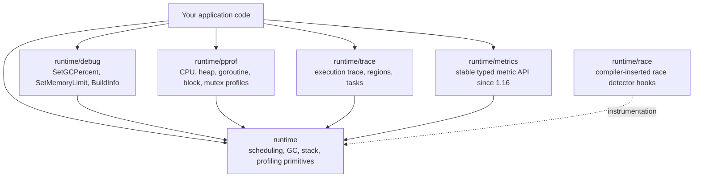

# runtime Package Deep — Middle

## 1. What "the runtime package" actually means

When people say "the runtime", they usually mean the C-and-Go machinery that implements goroutines, the scheduler, the GC, and stack management. The `runtime` *package* is the small, curated public API surface that lets your program talk to that machinery.

It's small on purpose. Most of the runtime is internal; what's exported is what the Go team is willing to keep stable. The middle-level skill is knowing which knob lives where, and resisting the urge to reach for them when a plain Go idiom would do.

The ecosystem around `runtime` is layered:



`runtime/debug`, `runtime/pprof`, `runtime/trace`, `runtime/metrics`, and `runtime/race` all sit on top of primitives that `runtime` itself exposes — sometimes publicly, sometimes through `//go:linkname` back-channels.

---

## 2. The exported `runtime` API, by category

| Category | Functions |
|----------|-----------|
| Scheduling | `GOMAXPROCS`, `Gosched`, `Goexit`, `LockOSThread`, `UnlockOSThread`, `NumGoroutine`, `NumCPU` |
| GC & memory | `GC`, `ReadMemStats`, `SetFinalizer`, `KeepAlive`, `AddCleanup` (1.24+), `MemProfileRate` |
| Profiling rates | `SetBlockProfileRate`, `SetMutexProfileFraction`, `SetCPUProfileRate` |
| Introspection | `Caller`, `Callers`, `CallersFrames`, `FuncForPC`, `Stack` |
| Build info | `Version`, `GOOS`, `GOARCH`, `Compiler` |
| Cgo plumbing | `SetCgoTraceback`, `CgoCheck`-style internals |

That's almost the entire user-facing surface. Everything heavier — pprof endpoints, trace events, structured metrics — lives in subpackages.

---

## 3. Scheduling knobs

```go
runtime.GOMAXPROCS(0)        // returns current P count; 0 = read, n>0 = set
runtime.NumCPU()             // logical CPUs visible to the process
runtime.NumGoroutine()       // live goroutines (cheap; reads sched counter)
runtime.Gosched()            // voluntary yield; rarely needed since async preempt
runtime.Goexit()             // terminate current goroutine; runs deferred funcs
runtime.LockOSThread()       // pin current g to current M for life or unlock
runtime.UnlockOSThread()     // release the pin (must match nesting depth)
```

A few middle-level facts:

- Since 1.14, the scheduler can preempt at any safe-point; `runtime.Gosched()` is almost never necessary outside benchmark-stabilization tricks.
- `GOMAXPROCS` was historically `NumCPU()` by default; under cgroup-aware setups you usually want `automaxprocs` or `GOMAXPROCS` reading from cgroup quota.
- `NumGoroutine()` is your cheapest leak sensor — alert when it grows monotonically.
- `Goexit()` runs `defer`s in the current goroutine, but won't touch other goroutines. It's how `testing` ends a failed test goroutine.

---

## 4. `LockOSThread` — when and when not

Pinning a goroutine to a thread is a heavy choice. Use it when:

- **Cgo with thread-local state**: OpenGL contexts, some GUI toolkits (Cocoa/GTK), libraries using `errno`-style TLS.
- **Signal masks**: you set per-thread signal masks via cgo and need them stable.
- **Single-threaded subsystems**: `sqlite3`-compiled-as-serialized, certain crypto HSM bindings.
- **The `main` goroutine on macOS** for Cocoa apps — `runtime.LockOSThread()` is called early so AppKit always runs on the same OS thread.

Do **not** use it just to "stay scheduled" or "avoid being moved" — Go goroutines aren't moved across CPUs at the language level; the OS scheduler still owns thread placement. Pinning prevents work-stealing and inflates the M count, both of which hurt throughput.

`LockOSThread` and `UnlockOSThread` nest; you must unlock the same number of times you locked, and if the goroutine exits while locked, the thread terminates with it. That's the intended way to dispose of an OS-thread-bound resource.

---

## 5. GC and memory functions

```go
runtime.GC()                       // synchronous, blocking GC; almost never use in app code
runtime.ReadMemStats(&m)           // STW-ish, expensive; do not poll in hot loops
runtime.SetFinalizer(obj, fn)      // schedule fn(obj) after obj becomes unreachable
runtime.KeepAlive(obj)             // explicit liveness extension to a program point
runtime.AddCleanup(ptr, fn, arg)   // 1.24+: lighter replacement for SetFinalizer
runtime.MemProfileRate = 512 * 1024 // sample rate for heap profile; 0 disables
```

Why each exists:

- `GC` exists for tests and benchmarks that want a clean baseline; if you call it in production you're papering over a real problem (allocation pressure, finalizer queue, soft memory limit tuning).
- `ReadMemStats` is *the* source for `HeapAlloc`, `NextGC`, `PauseNs`, `NumGC`, etc., but each call walks runtime data and is expensive. Prefer `runtime/metrics` for steady-state monitoring.
- `MemProfileRate` controls how many bytes-per-sample the heap profiler records. Default is 512KB; lower for finer granularity at runtime cost.

---

## 6. `SetFinalizer` semantics

```go
runtime.SetFinalizer(f, func(f *File) { _ = f.fd.Close() })
```

Important properties:

- The finalizer runs **at most once**, on a dedicated goroutine (not the GC goroutine).
- It runs only after the object becomes unreachable through ordinary references.
- **No ordering guarantee** between sibling finalizers, or between finalizer and other GC work. Cycles among finalizable objects are **not collected** — they leak.
- Resurrecting the object inside the finalizer makes it reachable again; the finalizer will not run a second time unless you re-`SetFinalizer`.
- Finalizers can run **at any safe point**, including during `os.Exit` — but program exit doesn't wait for them. If you rely on a finalizer to flush data, you'll lose it.

The classic trap: a `*File` wrapping an `int` fd. A finalizer that closes the fd looks safe — until escape analysis decides the wrapper doesn't escape, the wrapper dies early, and the fd is closed while the underlying syscall is still in flight. Fix with `runtime.KeepAlive(f)` after the syscall returns.

---

## 7. `KeepAlive` — the escape-analysis safety wire

```go
func read(f *File) []byte {
    buf := make([]byte, 1024)
    syscall.Read(int(f.fd), buf)
    runtime.KeepAlive(f) // ensure f is live until here
    return buf
}
```

`KeepAlive` is a no-op at runtime; it just tells the compiler "this variable must be considered live up to this program point". Without it, the optimizer is allowed to mark `f` dead the moment the last visible use is the `f.fd` read, and the GC might collect it before `syscall.Read` returns. With a finalizer in play, that's a closed-fd-during-syscall bug.

Use `KeepAlive` whenever:

- You hand a derived pointer (a field, an fd, a slice into a struct) to code the compiler can't see (cgo, syscalls, `unsafe`).
- You're past the last visible read of the owning object but still need it alive.

---

## 8. `SetFinalizer` vs `AddCleanup` (Go 1.24+)

| Aspect | `SetFinalizer` | `AddCleanup` |
|--------|----------------|--------------|
| Argument | Object pointer, function | Object pointer, function, arg |
| Ordering | Unordered; cycles leak | Designed to allow cycles |
| Resurrection | Possible (finalizer can re-reference) | Not possible (cleanup gets a value copy, not the object) |
| Multiple per object | One `SetFinalizer` overwrites | Multiple `AddCleanup`s allowed |
| Performance | One extra GC cycle to collect | Lighter; collected in same cycle |
| Removal | `SetFinalizer(obj, nil)` | Returned `Cleanup.Stop()` |
| Recommended use | Legacy code | New code (since 1.24) |

`AddCleanup` was added because `SetFinalizer` has accumulated a decade of subtle footguns. The signature change is the key fix: the cleanup callback doesn't receive the object itself, so it can't accidentally resurrect it, and cycles among cleanup-bearing objects no longer pin the cycle in memory.

If you're on Go 1.24+, default to `AddCleanup` for new code.

---

## 9. Introspection: stack frames and PCs

```go
pc, file, line, ok := runtime.Caller(0)             // caller's PC, file, line
var pcs [64]uintptr
n := runtime.Callers(2, pcs[:])                     // walk up the stack
frames := runtime.CallersFrames(pcs[:n])
for {
    f, more := frames.Next()
    fmt.Printf("%s\n  %s:%d\n", f.Function, f.File, f.Line)
    if !more { break }
}
buf := make([]byte, 1<<16)
n2 := runtime.Stack(buf, true)                      // all goroutines, like SIGQUIT
```

- `Caller(skip)` is one frame at a time and is what `log.Lshortfile` uses.
- `Callers` + `CallersFrames` is the right API for an error library that captures stacks (e.g. `pkg/errors`, `cockroachdb/errors`).
- `runtime.Stack(buf, true)` dumps all goroutine stacks — the same output you get on `SIGQUIT` or `panic`. Use it for snapshot-on-error or watchdog dumps.
- `FuncForPC(pc)` turns a PC back into a `*Func` you can call `Name`, `FileLine`, `Entry` on.

---

## 10. `runtime/debug`

This is the "knobs you tweak, not events you observe" subpackage.

| Function | Purpose |
|----------|---------|
| `SetGCPercent(n)` | GOGC equivalent at runtime; -1 disables GC |
| `SetMemoryLimit(n)` | GOMEMLIMIT equivalent; soft total cap |
| `FreeOSMemory()` | Force return of unused heap to the OS |
| `ReadGCStats(&s)` | Recent pause times, num GCs, pause quantiles |
| `Stack()` / `PrintStack()` | Current goroutine's stack as bytes / printed |
| `SetTraceback(level)` | Controls panic traceback verbosity (`single`, `all`, `system`, `crash`) |
| `BuildInfo()` | Module path, version, dependencies, VCS info |

`SetMemoryLimit` (1.19+) is the modern way to keep a Go process inside a container limit — set it to ~80–90% of the cgroup memory limit and let the runtime trade more GC work for staying under the bound. `GOGC=off` plus `SetMemoryLimit` is a viable mode for batch workloads.

`BuildInfo` is how you get the embedded VCS commit and module versions for `/version` endpoints; combine with `runtime.Version()` for the toolchain.

---

## 11. `runtime/pprof`

```go
f, _ := os.Create("cpu.pprof")
pprof.StartCPUProfile(f)
defer pprof.StopCPUProfile()

// Heap, goroutine, allocs, block, mutex, threadcreate:
pprof.Lookup("heap").WriteTo(w, 0)
pprof.Lookup("goroutine").WriteTo(w, 1) // debug=1 = textual
```

The available profiles:

| Profile | What it samples | Enable via |
|---------|------------------|------------|
| `cpu` | On-CPU samples (100Hz default) | `StartCPUProfile` |
| `heap` | Live allocations (sampled) | always on, rate via `MemProfileRate` |
| `allocs` | Cumulative allocations | always on |
| `goroutine` | Current goroutine stacks | always on |
| `block` | Time blocked on sync primitives | `SetBlockProfileRate` |
| `mutex` | Mutex contention | `SetMutexProfileFraction` |
| `threadcreate` | OS thread creations | always on |

`net/http/pprof` is a thin wrapper that registers HTTP handlers calling these. In production you usually pair it with a separate admin port.

Block and mutex profiles cost real overhead; set the rate non-zero only when investigating, then back to zero.

---

## 12. `runtime/trace`

`runtime/trace` records a fine-grained execution trace — goroutine lifecycle, GC events, syscalls, scheduler transitions — viewable with `go tool trace`.

```go
f, _ := os.Create("trace.out")
trace.Start(f)
defer trace.Stop()

ctx, task := trace.NewTask(ctx, "request")
defer task.End()

trace.WithRegion(ctx, "db.query", func() {
    db.Query(...)
})
trace.Log(ctx, "user_id", strconv.Itoa(uid))
```

Tasks group regions and logs into a logical unit of work. Regions are nested time spans. Logs are key/value events. The trace viewer shows them on a timeline alongside scheduler events, which is uniquely useful for "why did my latency spike?" — you can see your region overlap with a GC pause or a syscall block.

Tracing has higher overhead than pprof and produces large files; run for seconds, not minutes.

---

## 13. `runtime/metrics`

The stable, typed metric API introduced in 1.16, replacing ad-hoc `ReadMemStats` and `ReadGCStats` polling.

```go
descs := metrics.All()
samples := make([]metrics.Sample, len(descs))
for i, d := range descs {
    samples[i].Name = d.Name
}
metrics.Read(samples)

for _, s := range samples {
    switch s.Value.Kind() {
    case metrics.KindUint64:
        fmt.Println(s.Name, s.Value.Uint64())
    case metrics.KindFloat64:
        fmt.Println(s.Name, s.Value.Float64())
    case metrics.KindFloat64Histogram:
        h := s.Value.Float64Histogram()
        // h.Counts, h.Buckets — exportable to Prometheus
    }
}
```

Names look like `/gc/heap/allocs:bytes`, `/sched/goroutines:goroutines`, `/sched/latencies:seconds` (a histogram of run-queue wait). The contract: names and kinds are stable across versions, so you can build dashboards that survive Go upgrades. Prefer this over `ReadMemStats` for anything you want to graph.

---

## 14. `runtime/race`

You don't import `runtime/race` directly — it's enabled via:

```bash
go test -race ./...
go build -race ./cmd/server
```

At compile time, the compiler inserts hooks before every memory read and write. At runtime the race detector (a port of ThreadSanitizer) tracks happens-before relations across goroutines and reports any unsynchronized access pair.

Costs: ~5–10x CPU, ~2–3x memory, larger binaries. You use it in CI test runs and sometimes in canary builds — never in steady-state production. False positives are essentially absent; false negatives only when the race didn't happen on this run.

---

## 15. `//go:linkname` — the back-channel

The runtime exposes some primitives to other standard-library packages through `//go:linkname`, a compiler directive that rewires a Go symbol to one in another package. Example, from `sync/runtime.go`:

```go
//go:linkname sync_runtime_Semacquire sync.runtime_Semacquire
func sync_runtime_Semacquire(addr *uint32) {
    semacquire1(addr, false, semaBlockProfile, 0, waitReasonSemacquire)
}
```

And in `sync/runtime.go` (the `sync` side):

```go
//go:linkname runtime_Semacquire
func runtime_Semacquire(s *uint32)
```

The `sync` package declares a function with no body, and the linker stitches it to the runtime's internal `semacquire1`. That's how `sync.Mutex` borrows the runtime's semaphore implementation without exposing it publicly.

Other linkname users in the standard library: `time` for monotonic clock helpers, `os` for some signal plumbing, `reflect` for type-system internals. As of Go 1.23 the toolchain restricts third-party linkname into the runtime — packages outside the standard library can't rely on it for stability.

You'll occasionally see linkname in third-party packages reaching into runtime for performance or to capture internals (`fastrand`, scheduler hooks). Treat it as a build-breaking-in-the-next-version risk; it's not a stable interface.

---

## 16. Middle-level mistakes

- **Calling `runtime.GC()` in production.** Hides allocation pressure; usually wrong.
- **Polling `ReadMemStats` in a tight loop.** It walks runtime state; use `runtime/metrics`.
- **Forgetting `KeepAlive` around cgo/syscall calls** on objects with finalizers — closed fd in flight.
- **Holding `LockOSThread` longer than needed.** Inflates M count, breaks work-stealing.
- **Block/mutex profile permanently enabled** at a high sampling rate — measurable overhead.
- **Mixing `SetFinalizer` with cycles.** The cycle leaks; `AddCleanup` avoids this.
- **Reading `runtime.NumGoroutine` as a definitive count** without recognizing it's a fast read, not a snapshot — good for trends, not for assertions.

---

## 17. Summary

The `runtime` package is the small public face of a much bigger system. Middle-level mastery is knowing the categories — scheduling, GC, profiling rates, introspection — and which subpackage owns the heavier features. `runtime/debug` is for knobs, `runtime/pprof` for sampled profiles, `runtime/trace` for timeline traces, `runtime/metrics` for stable telemetry, `runtime/race` for compile-time correctness. `//go:linkname` is the back-channel that lets `sync`, `time`, and a few others reach into the runtime — useful to recognize, dangerous to rely on. Prefer `AddCleanup` over `SetFinalizer` in new code; use `KeepAlive` whenever you cross into cgo or syscalls with a finalizer-bearing object.

---

## Further reading
- `runtime` package docs — pkg.go.dev/runtime
- `runtime/metrics` reference — full list of stable metric names
- `runtime/trace` and `go tool trace` user guide
- `runtime/debug.BuildInfo` and `debug/buildinfo` for binary inspection
- Proposal #67535 — `runtime.AddCleanup` design discussion
- Go memory model — finalizer ordering & `KeepAlive` semantics
- `golang.org/x/exp/slog` and Prometheus exporters built atop `runtime/metrics`
