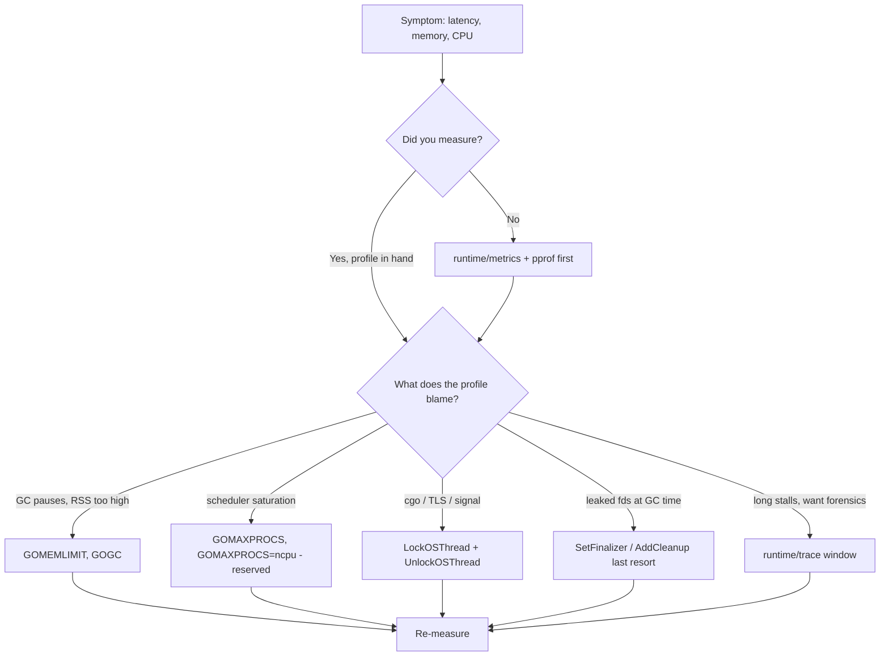
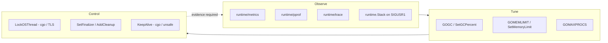

# runtime Package Deep — Senior

## 1. Mental model — a knob set, not a control surface

The senior-level claim about `runtime` is structural, not stylistic: **the exported runtime API is deliberately minimal, and most of it is for observation rather than control**. Read the package doc and `pkg.go.dev/runtime` once with that filter on, and the surface area splits cleanly in two:

| Class | What it does | Examples | Frequency in production code |
|-------|--------------|----------|------------------------------|
| **Diagnostic (read-only)** | Expose state of the scheduler / GC / heap / goroutines | `ReadMemStats`, `Stack`, `NumGoroutine`, `runtime/metrics`, `runtime/pprof`, `runtime/trace` | Frequent — but indirectly, via metrics/profiling stack |
| **Tuning (slow knobs)** | Bias the runtime's policy | `GOMAXPROCS`, `SetGCPercent`, `SetMemoryLimit`, `SetBlockProfileRate`, `SetMutexProfileFraction`, `SetCPUProfileRate` | Once at startup, or one-shot per workload mode |
| **Control (binding)** | Couple a Go-level concept to an OS or memory invariant | `LockOSThread`/`UnlockOSThread`, `SetFinalizer`, `AddCleanup`, `KeepAlive`, `Goexit` | Rare and load-bearing — every call needs a written justification |
| **Inspection (debugging)** | Programmatic source/call-site info | `Caller`, `Callers`, `CallersFrames`, `FuncForPC` | Wrappers for logging, error reporting |

The senior heuristic: **prefer the diagnostic API; reach for tuning only when a profile says you must; reach for control only when correctness demands it**. Production codebases that scatter `runtime.GC()`, `runtime.GOMAXPROCS(1)`, `debug.SetGCPercent(800)` across business code are almost always misdiagnosing a problem the GC was about to handle anyway. The runtime is tuned for the median Go program; the price of a knob set is that any twist of a knob is a claim about your workload that you owe a profile to back up.



The diagram is the senior position in one picture: **measurement precedes every knob**, and the knob you turn is dictated by the profile, not the intuition.

---

## 2. `runtime/metrics` — the modern observability API

`runtime/metrics` (Go 1.16+) is the supported, forward-compatible way to read runtime state. `ReadMemStats` still exists but is now best understood as a legacy compatibility surface. The differences are not cosmetic:

| Aspect | `runtime.ReadMemStats` | `runtime/metrics.Read` |
|--------|------------------------|------------------------|
| Stop-the-world | Yes (briefly) | No — lock-free snapshot |
| Set of values | Fixed `MemStats` struct | Discoverable via `metrics.All()`; grows per Go release |
| Histograms | None — only single values | Native histogram type (`Float64Histogram`) for tail-latency |
| Unit/kind annotation | Implicit (read the doc) | Explicit per metric |
| Cost | O(heap state collected) | O(metrics requested) |
| Cgo-safe during pause | Risky on huge heaps | Safe |
| Backward compat policy | `MemStats` is frozen | New metrics added; old never removed |

**A production-ready exporter** that exposes the key metrics to Prometheus:

```go
package runtimeobs

import (
    "runtime/metrics"
    "strings"
    "sync"

    "github.com/prometheus/client_golang/prometheus"
)

// Exporter samples runtime/metrics into Prometheus collectors. Concurrent-safe;
// zero-allocation in steady state (samples slice is reused).
type Exporter struct {
    descs   []*prometheus.Desc
    samples []metrics.Sample
    kinds   []metrics.ValueKind
    mu      sync.Mutex
}

// Curated list. Histograms are exported as native Prometheus histograms.
var watched = []string{
    "/sched/latency:seconds",           // hist: goroutine wait-to-run
    "/gc/pauses:seconds",               // hist: STW pauses
    "/gc/heap/live:bytes",              // gauge
    "/gc/heap/goal:bytes",              // gauge: next GC target
    "/memory/classes/total:bytes",
    "/sched/goroutines:goroutines",
    "/cpu/classes/gc/total:cpu-seconds",
    "/sync/mutex/wait/total:seconds",
}

func New() *Exporter {
    e := &Exporter{
        descs:   make([]*prometheus.Desc, len(watched)),
        samples: make([]metrics.Sample, len(watched)),
        kinds:   make([]metrics.ValueKind, len(watched)),
    }
    index := make(map[string]metrics.Description)
    for _, d := range metrics.All() { index[d.Name] = d }
    for i, name := range watched {
        d, ok := index[name]
        if !ok { continue } // metric absent in this Go version
        e.samples[i].Name = name
        e.kinds[i] = d.Kind
        e.descs[i] = prometheus.NewDesc(promName(name), d.Description, nil, nil)
    }
    return e
}

func (e *Exporter) Collect(ch chan<- prometheus.Metric) {
    e.mu.Lock(); defer e.mu.Unlock()
    metrics.Read(e.samples)
    for i, s := range e.samples {
        if e.descs[i] == nil { continue }
        switch e.kinds[i] {
        case metrics.KindUint64:
            ch <- prometheus.MustNewConstMetric(e.descs[i], prometheus.GaugeValue, float64(s.Value.Uint64()))
        case metrics.KindFloat64:
            ch <- prometheus.MustNewConstMetric(e.descs[i], prometheus.GaugeValue, s.Value.Float64())
        case metrics.KindFloat64Histogram:
            b, sum, cnt := histToProm(s.Value.Float64Histogram())
            ch <- prometheus.MustNewConstHistogram(e.descs[i], cnt, sum, b)
        }
    }
}

func promName(n string) string {
    n = strings.NewReplacer("/", "_", ":", "_", "-", "_").Replace(strings.TrimPrefix(n, "/"))
    return "go_" + n
}
```

Senior points buried in that code: (1) `metrics.All()` is the registry — query it once, do not hardcode against a specific Go version; (2) the sample slice is reused per `Collect`, no allocation on the hot path; (3) histograms are first-class — `/sched/latency:seconds` is the **runtime-measured goroutine scheduling latency**, the canonical signal of CPU saturation, and you get it without any external benchmark; (4) the curated list omits dozens of metrics on purpose — exporters should be opinionated, or Prometheus cardinality balloons.

---

## 3. `runtime/pprof` — profiles in production

`pprof` divides into two surfaces: the **HTTP handler** (`net/http/pprof`) for interactive profiling of long-running servers, and the **programmatic API** (`runtime/pprof`) for batch jobs, tests, and on-demand captures.

**HTTP handler — secure exposure.** The handler must never be on the public listener. Three acceptable patterns: a separate internal-only mux on loopback (`127.0.0.1:6060`) or unix socket; an authenticated middleware on the public listener for hosted PaaS; or a unix-socket-only endpoint that operators ssh-tunnel into.

The default `net/http/pprof` blank import (`import _ "net/http/pprof"`) registers handlers on `http.DefaultServeMux`. **Never use that in code that serves real traffic** — if anything in your code does `http.ListenAndServe(":443", nil)`, you've published pprof on the public internet. Real CVEs have come from this; treat it as a checklist item.

**Programmatic profiling — file-based, for batch jobs and bug repros:**

```go
func profileOnce(ctx context.Context, dir string) error {
    cpu, _ := os.Create(filepath.Join(dir, "cpu.prof"))
    defer cpu.Close()
    if err := pprof.StartCPUProfile(cpu); err != nil { return err }
    defer pprof.StopCPUProfile()
    runWorkload(ctx)
    heap, _ := os.Create(filepath.Join(dir, "heap.prof"))
    defer heap.Close()
    runtime.GC() // dump current live heap, not the noisy pre-GC state
    return pprof.WriteHeapProfile(heap)
}
```

**Label propagation (`pprof.Do`)** is the single most under-used feature. It lets you attribute CPU samples to logical work units — a request ID, a tenant, a job kind — and is visible in flame graphs as labels:

```go
func handleRequest(w http.ResponseWriter, r *http.Request) {
    labels := pprof.Labels(
        "tenant", tenantOf(r),
        "route", r.URL.Path,
    )
    pprof.Do(r.Context(), labels, func(ctx context.Context) {
        process(ctx, r, w)
    })
}
```

In `pprof -tags`, you can now answer "which tenant is burning the CPU?" without a separate APM tool. Labels are sampled with CPU profiles only; they do not propagate across goroutine spawns automatically unless the child goroutine inherits the labelled context (it does via `pprof.Do`'s `context.Context`). Spawn goroutines with `go func(){ pprof.Do(parentCtx, nil, ...) }` if you want continuity.

**Cost of a CPU profile.** Default rate is 100 Hz (100 samples/sec/CPU). Overhead is ~1-3% on most workloads. Push the rate via `runtime.SetCPUProfileRate` only with measurement — at 1 MHz the overhead can dominate the workload, and the histogram becomes biased.

---

## 4. `runtime/trace` — latency forensics

`pprof` answers "what burns CPU?". `trace` answers "what happened during this 200 ms?". When to reach for which:

| Question | Tool |
|----------|------|
| Steady-state CPU hotspots | `pprof` CPU |
| Steady-state allocation hotspots | `pprof` heap |
| Lock contention | `pprof` mutex / block |
| A specific request was slow — why? | `runtime/trace` |
| GC pause investigation | `runtime/trace` (shows P-states around GC) |
| Goroutine starvation | `runtime/trace` (visible as long `runnable` periods) |
| Tail latency p99.9 | `runtime/trace` for a sample window + `/sched/latency` histogram |

**Recording a window** in production:

```go
func captureTrace(d time.Duration, w io.Writer) error {
    if err := trace.Start(w); err != nil { return err }
    defer trace.Stop()
    time.Sleep(d)
    return nil
}
```

Triggered by SIGUSR2, a control-plane RPC, or a latency-threshold trip — anything but "always on". Trace overhead is **5-25%** depending on goroutine count; it is not free. A typical window is 1-5 s.

**Reading a trace** is a senior skill in itself. The pattern in `go tool trace`:

1. Open the **Goroutine analysis** view → the list of goroutines and their execution time, blocked time, and syscall time.
2. Find the long-tail outlier (usually visible as a goroutine with mostly `runnable` or `block` time).
3. Click into its **timeline** → identify the gap (waiting on chan, waiting on netpoll, blocked on syscall, GC assist).
4. Cross-reference with the **proc view** → was the CPU saturated, or was this goroutine just not scheduled?

A real pattern: **a 300 ms p99 spike that disappears in `pprof`** is almost always either a GC pause (visible in trace as a green GC band across all Ps) or scheduler starvation (the goroutine sits `runnable` for 200 ms with all Ps busy on other work). `pprof` averages it away; `trace` shows the single event.

---

## 5. `runtime/debug` tuning — `GOMEMLIMIT`, `SetGCPercent`, `BuildInfo`

The `runtime/debug` package is misnamed — it's tuning + introspection, not debugging.

**`GOMEMLIMIT` (Go 1.19+) vs `GOGC`.** `GOGC` (default 100) sets the *ratio* — GC triggers when heap doubles since last GC. `GOMEMLIMIT` (default unlimited) sets a *cap* — the runtime will GC harder to stay under it. The two interact: `GOGC` chooses the schedule, `GOMEMLIMIT` overrides it when memory is tight. The senior rule in containerized Go:

```go
// At startup, before any allocation-heavy work:
import "runtime/debug"

// Container limit is the OS cgroup memory limit. Leave 5-10% headroom for
// non-heap (stacks, goroutine metadata, mmap caches, cgo malloc).
debug.SetMemoryLimit(int64(containerLimit) * 90 / 100)
```

Why programmatic over `GOMEMLIMIT=` env: (1) the limit must reflect *this container's* actual limit, not a guess in the image; (2) cgroup v2 limits change at runtime if the orchestrator resizes; the program can re-read `/sys/fs/cgroup/memory.max` and adjust; (3) testing and benchmarks want to pin it programmatically. Env var is fine for static, single-tenant deployments.

**`debug.SetGCPercent` for batch jobs.** A cron job that allocates 10 GB transient state, then exits, gets murdered by GC running every doubling. `SetGCPercent(800)` (GC at 8x growth) cuts GC work by ~10x for the duration, at the cost of higher RSS. The pattern:

```go
prev := debug.SetGCPercent(800)
defer debug.SetGCPercent(prev) // restore for any caller in same process
doBatch()
```

`-1` disables GC entirely — only legitimate for very short, allocation-bounded jobs where you'd rather run out of memory than waste CPU on GC.

**`BuildInfo` / `ReadBuildInfo`.** Since Go 1.18, the binary embeds module/VCS info. `runtime/debug.ReadBuildInfo()` exposes it:

```go
func version() string {
    bi, ok := debug.ReadBuildInfo()
    if !ok { return "unknown" }
    var rev, time string
    var dirty bool
    for _, s := range bi.Settings {
        switch s.Key {
        case "vcs.revision": rev = s.Value
        case "vcs.time":     time = s.Value
        case "vcs.modified": dirty = s.Value == "true"
        }
    }
    return fmt.Sprintf("%s@%s%s (%s)", bi.Main.Path, rev[:8], dirtySuffix(dirty), time)
}
```

This replaces the old `-ldflags "-X main.version=..."` pattern. The data is in the binary unconditionally (`-buildvcs=false` to disable), and survives stripping. Use it for `/version` endpoints, log preambles, and crash reports.

---

## 6. `LockOSThread` — when correct, when wrong

`runtime.LockOSThread` is the most-misunderstood control call in the package. The doc says it ties the calling goroutine to its current OS thread, and that all subsequent goroutines on that thread are blocked until the lock is released or the goroutine exits. What it does **not** do: pin the OS thread to a CPU. CPU pinning needs `taskset`/`sched_setaffinity`, which is a different layer.

**When correct:**

| Use case | Why locking is required |
|----------|-------------------------|
| **cgo with thread-local state** (SQLite, GTK, libcurl easy handles, GL contexts) | The C library stores state in `pthread_self()`; calling from a different thread is UB. |
| **glibc locale-set / Linux capabilities** | `setlocale`, `setuid`, `setresuid`, `prctl(PR_SET_KEEPCAPS)` are *per-thread* on Linux, not per-process. Go's `syscall` package locks for you in some of these; for direct cgo calls, you lock. |
| **Signal handlers needing thread identity** | A goroutine using `signal.Notify` for `SIGURG` plus thread-targeted signals. Rare. |
| **Initialization on the main thread** (macOS/Cocoa, OpenGL, X11) | The first OS thread must execute the event loop. `main.main` runs on it; lock there and never release. |
| **Performance pinning** (combined with `taskset`) | Once locked, then `taskset` or `sched_setaffinity` on the lock-holder thread pins it. Useful for latency-critical loops on isolated cores. |

**When wrong:**

- "I want this goroutine to stay on this CPU." `LockOSThread` does not do CPU pinning. You also need OS-level affinity.
- "I want to reduce context switching." The scheduler will still migrate the OS thread between cores; you've just removed a degree of freedom the scheduler used.
- "I want goroutine-local storage." Use a `context.Context` value or a map keyed by request ID. Locking to fake TLS is a leaky, expensive workaround.
- Anywhere a `chan` or `sync.Mutex` would do.

The canonical idiom — wrap the locked goroutine, release on exit, never return from a locked goroutine without unlocking:

```go
func runOnLockedThread(fn func()) {
    runtime.LockOSThread()
    defer runtime.UnlockOSThread()
    fn()
}

// For main-thread libraries, the goroutine never returns:
func init() { // or main.init
    if runtime.GOOS == "darwin" {
        runtime.LockOSThread() // main goroutine, main thread
    }
}
```

A locked goroutine that exits without `UnlockOSThread` causes the runtime to **destroy the OS thread**, not return it to the pool. This is intentional — it ensures dirty TLS does not leak — and correct for libraries that need a one-shot thread. It is a bug when used naively for performance, because thread creation and destruction is expensive on Linux/macOS.

---

## 7. Goroutine dump triage — `runtime.Stack` on SIGUSR1

Every Go service in production should respond to a signal by dumping all goroutine stacks. The implementation is twenty lines:

```go
func installStackDumper() {
    ch := make(chan os.Signal, 1)
    signal.Notify(ch, syscall.SIGUSR1)
    go func() {
        for range ch {
            buf := make([]byte, 1<<20)
            for {
                n := runtime.Stack(buf, true) // all goroutines
                if n < len(buf) { buf = buf[:n]; break }
                buf = make([]byte, 2*len(buf))
            }
            timestamp := time.Now().UTC().Format("20060102T150405Z")
            path := filepath.Join("/var/log/myservice", "goroutines-"+timestamp+".txt")
            _ = os.WriteFile(path, buf, 0o600)
            log.Printf("dumped %d bytes of stacks to %s", len(buf), path)
        }
    }()
}
```

The growing buffer matters: at 100K goroutines, the dump can exceed 50 MB. Pre-allocating 1 MB and doubling is the simple, correct shape.

**Cost.** `runtime.Stack(buf, true)` is **STW-like at high goroutine counts**. The runtime must visit every goroutine, walk its stack, and copy frames into the buffer. At 100K goroutines this can take 50-200 ms. Do not call it on a hot path. Treat it as a forensic tool, triggered by signal or a one-shot endpoint.

**Reading the dump.** Patterns to look for:

- **Leaks**: thousands of goroutines all in the same stack — usually a `chan receive` or `select` waiting on a never-closed channel.
- **Deadlock**: a small ring of goroutines all in `chan send` or `sync.(*Mutex).Lock`.
- **netpoll wait**: huge fan-out blocked in `internal/poll.(*FD).Read` is normal for an HTTP server; check the count against expected connections.
- **GC assist**: stacks ending in `runtime.gcAssistAlloc` mean a goroutine is paying GC tax during allocation; if many goroutines are in assist, you are heap-pressured.

Tooling: `go tool pprof -goroutine` for a profile-shaped view; `gops` (`github.com/google/gops`) for live inspection; `delve`'s `goroutines` command for attaching to a running process. Internal teams almost always end up writing a small parser for `runtime.Stack` output — the format is text but stable.

---

## 8. `SetFinalizer`, `AddCleanup`, `KeepAlive`

Finalizers are the runtime's lowest-utility, highest-rope mechanism. The senior position: **never rely on a finalizer for correctness**.

**`SetFinalizer(obj, fn)`** schedules `fn(obj)` to run sometime after `obj` becomes unreachable. "Sometime after" is the trap:

- The finalizer goroutine is a single goroutine. Slow finalizers serialize.
- Finalizers do not run on program exit. `os.Exit` skips them entirely; even normal exit does not flush them.
- Finalizable objects survive one extra GC cycle (the finalizer needs the object alive when it runs), inflating heap pressure.
- Cycles among finalizable objects break finalization entirely — none of them runs.

**When a finalizer is acceptable (file-descriptor closer of last resort):**

```go
type wrappedFD struct{ fd int }
func newFD(path string) (*wrappedFD, error) {
    f, err := os.Open(path)
    if err != nil { return nil, err }
    w := &wrappedFD{fd: int(f.Fd())}
    // Last-resort safety net. *Documented* as belt-and-suspenders; users
    // must still call Close.
    runtime.SetFinalizer(w, func(w *wrappedFD) {
        log.Printf("wrappedFD %d not closed; closing in finalizer", w.fd)
        syscall.Close(w.fd)
    })
    return w, nil
}
func (w *wrappedFD) Close() error {
    runtime.SetFinalizer(w, nil) // clear; we're closing properly
    return syscall.Close(w.fd)
}
```

This is exactly the pattern in `os.File` and `net.conn.fd`. **Note**: clear the finalizer in `Close` — otherwise the finalizer runs *and* closes an FD that may have been reused by another goroutine.

**When a finalizer is wrong:**

- **Database connections** — the connection pool needs deterministic release. Finalizers serialize and starve other users; the pool exhausts before the GC runs.
- **Locks** — finalizing a `*sync.Mutex` to release it is nonsense; locks must be released by the goroutine that acquired them.
- **Anything ordering-dependent** — finalizer order is not the field order, not the construction order, not anything you can predict.

**`AddCleanup` (Go 1.24+)** is the modern replacement. It is the same idea minus most of the footguns: no extra GC cycle (the cleanup function holds no reference to the cleaned-up object), supports multiple cleanups per object, runs in worker goroutines (parallelizable), and explicitly forbids resurrection.

```go
// Go 1.24+
type wrappedFD struct{ fd int }
func newFD(path string) (*wrappedFD, error) {
    f, err := os.Open(path)
    if err != nil { return nil, err }
    w := &wrappedFD{fd: int(f.Fd())}
    runtime.AddCleanup(w, func(fd int) {
        log.Printf("wrappedFD %d cleanup", fd)
        syscall.Close(fd)
    }, w.fd) // pass the fd by value, not the *wrappedFD
    return w, nil
}
```

Prefer `AddCleanup` over `SetFinalizer` for new code. Migrate existing finalizers on a schedule.

**`KeepAlive`** — the third member of this trio — is the cure for premature finalization. The compiler may consider a value unreachable as soon as its last use is past, even before the surrounding function returns. In cgo or `unsafe`-based interop, this is a bug:

```go
func writeToCBuffer(data []byte) {
    p := C.malloc(C.size_t(len(data)))
    // p is owned by C; we copy into it
    C.memcpy(p, unsafe.Pointer(&data[0]), C.size_t(len(data)))
    // BUG without KeepAlive: `data` may be GCed here even though we
    // still hold a raw pointer to its backing array.
    C.process(p, C.size_t(len(data)))
    C.free(p)
    runtime.KeepAlive(data) // *forces* data to be alive until here
}
```

The same pattern protects finalizable wrappers from premature finalization in `unsafe` chains: any code path that uses the wrapped value via an opaque pointer must `KeepAlive` the wrapper at the last logical use.

---

## 9. Failure modes & senior code review checklist

### 9.1 Failure modes

| Mode | Symptom | Root cause | Fix |
|------|---------|------------|-----|
| Profile overhead dominates | App slower with `pprof` on than off | `SetCPUProfileRate(1e6)` or trace always on | Drop to default 100 Hz; trace only in windows |
| `runtime.Stack(buf, true)` STW | 50-500 ms latency spikes coincident with signal | Stack dump across 100K goroutines | Rate-limit signal; smaller dumps via `Stack(buf, false)` for current only |
| Finalizer goroutine starvation | Closer-of-last-resort runs minutes late, fds exhaust | Slow finalizers serialize on one goroutine | Migrate to `AddCleanup`; never rely for correctness |
| `GOMAXPROCS` misconfigured in container | App uses 64 cores when given 2 | Pre-Go 1.5 default, or pre-`automaxprocs` on cgroup v1 | `automaxprocs` (Uber) or Go 1.25+ which reads cgroup limits |
| `GOMEMLIMIT` too aggressive | GC at 100% CPU | Limit too close to live heap; GC thrashes | Raise headroom; check `/gc/cpu/total:cpu-seconds` |
| `LockOSThread` without `Unlock` | Thread count drifts up | Goroutine returns from a locked frame without unlocking | `defer runtime.UnlockOSThread()` at lock site |
| pprof exposed publicly | Random remote heap snapshots | `_ "net/http/pprof"` on default mux + public listener | Separate listener; auth middleware |
| Trace file gigabytes | Disk fills | `trace.Start` without `Stop` on crash | Always `defer trace.Stop()`; bound recording duration |
| `ReadMemStats` on every metrics scrape | p99 latency spike every 15 s | STW in ReadMemStats at 50 GB heap | Switch to `runtime/metrics.Read` |
| Premature finalization | Cgo segfault on a "live" buffer | Compiler reclaimed wrapper before C call returned | `runtime.KeepAlive` after the last logical use |
| Goroutine leak invisible in pprof CPU | RSS climbs, CPU profile clean | Goroutines blocked on chan — they cost RAM, not CPU | Goroutine pprof (`/debug/pprof/goroutine`); count via `/sched/goroutines:goroutines` |
| GC tuning bleed across libraries | One library sets `SetGCPercent`, another's behaviour breaks | Global state mutated mid-process | Set tuning once, in `main`; libraries never touch it |

### 9.2 Code review checklist

A senior reviewer scanning a diff that touches `runtime` should run through this list:

1. **Public API discipline.** Is the `runtime` import in business logic, or in an `internal/runtimex` package? Business code should not import `runtime` directly; wrap it in a single observability/tuning package.
2. **Tuning at init only.** Are `SetGCPercent`, `SetMemoryLimit`, `GOMAXPROCS` called in `main` / `init`, with a single owner? Mid-process tuning is almost always a bug.
3. **Profile exposure.** Is `net/http/pprof` on a public listener? Is the debug listener bound to loopback or a unix socket? Is there auth?
4. **`LockOSThread` has a written reason.** A code comment that names the cgo library, the syscall, or the GUI loop. "Just in case" is not a reason; reject.
5. **`SetFinalizer` is last-resort.** Is there a `Close`/`Release` API alongside? Does `Close` clear the finalizer? Could this be `AddCleanup` instead (Go 1.24+)?
6. **`runtime.Stack` is signal-triggered, not on a hot path.** Is the buffer growing on overflow? Is the output going to disk, not an HTTP response that holds connections?
7. **No `runtime.GC()` in code.** A manual GC call is almost always papering over an allocation problem. Acceptable in benchmarks and tests; not in production code paths.
8. **`pprof.Do` label propagation across goroutines.** If we spawn a goroutine inside a labelled context, does it inherit? If not, intentional?
9. **`ReadMemStats` vs `runtime/metrics`.** New code reaching for `MemStats` should be redirected to `runtime/metrics`.
10. **`KeepAlive` in cgo / `unsafe` paths.** Every cgo function that takes a raw Go pointer must have a `KeepAlive` at the end. Audit every diff that crosses the cgo boundary.
11. **No `runtime.NumCPU()` for parallelism sizing in containers.** Use `runtime.GOMAXPROCS(0)` (effective) — cgroup-aware in Go 1.25+, otherwise via `automaxprocs`.
12. **`debug.SetGCPercent(-1)`** is reviewed by two people. Disabling GC is a load-bearing decision.
13. **CPU profile rate** changes have a benchmark behind them. Default is fine for ~99% of cases.
14. **`GOMAXPROCS=1` for "single-threaded"** is misuse — it serializes Go goroutines but does not pin the OS thread or guarantee no concurrency. Likely the author wants `LockOSThread` or a `chan`.

---

## 10. Postmortem — the day `runtime.Stack` saved (and almost sank) the service

**Context.** A payments gateway running ~30k req/s, p99 latency 80 ms, occasional spikes to 8 s lasting 30-90 seconds with no clear cause in `pprof` CPU or heap. `runtime/metrics` `/sched/latency:seconds` p99 was an order of magnitude high during spikes; `pprof` mutex/block showed nothing actionable.

**First responders' move.** Installed a `SIGUSR1` handler that called `runtime.Stack(buf, true)` and wrote the dump to disk. Plumbed a Grafana alert on p99 > 2 s to fire a sidecar that sent the signal.

**What it caught.** The next spike produced a 47 MB dump with 280,000 goroutines, vs the steady-state 12,000. Almost all of them were parked at the same line:

```
goroutine 142891 [chan send, 31 minutes]:
internal/audit.(*Writer).Emit(...)
    /app/internal/audit/writer.go:142 +0x1c4
internal/audit.WriteEvent(...)
    /app/internal/audit/writer.go:78
http.middleware.AuditAccess.func1(...)
    /app/middleware/audit.go:54 +0x2a0
```

The audit writer's outbound channel was buffered at 1024; when the downstream Kafka producer stalled (DNS flap), every request handler queued an audit event, blocked on the full channel, parked, and was never reaped. The leak was invisible to CPU pprof because parked goroutines burn no CPU; invisible to heap pprof because each parked goroutine costs only the stack (~2 KB); visible only as the `/sched/goroutines:goroutines` metric climbing and `runtime.Stack` showing the smoking gun stack.

**What it almost broke.** The first deployment of the dumper called `Stack(buf, true)` with a 64 KB starting buffer, hit the overflow path, retried with 128 KB, 256 KB, etc. On a 280K-goroutine process, that loop took **2.4 seconds**, during which the process was effectively unresponsive. p99 went from 8 s to 11 s. The fix was (1) start the buffer at 4 MB, (2) rate-limit the signal handler to once per 30 s, (3) make the handler write asynchronously to a pre-opened tmpfile.

**Lasting changes.** The audit channel got a context-aware enqueue with a 100 ms cap and a drop-with-metrics fallback; `/sched/goroutines:goroutines` joined the dashboard with `> 3x baseline` alerting; the SIGUSR1 dumper became standard-library across services with the pre-allocated buffer and rate-limit defaults from that incident; a review rule was added that every channel in a request path must have a documented timeout/drop policy.

**The lesson.** `runtime.Stack` is the only tool that answers "what is every goroutine waiting on?" — pprof and metrics miss it entirely. It is also one of the most expensive tools in the package. Use it; respect its cost; allocate the buffer up front; rate-limit the trigger; write async. The team that uses it well treats it like a defibrillator — invaluable when needed, not carried in hand.

---

## 11. Closing principles

**The runtime is tuned for the median Go program; defaults are usually correct.** Every deviation from a default is a claim about your workload, backed by a profile.

**Diagnostic before tuning, tuning before control.** Reach for `runtime/metrics` and `pprof` first. Reach for `SetMemoryLimit` and `GOMAXPROCS` when a profile points at a bottleneck. Reach for `LockOSThread`, `SetFinalizer`, and `KeepAlive` only when correctness demands it.

**Prefer `runtime/metrics` over `MemStats`.** No STW, extensible, native histograms, explicit kinds. Migrate old code; do not write new code against `MemStats`.

**Migrate to `AddCleanup` (Go 1.24+) over `SetFinalizer`.** Same intent, fewer footguns. New code defaults to `AddCleanup` and explicit `Close`. Finalizers are belts on the suspenders, not the suspenders.

**Set `GOMEMLIMIT` programmatically in containers.** Read the cgroup limit; subtract 5-10% headroom; call `debug.SetMemoryLimit` once at startup. The env var is fine for static deployments.

**Use `pprof.Do` labels for multi-tenant attribution.** Labels are the cheapest way to answer "which tenant?" without a separate APM stack — nothing when off, near-nothing when on.

**Bind pprof to internal-only listeners.** No public service should expose `/debug/pprof/*` on its public port. Loopback or unix socket, operator-controlled auth.

**Install the SIGUSR1 goroutine dumper everywhere.** Pre-allocate the buffer, rate-limit the trigger, write async, ship the file off-host. The single best forensic tool for goroutine leaks and deadlock investigation.

**`LockOSThread` requires a written justification.** A code-review comment that names the C library, syscall, or GUI loop. "For performance" without a profile and affinity setting is not a justification.

**`KeepAlive` is mandatory in cgo and `unsafe` interop.** Every function handing a raw Go pointer to C ends with `runtime.KeepAlive`. Premature collection is a hard-to-reproduce bug class; the fix is mechanical.

**Embed build info via `ReadBuildInfo`, not `-ldflags`.** Module, revision, dirty bit, build time — present unconditionally since Go 1.18. Surface in `/version`, logs, crash reports.

**Tuning calls live in `main`, owned by one person, set once.** Libraries never call `SetGCPercent`, `SetMemoryLimit`, or `GOMAXPROCS`. Mid-process mutation breaks every other library that read at init.

**Treat the runtime API as forensic infrastructure.** Its weight is metrics, profiles, traces, dumps. The control surface — finalizers, thread locks, GC tuning — is small, sharp, rarely needed. The senior Go engineer's first instinct on a runtime symptom is *measure*; the second is *measure again*; the third is to turn exactly one knob.



Done well, the runtime package is the second-most-valuable thing in the Go standard library after the scheduler itself: a small, principled window into a complex machine, with just enough knobs to bias it when the evidence says you must.

---

## Further reading

- `runtime/metrics` — discoverable, lock-free, histogram-aware runtime introspection (Go 1.16+)
- `runtime/pprof`, `net/http/pprof`, `pprof.Do` labels — production profiling
- `runtime/trace` and `go tool trace` — latency-window forensics
- `runtime/debug.SetMemoryLimit`, `SetGCPercent`, `ReadBuildInfo` — Go 1.19+ tuning and build info
- `runtime.LockOSThread`, `UnlockOSThread` — cgo, TLS, GUI main loops
- `runtime.SetFinalizer` (legacy), `runtime.AddCleanup` (Go 1.24+), `runtime.KeepAlive` — resource cleanup and reachability
- `runtime.Stack`, `runtime.NumGoroutine`, `runtime.Callers`, `runtime.CallersFrames` — diagnostic introspection
- `go.uber.org/automaxprocs` and Go 1.25 cgroup-aware `GOMAXPROCS`
- Russ Cox / Austin Clements blog posts on the Go GC; `src/runtime/HACKING.md` for runtime internals
