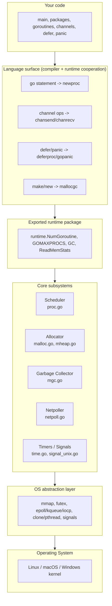
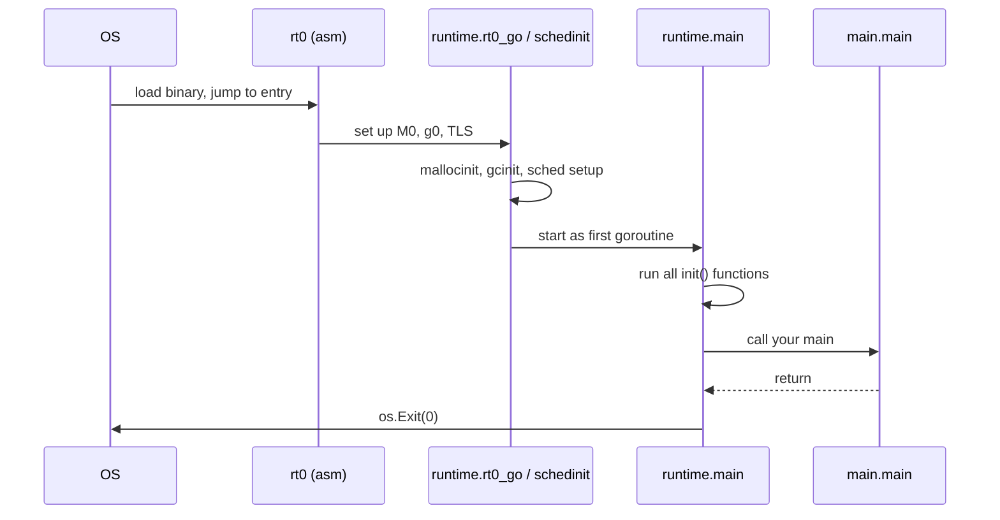

# Go Runtime Architecture — Junior

## 1. Why a capstone?

The first five subtopics of this section took the runtime apart: how to read the source (01), the scheduler (02), the allocator (03), the GC (04), and the exported `runtime` package (05). Each one zoomed *in*.

This subtopic zooms *out*. The goal is to see the runtime as a single layered system — to put scheduler, allocator, GC, and netpoller on one page and answer the question "how do they fit together, and where do *you* sit?".

If 01–05 were a tour of rooms, this is the floor plan.

---

## 2. The runtime is not a VM

Before anything else, three things the Go runtime is **not**:

- **Not a virtual machine.** There is no bytecode. The Go compiler emits native machine code for your target architecture. The runtime is just more of that machine code, linked into the same binary.
- **Not an interpreter.** Your `main` function is called directly. No dispatch loop.
- **Not a separate process.** When you run a Go program, the OS sees one process. The runtime lives inside it.

The Go runtime is **a library that ships with every Go binary**. Statically linked. Always there. About 50,000 lines of Go plus a few thousand lines of assembly.

> If you've used Java, picture the JVM — but compiled to native, and stapled to your `.exe` instead of installed on the machine.

---

## 3. The layered architecture

The runtime is a stack. The bottom touches the OS; the top is the language you write.



Read top-down: your code uses language features, which the compiler rewrites into runtime calls, which use core subsystems, which use a thin OS-abstraction layer, which calls the kernel.

---

## 4. The four big components

Almost everything interesting in the runtime is one of four subsystems. They cooperate constantly.

| Component | File(s) | One-line job |
|-----------|---------|--------------|
| **Scheduler** | `proc.go`, `runtime2.go` | Pick which goroutine runs on which OS thread |
| **Allocator** | `malloc.go`, `mheap.go`, `mcache.go`, `mcentral.go` | Hand out memory for `new`, `make`, escapes |
| **Garbage Collector** | `mgc.go`, `mgcmark.go`, `mgcsweep.go` | Find unreachable memory and reclaim it |
| **Netpoller** | `netpoll.go`, `netpoll_epoll.go`, etc. | Park goroutines blocked on I/O; wake them on OS events |

These are not isolated. A few examples of how they talk:

- The **GC** pauses goroutines using the **scheduler** (`stopTheWorld`).
- The **allocator** triggers the **GC** when the heap grows past a threshold.
- The **netpoller** hands wakeups to the **scheduler** (calls `goready`).
- A blocking syscall detaches the **M** from its **P** (scheduler) so other goroutines keep running.

Picture them as four gears in the same gearbox.

---

## 5. The OS view vs the Go view

The OS and your code see two very different things.

| What the OS sees | What your Go code sees |
|------------------|------------------------|
| One process | One program |
| Several OS threads (usually `GOMAXPROCS` + a few) | Thousands or millions of goroutines |
| Some memory mapped via `mmap` | A heap with neat objects |
| Some `futex` / `epoll` calls | Channels and `net.Conn` |
| SIGURG signals flying around | Preemptive scheduling (you don't see it) |

The translation between these two views *is* the runtime.

---

## 6. Anatomy of a Go binary

When you `go build`, the linker stitches several things into one executable file:

```
+----------------------------------+
|  Your code                       |  // main, your packages
+----------------------------------+
|  Standard library                |  // fmt, net/http, encoding/json, ...
+----------------------------------+
|  Go runtime                      |  // proc.go, malloc.go, mgc.go, ...
+----------------------------------+
|  rt0 + runtime.rt0_go (asm)      |  // entry point, sets up stack & TLS
+----------------------------------+
|  Type info / itab / pclntab      |  // reflection, stack traces, GC type bits
+----------------------------------+
|  Data, rodata, bss               |  // globals, string constants
+----------------------------------+
```

You can see this with:

```bash
go tool nm ./mybin | head -40       # symbols, including runtime.*
go tool objdump -s 'runtime\.main' ./mybin | head
ls -lh ./mybin                       # even "hello world" is a few MB — runtime included
```

A "hello world" Go binary is ~2 MB on Linux/amd64 with no special flags. About 99% of that is runtime + standard library; your code is a few hundred bytes.

---

## 7. The boot sequence in plain English

When you launch a Go program, here's the chain of events from CPU power-on to your `main`:

1. **OS loader** reads the ELF/Mach-O/PE file, maps it into memory, jumps to its entry point.
2. The entry point is `_rt0_amd64_linux` (or equivalent for your OS/arch) — about 20 lines of assembly. It sets up the argument vector and calls `runtime.rt0_go`.
3. **`runtime.rt0_go`** (still mostly assembly) creates the first M, allocates a special goroutine `g0`, sets the **`runtime.g` register** (on amd64, this is a per-thread pointer to the currently running goroutine), then calls `runtime.schedinit`.
4. **`runtime.schedinit`** initializes the four big subsystems in order: allocator (`mallocinit`), GC (`gcinit`), scheduler internals (`schedinit` proper), signal handlers. After this, the runtime is ready but no user code has run.
5. **`runtime.main`** is launched as the first user goroutine. It runs all `init` functions in dependency order, then calls **your** `main.main`.
6. When `main.main` returns, `runtime.main` calls `os.Exit(0)`.



The whole sequence takes microseconds. By the time your `main` runs, the scheduler is alive, the heap is set up, the GC is armed, and the signal handlers are installed.

---

## 8. Where you sit: three layers of API

From your code, the runtime exposes itself at three different heights.

| Height | How you reach it | Examples |
|--------|------------------|----------|
| **Language features** | Built-in syntax — no import | `go f()`, `chan T`, `defer`, `panic`, `make`, `new`, `select`, range over a channel |
| **Exported `runtime` package** | `import "runtime"` | `runtime.NumGoroutine()`, `runtime.GC()`, `runtime.GOMAXPROCS()`, `runtime.Stack()`, `runtime.SetFinalizer()` |
| **Indirect via stdlib** | Standard library wraps runtime hooks | `sync.Mutex` (uses `runtime_Semacquire`), `time.Sleep` (uses `runtime.timeSleep`), `net.Conn` (uses the netpoller) |

You almost never touch the runtime directly. Most of your interaction is through language features that the compiler silently rewrites into runtime calls. `go f()` becomes `runtime.newproc(funcval)`. `make(chan int, 4)` becomes `runtime.makechan(...)`. `defer x.Close()` becomes `runtime.deferproc(...)` plus `runtime.deferreturn(...)` on the way out.

---

## 9. One shared address space

Every goroutine in your program sees the **same memory**. There is no per-goroutine heap, no isolation, no "actor mailbox" by default.

```go
var counter int  // shared by every goroutine, no exceptions

go func() { counter++ }()  // data race waiting to happen
go func() { counter++ }()
```

This is by design — it's why goroutine communication via channels is fast (no copy if you don't want one) and why `sync.Mutex` is so common. The runtime gives you cheap concurrency; it does **not** give you isolation. That's your job.

The corollary: a panic in one goroutine that's not recovered crashes the *whole* process, because it's all one address space and one process from the OS's view.

---

## 10. The `runtime.g` register — one detail worth knowing

On amd64 Linux, the runtime reserves a CPU register (originally `r14`, varies by ABI) as a pointer to the currently running goroutine's `g` struct. Every OS thread (M) sees a *different* value in this register depending on which goroutine it is running.

Why does this matter? Because nearly every runtime helper starts by reading this register to ask "who am I?". `runtime.Gosched()`, `runtime.NumGoroutine()`, channel operations, GC write barriers — they all need access to the current `g`, and a register is the fastest place to keep it.

You'll never write to this register from your code. But when you read assembly output of Go programs (`go tool objdump`), seeing `MOVQ (R14), ...` and recognizing "ah, that's reading the current goroutine" is a small superpower.

---

## 11. A tour map of subtopics 01–05

Now that the floor plan exists, here's where each prior subtopic sits on it:

| # | Subtopic | What it covers | Where it fits in the layered picture |
|---|----------|----------------|---------------------------------------|
| **01** | Runtime source dive | How to read `$GOROOT/src/runtime`, file map, glossary | The whole stack — orientation |
| **02** | Scheduler (GMP) | `proc.go`, G/M/P types, `schedule()` loop, work-stealing | "Scheduler" box in section 3 |
| **03** | Allocator | `malloc.go`, size classes, mcache/mcentral/mheap | "Allocator" box |
| **04** | Garbage collector | `mgc.go`, tri-color mark, write barriers, STW phases | "GC" box; talks to scheduler & allocator |
| **05** | Exported `runtime` package | The public API: `GOMAXPROCS`, `MemStats`, `SetFinalizer`, ... | "Exported runtime package" layer |
| **06** | **This capstone** | How the pieces compose; boot; binary anatomy | Everything, viewed top-down |

If you've absorbed 01–05, this subtopic is mostly review. The new content is the **composition** — how a single goroutine's lifetime touches every box.

---

## 12. A goroutine's lifetime, end to end

To make the composition concrete, follow one goroutine from `go f()` to its return:

1. `go f()` compiles to `runtime.newproc(funcval)`.
2. `newproc` allocates a new `g` struct (often from a free list — **allocator**), initializes its stack (2 KB typical), and puts it on the local run queue of the current **P** (**scheduler**).
3. Eventually some M picks it up via `schedule()` and starts running `f` (**scheduler**).
4. `f` allocates a slice — calls `runtime.makeslice` → `mallocgc` (**allocator**). If the heap has grown past the trigger, this also kicks off a GC cycle (**GC**).
5. `f` reads from a channel that's empty — the goroutine calls `gopark`, gets parked, the M moves on to another goroutine (**scheduler**).
6. The sender does a write into the channel; that calls `goready`, putting our goroutine back on a run queue (**scheduler**).
7. `f` does a network read — the netpoller registers interest with `epoll`, parks the goroutine again (**netpoller** + **scheduler**).
8. Bytes arrive; the kernel notifies via `epoll`; the netpoller hands the goroutine back to the scheduler (**netpoller** + **scheduler**).
9. `f` returns. The `g` is marked free, its stack pages are returned to the allocator's free list (**scheduler** + **allocator**).

Every one of those numbered steps is a function in the source tree you can open. None of them is magic.

---

## 13. Common confusion at this level

- **"The runtime is a separate process."** No. It's code in your binary, in the same address space as your `main`.
- **"Goroutines are OS threads."** No. Many goroutines share one OS thread. The mapping is the scheduler's job.
- **"Go has no runtime because it compiles to native code."** Compilation target and presence of a runtime are independent. C compiles to native and has a (tiny) runtime too. Go's just happens to be larger because it does more.
- **"The standard library is separate from the runtime."** Mostly yes, but the line is blurry. `sync`, `time`, `os`, `net` all call into runtime hooks (`runtime_Semacquire`, `runtime.timeSleep`, `runtime_pollWait`). They're best understood as a thin layer *on top of* the runtime.
- **"`GOMAXPROCS` controls goroutines."** It controls **P**s — how many goroutines can be running Go code *in parallel*. You can have a million goroutines with `GOMAXPROCS=1`; only one runs at a time.

---

## 14. Summary

The Go runtime is a layered system, statically linked into every Go binary. From the bottom: an OS-abstraction layer (mmap, futex, epoll); above it the four big subsystems (scheduler, allocator, GC, netpoller); above them the exported `runtime` package; on top, the language features (`go`, channels, `defer`, `panic`) that the compiler silently rewrites into runtime calls.

A Go program boots through `rt0` → `runtime.rt0_go` → `runtime.schedinit` (which arms the four subsystems) → `runtime.main` (which runs `init` functions and then your `main`). The OS sees one process and a handful of threads; your code sees thousands of goroutines in one shared address space.

Subtopics 01–05 of this section zoomed into individual rooms. This subtopic is the floor plan. With it in hand, "the Go runtime" stops being a vague label and becomes a small, named set of components you can point to in the source.

---

## Further reading
- Go source tree: `https://github.com/golang/go/tree/master/src/runtime` (pin to a tag, e.g. `go1.22.0`)
- `runtime/HACKING.md` — the runtime team's own orientation document, lives in the source tree
- "Go's Memory Model" — `https://go.dev/ref/mem` — what goroutines + shared memory mean, formally
- "The Go Programming Language Specification" — `https://go.dev/ref/spec` — for what the language *guarantees*, leaving the runtime free to implement however
- Dave Cheney, "Five things that make Go fast" — a high-level tour of why the runtime design choices matter
- Subtopics 01–05 of this section — re-read them with the floor plan in mind
