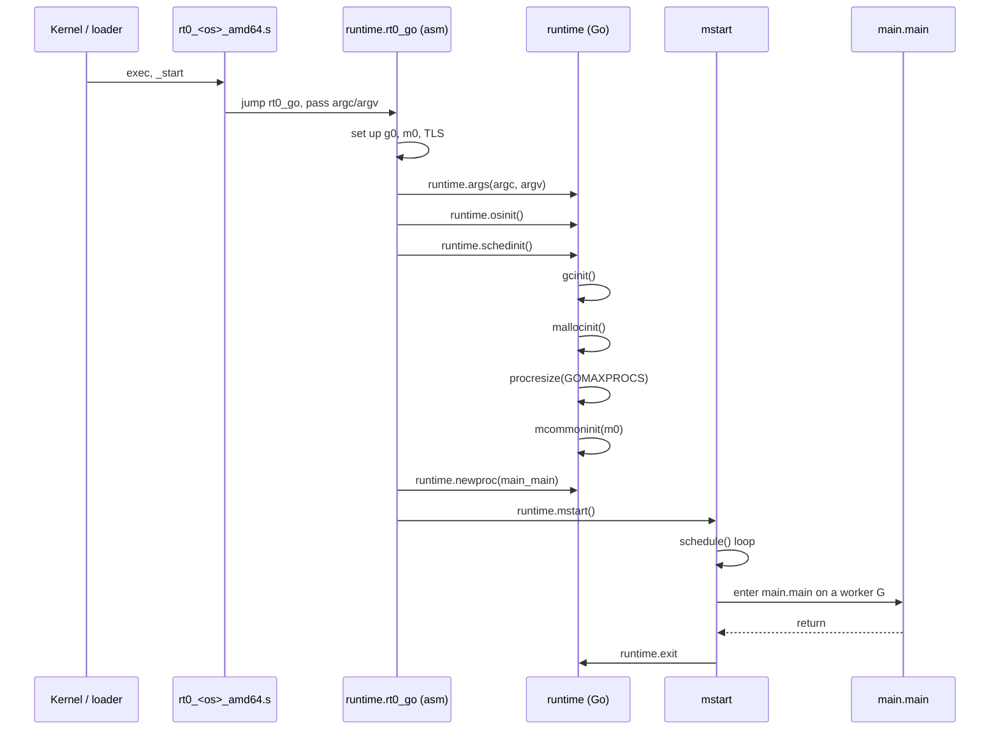

# Go Runtime Architecture — Middle

## 1. The runtime as a layered system

At the middle level the runtime stops being "the thing that runs goroutines" and becomes a set of cooperating subsystems with a defined startup order, defined inter-subsystem contracts, and a defined OS boundary. Three things distinguish this view from the junior one:

- The runtime is **just Go code** (plus a thin assembly shim per OS/arch). `goroutine` keywords, channel ops, panics, and map literals are rewritten by the compiler into ordinary calls into `runtime/*.go`.
- Subsystems are **mutually dependent at runtime but strictly ordered at init**. GC needs the allocator; the allocator needs P's; P's need the scheduler; the scheduler needs the OS layer.
- The OS layer is **narrow on purpose**: a handful of syscalls and a thread-creation primitive, abstracted by `runtime/os_<os>.go` and `runtime/sys_<os>_<arch>.s`.

| Layer | Files (representative) | Owns |
|-------|------------------------|------|
| Entry / startup | `rt0_<os>_<arch>.s`, `asm_<arch>.s`, `proc.go` | Argv pickup, TLS, first M, first G |
| OS abstraction | `os_<os>.go`, `sys_<os>_<arch>.s`, `signal_unix.go` | Threads, signals, syscalls, time |
| Scheduler | `proc.go`, `runtime2.go` (`g`, `m`, `p`) | G/M/P, run queues, parking |
| Memory | `malloc.go`, `mheap.go`, `mcache.go`, `mcentral.go` | Allocator |
| GC | `mgc.go`, `mgcmark.go`, `mgcsweep.go`, `mgcpacer.go` | Tri-color mark/sweep, write barrier |
| Netpoller | `netpoll.go`, `netpoll_<os>.go` | epoll/kqueue/iocp integration |
| Sync primitives | `chan.go`, `sema.go`, `lock_*.go`, `time.go` | Channels, semaphores, timers |
| Language runtime | `iface.go`, `map.go`, `slice.go`, `panic.go`, `stack.go` | What the compiler lowers into |

---

## 2. The startup sequence

The boot path is fixed and surprisingly short. Tracing it once is the fastest way to understand how the pieces hang together.



| Step | Function | Purpose |
|------|----------|---------|
| 1 | `rt0_<os>_amd64.s` | Kernel entry; small assembly stub picked by the OS |
| 2 | `runtime.rt0_go` | Set up `g0` (system goroutine), `m0` (main M), TLS, stack guards |
| 3 | `runtime.args` | Capture `argc`/`argv`, environment, auxv |
| 4 | `runtime.osinit` | Read CPU count, page size, HZ; OS-specific quirks |
| 5 | `runtime.schedinit` | Init the rest of the runtime (see below) |
| 6 | `runtime.newproc(main)` | Create the goroutine that runs `main.main` |
| 7 | `runtime.mstart` | Hand `m0` to `schedule()`; never returns |
| 8 | `schedule` | Picks the main G; runs `runtime_init` then `main.main` |

### `schedinit` in order

```
argv/argc already captured
  → tracebackinit / moduledataverify   // verify ELF/Mach-O metadata
  → stackinit                          // init stack pools
  → mallocinit                         // init allocator (spans, mcaches)
  → fastrandinit                       // PRNG
  → mcommoninit(m0)                    // link m0 into allm
  → cpuinit                            // detect AVX/BMI/etc.
  → alginit                            // hash seeds (depends on cpuinit)
  → modulesinit / typelinksinit        // link package metadata
  → itabsinit                          // init interface tables
  → gcinit                             // GC pacer state
  → procresize(GOMAXPROCS)             // create P's, attach m0 to P0
```

Order matters in three places: `mallocinit` before anything that allocates, `gcinit` before `procresize` (P's keep GC scratch state), `alginit` before any map is created (`hmap` uses the seeded hash).

---

## 3. G / M / P, briefly

| Type | Lives in | Role |
|------|----------|------|
| `g` | `runtime2.go` | A goroutine: stack, PC/SP saves, status, defer chain |
| `m` | `runtime2.go` | An OS thread bound to one `g0` (system stack) |
| `p` | `runtime2.go` | A logical processor: local run queue, mcache, timer heap |

Invariant: a running G runs on an M that holds a P. Number of P's = `GOMAXPROCS`. M's may exceed P's (a syscalling M parks its P and a new M picks it up).

The job of `schedule()` is "find a runnable G for the current M's P", which is `findRunnable()`'s problem and where the netpoller hooks in.

---

## 4. Allocator + GC cooperation

The allocator (`mallocgc` in `malloc.go`) is the single funnel for *every* heap allocation the compiler emits. Two things happen on each call beyond just returning memory:

- **GC accounting** — bytes are added to `gcController.heapLive`; if the pacer says "you owe assist work", the allocating goroutine does mark work on the spot (`gcAssistAlloc` in `mgcmark.go`). This is why allocation-heavy code under GC pressure gets slower: callers literally pay the mark cost in their own time.
- **Write barrier flag** — during the mark phase, `writeBarrier.enabled` is true, and compiler-emitted pointer writes call `runtime.gcWriteBarrier` to track pointer updates against the snapshot-at-the-beginning invariant.

| Direction | Cooperation point | Code |
|-----------|-------------------|------|
| Allocator → GC | every `mallocgc` updates `heapLive`, triggers assist | `malloc.go`, `mgcpacer.go` |
| GC → Allocator | sweep returns spans to mcentral/mheap | `mgcsweep.go` |
| GC → Scheduler | mark workers are goroutines parked on a per-P slot | `mgc.go`, `proc.go` |
| Scheduler → GC | every `findRunnable` checks for idle mark work | `proc.go` |

Mark workers (`gcBgMarkWorker`) are *normal goroutines*. They're started by `gcStart` and parked; the scheduler wakes them in `findRunnable` when `gcBlackenEnabled != 0` and there's no other work. That's how concurrent marking is "free" — it uses spare scheduler capacity.

---

## 5. Scheduler + netpoller

`netpoll` is the runtime's epoll/kqueue/iocp wrapper. The integration point is `findRunnable`, which roughly does:

```
1. local runq                 (P's own queue)
2. global runq (1/61 of time) (anti-starvation)
3. netpoll(0)                 (non-blocking poll: any I/O ready?)
4. work-steal from other P's  (random victim)
5. global runq                (one more try)
6. netpoll(block)             (no work? sleep on epoll_wait)
```

`netpollready` puts ready G's back on a run queue. From the user's side, a blocking read on a `net.TCPConn` is `gopark`-ed (status `Gwaiting`, reason `waitReasonIOWait`); the I/O completion path inside `netpoll` calls `goready` on it. The G never sees a real OS thread block — its M is free to run other G's.

---

## 6. The OS abstraction layer

The runtime's deal with the kernel is narrow:

| Concern | Linux | macOS | Windows |
|---------|-------|-------|---------|
| Thread creation | `clone()` | `bsdthread_create` | `CreateThread` |
| Thread park | `futex` | `psynch_cvwait` / `__ulock_*` | `WaitForSingleObject` |
| Memory map | `mmap` | `mmap` | `VirtualAlloc` |
| Timer source | `nanotime` via `clock_gettime` | `mach_absolute_time` | `QueryPerformanceCounter` |
| Polling | epoll | kqueue | IOCP |
| Signals | POSIX signals | POSIX signals | (no signals; structured exceptions) |

Files involved:
- `runtime/os_linux.go`, `runtime/os_darwin.go`, `runtime/os_windows.go`, `runtime/os_freebsd.go`
- `runtime/sys_linux_amd64.s`, `runtime/sys_darwin_amd64.s`, `runtime/sys_windows_amd64.s`
- `runtime/netpoll_epoll.go`, `runtime/netpoll_kqueue.go`, `runtime/netpoll_windows.go`

On Linux, every direct syscall the runtime makes goes through `runtime/sys_linux_amd64.s`'s `SYSCALL` wrappers — the runtime never calls libc for its core paths (it does optionally on macOS, where Apple no longer guarantees stable syscalls).

Thread creation differs too: on Linux `newosproc` calls `clone()` with `CLONE_THREAD|CLONE_VM|CLONE_FS|...`; on macOS it goes through `bsdthread_create` (via libSystem). The runtime hands the new thread a tiny trampoline that sets up TLS, then jumps to `mstart`.

---

## 7. Signal handling

Signals are the runtime's most underrated subsystem. `signal_unix.go` installs handlers during `signalinit()`; every M has a signal mask and a small signal stack (`gsignal`).

| Signal | Use |
|--------|-----|
| `SIGURG` | Async preemption (since 1.14) — runtime sends to itself |
| `SIGPROF` | `runtime/pprof` profiler ticks |
| `SIGABRT` | Crash with stack dump |
| `SIGSEGV` / `SIGBUS` | Caught, converted to a runtime panic with traceback |
| `SIGPIPE` | Default-ignored for stdout/stderr; otherwise forwarded |
| `SIGCHLD` / `SIGHUP` / etc. | Forwarded to `os/signal` channel subscribers |

The `SIGURG` trick is the centrepiece of async preemption: the scheduler picks a long-running G, sends `SIGURG` to its M; the signal handler (`doSigPreempt`) decides if the G is at a safe-point (sufficient stack, no critical section) and if so rewrites the G's PC so it lands in `runtime.asyncPreempt`, which calls `gopreempt_m` and yields. SIGURG was chosen because it's both unused by Go programs and not blocked by default.

Signal masks per M ensure that user-installed signal handlers (via `os/signal.Notify`) don't fire on the wrong thread; the runtime parks a dedicated G (`signal_recv`) that reads from the signal queue.

---

## 8. Timers

`runtime/time.go` is owned per-P since Go 1.14 (the global timer heap was the bottleneck before that). Each P has a four-ary min-heap of `runtimeTimer` entries; `time.Sleep`, `time.NewTimer`, `time.AfterFunc`, `context.WithTimeout` all route here.

`time.Sleep(d)` is essentially:

```
gopark(park, …, reason=waitReasonSleep)
  // a runtimeTimer was added that will call goready on this G in d
```

Each scheduler tick (and every `findRunnable`) calls `checkTimers(pp, now)`. If the head of the heap is due, the timer fires: for `time.Sleep` the action is `goready(g)`. Since 1.21 the timer code uses `timerWhen` atomics so other P's can steal due timers; that fixed the "all timers on one P" hot-spot.

---

## 9. Stack management

Every G has its own stack. The runtime starts each G with **2 KB** (since 1.4 — was 8 KB before). Two mechanisms keep this sustainable:

- **`morestack`** (in `asm_<arch>.s`) — prologue of every non-leaf function checks `SP > g.stackguard0`. If not, it calls `runtime.morestack_noctxt`, which calls `newstack` (in `stack.go`), allocates a stack twice the size, copies the old frames, fixes up pointers, and resumes. Stack growth is therefore O(stack size) but amortised O(1).
- **Stack shrinking** — `shrinkstack` (since 1.2) runs during GC: if a G is using less than 1/4 of its stack, copy to half-size. Prevents long-lived idle goroutines from holding megabytes.

The pointer fixup is the hard part: every pointer-into-stack must be updated. The compiler emits stack maps (per safe-point liveness data) so `adjustpointers` can walk them precisely. This is also what makes Go's stacks *moveable* — a property that simplifies GC enormously.

---

## 10. Defer / panic / recover

`runtime/panic.go` owns the unwinder. `runtime2.go` defines `_defer` and `_panic` structs. Three modes coexist for `defer`:

| Mode | Allocation | When |
|------|------------|------|
| Heap-allocated `_defer` | `runtime.deferproc` | Defers inside loops, or `defer` before 1.13 |
| Stack-allocated `_defer` | inline on caller's stack | Since 1.13, for "open" defer site count <= 8 |
| Open-coded defer | no struct at all; compiler emits an inlined trampoline | Since 1.14, for the common case of <= 8 static defers per function |

Open-coded defers are why `defer` is essentially free in modern Go: the compiler turns each `defer f()` into an entry in a per-function bitmask; on return (or panic), it unrolls the bitmask in a generated trampoline. `runtime.deferproc`/`deferreturn` are only hit for the dynamic / loop cases.

`panic(x)` lowers to `runtime.gopanic` → walks the `_defer` chain → for each deferred call, runs it and checks if it called `recover()` (which sets `_panic.recovered = true`) → if recovered, longjmp-style unwinds to the deferred call's return; if not, eventually hits `runtime.fatalpanic` → prints traceback → exits.

---

## 11. Interfaces, maps, channels

These three "language features" are entirely runtime types:

```
runtime.iface = { *itab, data unsafe.Pointer }   // interface I
runtime.eface = { *_type, data unsafe.Pointer }  // interface{}
```

`iface.go` builds `itab`s lazily on first conversion of `(*ConcreteT)` to an interface; the itab caches the method table and is interned in `itabTable` (a hash table guarded by a mutex). `eface` skips the itab — there's no method dispatch from `interface{}` until you type-assert.

`map.go` implements `hmap` (header) + `bmap` (bucket of 8 key/value slots). Growth is incremental: when load factor passes 6.5, a new bucket array twice as large is allocated; each subsequent `mapassign`/`mapaccess` migrates one or two old buckets. That's why map operations are O(1) amortised even at the resize boundary.

`chan.go` defines `hchan` — buffer ring, sendq/recvq linked lists of `sudog`s, lock. `make(chan T, n)` calls `runtime.makechan`. `ch <- v` lowers to `runtime.chansend1`, which is:

```
acquire hchan.lock
if recvq not empty:    // direct hand-off, no buffer copy
   sg := recvq.dequeue()
   send(c, sg, v)      // copies v straight into receiver's frame
   goready(sg.g)
else if buf has space:
   put v into buf
else:                  // block
   sg = acquireSudog()
   sendq.enqueue(sg)
   gopark(...)         // unparked by future receiver
```

Notice the direct hand-off case: an unbuffered channel send never touches the buffer (there is none); it copies straight from sender's stack to receiver's stack while both are stopped. That's how `ch <- v` on an unbuffered channel ends up being roughly two atomic ops and a memcpy.

---

## 12. "Everything is a function call"

The compiler is the runtime's biggest collaborator. Almost every language feature lowers to a `runtime.*` call:

| Source | Compiler lowering |
|--------|-------------------|
| `go f(x)` | `runtime.newproc(siz, f, x)` |
| `ch <- v` | `runtime.chansend1(ch, &v)` |
| `v, ok := <-ch` | `runtime.chanrecv2(ch, &v)` |
| `select { … }` | `runtime.selectgo(...)` |
| `make([]T, n)` | `runtime.makeslice(T, n, n)` |
| `make(map[K]V)` | `runtime.makemap(T, hint, nil)` |
| `m[k] = v` | `runtime.mapassign(T, m, &k)` |
| `panic(x)` | `runtime.gopanic(x)` |
| `recover()` | `runtime.gorecover(...)` |
| `defer f()` (dynamic) | `runtime.deferproc(...)` + `runtime.deferreturn` |
| `new(T)` / `&T{}` escapes | `runtime.newobject(T)` |
| `i.(T)` (type assert) | `runtime.assertI2T(...)` |
| heap pointer write (during GC) | `runtime.gcWriteBarrier(...)` |
| goroutine preempt point | `runtime.morestack_noctxt` (also the check site) |

So when you read runtime source, you're reading the *implementations* of the operators and keywords you use every day. There is no other layer.

---

## 13. Putting it together — a goroutine's life

| Phase | What runs |
|-------|-----------|
| Birth | `go f(x)` → `runtime.newproc` allocates a `g`, initial 2 KB stack from per-P cache, copies args, enqueues on P's local runq |
| First run | Scheduler picks it in `schedule`; M jumps to `f`'s entry via `gogo` |
| Allocation | Each `new`/`make` calls `mallocgc`, updates GC accounting, possibly assists mark |
| I/O | Blocking syscall → `entersyscall` releases P; M parks. Network I/O → `gopark` + `netpollready` later |
| Preemption | After 10 ms a SIGURG arrives; handler retargets PC to `asyncPreempt` → goes back to runq |
| Channel ops | `chansend1` / `chanrecv1` → may `gopark`; counterparty calls `goready` |
| Defer | Open-coded trampoline at function return; or `deferreturn` walks `_defer` chain |
| Panic | `gopanic` → unwind defers → `gorecover` resets, or `fatalpanic` |
| Death | Function returns to `goexit0` → defers run → `g` recycled into P's gFree list; stack returned |

The runtime's whole job is keeping that table consistent for tens of thousands of G's at once, on top of a handful of OS threads, while the GC concurrently traces a heap that's changing under it.

---

## 14. Summary

The runtime is a small number of cooperating Go packages with one careful boot order and a narrow OS layer. Allocator and GC talk through `mallocgc`'s accounting; GC and scheduler share goroutines as mark workers; scheduler and netpoller share `findRunnable`; signals are repurposed for preemption and profiling. The compiler does half the work by lowering language features into runtime calls. Reading `proc.go`, `malloc.go`, `mgc.go`, `chan.go`, and `panic.go` once, with this map in hand, makes the rest of the source readable.

---

## Further reading
- `src/runtime/HACKING.md` — official primer
- `src/runtime/proc.go` — scheduler core (`schedinit`, `schedule`, `findRunnable`)
- `src/runtime/malloc.go` + `mheap.go` — allocator
- `src/runtime/mgc.go` + `mgcpacer.go` — GC pacing and mark phases
- `src/runtime/signal_unix.go` — signal handling and async preemption
- `src/runtime/time.go` — per-P timer heap
- `src/runtime/chan.go`, `map.go`, `iface.go`, `panic.go` — language-feature implementations
- Cox / Cheney / Hudson talks on "How Go scheduler works" and "Getting to Go: the journey of Go's garbage collector"
