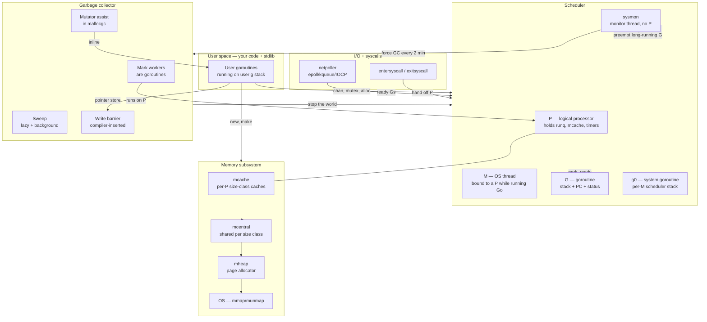
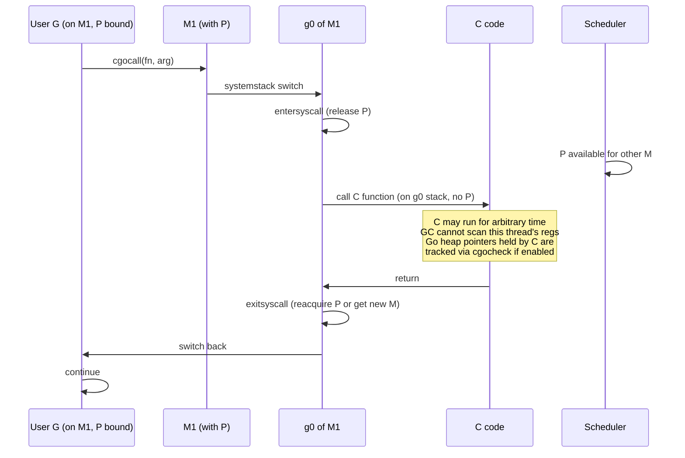
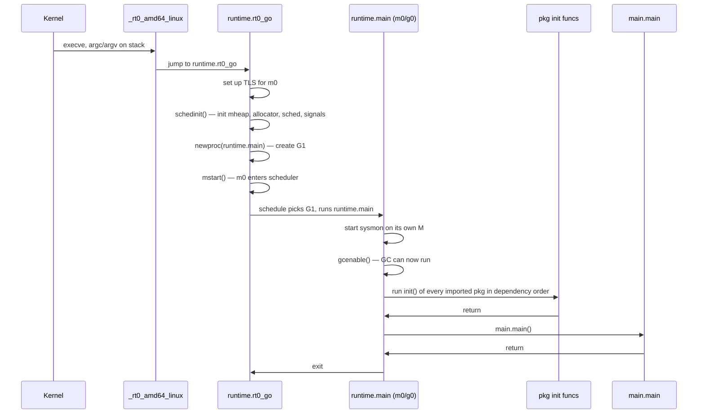

# Go Runtime Architecture — Senior

## 1. Mental model — the runtime is just Go code

At senior level the single most important fact about the Go runtime is the one beginners get wrong: **there is no VM, no JIT, no separate runtime process, no managed boundary**. Everything labelled "the runtime" is ordinary Go code (with a thin layer of architecture-specific assembly at OS, signal, and stack-switch boundaries) sitting in the `runtime` package, compiled into your binary, linked into the same address space as your code, called by direct function call or by the compiler inserting hooks. `go build hello.go` produces one ELF/Mach-O/PE file: your code, the runtime, the stdlib, the linker stub. That is the whole system.

This shapes every architectural decision downstream. The scheduler can park a goroutine in 50 ns because parking is a function call to `gopark` switching to `g0`'s stack, not a system call into a kernel scheduler. The GC's write barrier is one branch and one indirect store inserted by the compiler at every pointer write — no barrier traps, no protected pages. The allocator's fast path is 5-10 ns because `mallocgc` is inlined into a per-P cache pop, no lock, no syscall. The cost model is "function call cost plus a small constant" because that is literally what runtime calls compile to. Compare with the JVM: every allocation crosses a JIT/runtime boundary; every GC barrier may trap; every monitor enter is a CAS plus possible OS futex; the GC is a separate set of native threads communicating with the mutator via JVMTI. Go collapses all of that into one compilation unit.

The price of "the runtime is just Go code" is that **runtime code has restrictions ordinary Go does not**. `//go:nosplit` functions cannot grow the stack — used in signal handlers, scheduler entry points, the bottom of `mallocgc`. `//go:systemstack` functions must run on `g0`'s 64 KB stack, not the goroutine's 2 KB starting stack. `//go:nowritebarrier` and `//go:nowritebarrierrec` mark code that runs during GC phases where the barrier would deadlock. The `runtime` package quietly defines its own world: no `panic` in some paths, no `defer` in others, no allocation in many, no interface method calls in some. Read `src/runtime/HACKING.md` once and the constraints make sense; read it three times and you can predict why a given function is structured the way it is.

The senior mental model is therefore: **the runtime is a co-routine library, a memory manager, a tracing GC, a network poller, and a signal-driven preemption mechanism, all linked into your binary as Go code**. There is no boundary to cross. The questions then become: how do these subsystems cooperate, where are they coupled, where are they decoupled, and what does that coupling buy you and cost you?

## 2. Subsystem map — what the runtime actually contains



This is the production architecture in one picture. **Five subsystems** — scheduler, allocator, GC, netpoller, sysmon — communicating through shared mutable state with carefully chosen synchronization. Three more — signals, cgo, finalizers — sit at the edges. The boxes are not even — the scheduler is roughly 8000 lines, the GC 12000, the allocator 5000, the netpoller 2000, sysmon 500. The coupling diagram is what to study: **which arrows are required**, which are optimization, which are isolation.

The required arrows: write barriers from user code into GC bookkeeping (correctness); `mallocgc` calling into GC for assist (pacing); scheduler invoking GC at safepoints (STW); GC's mark workers being goroutines (avoids special threading). The optimization arrows: mcache per-P (lockless allocation); P-local run queues (lockless scheduling). The isolation arrows: netpoller exposes one interface (`netpollopen`/`netpoll`); the scheduler does not care which OS primitive backs it.

## 3. Coupling and cohesion — what is glued, what is loose

The runtime's tight couplings are deliberate; its loose ones are also deliberate. Both reveal design intent.

**Scheduler ↔ GC: tight.** The GC's mark workers ARE goroutines, scheduled on user P's with a fractional CPU budget (default 25% via `gcBackgroundUtilization`). When you see `runtime.gcBgMarkWorker` in a profile, that is a goroutine the scheduler ran. Stop-the-world is a scheduler primitive — `stopTheWorld` walks all M's, sends each a preemption signal, waits until every G is parked at a safepoint, then runs the GC operation on `g0`. GC pacing reads scheduler state (`gomaxprocs`, current goroutine count) to size mark assist. There is no way to swap the GC without rewriting the scheduler, and no way to swap the scheduler without rewriting GC pacing. Senior interpretation: **scheduler and GC are one subsystem in two files**; the split is editorial.

**Allocator ↔ GC: tight.** `mallocgc` is the GC's input hook. Every allocation:
1. Increments per-P heap accounting (`memstats.heapLive` indirectly).
2. Checks the GC pacer — am I behind the assist ratio? If yes, do mark work proportional to my allocation before returning.
3. Sets the new object's color in the span bitmap (initially black if allocating during mark phase, white otherwise).
4. May trigger a GC cycle if `heap_live >= gc_trigger`.

The write barrier (compiler-inserted, not allocator-inserted) couples in reverse: pointer stores by user code update GC's shaded-pointer queues. Senior interpretation: **the allocator is the GC's mutator interface**; you cannot have one without rewriting the other.

**Scheduler ↔ netpoller: loose.** The netpoller exposes `netpollinit`, `netpollopen(fd) (pd *pollDesc, err)`, `netpoll(delay int64) []*g`, `netpollclose`. The scheduler calls `netpoll(0)` opportunistically on every schedule loop, and `netpoll(blocking)` when there is no work. There are four implementations: `netpoll_epoll.go` (Linux), `netpoll_kqueue.go` (BSD, Darwin), `netpoll_windows.go` (IOCP), `netpoll_solaris.go`. Each implements the same interface. Swap one out: the scheduler does not notice. Senior interpretation: **netpoller is a port; scheduler is a host**; the boundary is the cleanest in the runtime.

**Scheduler ↔ timers: was loose, now tighter (Go 1.21+).** Before 1.14, timers were a single heap with a lock. 1.14 moved them to per-P heaps. 1.21 (`runtime: per-P timer queues with sharded contention`) finalized this: each P owns its timer heap, the scheduler checks the heap on every loop, expired timers spawn or wake goroutines. Timers stopped being a separate subsystem and became scheduler state. Senior interpretation: **subsystems tend to be absorbed when contention forces it** — the architectural decision was made by `go test -bench` on time-heavy workloads.

**Sysmon ↔ everything: weak by design.** Sysmon is a special M with no P, no Go user code, just a loop:

```
sysmon:
  forever:
    if no Ps busy 50µs → sleep up to 10ms
    netpoll(0) → ready any I/O-ready Gs
    retake Ps stuck in syscalls >20µs
    preempt Gs running >10ms (cooperative or SIGURG)
    if 2 minutes since last GC and heap >4MB → forceGC
    scavenge unused pages back to OS
```

Sysmon reads scheduler counters and pokes them; it does not own them. It is the runtime's heartbeat. Removing sysmon would break preemption of CPU-bound loops, syscall handoff, periodic GC, and OS memory return — but each of those would be fixable in their owning subsystem. Senior interpretation: **sysmon is glue, not structure**; it exists because no single subsystem wants the responsibility of "watch for stuck things".

| Coupling pair | Tight / Loose | Why |
|---|---|---|
| Scheduler ↔ GC | Tight | Mark workers are goroutines; STW needs scheduler; pacing reads scheduler state |
| Allocator ↔ GC | Tight | `mallocgc` does assist; write barrier updates GC; colors live in spans |
| Scheduler ↔ Allocator | Medium | Per-P `mcache` for lockless alloc; otherwise independent |
| Scheduler ↔ Netpoller | Loose | One Go-level interface, four OS implementations |
| Scheduler ↔ Timers | Tight (1.21+) | Per-P heaps; scheduler loop drains them |
| Sysmon ↔ All | Loose | Polls others, owns nothing |
| Cgo ↔ Scheduler | Tight at boundary | Entersyscall/exitsyscall hand off P; thread state mutates |
| Finalizers ↔ GC | Tight | GC discovers, dedicated goroutine runs |
| Signals ↔ Scheduler | Medium | SIGURG preemption is scheduler-driven; others are signal.Notify path |

## 4. Performance topology — what runs on what

The runtime has several execution contexts and pretending they are the same is a senior-level mistake.

| Context | Stack | Schedulable? | Owns a P? | Used for |
|---|---|---|---|---|
| User `g` | 2 KB growable | Yes | Yes (its M's P) | Your code |
| `g0` (per M) | 64 KB fixed | No (it IS the scheduler) | Yes | `schedule()`, GC, syscalls, stack growth |
| `gsignal` (per M) | 32 KB | No | N/A | Signal handlers — runs SIGURG, SIGPROF, SIGSEGV |
| GC mark worker G | Same as user G | Yes, fractional | Yes | Concurrent marking, on user P's |
| Finalizer goroutine | Normal | Yes | Yes | Drains `runtime.SetFinalizer` queue |
| Sysmon M | Special | N/A (no G context) | **No** | Sysmon loop |
| Template M (idle) | None active | N/A | No | Parked, waiting for work |

Reading a stack trace in production starts here. **`runtime.mcall` at the top of frame: you are on `g0`.** **`runtime.systemstack_switch`: you went to `g0` to do something restricted.** **`runtime.gopark` to `runtime.mcall` to `runtime.schedule`: the canonical "go to sleep" path.** **`runtime.gcBgMarkWorker`: a mark worker just started running on a P.** **`runtime.sigtramp` → `runtime.sighandler`: you are inside a signal, on `gsignal`'s stack.**

The cost model attached to each context:

| Operation | Cost (order of magnitude) | Notes |
|---|---|---|
| `mallocgc` fast path (size class, no GC pressure) | 5–15 ns | Inlined pop from mcache; no lock |
| `mallocgc` with mark assist | 100 ns – several µs | Proportional to alloc; visible in latency |
| `chansend` no contention | 80–120 ns | Lock + copy + maybe wake |
| `chansend` with park | 200 ns – 1 µs | `gopark` → `mcall` → `schedule` → wake on other side |
| `gopark` / `goready` | ~150 ns each | One mcall + queue manipulation |
| Goroutine creation (`go f()`) | 200–400 ns | Stack alloc + scheduler insert |
| Stack growth (2 KB → 4 KB) | ~1 µs | Copy old stack, fix up pointers |
| Pointer write (with barrier, mark phase) | +1–2 ns | Branch + buffered store |
| OS syscall (Go-wrapped) | 200 ns – few µs | `entersyscall`/`exitsyscall` add ~50 ns over raw |
| cgo call (small, no callback) | ~150 ns + C work | Hand off P, switch stack to g0, switch to C |
| GC STW (modern Go) | 100 µs – low ms | One-digit ms is a red flag |
| GC mark phase | Concurrent; steals ~25% CPU | Visible as `gcBgMarkWorker` |

These are not all the same magnitude, and they do not all scale the same way. A pure CPU loop on a hot P does zero of these per nanosecond. A workload heavy in channels and allocation does thousands per millisecond. The shape of your latency histogram is determined by which of these dominate.

## 5. The "no compaction, no generations" GC and what it forced

Go's GC is **non-moving, non-generational, concurrent, tri-color mark-sweep with write barriers**. Each of those words excludes design space someone else's runtime chose, and each exclusion shaped the rest of the runtime.

**Non-moving.** Object addresses are stable for the object's lifetime. The runtime can hand out raw pointers to user code, including to cgo, and trust they remain valid until the next GC's sweep proves the object dead. This is why `unsafe.Pointer` works across goroutines, why cgo can pass a `&buf[0]` to C without pinning, why finalizers can resurrect objects. The cost: **fragmentation**. Go's answer is the **size-class allocator** — ~67 fixed sizes (8, 16, 24, 32, 48, 64, 80, ..., 32 KB), each backed by spans of pages, with a free list per size. Internal fragmentation is bounded (~12.5% worst case); external fragmentation is impossible because every span holds objects of one size. Java's compacting GCs avoid this entirely but pay constant overhead in object moves and read barriers (or stop-the-world copy pauses). Go traded fragmentation tolerance for stable addresses and a simpler mutator.

**Non-generational.** No young/old split. Every cycle scans the entire heap. This sounds expensive — and is — but generations were rejected because Go programs do not have JVM's allocation profile. The JVM's gen hypothesis (most objects die young) holds most strongly in code with rich object creation per request; Go programs are more often "allocate large pools at startup, churn small things during request". The runtime team measured and concluded generations would cost more in barrier complexity than they would save in cycle time. The cost: **the whole heap must be markable in time before next allocation outruns mark**. This is what the **GC pacer** controls — the goal is to start GC early enough that mark finishes before the heap doubles. `GOGC=100` means "trigger GC when heap is 2× live size after last GC". `GOMEMLIMIT` (1.19+) is the hard ceiling that overrides pacing under pressure.

**Concurrent, tri-color.** Mark and sweep run concurrently with user goroutines on the same P's. Tri-coloring (white = unmarked, grey = found, black = scanned) plus the **Dijkstra-style insertion barrier** (any pointer stored into a black object greys the target) ensures the mark phase converges. Go 1.8+ uses a **hybrid barrier** — insertion barrier plus deletion barrier at STW boundaries — which eliminated the second STW at end of mark, dropping GC pauses by an order of magnitude. Senior recall: **the barrier is the GC**; tuning the barrier (cost per pointer write, latency it adds to the mutator) is what shifts the architecture, not the mark algorithm.

**Page-level release to OS.** Sweeping returns pages to the heap; the **scavenger** returns them to the OS via `madvise(MADV_DONTNEED)` on Linux or `MADV_FREE` where supported. `runtime.GC()` does not return memory; the scavenger does, lazily, in the background. 1.19's `GOMEMLIMIT` tied scavenger aggressiveness to the limit — close to limit, scavenge harder. Senior consequence: **RSS does not equal heap**. RSS lags. The OS may not have reclaimed pages even after the runtime asked, depending on memory pressure. Reading `runtime.MemStats.HeapReleased` (or `runtime/metrics`' `/memory/classes/heap/released:bytes`) tells you what the runtime returned; reading `RSS` tells you what the kernel agreed to.

## 6. Preemption — cooperative, asynchronous, OS, and where they meet

Go has three preemption mechanisms layered on top of each other.

**1. OS thread preemption (free).** Multiple M's are OS threads. The kernel preempts them at its own discretion. This is why Go does not freeze when one G runs hot — the OS will eventually move that M off the core. But it does not help one G monopolize a P. Stuck Gs on busy Ps block everything that P should run, including GC mark assist on that P.

**2. Cooperative (compiler-inserted, since forever).** The compiler inserts safepoint checks at function prologues — a check against `g.stackguard0`. When the scheduler wants to preempt G, it sets `g.stackguard0 = stackPreempt`. On next function call, the check fires, the G calls `runtime.morestack_noctxt`, which detects the preempt request and yields. The cost: **tight loops with no function calls cannot be preempted**. Pre-1.14 this caused real bugs — `for { x++ }` would freeze STW indefinitely.

**3. Asynchronous (1.14+, via SIGURG).** The scheduler sends `SIGURG` to the M's thread. The signal handler runs on `gsignal`, inspects the interrupted PC, and if the PC is at a "safe" instruction (registers and stack are in a state the runtime can reconstruct), it rewrites the return address so the G returns into `asyncPreempt`. The G yields. This works for tight loops; it pays a cost in signal handler complexity and limits — some PCs (inside `//go:nosplit`, inside the runtime, during stack growth) are not safe to async-preempt, so the runtime falls back to cooperative for those windows.

The architecture meets here: **Go inherits OS preemption between Ms, runs cooperative preemption between Gs cheaply, and tops up with async preemption to bound STW latency**. The senior observation is that this stack is **fragile to compiler/runtime changes** — a regression in safepoint placement can cause a 1-second STW; a bug in async signal handling can cause `unexpected fault address` crashes. Read the release notes around "preemption" carefully across versions.

## 7. Cgo — the runtime / non-Go-world boundary

cgo is the most architecturally interesting boundary in the runtime because it is where every assumption breaks.

When you call C from Go, the runtime does this:



Key consequences:

- **cgo releases the P.** The scheduler can run other goroutines on the same OS thread? No — the thread is busy in C. The scheduler can move other Gs to other Ms? Yes. Net effect: cgo does not block your program, but it does waste a thread.
- **GC cannot preempt code in C.** A multi-hour C call holds memory; GC will complete its cycle but will not reclaim anything reachable through the C-pinned pointers.
- **Threads created by C cannot run goroutines unless they call back into Go.** When C calls a Go callback, the runtime creates an M for that thread on first call (`needm`), runs the Go code, then detaches (`dropm`). Each such crossing costs ~1 µs.
- **`runtime.LockOSThread` is mandatory for some C libraries.** GUI toolkits, OpenGL, and any TLS-using library require the same OS thread for all calls. `LockOSThread` pins a G to its M for the G's lifetime; the M is not reused for other Gs.
- **`GODEBUG=cgocheck=2`** turns on dynamic checking that Go pointers passed to C do not transitively reference more Go pointers. Production-off (it is slow). Use during integration.

The senior framing: **cgo is two runtimes in one process, and the boundary is the most expensive function call in Go**. Treat cgo as you would treat an out-of-process RPC: batch, pool, isolate. A binary that does cgo on every request runs at half its no-cgo speed.

## 8. Cross-platform abstraction — what is shared, what diverges

The runtime is mostly portable Go. The OS-specific parts are concentrated in well-defined files:

| Concern | File pattern | Variants |
|---|---|---|
| Thread creation | `os_linux.go`, `os_darwin.go`, `os_windows.go` | `clone()`, `bsdthread_create`, `CreateThread` |
| Signal delivery | `signal_unix.go`, `signal_windows.go`, `signal_<arch>.go` | sigaction vs vectored handlers |
| Time source | `time_*.go`, `runtime_unix.go` | `clock_gettime`, `mach_absolute_time`, `QueryPerformance` |
| Netpoller | `netpoll_*.go` | epoll, kqueue, IOCP, AIX, Solaris |
| Memory mapping | `mem_*.go` | `mmap` vs `VirtualAlloc` |
| TLS | `tls_*.s` | FS/GS register, Windows TIB |
| Syscall trampolines | `sys_<os>_<arch>.s` | Per-OS, per-ABI |

What is **not** ported: the scheduler, the allocator's page logic, the GC algorithm, channel/select/mutex implementations, the type system. All of those are pure Go and identical on every platform.

What **differs** in user-visible ways:
- **Goroutine preemption** uses SIGURG on Unix and a thread-suspend trick on Windows.
- **Default `GOMAXPROCS`** comes from `sched_getaffinity` on Linux (so it sees cgroup CPU quotas indirectly via affinity but **not** via CPU shares unless `GOMAXPROCS` is set, which is why `GOMAXPROCS=$(nproc)` is wrong in Kubernetes — use `uber-go/automaxprocs` or set explicitly from the cgroup quota).
- **`madvise` flavor**: MADV_DONTNEED on Linux returns RSS immediately; MADV_FREE (Linux 4.5+, default on darwin) defers RSS reclaim until pressure, making `ps` lie about memory usage.
- **Time resolution and monotonicity** vary; `time.Now()` returns both wall and monotonic clocks on systems that support them.

Senior production rule: **never assume Linux behavior on macOS or Windows for production stress**. Different scheduler signal cost, different memory return policy, different netpoller granularity. Validate on the target OS.

## 9. Runtime startup — from `_rt0` to your `main`



A few things are senior-noteworthy:

- **`schedinit` runs before any Go code.** It sets `GOMAXPROCS`, parses `GODEBUG`, sizes the heap arena, sets up signal handlers. Misconfigured `GODEBUG` at this stage just exits.
- **`runtime.main` is itself a goroutine.** It runs on a P like any other. Your `main.main` is just a function `runtime.main` calls between `init` and exit.
- **GC is disabled until `gcenable()`.** Init code runs without GC; allocation is fine but no collection. A bad init function that allocates 10 GB before returning does not get garbage collected during init.
- **`init` order is determined by the linker** from the import graph (topological), then alphabetical within a package's files. Cycles are forbidden; the compiler enforces this.
- **`runtime.GOMAXPROCS(n)` before any goroutine starts** is special — set during `init()` of `package main` or earlier, it sizes P's once. After goroutines exist, changing it triggers a STW resize.

This sequence is where production bugs hide: 30-second `init()` from a bad migration, panics in `init()` (no recovery — process dies), GOMAXPROCS read from `nproc` in a 64-core container where cgroups grant 2 cores.

## 10. Architectural evolution — version-by-version

| Version | Architectural shift | Why it mattered |
|---|---|---|
| 1.1 (2013) | Heap profiling, goroutine profiles | Made the runtime observable |
| 1.5 (2015) | Concurrent GC; runtime rewritten from C to Go | GC pauses went from hundreds of ms to ~10 ms; "the runtime is Go code" became literally true |
| 1.7 (2016) | Compiler SSA; new mid-stack inliner | Performance baseline ratcheted |
| 1.8 (2017) | Hybrid GC write barrier; sub-ms GC pauses | Production latency story stabilized |
| 1.10 (2018) | Tighter compiler, faster malloc | Cost-per-alloc dropped ~20% |
| 1.12 (2019) | MADV_FREE on Linux | RSS appears higher; `ps` misleading |
| 1.14 (2020) | Async preemption via SIGURG | Tight loops finally preemptible |
| 1.17 (2021) | Register-based ABI on amd64; arm64 followed | ~5% across the board |
| 1.19 (2022) | `GOMEMLIMIT` soft memory cap | First production-grade memory ceiling |
| 1.20 (2023) | PGO general availability | Per-binary optimization from profiles |
| 1.21 (2023) | Per-P timer heaps; built-in `min`/`max`/`clear` | Timer scaling fixed; new builtins |
| 1.22 (2024) | Loop variable scoping fix; new range-over-int; trace v2 | Eliminated a class of concurrency bugs; tracing usable in prod |
| 1.23 (2024) | Range-over-func; unique package | Iterators became part of the language |
| 1.24 (2025) | `runtime.AddCleanup` (finalizer successor); Swiss-table maps | Map perf 30%+ for common shapes; cleanups eliminate finalizer footguns |

Each shift either (a) lowered an existing cost class (GC pauses, alloc cost, syscall overhead) or (b) added a new control surface (`GOMEMLIMIT`, PGO, `AddCleanup`). The Go team's pattern: **measure, ship the smallest change that moves the metric, never add API unless absolutely forced**. The lack of a `runtime.SetScheduler` is intentional — every published knob is a forever-knob.

## 11. The minimal-API philosophy — why `runtime/metrics` exists

The `runtime` package's public API is deliberately small: `GOMAXPROCS`, `NumCPU`, `NumGoroutine`, `Gosched`, `LockOSThread`, `SetFinalizer`/`AddCleanup`, `Stack`, `MemStats`, `GC`, `ReadMemStats`. Most production observability needs more than this — per-goroutine state, scheduler latency, GC sub-phase timing, P utilization, mcache stats.

`runtime/metrics` (Go 1.16+) is the answer. It exposes ~50 metrics through a typed, stable API:

```go
samples := []metrics.Sample{
    {Name: "/sched/latencies:seconds"},
    {Name: "/memory/classes/heap/objects:bytes"},
    {Name: "/gc/pauses:seconds"},
    {Name: "/cpu/classes/gc/total:cpu-seconds"},
}
metrics.Read(samples)
```

The architectural decision is **versioned, named metric paths instead of struct fields**. `runtime.MemStats` is frozen — adding a field would break programs that read it. `runtime/metrics` can add or deprecate paths between releases under documented compatibility rules. Senior consequence: **for any new observability work, use `runtime/metrics` and forget `MemStats` exists** except for backward compatibility. Bridge to Prometheus via `collectors.NewGoCollector(collectors.WithGoCollectorRuntimeMetrics(collectors.MetricsAll))`.

## 12. Compared to other runtimes

| Runtime | Concurrency unit | Scheduling | GC | Cost of "go f()" equivalent |
|---|---|---|---|---|
| Go | Goroutine (~2 KB stack) | M:N user-space, cooperative + async preempt | Concurrent non-moving non-generational | 200 ns |
| JVM (Java) | Thread (1 MB stack) or virtual thread (1.21+) | OS for threads; cooperative for VThreads | Several (G1, ZGC, Shenandoah), generational, moving | 1–10 µs per OS thread; ~1 µs per VThread |
| Erlang/BEAM | Process (~300 byte stack) | Preemptive on reduction count; built-in fairness | Per-process generational, no global GC | ~1 µs |
| Rust (no runtime) | OS thread or async task | None for threads; executor-defined for tasks | None (RAII) | OS thread cost; ~50 ns for tokio task |
| Node.js (V8) | Single-threaded loop + workers | Event loop; libuv thread pool | Generational moving (V8) | n/a (single-threaded) |
| Python (CPython) | Thread (GIL) or asyncio task | GIL-serialized | Refcounting + cycle collector | OS thread cost; ~µs per task |

The deepest architectural contrast is with **Erlang's BEAM**: BEAM is preemptive — every process gets a reduction budget and is forcibly descheduled when it expires, regardless of code shape. Go is cooperative-with-async-fallback; BEAM is preemptive-with-reduction-counting. BEAM trades runtime cost (every primitive op decrements the counter) for hard latency guarantees Go cannot match without async preempt. Go traded the other way: cheaper primitives, occasional latency tail when async preempt cannot fire.

With **the JVM**: JVM is a separate VM with a JIT and a heap that the OS sees as "this Java process". Go's runtime is your binary. JVM has decades of GC research producing pauseless options (ZGC: <1 ms regardless of heap); Go's pauses are sub-ms but increase with the number of goroutines (root scan time scales with G count). JVM's startup is hundreds of ms; Go's is a few. JVM's RSS overhead is hundreds of MB; Go's is 10s of MB.

With **Rust**: Rust ships no runtime; cost-of-abstraction is zero; concurrency is whatever library you pick (tokio, async-std, smol). Go's runtime is the cost of having goroutines, channels, and GC built in. The trade is real: Rust is faster and more memory-frugal in skilled hands; Go is faster to write and easier to debug for distributed workloads.

With **Node.js**: Node is a single-threaded event loop on V8, with libuv backing async I/O and a worker thread pool for CPU work. Go's scheduler subsumes both — netpoller is the event loop, P's are the thread pool, the model is unified. Node forces you to think about which thread you are on (main vs worker) and to keep CPU-bound work off main; Go lets you write straight-line blocking-style code and trusts the runtime to schedule. The cost of that unification is the GC pause class (Go has one, Node defers it per-isolate) and the goroutine root-scan ceiling (more Gs costs more GC) — neither shows up in Node.

The architectural meta-lesson across the table: **every runtime trades the same axes (latency, throughput, memory, startup, ergonomics)**, just at different points. Go picks "ergonomics + steady throughput + sub-ms GC" and pays in non-zero RSS overhead, non-zero per-allocation cost, and lack of a JIT. Knowing which axis you are buying lets you predict where Go will sting in production.

## 13. Reading runtime crashes architecturally

Every Go runtime crash message points at a specific subsystem. Reading them properly is senior-level diagnostic.

**`runtime: out of memory`** — `mmap` for arena growth returned `ENOMEM` or hit `RLIMIT_AS`. The allocator asked the OS for more pages and was denied. Architectural meaning: heap wants to grow, OS or cgroup says no. Fix path: set `GOMEMLIMIT` below the cgroup limit so the runtime backs off before the kernel kills.

**`fatal error: concurrent map writes`** — race detector in the map implementation tripped. The runtime sets a flag on enter, checks on enter, finds another writer present, panics. Architectural meaning: your map is shared without synchronization. The runtime cannot help.

**`fatal error: all goroutines are asleep - deadlock!`** — main exited or all Gs are parked, no work, no I/O outstanding (`netpoll` would have returned). The scheduler is the detector; it crashes the process rather than hang. Architectural meaning: every G is parked on a sync primitive whose other side is not coming.

**`runtime: unexpected fault address 0x...`** or **`SIGSEGV: segmentation violation`** with runtime frames at top — typically pointer corruption past the GC's tolerance: a `unsafe.Pointer` cast crossing object boundaries, a finalizer resurrecting a freed object, cgo writing to a Go pointer that moved (cannot happen in Go but C can corrupt). Architectural meaning: the mutator violated the GC's invariants.

**`fatal error: stack overflow`** — goroutine stack hit 1 GB (default `MaxStack`). Architectural meaning: unbounded recursion. The fix is in your code, not the runtime.

**`fatal error: sweep increased allocation count`** — a sweep found more allocated objects than mark counted. Architectural meaning: a runtime bug or a memory corruption that confused the GC's accounting. Filing a bug is the right response.

**`runtime: lfstack.push`** with corruption — lock-free stack used internally (`mcentral`, scheduler) had a node that violated the ABA-encoded pointer invariant. Architectural meaning: memory corruption in runtime internals; usually a cgo or `unsafe` bug.

**`fatal error: schedule: holding locks`** — the scheduler entered `schedule()` while still holding internal locks. Architectural meaning: a runtime bug or an external preemption (rare). File the bug.

**`runtime: program exceeds 10000-thread limit`** — `debug.SetMaxThreads`. The runtime caps M's. Architectural meaning: you are leaking OS threads, usually via `LockOSThread` Gs that never exit, or via blocking syscalls saturating Gs.

The general method: locate the subsystem (scheduler / GC / allocator / cgo / signal), read its invariant, identify which one was violated, find the user code that did it.

## 14. Production decisions

**`GOMAXPROCS`** — set explicitly in containers. The default reads `runtime.NumCPU()` which reads `sched_getaffinity`, which **ignores CPU shares and only partially respects CPU quotas**. On a 64-core node with a 2-CPU cgroup quota, Go sees 64. The scheduler creates 64 P's, throws goroutines at them, the kernel throttles them all into 2 CPU's worth of time, latency tail explodes. Fix: `import _ "go.uber.org/automaxprocs"` or read `/sys/fs/cgroup/cpu/cpu.cfs_quota_us` and call `GOMAXPROCS` yourself.

**`GOMEMLIMIT`** — set to ~90% of container memory limit. The runtime treats it as a soft target — it raises GC frequency to stay under it. Without it, the runtime grows heap aiming for `GOGC` ratio, oblivious to your cgroup limit, and gets OOM-killed. With it, you trade some CPU (more GC cycles) for not dying.

**`GOGC`** — start at default (100). Tune down (50) if memory-bound and CPU is free. Tune up (200, 500, off) if CPU-bound and memory is free. Modern advice: prefer `GOMEMLIMIT` to extreme `GOGC` values.

**`runtime.LockOSThread`** — only for cgo with thread-affine C libraries (CUDA, OpenGL, GTK), for `setns`/`unshare` Linux namespace ops, for signal masking. Adds an M permanently; do not use as a perf trick.

**`runtime/metrics` integration** — scrape on a long interval (15-60 s). The Prometheus default `GoCollector` does this; opt into the full metric set (`MetricsAll`). Alert on `/sched/latencies:seconds` p99 > 1 ms (scheduler is starving), `/gc/pauses:seconds` p99 > 5 ms (root scan or write barrier issue), `/memory/classes/heap/released:bytes` falling against `/memory/classes/heap/objects:bytes` rising (memory retained).

**`pprof`** — always exposed in production over an internal-only endpoint. CPU, heap, goroutine, mutex, block profiles. Mutex and block off by default (cost); turn on with `runtime.SetMutexProfileFraction` / `SetBlockProfileRate` for short windows.

**`runtime/trace`** — keep it ready, do not run continuously. A 5-second trace tells you everything about scheduler decisions, GC, syscalls, network events. Trace v2 (1.22+) made it cheap enough to enable on production for incident windows.

**`debug.SetGCPercent`, `debug.SetMemoryLimit`** — programmatic equivalents of `GOGC`/`GOMEMLIMIT`. Useful when memory budget changes at runtime (sidecar getting reconfigured).

**Avoid `runtime.GC()`** in steady state — it forces a synchronous full GC, defeats the pacer, and is a latency spike. Acceptable in tests, in benchmarks, in shutdown.

**Avoid `runtime.Gosched()`** unless you really mean it — it yields, but the scheduler will yield anyway at the next preemption point. The only case is a pre-1.14-compatibility tight loop where async preempt cannot fire.

**`runtime.SetFinalizer` is mostly wrong; use `runtime.AddCleanup` (1.24+).** Finalizers run on one shared goroutine, can resurrect objects, fire late, and are easy to leak. `AddCleanup` registers a callback with the cleanup itself receiving no reference to the object — cleaner semantics, no resurrection.

## 15. Architectural code review checklist

1. **`GOMAXPROCS` set correctly for the container?** `nproc` in K8s without `automaxprocs` is a bug.
2. **`GOMEMLIMIT` set below cgroup memory limit?** Otherwise OOM-kill instead of GC pressure.
3. **No `runtime.GC()` calls in hot paths?** Forces STW, defeats pacer.
4. **No `runtime.Gosched()` sprinkled "for fairness"?** Either superstition or hides a real loop preemption bug.
5. **`LockOSThread` justified by cgo, namespace, or signal mask?** Otherwise it leaks an M.
6. **No finalizers; cleanups instead (1.24+)?** Finalizers are a deprecated foot-gun.
7. **Cgo calls batched, not per-request?** Boundary cost is ~150 ns + transition risk.
8. **Goroutine lifetimes bounded by `context.Context`?** Unbounded `go func()` leaks Gs and stacks.
9. **`select` with `time.After` in long-lived loops uses `time.NewTimer` + `Stop`?** `time.After` leaks until fire.
10. **No `sync.Pool` for short-lived small objects?** Pool churn is worse than alloc fast path.
11. **Mutex / block profiling enabled, even at low rate, in prod?** Otherwise contention is invisible.
12. **`runtime/metrics` scraped, not just `MemStats`?** `MemStats` is legacy.
13. **`pprof` exposed on internal endpoint, not public?** It is your debugger; protect it.
14. **`debug.SetTraceback("all")` or `crash` configured for fatal events?** Default shows only the panicking G.
15. **Container has glibc, not just musl (or musl-aware build)?** musl's `mmap` defaults and thread cost differ; tune accordingly.
16. **`GODEBUG` values pinned for known issues?** e.g. `madvdontneed=1` if you need MADV_DONTNEED semantics on Linux for RSS predictability.
17. **No `recover()` in `main`-level wrappers swallowing runtime panics?** Some runtime errors should crash; do not paper over them.
18. **PGO profile collected from production and fed back to build?** 1.20+ free perf.
19. **Trace (v2) collection plan for incidents?** Knowing how to capture matters in the moment.
20. **Crash log handling in your observability has runtime patterns indexed?** `fatal error:` lines are structured; treat them as such.

## 16. Postmortems

**P1. The 1.14 `madvdontneed` flip — "the pod is OOM-killed but the heap is fine."**
After 1.12 switched Linux to `MADV_FREE`, freed pages stayed in RSS until kernel pressure. Production dashboards (`container_memory_working_set_bytes`) reported high memory; pods were OOM-killed by node pressure even though Go's heap was small. Diagnosis required reading `runtime/metrics` `/memory/classes/heap/released:bytes` vs RSS. Fix: `GODEBUG=madvdontneed=1` until `GOMEMLIMIT` in 1.19 made this less painful. Architectural lesson: **RSS is not heap; the OS owns RSS, the runtime owns heap; their convergence is an SLA the kernel does not promise**.

**P2. The 30-second `init()` migration.**
A service imported a package whose `init()` ran a schema migration against a database. On startup with cold DB connections, `init` took 30 seconds. Liveness probes failed, K8s restarted the pod, init re-ran, restart loop. The runtime had no GC during init (it had not been enabled yet) so memory grew unboundedly during the migration. Architectural lesson: **`init` is privileged code that runs before the rest of the runtime is fully alive**; do nothing in `init` that could fail, block, or allocate heavily.

**P3. Pre-1.14 STW freeze on a tight loop.**
A worker had `for { case <-ch: ...; default: }` polling a channel. The Go scheduler ran the worker forever; no function call meant no cooperative preempt point; STW for GC waited forever; the whole process froze for ~60 s before sysmon escalated. Diagnosis: thread-dump (`SIGQUIT`) showed every G parked except the polling worker. Fix: upgrade to 1.14+ for async preempt, **and** add a `runtime.Gosched()` or `time.Sleep(0)` defensively, **and** restructure the poll loop into a blocking receive. Architectural lesson: **cooperative preemption is a contract between you and the compiler; tight loops with no calls violate it**.

**P4. cgo callback storm.**
A library called Go callbacks from C at ~100k/sec. Each callback was a `needm`/`dropm` pair, ~1 µs each. CPU was pegged in `runtime.cgocallback`. Solution: pin the C-side caller to a fixed Go goroutine via a channel, drain in a loop, avoid per-call crossing. Architectural lesson: **cgo crossings have fixed cost; batch ruthlessly**.

**P5. Finalizer resurrection causing leaks.**
A `*bytes.Buffer` was registered with a finalizer that put it back into a pool. The finalizer ran, the pool grew, but the finalizer was not re-registered after pool re-use, so on second collection the object was just freed. Worse: a bug in the resurrection path retained references, preventing collection entirely. Fix: replaced with `sync.Pool`, removed finalizer. Architectural lesson: **finalizers are async, single-threaded, and a bad fit for resource pooling; `sync.Pool` exists**. Post-1.24, `AddCleanup` removes the resurrection risk by design.

**P6. `GOMAXPROCS=128` in a 4-CPU pod.**
A Go service running on a 128-core node with a 4-CPU CFS quota saw `NumCPU()` = 128. Scheduler created 128 P's; under load 128 goroutines tried to run, kernel throttled, p99 latency went from 5 ms to 800 ms. Fix: `automaxprocs` set GOMAXPROCS to 4 from the cgroup quota. Latency dropped immediately. Architectural lesson: **the Go scheduler does not understand cgroups; you must teach it**.

**P7. `unexpected fault address` from an `unsafe.Pointer` cast.**
A perf optimization cast `*[]byte` headers between types to avoid copies. After a Go upgrade, the slice header layout (still stable but subject to compiler changes around bounds) interacted with a new escape analysis decision; the cast occasionally observed half-updated memory. Crash was `unexpected fault address` inside `runtime.memmove`. Architectural lesson: **`unsafe.Pointer` casts are not portable across runtime versions even when they look syntactically the same; the runtime maintains invariants `unsafe` lets you violate silently**.

**P8. GC pauses spiking with goroutine count.**
A service spawned 500k long-lived goroutines (per-connection state machines). GC root scan time scales with goroutine count (~50 ns per G stack scan minimum). p99 GC pauses went from 0.3 ms to 8 ms when G count crossed 100k. Fix: pool state machines, drop to 5k goroutines, p99 fell back. Architectural lesson: **goroutines are cheap but not free**; GC root scan is the cost ceiling.

**P9. `GOMEMLIMIT` set too aggressively.**
Set to 95% of container limit; under burst load the runtime spent 60% of CPU in GC trying to stay under the limit, application CPU starved, requests timed out, pods got killed for liveness. Fix: lowered to 85%, raised CPU limits. Architectural lesson: **`GOMEMLIMIT` trades CPU for memory; do not give it more memory budget than you can afford to spend CPU defending**.

**P10. Tracing on in production caused a 20% throughput hit.**
Trace v1 was enabled "for diagnostics" via an admin endpoint and never disabled; each goroutine schedule event paid for tracing. Throughput regressed 20%. Fix: hard timeout on trace endpoint, default off, v2 (1.22+) drops the cost. Architectural lesson: **observability is not free; the runtime gives you cheap defaults and expensive deep traces; choose explicitly**.

**P11. Mark assist spikes during burst allocation.**
A service that normally allocated steadily got a per-minute job that allocated 4 GB in one burst. The GC pacer, sized for the steady rate, fell behind; every allocating goroutine paid mark-assist proportional to the deficit; p99 latency spiked from 5 ms to 600 ms for 90 seconds. Fix: pre-allocate the burst's buffers at process start; or run the burst job in a dedicated goroutine pool and accept the queueing delay; or call `runtime.GC()` before the burst to give the pacer a fresh baseline. Architectural lesson: **the pacer assumes steady state; bursts force assist onto every mutator**.

**P12. Scheduler latency on a 96-core box with cgo-heavy workload.**
A workload mixing Go and cgo on a 96-vCPU node showed `/sched/latencies:seconds` p99 at 25 ms, sometimes 100 ms. Each cgo call released a P and then competed to reacquire one on return; with 96 Ps and thousands of cgo-bound Gs, the spinning M phase (M's that just lost a P spinning to grab a new one) dominated CPU. Fix: cap GOMAXPROCS at 16, batch cgo calls. Architectural lesson: **more P's is not always faster — spinning, lock contention on global structures (`sched.lock`), and cgo handoff scale superlinearly**.

**P13. `signal.Notify` channel saturation losing SIGTERM.**
A service registered for SIGTERM via `signal.Notify(ch, syscall.SIGTERM)` with an unbuffered channel and a busy receive loop that handled SIGUSR1 first. Under heavy SIGUSR1 traffic during a deploy, the SIGTERM dropped (signal handler tries to send, channel full, signal is discarded per Go's documented semantics). Pod did not gracefully drain, K8s SIGKILLed after `terminationGracePeriodSeconds`. Fix: dedicated buffered channels per signal type, and `runtime.GOMAXPROCS` headroom so the signal-handling G is always schedulable. Architectural lesson: **signal delivery is best-effort by design; the runtime never blocks the kernel on your channel**.

---

## Further reading

- `src/runtime/HACKING.md` — the contract you must respect when touching runtime code
- `src/runtime/proc.go` — scheduler entry points, `mstart`, `schedule`, `findRunnable`
- `src/runtime/mgc.go` and `mgcmark.go` — GC orchestration and marking
- `src/runtime/malloc.go` — `mallocgc`, the mutator's view of the allocator
- `src/runtime/netpoll.go` and `netpoll_*.go` — the netpoller interface and ports
- `src/runtime/sys_*.s` — per-platform trampolines
- "Go 1.5 GC" talk (Hudson, Rust 2014) and "Getting to Go" (Hudson, 2018) for GC history
- "Scheduling in Go" by Dmitry Vyukov; "Notes on the implementation of scheduler" in `proc.go`
- `runtime/metrics` documentation — for production observability
- Release notes for every version since 1.14 — runtime changes are always called out
