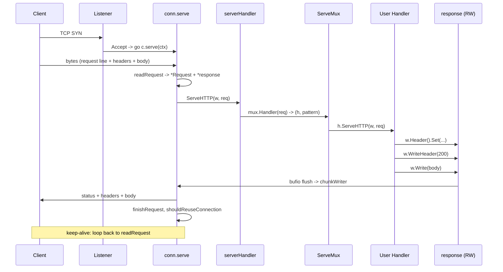

# Reading `net/http` Source — Middle

## 1. The five files that matter

At middle depth you only need to know five files in `src/net/http`:

| File | Responsibility |
|------|----------------|
| `server.go` | `Server`, `conn`, `response`, the accept loop, per-connection state machine |
| `request.go` | `Request` type, `ReadRequest`, header parsing, body wrapping |
| `serve_mux.go` | `ServeMux`, pattern parsing, longest-match routing |
| `transport.go` | `Transport`, connection pool, `RoundTrip` lifecycle |
| `client.go` | `Client`, redirect handling, request-level timeouts |

`h2_bundle.go` is the vendored `golang.org/x/net/http2`; read it last. `httputil` is a worked example of using `Transport` directly.

---

## 2. `Server.Serve` — the accept loop

```go
func (srv *Server) Serve(l net.Listener) error {
    // ... shutdown bookkeeping, BaseContext setup ...
    for {
        rw, err := l.Accept()
        if err != nil {
            // tempDelay backoff for transient errors
            continue
        }
        connCtx := ctx
        c := srv.newConn(rw)
        c.setState(c.rwc, StateNew, runHooks)
        go c.serve(connCtx)
    }
}
```

One connection per goroutine, no worker pool. Notable details:

- **`tempDelay` backoff** — `net.Error.Temporary()` triggers exponential sleep capped at 1s so fd-exhaustion doesn't busy-loop.
- **`BaseContext` / `ConnContext`** — per-listener and per-connection context hooks; `ConnContext` lets handlers see the underlying `net.Conn`.
- **`setState`** — drives `ConnState` (`StateNew → StateActive → StateIdle → StateClosed`).

The accept loop never blocks on a slow handler. Cost is one goroutine per connection — fine to ~100k concurrent, initial stack is 2 KB.

---

## 3. `conn.serve` — the per-connection state machine

This is the heart of the server. The simplified shape:

```go
func (c *conn) serve(ctx context.Context) {
    defer func() {
        if err := recover(); err != nil && err != ErrAbortHandler {
            // log stack trace
        }
        c.close()
        c.setState(c.rwc, StateClosed, runHooks)
    }()

    if tlsConn, ok := c.rwc.(*tls.Conn); ok {
        if err := tlsConn.HandshakeContext(ctx); err != nil { return }
        // ALPN: hand off to http2 if negotiated
        if proto := tlsConn.ConnectionState().NegotiatedProtocol; proto != "" {
            if fn := c.server.TLSNextProto[proto]; fn != nil {
                h2c := &initALPNRequest{ctx, tlsConn, serverHandler{c.server}}
                fn(c.server, tlsConn, h2c)
                return
            }
        }
    }

    for {
        w, err := c.readRequest(ctx)
        if err != nil {
            // 400 / 413 / timeout handling
            return
        }
        serverHandler{c.server}.ServeHTTP(w, w.req)
        w.finishRequest()
        if !w.shouldReuseConnection() { return }
        c.setState(c.rwc, StateIdle, runHooks)
        // wait for next request (read deadline)
    }
}
```

Middle-level observations:

- **`ErrAbortHandler`** panic silently aborts without logging. Used by hijacking handlers.
- **ALPN dispatch** to HTTP/2 happens *before* the request-read loop; if `h2` is negotiated, HTTP/1 code never runs.
- **Keep-alive** is `w.shouldReuseConnection()` — true if `Connection: close` wasn't set, response was clean, body fully drained.
- **`serverHandler{c.server}.ServeHTTP`** picks `srv.Handler` or falls back to `DefaultServeMux`.

---

## 4. Request parsing — `ReadRequest` / `readRequest`

`Request` parsing happens in `request.go`:

```go
func ReadRequest(b *bufio.Reader) (*Request, error) {
    return readRequest(b)
}

func readRequest(b *bufio.Reader) (req *Request, err error) {
    tp := newTextprotoReader(b)
    req = new(Request)

    // First line: METHOD SP URI SP VERSION CRLF
    var s string
    if s, err = tp.ReadLine(); err != nil { return nil, err }
    req.Method, req.RequestURI, req.Proto, _ = parseRequestLine(s)

    // MIME headers
    mimeHeader, err := tp.ReadMIMEHeader()
    if err != nil { return nil, err }
    req.Header = Header(mimeHeader)

    // Transfer-Encoding / Content-Length determines body length
    err = readTransfer(req, b)
    return req, err
}
```

A request body is a wrapper around the connection's `bufio.Reader`:

| Transfer mode | Body type | Behavior |
|---------------|-----------|----------|
| `Content-Length: N` | `*body` reading exactly N bytes | EOF after N |
| `Transfer-Encoding: chunked` | `*body` over a `internal/chunked.Reader` | EOF after `0\r\n\r\n` |
| No length, no chunking | `http.NoBody` (server) or up to EOF (client) | — |

`readTransfer` (in `transfer.go`) dispatches. Server-side, `Request.Body` is never nil; reading advances the connection cursor. **Not reading the body** breaks keep-alive — the next request starts mid-stream. The server defensively drains up to `maxPostHandlerReadBytes` (256 KB) on `body.Close()` before giving up.

---

## 5. `ResponseWriter` — the `response` struct

The `ResponseWriter` you receive in a handler is a `*response` in `server.go`. Important fields:

```go
type response struct {
    conn          *conn
    req           *Request
    w             *bufio.Writer        // buffers handlerBody → cw
    cw            chunkWriter          // writes status+headers, then body chunks
    handlerHeader Header               // what the handler sees as w.Header()
    wroteHeader   bool
    status        int
    contentLength int64
    // ...
}
```

The two-buffer design is the subtle bit:

1. `w` is a 4 KB `*bufio.Writer` the handler writes into.
2. When `w` flushes, bytes go into `cw` (`chunkWriter`).
3. `cw.writeHeader` runs **on the first flush** — only then do status + headers hit the wire.

```go
w.Header().Set("X-Foo", "bar")
w.WriteHeader(201)
w.Write([]byte("hello"))   // buffered; nothing on wire yet
```

`w.Header().Set(...)` after the first `Write` is silently ignored *only if* the buffer already flushed. Below 4 KB you sometimes get away with it; above, you don't. Rule: **set headers before any `Write`**.

`Write` implicitly calls `WriteHeader(200)`. The first chunkWriter flush sniffs `Content-Type` (`DetectContentType` on first 512 bytes) and emits `Content-Length` or `Transfer-Encoding: chunked` depending on what's known.

---

## 6. `ServeMux` — pattern routing

Pre-1.22, `ServeMux` was a flat map plus a length-sorted slice of prefix patterns; `Handler(r)` walked the slice and returned the first entry whose pattern was a prefix of `r.URL.Path`. Longest-match wins.

Go 1.22 rewrote it as a segment trie with method awareness:

```go
type ServeMux struct {
    mu       sync.RWMutex
    tree     routingNode      // segment trie
    index    routingIndex     // conflict detection
    patterns []*pattern
}
```

Patterns parse as `[METHOD] [HOST]/PATH` with `{name}` and `{name...}` wildcards:

```go
mux.HandleFunc("GET /users/{id}", getUser)
mux.HandleFunc("POST /users/{id}", updateUser)
mux.HandleFunc("/static/{path...}", fileServer)
```

Precedence is "most specific wins" — static beats single wildcard beats multi-wildcard. The mux *panics* on conflicting patterns at registration time. `r.PathValue("id")` reads captures. Legacy prefix form (`mux.Handle("/api/", h)`) still works alongside.

---

## 7. `Transport.RoundTrip` — the client engine

`Transport` is the client-side analogue of `Server`. Its job: take a `*Request`, return a `*Response`, and pool connections.

```go
type Transport struct {
    idleConn     map[connectMethodKey][]*persistConn
    idleConnWait map[connectMethodKey]wantConnQueue
    // ...
}
```

`connectMethodKey` is the pool key. It looks roughly like:

```go
type connectMethodKey struct {
    proxy, scheme, addr string
    onlyH1              bool
}
```

So `https://api.example.com:443` direct and `https://api.example.com:443` via a proxy hash to different pool buckets. `addr` is `host:port`, so different ports are different pools.

The simplified `RoundTrip`:

```go
func (t *Transport) RoundTrip(req *Request) (*Response, error) {
    // ... validate request ...
    for {
        pconn, err := t.getConn(treq, cm)
        if err != nil { return nil, err }

        resp, err := pconn.roundTrip(treq)
        if err == nil { return resp, nil }
        if !pconn.shouldRetryRequest(req, err) {
            return nil, err
        }
        // idempotent + connection-reused → retry once on broken conn
    }
}
```

`getConn` pulls an idle conn or dials new (bounded by `MaxConnsPerHost`). `persistConn.roundTrip` writes the request and waits on a response channel; a *separate* `readLoop` goroutine parses the response and pushes it back. That split lets pipelining and HTTP/2 streams reuse the same machinery.

**Retry rule**: only idempotent methods retry, only when failure is a server-side close before any byte was read.

---

## 8. `Client` — redirect & timeout layer

`Client` wraps `Transport` with policy: `Transport`, `CheckRedirect`, `Jar`, `Timeout`. `Client.do` calls `Transport.RoundTrip` in a loop, following 301/302/303/307/308 per `CheckRedirect` (default: stop after 10). 307/308 preserve the original method *and body*; older codes typically degrade `POST → GET`.

Timeouts:

| Setting | Scope |
|---------|-------|
| `Client.Timeout` | Whole request including redirects + body read |
| `Transport.DialContext` deadline | Just the dial |
| `Transport.TLSHandshakeTimeout` | Just TLS |
| `Transport.ResponseHeaderTimeout` | Dial+TLS+write done → first response byte |
| `Transport.IdleConnTimeout` | How long idle conns sit in the pool |
| `Request.Context()` cancellation | Anything above + body read |

`Client.Timeout` is implemented by setting a `context.WithDeadline` on the request and arming a goroutine that closes the body if the deadline fires mid-body-read.

---

## 9. Hijack — escape hatch to raw TCP

```go
type Hijacker interface {
    Hijack() (net.Conn, *bufio.ReadWriter, error)
}
```

`response.Hijack` (in `server.go`) sets `c.hijackedv = true`, stops the server from touching the connection (no keep-alive, no auto-`finishRequest`), and returns the raw `net.Conn` + its `bufio.ReadWriter`. The handler then *owns* the connection. WebSocket libraries (`gorilla/websocket`, `nhooyr.io/websocket`) all start with `Hijack` after sending `101 Switching Protocols`.

HTTP/2 streams cannot be hijacked — no raw connection to hand out. HTTP/1 only.

---

## 10. HTTP/2 integration

`net/http` HTTP/2 is the bundled `golang.org/x/net/http2` package, stored as `h2_bundle.go`. Activation paths:

| Side | Mechanism |
|------|-----------|
| Server | `Server.TLSNextProto["h2"]` populated by `http2.ConfigureServer` (called automatically when TLS is enabled and no manual `TLSNextProto` was set) |
| Client | `Transport.TLSNextProto["h2"]` similarly, via `http2.ConfigureTransport` |

The ALPN handoff happens in `conn.serve` (server) and inside `persistConn` setup (client). After handoff, none of the HTTP/1 code in `server.go` / `transport.go` runs — h2 streams are framed and demuxed inside `http2.Server` / `http2.Transport`.

**To disable HTTP/2**: set `TLSNextProto = map[string]func(...){}` (empty, non-nil) on either side. This is a common middle-level escape hatch for h2-specific bugs.

---

## 11. `httputil.ReverseProxy` — `Transport` used directly

`httputil/reverseproxy.go` is the cleanest worked example of using `Transport` as a building block:

```go
func (p *ReverseProxy) ServeHTTP(rw ResponseWriter, req *Request) {
    transport := p.Transport
    if transport == nil { transport = DefaultTransport }

    outreq := req.Clone(ctx)
    p.Director(outreq)        // rewrite URL.Host, URL.Scheme, etc.
    removeHopByHopHeaders(outreq.Header)

    res, err := transport.RoundTrip(outreq)
    // ... error handling ...

    removeHopByHopHeaders(res.Header)
    copyHeader(rw.Header(), res.Header)
    rw.WriteHeader(res.StatusCode)
    p.copyResponse(rw, res.Body, p.flushInterval(res))
    res.Body.Close()
}
```

Lessons:

- **Hop-by-hop headers** (`Connection`, `Keep-Alive`, `Te`, `Trailer`, `Transfer-Encoding`, `Upgrade`) stripped both ways (RFC 7230 §6.1).
- **`flushInterval`** flushes the `ResponseWriter` periodically for streaming responses (SSE, video). Without it, buffering hides the stream.
- **`Director` vs `Rewrite`** — `Director` (2011) vs `Rewrite` (1.20+) which takes `*ProxyRequest` and handles `X-Forwarded-For` safely.

---

## 12. Request lifecycle — sequence



---

## 13. Common middle-level mistakes

- **`http.DefaultClient` has no timeout.** A hung peer hangs forever. Always construct a `Client` with `Timeout` or pass a deadline-bound context.
- **Creating a `Transport` per request.** Each `Transport` holds its own pool; throwing one away closes all idle conns. Reuse a single `Transport` for the process.
- **Forgetting `resp.Body.Close()`.** The conn isn't pooled until body reaches EOF *and* is closed. Use `io.Copy(io.Discard, resp.Body)` before `Close()` for partial reads.
- **Setting headers after `Write`.** Once `bufio.Writer` flushes, headers are gone.
- **Pre-1.22 `ServeMux` for REST.** No method matching, no path params. Upgrade or use `chi` / `gorilla/mux`.
- **Mutating `Request.Body` in middleware.** One-shot reader; rewrap with `io.NopCloser(bytes.NewReader(...))` after reading.
- **Assuming `Hijack` works under HTTP/2.** It doesn't; check `_, ok := w.(http.Hijacker)` and degrade.
- **Custom `Transport` without `ForceAttemptHTTP2`.** Won't speak HTTP/2 to TLS endpoints unless that flag is set or `TLSClientConfig.NextProtos` includes `"h2"`.

---

## 14. Summary

`net/http` is one accept-per-goroutine server, a per-connection state machine (`conn.serve`), a buffered response writer, and a routing mux — plus a symmetric client built on a pooling `Transport`. HTTP/2 is bolted on via ALPN handoff; hijacking is the TCP escape hatch. Middle depth is knowing which file owns each responsibility and which knobs (timeouts, pool sizing, `TLSNextProto`) matter in production.

---

## Further reading

- `src/net/http/server.go` — `Server`, `conn.serve`, `response`
- `src/net/http/request.go`, `transfer.go` — request parsing, body wrapping
- `src/net/http/serve_mux.go`, `pattern.go` (1.22+) — routing
- `src/net/http/transport.go`, `transfer.go` — client engine, connection pool
- `src/net/http/client.go` — redirects, `Client.Timeout`
- `src/net/http/httputil/reverseproxy.go` — `Transport` as a building block
- `golang.org/x/net/http2` — bundled HTTP/2 implementation
- "go-http-server-in-15-minutes" by Filippo Valsorda — historical context
