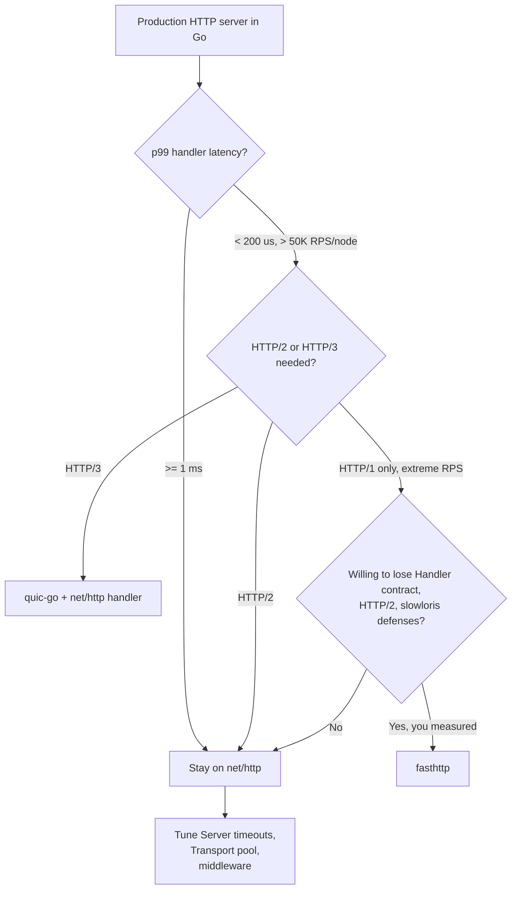
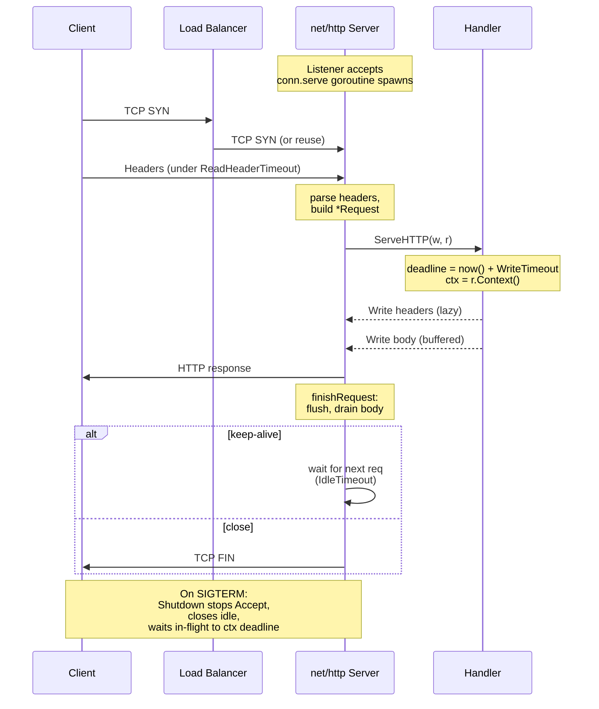

# `net/http` Source Reading — Senior

## 1. Design philosophy — the stdlib is the production baseline

The senior posture toward `net/http` is the opposite of the junior one: **assume stdlib is enough until measurement says otherwise**. Caddy, etcd, Kubernetes (apiserver, kubelet, kube-proxy), Docker daemon, Prometheus, CockroachDB, Vault, and Consul all serve HTTP from `net/http` directly. None of them use `fasthttp`. The throughput floor is tens of thousands of RPS per node — well above where most application teams imagine they need a "faster" HTTP library.

`net/http` ships: a request parser hardened against slowloris, header bombs, and malformed `Transfer-Encoding` through CVE-tracked patches; a connection state machine for keep-alive, pipelining, HTTP/1.1 chunked, and HTTP/2 multiplexing under one `Handler` contract; `Server.Shutdown` for graceful drain; a `Transport` whose pool and HTTP/2 upgrade have been beaten on for over a decade; and `httputil.ReverseProxy` that is the basis of Caddy and Traefik.

The cost of leaving stdlib is leaving that survivorship. `fasthttp` is faster on microbenchmarks because it reuses request/response objects, but it breaks `Handler` semantics, has no HTTP/2, and the maintainer publicly recommends against it for general-purpose servers. `quic-go` is the right choice for HTTP/3, not for replacing HTTP/1.1.

Senior rule: **measure first, replace last**. If your p99 handler is 5 ms, the HTTP layer is 50 µs of it; faster HTTP buys you nothing. If p99 is 50 µs and you serve 200K RPS per box, `fasthttp` enters the conversation — and you are likely the team writing your own.



The diagram is the whole decision. Most teams stop at `C` correctly. Teams that move past `C` without measuring are the same teams who later post "we migrated back to net/http" blog entries.

---

## 2. Server tuning — the five timeouts you must set

The default `http.Server{}` has no timeouts. Zero. A naked `http.ListenAndServe(":8080", mux)` will:

- Accept a connection from a slowloris attacker who sends one byte per second of header forever
- Allocate goroutines and file descriptors for those connections until the process hits the fd limit
- Never close an idle connection from a misbehaving client

This is intentional — stdlib refuses to pick numbers for you because your numbers depend on your workload — and it is the single most common source of production fd exhaustion in Go. The five settings you must set, in order of importance:

```go
srv := &http.Server{
    Addr:              ":8080",
    Handler:           mux,
    ReadHeaderTimeout: 5 * time.Second,
    ReadTimeout:       30 * time.Second,
    WriteTimeout:      30 * time.Second,
    IdleTimeout:       120 * time.Second,
    MaxHeaderBytes:    1 << 20, // 1 MiB
}
```

**`ReadHeaderTimeout`** is the most important. From the source, in `server.go`:

```go
// ReadHeaderTimeout is the amount of time allowed to read
// request headers. The connection's read deadline is reset
// after reading the headers and the Handler can decide what
// is considered too slow for the body. If zero, the value of
// ReadTimeout is used. If negative, or if zero and ReadTimeout
// is zero, there is no timeout.
ReadHeaderTimeout time.Duration
```

The slowloris defense is *only* this field. Without it, an attacker holding a socket open while dribbling header bytes pins one goroutine and one fd per connection. Modern Go (1.20+) defaults the implicit value in some helpers, but `&http.Server{}` does not. Set it to 5-10 s.

**`ReadTimeout`** bounds the whole request read — headers plus body. If a client uploads a 100 MB file on a slow connection, `ReadTimeout: 30s` may be wrong; either raise it for upload endpoints or use streaming with `Request.Body` and check `context.Done()` inside the handler. The source resets the deadline after headers if `ReadHeaderTimeout > 0 && ReadHeaderTimeout < ReadTimeout`.

**`WriteTimeout`** is **whole-response** — from the end of headers parse to the end of write. For a streaming endpoint (SSE, long-polling, large file download), set it to 0 (unlimited) and rely on the per-request `context` for cancellation. Otherwise 10-30 s.

**`IdleTimeout`** controls keep-alive cleanup. The source uses it to close a connection that has finished a request but no new one has arrived. Without it, idle clients consume fds forever. 60-120 s is standard; behind a load balancer, set it shorter than the LB's idle timeout to avoid the LB closing on you.

**`MaxHeaderBytes`** caps the parsed header size. Default is 1 MiB. The header-bomb attack sends a few headers with values measured in megabytes; without a cap, the buffer grows until OOM. The source enforces this in `textproto.Reader.ReadMIMEHeader` via a `LimitReader`. 1 MiB is usually too much — drop to 64-256 KiB for public endpoints.

Two more knobs worth knowing:

- **`http.Server.BaseContext` and `ConnContext`** — install a `context.Context` per listener / per connection. The hook for tenant ID, trace ID, dial-time TLS info propagation.
- **`Server.ConnState`** — observe connection state transitions (`StateNew`, `StateActive`, `StateIdle`, `StateClosed`). The hook for connection-count gauges, slow-handler detection.

---

## 3. Connection lifecycle — what happens between Accept and Close

The HTTP/1.1 server's per-connection state machine is in `server.go`'s `conn.serve` method. The essential loop:

```
Accept
  conn.serve goroutine spawned
    for {
      readRequest         // parses headers under ReadHeaderTimeout
      Handler.ServeHTTP   // your code; deadline is WriteTimeout from now
      finishRequest       // flush, drain remaining body
      if !keepAlive || shutdown || idleTimeout { break }
      wait for next request under IdleTimeout
    }
  conn.close
```

Three subtleties matter at senior level.

**Keep-alive is automatic but cancellable.** A client sends `Connection: close`, or the server sets `Connection: close` in the response, or HTTP/1.0 negotiates no-keep-alive. The source disables keep-alive on the connection and exits the loop after the current request. Inside a handler, `w.Header().Set("Connection", "close")` is the lever; useful for forcing reconnects during rolling deploys.

**Request pipelining** — multiple requests on one connection without waiting for responses — is supported by the HTTP/1.1 spec and silently disabled in most clients (browsers gave up on it; Go's client does not pipeline). The server still parses pipelined requests serially; the handler always sees them in order. You will not encounter this in practice except in attack traffic, where it amplifies request rate per fd.

**`CloseNotify`** (deprecated since Go 1.7 in favor of `Request.Context()`) used to be how handlers detected client disconnect mid-response. The modern source emits a `context.Canceled` on `r.Context().Done()` when the client TCP RST/FINs. For long-running handlers (streaming, websockets, SSE), select on `r.Context().Done()`:

```go
for {
    select {
    case <-r.Context().Done():
        return
    case ev := <-events:
        fmt.Fprintf(w, "data: %s\n\n", ev)
        w.(http.Flusher).Flush()
    }
}
```

The source signals cancellation via the `*conn` watching the underlying TCP socket; this works for HTTP/1.1 and HTTP/2.

**Graceful shutdown** — `Server.Shutdown(ctx)`:

```go
func main() {
    srv := &http.Server{Addr: ":8080", Handler: mux, /* timeouts */}
    go func() { _ = srv.ListenAndServe() }()

    stop := make(chan os.Signal, 1)
    signal.Notify(stop, syscall.SIGINT, syscall.SIGTERM)
    <-stop

    ctx, cancel := context.WithTimeout(context.Background(), 30*time.Second)
    defer cancel()
    if err := srv.Shutdown(ctx); err != nil {
        log.Printf("shutdown: %v", err)
    }
}
```

`Shutdown` stops `Accept` immediately, closes idle keep-alive connections, and waits for in-flight handlers to return. If the context deadline fires first, it returns the deadline error and the program exits with handlers still running — they will be killed on process exit. For a Kubernetes deployment, the `terminationGracePeriodSeconds` should exceed the Shutdown timeout, and the readiness probe should be flipped to "not ready" before SIGTERM to drain the load balancer first. Without that ordering, the LB sends requests to a server that has stopped accepting them.

The source uses `Server.RegisterOnShutdown` to also let the user close websocket-like long-lived connections — `Shutdown` will not finish them on its own because they are stuck in a handler.

---

## 4. `http.Transport` for production clients

The client-side equivalent of the server's connection state machine is `http.Transport`. Its pool sizing and timeout configuration are where most production-grade Go HTTP issues live.

**Never use `http.DefaultClient` in production code.** `DefaultClient` has no timeout — a misbehaving upstream pins a goroutine until the kernel times out the socket, possibly minutes. Worse, `DefaultTransport` is shared package-globally; one library setting `MaxIdleConnsPerHost = 1` affects every caller's connection pool. Build a per-client `Transport`:

```go
tr := &http.Transport{
    Proxy: http.ProxyFromEnvironment,
    DialContext: (&net.Dialer{
        Timeout:   5 * time.Second,
        KeepAlive: 30 * time.Second,
    }).DialContext,
    ForceAttemptHTTP2:     true,
    MaxIdleConns:          200,
    MaxIdleConnsPerHost:   50,
    MaxConnsPerHost:       100,
    IdleConnTimeout:       90 * time.Second,
    TLSHandshakeTimeout:   5 * time.Second,
    ExpectContinueTimeout: 1 * time.Second,
    ResponseHeaderTimeout: 10 * time.Second,
}
client := &http.Client{
    Transport: tr,
    Timeout:   30 * time.Second,
}
```

The pool fields are commonly misread.

- **`MaxIdleConns`** caps total idle connections across all hosts. Default 100. Raise for clients hitting many distinct upstreams.
- **`MaxIdleConnsPerHost`** caps idle per host. Default is `2`. This default is the most common production footgun: a client hammering one upstream creates and tears down connections on every request because the second one cannot be cached. Raise to 50-200 for a high-RPS client hitting one upstream.
- **`MaxConnsPerHost`** caps *total* (idle + active) per host. Default 0 (unlimited). Setting this is how you implement per-upstream concurrency control without a semaphore. Excess requests block in `RoundTrip` until a slot frees.

The source manages the pool in `transport.go`'s `connectMethod` map. Connections are keyed by `(scheme, addr, proxy, TLSConfig)` — a `TLSClientConfig` pointer difference means a different pool key, so do *not* construct a fresh `tls.Config` per request, or your pool is effectively size 1.

**`DialContext`** is the senior hook. The default dialer has only network-level timeouts; production wants:

- **Retry on transient dial errors** — exponential backoff inside a custom dialer
- **Circuit breaker** — wrap `DialContext` to fail fast when an upstream is known-bad
- **Health-aware routing** — multi-A-record DNS, pick a healthy address
- **mTLS with rotating certs** — wrap to refresh the client cert before each dial when expiring

```go
tr.DialContext = func(ctx context.Context, network, addr string) (net.Conn, error) {
    if breaker.Open(addr) {
        return nil, fmt.Errorf("circuit open: %s", addr)
    }
    conn, err := (&net.Dialer{Timeout: 5 * time.Second}).DialContext(ctx, network, addr)
    if err != nil { breaker.RecordFail(addr); return nil, err }
    breaker.RecordSuccess(addr)
    return conn, nil
}
```

**Custom TLS.** `TLSClientConfig` is the field. Setting `InsecureSkipVerify: true` outside a test fixture is a CVE waiting to happen. Pin certs with `RootCAs`; pin SPKI fingerprints with `VerifyPeerCertificate` for high-security paths. Rotate the `Config` by building a new `Transport` and atomic-swapping the `*Client`; do not mutate a live `Config`.

The four client timeouts to set (besides `Client.Timeout`, which is whole-request):

| Field | Bounds | Typical |
|-------|--------|---------|
| `Dialer.Timeout` | TCP connect | 3-5 s |
| `TLSHandshakeTimeout` | TLS handshake | 5 s |
| `ResponseHeaderTimeout` | request sent → first byte of response headers | 5-15 s |
| `IdleConnTimeout` | idle pooled connection lifetime | 60-90 s |
| `ExpectContinueTimeout` | 100-Continue wait for body upload | 1 s |

`Client.Timeout` is a hard ceiling that includes redirects and body read. For streaming responses you must set `Client.Timeout = 0` and bound via `Request.Context()` instead, or `Body.Read` will be cut off mid-stream.

---

## 5. HTTP/2 — when, how, and how to debug it

`net/http` (Go 1.6+) auto-negotiates HTTP/2 for TLS servers when ALPN advertises `h2`. The source lives in `net/http/h2_bundle.go`, vendored from `golang.org/x/net/http2`. On a `Server` with TLS, you get HTTP/2 by default; opt out with `Server.TLSNextProto = map[string]func(*Server, *tls.Conn, Handler){}` (an empty non-nil map disables it).

When to want HTTP/2:

- **Many concurrent requests over one connection** — mobile clients, microservice fanout
- **Server push you do not need** — it is deprecated; do not design around push
- **Header compression matters** — HPACK saves bandwidth on chatty APIs
- **HOL blocking on HTTP/1.1 keep-alive** — pipelining never worked; multiplexing actually does

When HTTP/2 hurts:

- **Single-stream large transfers** — HTTP/2 has per-stream flow control with default 64 KiB windows; for high-throughput single-stream, you must tune `http2.Server.MaxConcurrentStreams`, `Server.IdleTimeout`, and flow-control windows, or you cap at ~50 MB/s. The source defaults are conservative.
- **Long polls and many idle streams** — one TCP connection multiplexing 10K streams can starve under window updates
- **Behind an L4 load balancer doing connection-based balancing** — all your traffic goes to one backend per client

**`GODEBUG=http2debug=1`** dumps frame-level traffic to stderr. `http2debug=2` adds frame contents. The source checks the env var in `h2_bundle.go`:

```
GODEBUG=http2debug=1 ./myserver
2024/05/28 12:00:00 http2: server: new connection from 10.0.0.5:54321
2024/05/28 12:00:00 http2: Framer 0xc0001b6000: read SETTINGS len=18, settings: ...
2024/05/28 12:00:00 http2: Framer 0xc0001b6000: read HEADERS flags=END_HEADERS|END_STREAM stream=1
2024/05/28 12:00:00 http2: server: error reading client preface: ...
```

The trace is verbose but reveals: stream IDs, window updates, RST_STREAM reasons, settings frames, and graceful GOAWAY. For a debugging session in staging, set the variable; never in production (the logging is unbounded).

The HTTP/2 client side uses the same env var. For client misbehavior — phantom `connection refused`, half-closed streams — `GODEBUG=http2client=0` forces HTTP/1.1 and tells you whether the problem is in h2.

---

## 6. Hot-path allocations — `Request.Body`, `Header.Get`, `ResponseWriter.Write`

A `Handler` that allocates per request scales worse than one that does not, and most allocation comes from three predictable places.

**`Request.Body` reads.** The source wraps the underlying connection reader in a `body` struct that handles chunked transfer-encoding and content-length termination. Every `Read` is one syscall worst-case, but `Body` does not buffer — if you do `io.ReadAll(r.Body)` for a small JSON payload, you allocate a slice for the body, then JSON decode allocates again. For small payloads, use `json.NewDecoder(r.Body).Decode(&v)` — decoder streams from the body without an intermediate buffer.

For large uploads, `io.Copy(dst, r.Body)` with a `bufio.Reader` of known size beats `ReadAll`; you avoid the doubling-buffer growth.

**Critical:** `r.Body.Close()` is mandatory in middleware that does not pass the body downstream. The Go source documents this — failing to close drains the body for the connection's next request, but failing to read-to-end *and* close before returning can leak goroutines holding the connection. The server's `finishRequest` will drain a small unread body but gives up after `Server.MaxBytesReader`-style limits.

**`Header.Get`** — the source uses `textproto.MIMEHeader`, a `map[string][]string`. `Get` canonicalizes the key (`MIMEHeaderKey`) on every call, which allocates if the key has lowercase letters not matching the canonical form. Hot-path: write `r.Header["X-Request-Id"]` directly (already canonical), or canonicalize once with `http.CanonicalHeaderKey` and reuse the constant.

**`ResponseWriter.Write`** — the source flushes the response headers on first `Write`. Inside, it wraps the connection in a `bufio.Writer` (default 4 KiB). Many small writes are buffered; you do not need your own `bufio.Writer` around `ResponseWriter`. The exception: handlers that stream tiny events (SSE) need to call `w.(http.Flusher).Flush()` to push the buffer, otherwise events sit until the buffer fills. Wrapping `ResponseWriter` in a custom `bufio.Writer` defeats `Flusher`.

**`http.NewRequest`** allocates a `Request` struct, a `url.URL`, a `Header`, and parses the URL. In a tight client loop, build one `Request` and clone it via `Request.Clone(ctx)` — `Clone` is shallow on `URL` but copies `Header`. The source added `Clone` in Go 1.13 specifically for this pattern.

**`sync.Pool`** for per-request scratch buffers — `bytes.Buffer` for logging, marshalling scratch — saves allocations in handlers running 50K+ RPS. Be careful with `ResponseWriter.Write(buf.Bytes())`: the source buffers internally, but `buf` is returned to the pool immediately, so this is safe; if you return early without writing, return the buffer in `defer`.

---

## 7. Reverse proxy — `httputil.ReverseProxy` in production

`httputil.ReverseProxy` is what Caddy v1 was built on. The source is ~500 lines and worth reading end to end.

Pre-1.20 `Director` mutates the request in place. It does *not* set `r.Host` from the URL — the original `Host` is preserved unless the director overrides it, which is wrong for almost every use case. Go 1.20 introduced `Rewrite` with `*ProxyRequest` exposing both `In` (original) and `Out` (outgoing) — strictly better:

```go
proxy := &httputil.ReverseProxy{
    Rewrite: func(pr *httputil.ProxyRequest) {
        pr.SetURL(upstream)             // scheme, host, path
        pr.SetXForwarded()              // X-Forwarded-*, strips untrusted
        pr.Out.Header.Set("X-Tenant", pr.In.Header.Get("X-Tenant"))
    },
}
```

`SetXForwarded` adds `X-Forwarded-For/Host/Proto` and removes incoming values from untrusted sources — defense against header spoofing. Prefer `Rewrite` whenever you can drop Go 1.19 support.

**`ModifyResponse`** transforms the upstream response before write — JSON rewriting, stripping `Server`/`X-Powered-By`, status translation. Runs after headers arrive, before body streams.

**`ErrorHandler`** is the senior necessity. The default emits `502 Bad Gateway` with an English string that leaks upstream identity:

```go
proxy.ErrorHandler = func(w http.ResponseWriter, r *http.Request, err error) {
    log.Printf("proxy error: %v", err)
    http.Error(w, `{"error":"upstream_unavailable"}`, http.StatusBadGateway)
}
```

**`Transport`** is its own `http.Transport`. Reuse a tuned one (section 4); do not let the proxy default-construct.

**`FlushInterval`** controls streaming: `0` (default) buffers; `< 0` flushes on each `Write`; `> 0` flushes on a timer. Use `-1` for SSE.

**`X-Forwarded-For`** is the hardest part. A malicious client sends `X-Forwarded-For: 127.0.0.1` to pretend to be local. `SetXForwarded` is correct for the *outermost* proxy; in a chain (LB → proxy → app), you must preserve the chain. Read `ProxyRequest.SetXForwarded` — 12 lines encoding the right policy.

---

## 8. Middleware patterns — `Handler` composition without a framework

A middleware is a function that wraps a `Handler` and returns a `Handler`:

```go
type Middleware func(http.Handler) http.Handler

func Logging(next http.Handler) http.Handler {
    return http.HandlerFunc(func(w http.ResponseWriter, r *http.Request) {
        t0 := time.Now()
        rw := &statusRecorder{ResponseWriter: w, status: 200}
        next.ServeHTTP(rw, r)
        log.Printf("%s %s %d %v", r.Method, r.URL.Path, rw.status, time.Since(t0))
    })
}

func Chain(h http.Handler, mws ...Middleware) http.Handler {
    for i := len(mws) - 1; i >= 0; i-- { h = mws[i](h) }
    return h
}

mux := http.NewServeMux()
mux.HandleFunc("/api/users", handleUsers)
srv := &http.Server{Handler: Chain(mux, Recover, Logging, RateLimit, Auth)}
```

The pattern is one of the few places in Go where chaining higher-order functions reads naturally — no framework needed, no `Use()` registration call, no `*gin.Context` reinvention of `Request.Context()`. Mature codebases stay on this shape for a decade.

**`Handler` vs `HandlerFunc`.** `Handler` is the interface, `HandlerFunc` is a function adapter that satisfies it. Use `HandlerFunc` for ad-hoc handlers, `Handler` for handlers with state. Both compose identically.

**Wrapping `ResponseWriter`** to capture status code, byte count, or buffer for compression is the most common gotcha. The source's `ResponseWriter` may also implement `http.Flusher`, `http.Hijacker`, `http.Pusher`, `io.ReaderFrom`. A naive wrapper that only embeds `ResponseWriter` defeats `Flusher` for the inner handler:

```go
type statusRecorder struct {
    http.ResponseWriter
    status int
    bytes  int64
}

func (s *statusRecorder) WriteHeader(code int) {
    s.status = code
    s.ResponseWriter.WriteHeader(code)
}

func (s *statusRecorder) Write(b []byte) (int, error) {
    n, err := s.ResponseWriter.Write(b)
    s.bytes += int64(n)
    return n, err
}

// Required passthroughs:
func (s *statusRecorder) Flush() {
    if f, ok := s.ResponseWriter.(http.Flusher); ok { f.Flush() }
}
func (s *statusRecorder) Hijack() (net.Conn, *bufio.ReadWriter, error) {
    return s.ResponseWriter.(http.Hijacker).Hijack()
}
```

A wrapper that does not pass `Flush`/`Hijack` through is the canonical "websocket upgrade fails after we added the logging middleware" bug.

**`runtime/pprof.Do` for label propagation.** `pprof` profiles can be labeled by tenant, endpoint, or trace ID with `pprof.Do`:

```go
func PprofLabels(next http.Handler) http.Handler {
    return http.HandlerFunc(func(w http.ResponseWriter, r *http.Request) {
        labels := pprof.Labels("endpoint", r.URL.Path, "method", r.Method)
        pprof.Do(r.Context(), labels, func(ctx context.Context) {
            next.ServeHTTP(w, r.WithContext(ctx))
        })
    })
}
```

`go tool pprof` then shows CPU broken down by label — answering "which endpoint is hot" without a separate APM. The cost is small: ~50 ns per label per sample.

---

## 9. Pitfalls — the seven things that break in production

**Leaking goroutines through unread bodies.** A handler or client that does not `r.Body.Close()` (and drain when needed) holds the connection open. `defer resp.Body.Close()` on the client; server-side, the framework closes it but read first if you want keep-alive.

**Sharing `http.DefaultClient` / `http.DefaultTransport`.** Library A sets `MaxIdleConnsPerHost = 1`; library B's pool collapses. Always construct your own `*http.Client` per logical caller.

**`http.ServeMux` pattern footguns pre-Go-1.22.** Pre-1.22 had no path parameters, no method routing, and surprising prefix matching (`/foo` exact, `/foo/` prefix). Go 1.22 added both:

```go
mux.HandleFunc("GET /users/{id}", handleGet)
id := r.PathValue("id")
```

Pre-1.22 codebases bolt on `chi`, `gorilla/mux`, or `httprouter`. Post-1.22, stdlib router is enough for almost any service.

**Per-request timeouts without context propagation.** A handler sets `ctx, cancel := context.WithTimeout(r.Context(), 5*time.Second)` and forgets to use `ctx` downstream — the timeout is dead. Pass `ctx` to every blocking call.

**Goroutines launched from a handler outliving the request.** `go func() { /* uses r */ }()` is broken — when the handler returns, the connection is recycled, `r.Body` is invalid, `r.Context()` is canceled. Pass copies or use a job queue.

**Header injection via reflected user input.** The source rejects CRLF in `Header.Set` since Go 1.10 via `validHeaderFieldValue`, but raw `Hijack` paths still need manual sanitization.

**Logging the wrong request body.** Body is a stream; reading it in middleware leaves the handler with an empty body. Use `io.TeeReader` (capped with `io.LimitReader` for large bodies):

```go
buf := &bytes.Buffer{}
r.Body = io.NopCloser(io.TeeReader(r.Body, buf))
next.ServeHTTP(w, r)
log.Printf("body: %s", buf.String())
```

---

## 10. Performance ceiling vs `fasthttp` and `quic-go`

Source design choices that bound throughput: one goroutine per connection (100K idle keep-alives = 400 MB of stacks); `Request`/`Response` allocated per request (fasthttp pools them); HTTP/1.1 parser is allocation-conservative but byte-level.

`fasthttp` benchmarks at 300-700K RPS versus `net/http` at 50-150K RPS for echo-style handlers. The gap is dominated by `Request`/`Response` pooling. Costs: different `Handler` signature (`func(*fasthttp.RequestCtx)`), no `http.Handler` ecosystem, no HTTP/2 (out of scope per maintainer), and reused objects mean handlers that retain references past return cause silent corruption.

The decision is binary: with a real workload (DB, JSON, auth, business logic) the gap closes to single digits. If you serve `/healthz`, you can saturate one core at 1 M RPS in stdlib.

`quic-go` is for HTTP/3 — useful for mobile clients with lossy networks. It plugs into a `net/http` handler via `http3.Server{Handler: mux}`. Adopt for HTTP/3 specifically, not as a fasthttp replacement.

---

## 11. Postmortems — three real-shaped failures

**Slowloris drains fds.** A service running `http.ListenAndServe(":443", mux)` with no `Server` struct went down on a Friday. Symptoms: `accept tcp [::]:443: accept4: too many open files`, then `runtime: failed to create new OS thread`. Root cause: no `ReadHeaderTimeout`. An attacker held 32K connections open dribbling one header byte per minute. Fix: `ReadHeaderTimeout: 5*time.Second` plus ingress rate-limiting on per-IP new connections, and `Server.ConnState` instrumented with a counter on `StateNew` to alarm on connection storms.

**Header bomb OOMs the process.** A service hit p99 latency spikes and intermittent OOM kills. `pprof` showed `textproto.Reader.ReadMIMEHeader` allocating gigabytes. Root cause: `MaxHeaderBytes` was the default 1 MiB, and an attacker sent requests with 1 MiB of `Cookie:` headers. With 200 concurrent connections, that is 200 MiB of headers parsed simultaneously. Fix: `MaxHeaderBytes: 64 << 10`. Public endpoints rarely need more than 8 KiB.

**fd exhaustion from missing client `Body.Close`.** A service calling a downstream API ran fine in load tests, started failing in production after 90 minutes. `lsof` showed thousands of `CLOSE_WAIT` sockets. Root cause: a code path returning early on `resp.StatusCode != 200` without closing `resp.Body`. Fix:

```go
resp, err := client.Do(req)
if err != nil { return err }
defer resp.Body.Close()
if resp.StatusCode != 200 {
    io.Copy(io.Discard, resp.Body) // drain so connection returns to pool
    return fmt.Errorf("status %d", resp.StatusCode)
}
```

`defer Close` is necessary but not sufficient — without draining, the connection does not return to the idle pool, and you re-dial on every request. Add `bodyclose` from `golangci-lint` to catch missed closes statically.

---

## 12. Code review checklist for HTTP servers and clients

```
Server (http.Server):
  [ ] ReadHeaderTimeout set (5-10 s)
  [ ] ReadTimeout set (30 s default; longer for uploads)
  [ ] WriteTimeout set or context-bounded
  [ ] IdleTimeout set (60-120 s)
  [ ] MaxHeaderBytes set (64-256 KiB for public)
  [ ] BaseContext / ConnContext set if per-conn state needed
  [ ] Graceful shutdown via Server.Shutdown(ctx) on SIGTERM
  [ ] Readiness probe flips before SIGTERM (k8s/LB drain)
  [ ] Handlers select on r.Context().Done() for cancellation
  [ ] No goroutines from handler outlive the handler
  [ ] ResponseWriter wrappers pass through Flush/Hijack/Push
  [ ] Logged bodies use io.TeeReader, not Body consumption
  [ ] Method routing via 1.22+ patterns or external router
  [ ] Recover middleware catches handler panics
  [ ] pprof.Do labels propagate endpoint/tenant
  [ ] http2debug tested in staging

Client (http.Client + http.Transport):
  [ ] Not using http.DefaultClient / http.DefaultTransport
  [ ] Client.Timeout set OR Request.Context-bound (streaming)
  [ ] Dialer.Timeout, TLSHandshakeTimeout, ResponseHeaderTimeout set
  [ ] MaxIdleConnsPerHost raised from default 2 if hammering one host
  [ ] MaxConnsPerHost set if concurrency cap is needed
  [ ] resp.Body closed in defer
  [ ] resp.Body drained (io.Copy(io.Discard, ...)) on non-2xx for keep-alive
  [ ] No InsecureSkipVerify outside test
  [ ] Custom DialContext for retry / circuit breaker if external upstream
  [ ] TLS config not mutated on a live Transport

Proxy (httputil.ReverseProxy):
  [ ] Using Rewrite (Go 1.20+), not Director
  [ ] SetXForwarded called (or equivalent)
  [ ] ErrorHandler overridden (no upstream leakage)
  [ ] ModifyResponse strips Server, X-Powered-By
  [ ] Transport tuned (see client checklist)
  [ ] FlushInterval -1 for streaming endpoints

Observability:
  [ ] Metrics: requests by status/method/path, latency histogram, in-flight
  [ ] Connection-state gauges (ConnState)
  [ ] Goroutine count, fd usage alarms
  [ ] Trace context propagated via Request.Context()
  [ ] linter: bodyclose, errcheck, govet
```



---

## 13. Closing principles

**`net/http` is production-grade by default but not production-tuned by default.** Defaults are conservative; production usage requires setting the five timeouts and choosing a connection pool size. Both are 30-line changes that prevent 80% of HTTP-layer incidents.

**Reach for `fasthttp` only after measuring.** Every production incident attributed to "Go HTTP is slow" has been a misconfigured timeout, an unread body leak, or a CPU-bound handler — never the HTTP layer.

**Read the source.** `net/http/server.go`, `net/http/transport.go`, `net/http/httputil/reverseproxy.go` are the three files that explain 90% of behavior. `h2_bundle.go` is HTTP/2 — search for symbols, do not read top-to-bottom.

**Trust `Server.Shutdown` and `Request.Context`.** Both were added to make graceful behavior possible. Code that does not honor `r.Context()` is broken under graceful shutdown.

**Treat middleware as composition of pure `Handler` wrappers.** Frameworks reinvent this with worse names; stdlib's shape has aged into a 12-year-old idiom for a reason.

**Observe the connection state machine.** `Server.ConnState`, `Transport.IdleConnsForHost`, `expvar` counters for fd usage and goroutine count. The HTTP layer is invisible until it isn't.

---

## Further reading

- `net/http/server.go` — `Server`, `conn.serve`, `readRequest`
- `net/http/transport.go` — `Transport`, `RoundTrip`, connection pool key, dial coalescing
- `net/http/httputil/reverseproxy.go` — `ReverseProxy`, `ProxyRequest`, `SetXForwarded`
- `net/http/h2_bundle.go` — HTTP/2 bundle from `golang.org/x/net/http2`
- `net/http/pprof` — runtime profiling endpoints (gate behind auth in production)
- `golang.org/x/net/http2/h2c` — HTTP/2 cleartext for service-mesh sidecars
- Brad Fitzpatrick — "Modernizing Go's HTTP Server" (GopherCon 2019)
- Filippo Valsorda writeups on HTTP/2 in Go and CVE postmortems
- `bodyclose`, `noctx`, `contextcheck` linters in `golangci-lint`
- Go 1.22 `ServeMux` patterns documentation
