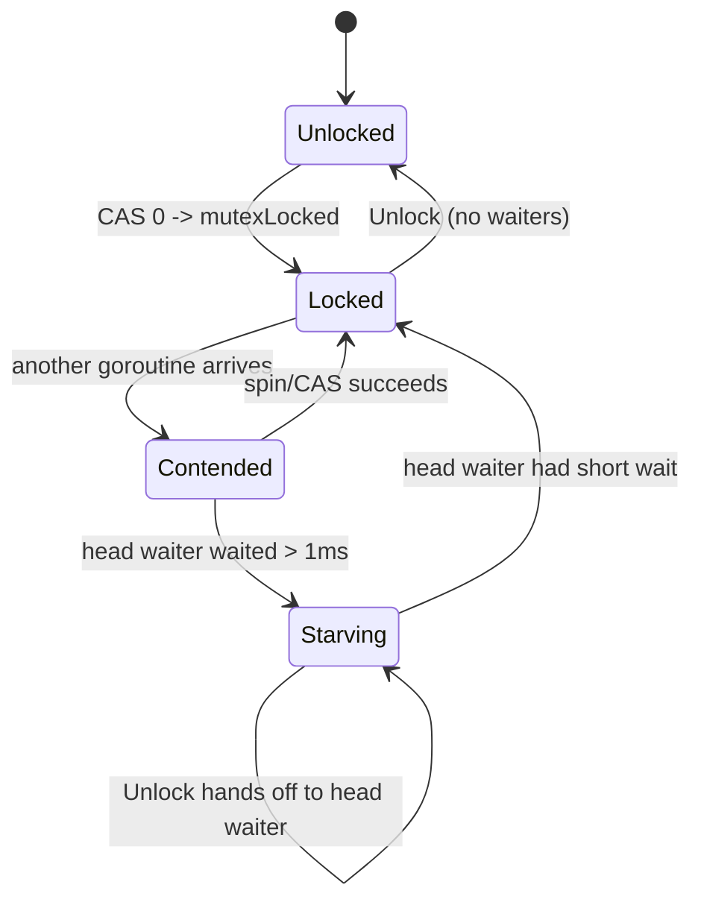

# `sync` Source — Middle

## 1. Map of the package

`src/sync/` is small but every file is dense. The middle reader's map:

| File | Implements | Key runtime calls |
|------|------------|-------------------|
| `mutex.go` | `Mutex`, `Locker` | `runtime_SemacquireMutex`, `runtime_Semrelease` |
| `rwmutex.go` | `RWMutex` | inner `Mutex` + `runtime_SemacquireRWMutex` |
| `waitgroup.go` | `WaitGroup` | `runtime_Semacquire`, `runtime_Semrelease` |
| `once.go` | `Once`, `OnceFunc`, `OnceValue` | inner `Mutex` |
| `pool.go` | `Pool` | `runtime_registerPoolCleanup`, `runtime_procPin` |
| `map.go` | `Map` | `atomic.Pointer[readOnly]` |
| `cond.go` | `Cond` | `runtime_notifyListAdd`/`Wait` |
| `runtime.go` | `go:linkname` bridge to `runtime/sema.go` | semaphore primitives |

`runtime.go` is load-bearing — every primitive goes through it to reach the scheduler.

---

## 2. The runtime bridge

None of `sync` works without the `go:linkname` declarations in `runtime.go`:

```go
func runtime_Semacquire(s *uint32)
func runtime_SemacquireMutex(s *uint32, lifo bool, skipframes int)
func runtime_Semrelease(s *uint32, handoff bool, skipframes int)
```

These are *declarations only*. Bodies live in `runtime/sema.go`, wired in via:

```go
//go:linkname sync_runtime_Semacquire sync.runtime_Semacquire
func sync_runtime_Semacquire(addr *uint32) { ... }
```

The runtime owns goroutine parking/unparking; `sync` owns the API. The split exists because `sync` is a normal package while `runtime` is privileged (can call `gopark`/`goready`).

---

## 3. `Mutex` — the state word

```go
type Mutex struct {
    state int32
    sema  uint32
}
```

`state` is a packed bitfield:

| Bits | Name | Meaning |
|------|------|---------|
| 0 | `mutexLocked` | Lock held |
| 1 | `mutexWoken` | A goroutine was woken and is racing for the lock |
| 2 | `mutexStarving` | Starvation mode |
| 3..31 | waiter count | Goroutines parked on `sema` |

`sema` is the semaphore address goroutines park on; `runtime_Semrelease` wakes one of them.

---

## 4. `Lock` fast and slow paths

```go
func (m *Mutex) Lock() {
    if atomic.CompareAndSwapInt32(&m.state, 0, mutexLocked) {
        return // fast path
    }
    m.lockSlow()
}
```

The fast path is a single CAS. The slow path:

```go
func (m *Mutex) lockSlow() {
    var waitStartTime int64
    starving := false
    iter := 0
    old := m.state
    for {
        if old&(mutexLocked|mutexStarving) == mutexLocked && runtime_canSpin(iter) {
            // try set woken so Unlock doesn't wake another waiter
            runtime_doSpin()
            iter++
            old = m.state
            continue
        }
        // ... build new state, CAS, then park if needed:
        // runtime_SemacquireMutex(&m.sema, lifo=true, ...)
    }
}
```

Two key steps:

1. **Spin.** `runtime_doSpin` is ~30 cycles of `PAUSE` on x86, bounded to 4 iterations on multicore only. Spinning on uniprocessors steals time from the holder.
2. **Park.** `runtime_SemacquireMutex` with `lifo=true` puts new waiters at the head of the queue — they're more likely cache-hot.

---

## 5. Starvation mode (Go 1.9+)

Vanilla mutex handoff is unfair: a new arrival can steal the lock before a long-waiting parked goroutine wakes. Go 1.9 added starvation mode to bound waiter latency.

```go
const starvationThresholdNs = 1e6 // 1ms
```



In starvation mode:
- `Unlock` does **not** flip the lock bit; it hands ownership directly to the head waiter via `runtime_Semrelease(&m.sema, handoff=true, ...)`.
- New goroutines do **not** spin or try to acquire — they go to the back of the queue.
- The receiving waiter clears `mutexStarving` if its wait was < 1ms or it's the last waiter.

Tradeoff: starvation mode is FIFO, but each `Unlock` forces a context switch. Throughput drops; tail latency stops climbing.

---

## 6. `Unlock`

```go
func (m *Mutex) Unlock() {
    new := atomic.AddInt32(&m.state, -mutexLocked)
    if new != 0 { m.unlockSlow(new) }
}
```

`unlockSlow` checks normal vs starving and calls `runtime_Semrelease` with the right `handoff` flag. Unlocking an unlocked mutex is a *fatal*, not a recoverable panic — the mutex is corrupt and recovery would deadlock.

---

## 7. `RWMutex`

```go
type RWMutex struct {
    w           Mutex        // held while writers are pending
    writerSem   uint32
    readerSem   uint32
    readerCount atomic.Int32
    readerWait  atomic.Int32
}

const rwmutexMaxReaders = 1 << 30
```

```go
func (rw *RWMutex) RLock() {
    if rw.readerCount.Add(1) < 0 {
        runtime_SemacquireRWMutexR(&rw.readerSem, false, 0)
    }
}

func (rw *RWMutex) Lock() {
    rw.w.Lock() // exclude other writers
    r := rw.readerCount.Add(-rwmutexMaxReaders) + rwmutexMaxReaders
    if r != 0 && rw.readerWait.Add(r) != 0 {
        runtime_SemacquireRWMutex(&rw.writerSem, false, 0)
    }
}
```

The trick: `Lock` subtracts `1<<30` from `readerCount`. The value becomes negative, so new `RLock` calls see `< 0` and park on `readerSem`. The original positive count is recovered as `r`; the writer waits for those `r` existing readers to drain via `readerWait`.

**Why writer-preferring:** a reader-preferring design lets a stream of readers indefinitely starve writers. Subtracting blocks new readers immediately when a writer enters.

| Op | Uncontended cost |
|----|------------------|
| `RLock` | one `Add` |
| `RUnlock` | one `Add` |
| `Lock` | `Mutex.Lock` + `Add` |
| `Unlock` | `Add` + release readers + `Mutex.Unlock` |

---

## 8. `WaitGroup`

```go
type WaitGroup struct {
    noCopy noCopy
    state  atomic.Uint64 // high 32: counter; low 32: waiter count
    sema   uint32
}
```

`Add` increments the high half; `Done` is `Add(-1)`:

```go
func (wg *WaitGroup) Add(delta int) {
    state := wg.state.Add(uint64(delta) << 32)
    v := int32(state >> 32)
    w := uint32(state)
    if v < 0 { panic("sync: negative WaitGroup counter") }
    if w != 0 && delta > 0 && v == int32(delta) {
        panic("sync: WaitGroup misuse: Add called concurrently with Wait")
    }
    if v > 0 || w == 0 { return }
    wg.state.Store(0)
    for ; w != 0; w-- { runtime_Semrelease(&wg.sema, false, 0) }
}
```

`Wait` increments waiter count via CAS and parks on `sema` until counter hits 0.

Invariants the source enforces:
- `Add(positive)` while a `Wait` is in progress is misuse.
- Reusing a `WaitGroup` before the previous `Wait` returns is a panic.

The race detector inserts `race.Acquire`/`race.Release` so `-race` builds catch missing happens-before edges.

---

## 9. `Once.Do`

```go
type Once struct {
    done atomic.Uint32
    m    Mutex
}

func (o *Once) Do(f func()) {
    if o.done.Load() == 0 { o.doSlow(f) }
}

func (o *Once) doSlow(f func()) {
    o.m.Lock()
    defer o.m.Unlock()
    if o.done.Load() == 0 {
        defer o.done.Store(1)
        f()
    }
}
```

Double-check is intentional. Fast path is one atomic load — inlinable. `defer o.done.Store(1)` runs *before* `o.m.Unlock`, so `done==1` is visible to the next acquirer.

Pre-1.21 trap: if `f` panics, `done` is still 0; the next `Do` runs `f` again. That's why `OnceFunc` was added.

---

## 10. `OnceFunc`, `OnceValue`, `OnceValues` (1.21+)

Typed generic wrappers around `Once`:

```go
func OnceValue[T any](f func() T) func() T {
    var (
        once   Once
        valid  bool
        p      any
        result T
    )
    g := func() {
        defer func() {
            p = recover()
            if !valid { panic(p) }
        }()
        result = f()
        valid = true
    }
    return func() T {
        once.Do(g)
        if !valid { panic(p) } // re-panic on every subsequent call
        return result
    }
}
```

Two ergonomics fixes:
- Returning a value used to need a `sync.Once` + package var + wrapper. `OnceValue` is one line.
- If `f` panics, the panic is memoized; subsequent calls re-panic instead of silently re-running.

---

## 11. `Pool`

```go
type Pool struct {
    noCopy    noCopy
    local     unsafe.Pointer // per-P array of poolLocal
    localSize uintptr
    victim     unsafe.Pointer // local from previous GC cycle
    victimSize uintptr
    New func() any
}

type poolLocalInternal struct {
    private any        // owning P only — lock-free
    shared  poolChain  // owner pushHead/popHead; thieves popTail
}
```

Two-level shard per P (processor):

1. **`private`** — single slot, no locking. `Get` checks here first.
2. **`shared`** — lock-free deque. Owner uses head; other Ps steal from the tail.

The victim cache:

```go
func poolCleanup() {
    for _, p := range allPools {
        p.victim, p.local = p.local, nil
        p.victimSize, p.localSize = p.localSize, 0
    }
}
```

Every GC, `local` becomes `victim` and the previous `victim` is dropped. Net: an object survives at most two GCs. The victim layer smooths the cost — a single GC doesn't empty every pool at once, which would tank latency.

This is why `Pool` is **not** a generic object cache: contents are ephemeral.

---

## 12. `Map`

```go
type Map struct {
    mu     Mutex
    read   atomic.Pointer[readOnly]
    dirty  map[any]*entry
    misses int
}

type readOnly struct {
    m       map[any]*entry
    amended bool // dirty has keys not in m
}
```

Two maps:
- `read` — atomically loaded, no lock for hits.
- `dirty` — protected by `mu`; new keys land here.

`Load` checks `read` first. On miss with `amended`, it takes `mu` and checks `dirty`, incrementing `misses`. After enough misses (proportional to `len(dirty)`), promotion happens:

```go
func (m *Map) missLocked() {
    m.misses++
    if m.misses < len(m.dirty) { return }
    m.read.Store(&readOnly{m: m.dirty})
    m.dirty = nil
    m.misses = 0
}
```

Tuned for:
- **Caches that fill once** — after promotion, reads are lock-free.
- **Disjoint key sets across goroutines** — readers never conflict on `mu`.

For read-modify-write workloads, `Map` is *slower* than `Mutex + map`: every write hits `mu` and promotion cost is paid by readers.

---

## 13. `Cond.Wait`/`Signal`/`Broadcast`

```go
type Cond struct {
    noCopy  noCopy
    L       Locker
    notify  notifyList
    checker copyChecker
}

func (c *Cond) Wait() {
    c.checker.check()
    t := runtime_notifyListAdd(&c.notify)
    c.L.Unlock()
    runtime_notifyListWait(&c.notify, t)
    c.L.Lock()
}

func (c *Cond) Signal()    { runtime_notifyListNotifyOne(&c.notify) }
func (c *Cond) Broadcast() { runtime_notifyListNotifyAll(&c.notify) }
```

Critical step: `notifyListAdd` happens **before** `L.Unlock`. If a `Signal` arrives between `Unlock` and `notifyListWait`, the wake ticket is already in the list — `Wait` won't sleep forever.

Canonical usage:

```go
c.L.Lock()
for !condition() {   // for, never if — spurious wakeups allowed
    c.Wait()
}
c.L.Unlock()
```

---

## 14. Common middle-level mistakes

| Mistake | Why it bites |
|---------|--------------|
| `func (m Mutex) Lock()` value receiver | Locks a copy. `go vet -copylocks` catches it. |
| Passing `WaitGroup` by value | `Done` runs on a copy. Always `*WaitGroup`. |
| `sync.Map` for read-write mix | Slower than `Mutex + map[K]V`. Reserve for read-mostly. |
| `sync.Pool` for stateful objects | Pool clears each GC. Use only for zero-able buffers. |
| Forgetting to `Reset` pooled objects | Returned objects keep dirty state. |
| `Cond.Wait` inside `if` | Spurious wakeup leaves you running on a false predicate. |
| Pre-1.21 `Once.Do` with panicking `f` | Next call re-runs. Use `OnceFunc` post-1.21. |
| Recursive `Mutex.Lock` | Not reentrant — instant deadlock. |
| Reusing `WaitGroup` mid-`Wait` | Panic: "WaitGroup is reused before previous Wait has returned." |

---

## 15. Summary

Middle-depth `sync`: every primitive is a thin Go-side wrapper over a runtime semaphore, glued by `go:linkname`. `Mutex` has a fast CAS path and a starvation-mode slow path. `RWMutex` is writer-preferring via a single subtract trick. `WaitGroup` packs counter and waiter count into one 64-bit atomic. `Once` is two atomics and a mutex. `Pool` is per-P shards plus a victim cache cleared every GC. `Map` is an atomic read-only path plus a promotion-driven dirty map. `Cond` builds on a runtime notify list. The package is tiny; the runtime contract is what makes it work.

---

## Further reading

- `src/sync/` — every file is worth reading once
- `src/runtime/sema.go` — the other half of `Semacquire`/`Semrelease`
- CL 34310 (`sync: make Mutex more fair`) — the Go 1.9 starvation change
- Russ Cox, "The Go Memory Model"
- Dmitry Vyukov's scheduler talk — context for `runtime_canSpin`
- `go vet -copylocks` — catches value-receiver mistakes at compile time
