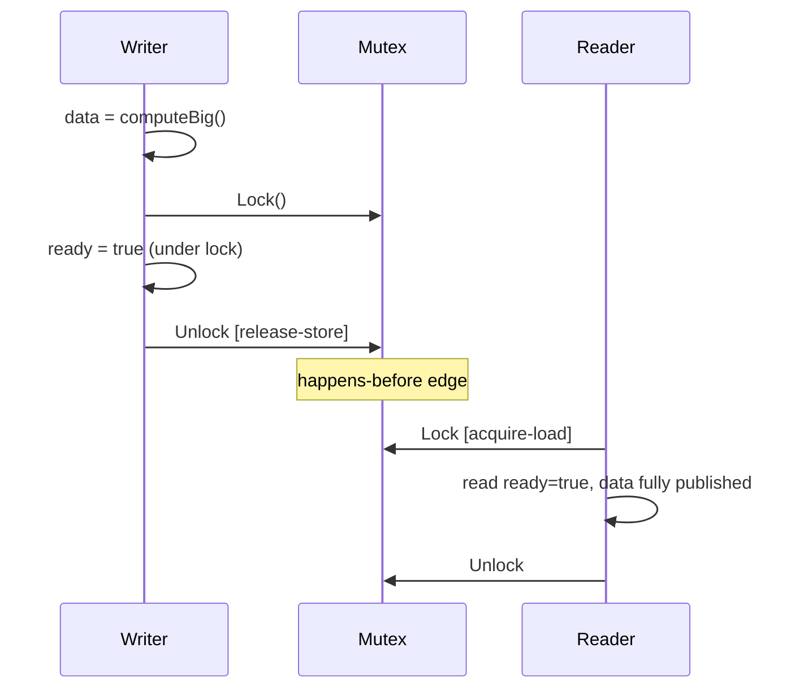

# `sync` — Senior

## 1. Mental model — `sync` is the contention surface of your service

At senior level, `sync` is not a grab bag of primitives — it is **the contention surface of the process**. Every `sync.Mutex` is a serial section that limits throughput to `1 / critical_section_duration`. Every `sync.RWMutex` is a bet that readers dominate writers enough to pay for the heavier protocol. Every `sync.Pool` is a wager about allocation rate vs object size vs GC pressure. The question is never "which primitive do I reach for" but **where is my contention, how do I measure it, and which structural change removes it**.

Three facts shape every senior decision:

1. **A held mutex is a serial bottleneck.** Amdahl's law: if 5% of request time is under a global lock, throughput caps at 20× single-thread regardless of core count. The fix is structural (shard, atomic, copy-on-write), not tighter critical sections.
2. **`sync` operations are happens-before edges** (Go memory model, 2022 revision). `Unlock` is a release-store, `Lock` is an acquire-load. That is what gives visibility — not "I added a lock so it must be safe", but "the lock established a synchronization edge between writer and reader".
3. **The primitives lie about cost in microbenchmarks.** Uncontended `Mutex.Lock` is ~20 ns; contended is unbounded. `sync.Map.Load` beats `RWMutex` at 99% reads; loses at 70/30. Always measure production-shaped traffic.

Senior heuristic: **start with `sync.Mutex`. Measure. Shard or atomic-ize only with a profile in hand.** `RWMutex`, `sync.Map`, `sync.Pool` are *optimizations* — they have negative payoff on the wrong workload. The default of the default is channel ownership; the default of shared-state code is `Mutex`.

---

## 2. Lock contention as a scaling bottleneck — detection

A contended mutex is invisible until you go looking. Symptoms: CPU-bound goroutines that scale sublinearly past 2-4 cores, p99 that grows with load while p50 stays flat, `runtime.Gosched` showing up in flame graphs.

| Profile | Enable | Shows |
|---------|--------|---------------|
| Mutex profile | `runtime.SetMutexProfileFraction(N)` | Stacks blocking *others* — bottleneck owners |
| Block profile | `runtime.SetBlockProfileRate(N)` | Goroutines blocked on a channel or sync primitive |
| `pprof` CPU | always | Time *spent* under lock |
| Execution trace | `runtime/trace` | Per-goroutine timeline; lock waits as STW-shaped bars |

The mutex profile is the senior tool. It samples 1 in N contention events and attributes them to the stack that *released* the lock — the bottleneck owner, not the victim. Enable in production at low rate (`SetMutexProfileFraction(1000)` samples 0.1%, near-zero overhead):

```go
import _ "net/http/pprof"
runtime.SetMutexProfileFraction(1000)
runtime.SetBlockProfileRate(1_000_000) // sample 1µs+ blocks
```

A healthy service has a near-empty mutex profile; 50 ms cumulative wait per second at 1k QPS means ~5% of CPU is serialized. Execution traces show patterns profiles flatten — a 200 ms tail every 30 s correlates with a `sync.Pool.Put` of a 4 MB buffer triggering GC mark assist. The trace shows the stall; the profile does not.

---

## 3. When to shard a `Mutex` — per-P, per-key, striped

A single Mutex protecting a hot map at 50K QPS is a guaranteed bottleneck. The structural fix is sharding — split the protected resource into N independent partitions, each with its own lock. Three shapes, picked by access pattern:

**Per-key striped** — N buckets, key hashed to bucket. Standard for map-shaped caches.

```go
type StripedMap[V any] struct {
    shards [256]struct {
        mu sync.Mutex
        m  map[string]V
        _  [40]byte // padding to avoid false sharing on 64-byte cache lines
    }
}

func (s *StripedMap[V]) shard(key string) *struct{ mu sync.Mutex; m map[string]V; _ [40]byte } {
    h := fnv.New64a(); h.Write([]byte(key))
    return &s.shards[h.Sum64()%uint64(len(s.shards))]
}

func (s *StripedMap[V]) Get(key string) (V, bool) {
    sh := s.shard(key)
    sh.mu.Lock(); defer sh.mu.Unlock()
    v, ok := sh.m[key]
    return v, ok
}
```

Shard count = power of 2, padded to 64 bytes to avoid false sharing on adjacent cache lines. 256 shards on a 32-core box gives contention probability ~32/256 = 12.5% per access — adequate for most workloads. Push to 1024 if profiles still show queueing.

**Per-P sharding** — one shard per logical processor, no hashing. The goroutine reads `runtime_procPin()` (unexported; use `runtime.NumCPU()` + a thread-local index in libraries like `golang.org/x/sync/syncmap`) and writes to its own shard. Reads aggregate across all shards. Used by counters that are written far more than read (`expvar.Map`, `prometheus.Counter` internally).

```go
type Counter struct {
    shards []atomic.Int64 // len == GOMAXPROCS
}

func (c *Counter) Add(n int64) {
    c.shards[runtime_procPin()].Add(n)
    runtime_procUnpin()
}

func (c *Counter) Load() int64 {
    var sum int64
    for i := range c.shards { sum += c.shards[i].Load() }
    return sum
}
```

Writes are uncontended; reads pay O(P). This wins when write:read ratio is > 100:1.

**Per-identity locks** — one lock per user/resource ID, via a reference-counted `sync.Map[K, *sync.Mutex]`, evicted on zero refs. Cap the manager and fall back to a hash-stripe to bound memory.

Trade: sharding multiplies memory by N and complicates global ops (`Len`, `Range`). Range walks all shards under their own locks; point-in-time consistency is sacrificed. Document it.

---

## 4. `sync.RWMutex` — when it helps, when it hurts

Folk wisdom: "more reads than writes → RWMutex". Reality is constrained. `RWMutex` is **slower than `Mutex`** when reads are short and writers exist:

1. Read path takes an atomic increment + cache-line write (reader count), then the read.
2. Writers wait for reader count to drain — in-flight readers delay every writer.
3. Go's RWMutex gives writers priority once queued, **blocking new readers** while drain happens. Latency variance spikes.

| Read share | Hold time | Better choice |
|-----------|-----------|---------------|
| > 99% | Any | `atomic.Pointer[T]` + copy-on-write |
| 95-99% | > 1 µs | `sync.RWMutex` |
| 95-99% | < 1 µs | `sync.Mutex` (RWMutex overhead eats the saving) |
| 70-95% | Any | `sync.Mutex` |
| < 70% | Any | `sync.Mutex` (RWMutex strictly worse) |

Microbenchmark (4 readers, 1 writer, M-class):

```
BenchmarkRWMutex_50ns_critsec-10    120M    9.8 ns/op
BenchmarkMutex_50ns_critsec-10      180M    6.6 ns/op
BenchmarkRWMutex_5us_critsec-10       1M  1130 ns/op
BenchmarkMutex_5us_critsec-10        300K  4180 ns/op
```

Crossover ~1 µs hold time. Short critsec: `Mutex` wins 30%. Long: `RWMutex` wins 4×.

**Failure mode in production** is `RLock` recursion. RWMutex does *not* support recursive RLock by the same goroutine — if a writer is queued, the second RLock deadlocks. Code review red flag: any `RLock` followed by a method call on the same receiver. Separate the locked-read from the work.

When reads truly dominate, the substitute is copy-on-write with `atomic.Pointer[T]` (section 11).

---

## 5. `sync.Pool` — when it saves, when it is noise

The contract: **a free list with per-P caches that the GC may empty at any time**. Saves allocations when:

1. Object is **expensive to construct** (≥ 1 KB, or constructor does syscalls / parsing).
2. Allocation rate is **high** (> 10K/s) — the GC notices.
3. Lifetime is **synchronous** — get on entry, put on exit, no retention.
4. **Reset before use**, not on Put. Resetting on Put races with the GC drain.

Noise when:
- Small objects (< 64 B). Pool overhead exceeds the allocation.
- Low rates (< 1K/s). GC handles it; the pool just adds locality misses.
- Long-lived or stateful objects. The pool is for ephemeral reuse; forgetting to reset leaks user A's data into user B's request — a common cause of cross-tenant info disclosure.

```go
var bufPool = sync.Pool{New: func() any { return new(bytes.Buffer) }}

func handle(req *Request) {
    buf := bufPool.Get().(*bytes.Buffer)
    buf.Reset()                    // ALWAYS reset; previous user is unknown
    defer bufPool.Put(buf)
    // ... use buf ...
}
```

**The retention failure** — `sync.Pool` keeping giant objects:

```go
func handleBigRequest(r io.Reader) {
    buf := bufPool.Get().(*bytes.Buffer)
    defer bufPool.Put(buf)
    io.Copy(buf, r) // some requests are 100 MB
}
```

One 100 MB request grows the buffer; on `Put` it returns to the pool. Steady state on 8 cores: ~800 MB resident from "occasional" large requests. Fix — cap size on Put:

```go
const maxPooled = 64 << 10
defer func() { if buf.Cap() <= maxPooled { bufPool.Put(buf) } }()
```

`fmt`, `encoding/json`, `net/http` all use bounded pools. This is correctness, not optimization.

---

## 6. `sync.Map` — narrow use case

Engineered for **read-heavy maps with stable keys**. Internals: a fast-path `read` map (immutable, `atomic.Value`) plus a slow-path `dirty` map (locked). Reads of stable keys hit the atomic and never touch the lock; writes periodically promote the dirty map.

Use it for converging key sets read by >100× more often than written — memoization caches, type-info registries.

Avoid when:
- Writes are frequent. Promotion is expensive; `map + RWMutex` beats it.
- Iteration matters. `Range` is unordered and may miss concurrent inserts.
- You need `Len` — there is no O(1) length.
- Value type is known. Every `Load` is a type assertion; a striped generic `map[K]V` is faster and type-safe.

```
BenchmarkSyncMap_99R_1W-10        50M    24 ns/op
BenchmarkRWMutexMap_99R_1W-10     40M    31 ns/op
BenchmarkStripedMap_99R_1W-10     70M    16 ns/op
BenchmarkSyncMap_70R_30W-10        8M   180 ns/op
BenchmarkRWMutexMap_70R_30W-10    15M    78 ns/op
BenchmarkStripedMap_70R_30W-10    25M    40 ns/op
```

Break-even around 90-95% reads. For 99% of candidates, `map[K]V + RWMutex` or a striped map is clearer and faster. Reach for `sync.Map` only when a profile proves it.

---

## 7. `sync.Once` — lazy init at package scope

`Once.Do(f)` executes `f` exactly once across all goroutines, with the happens-before guarantee that anything `f` writes is visible to all callers after `Do` returns. Right for:

- Lazy init depending on runtime state (env at first use, not import).
- Expensive resources that may never be needed.
- Replacing `init()` when order or error handling matters.

| Aspect | `init()` | `sync.Once` |
|--------|----------|-------------|
| When | Package import | First call |
| Error handling | `panic` | Return error |
| Test isolation | Hard | Easy (fresh Once) |
| Side effects on import | Yes | No |

Use `init()` for static, side-effect-free registration (drivers, regexp compile). Use `Once` for anything touching the world (env, network, files) or that might fail.

**Go 1.21+** ships `sync.OnceFunc`, `OnceValue`, `OnceValues`:

```go
var DB = sync.OnceValues(func() (*sql.DB, error) {
    db, err := sql.Open("postgres", os.Getenv("DATABASE_URL"))
    if err == nil { err = db.Ping() }
    return db, err
})
```

Pitfall: `Once.Do` does not retry on error — if `f` errors and you cache it, every caller forever sees that error. For retryable init, do not use `Once` — use a guard with a generation counter, or re-init under a `Mutex` with backoff.

---

## 8. `sync.WaitGroup` — patterns and deadlocks

Counts in-flight work. Contract:

- **`Add` before `go`.** `Add` inside the goroutine races `Wait` and can deadlock or panic with "negative WaitGroup counter".
- `defer wg.Done()` as the first statement in the worker.
- Calling `Add(n>0)` after a `Wait` has started is a data race.

```go
var wg sync.WaitGroup
for _, w := range work {
    wg.Add(1)
    go func(w Work) {
        defer wg.Done()
        process(w)
    }(w)
}
wg.Wait()
```

**The classic bug** is `Add` inside the goroutine:

```go
go func(w Work) {
    wg.Add(1)         // RACE — may run after the main goroutine's Wait
    defer wg.Done()
    process(w)
}(w)
```

`-race` catches it; in production it surfaces as "Wait returned but workers are still running".

**`errgroup` is the senior default** for fan-out that can fail:

```go
g, ctx := errgroup.WithContext(ctx)
g.SetLimit(8)                          // bounded concurrency
for _, w := range work {
    w := w
    g.Go(func() error { return process(ctx, w) }) // ctx cancels on first error
}
if err := g.Wait(); err != nil { return err }
```

`errgroup` gives error propagation, context cancellation on first error, and (Go 1.18+) a bounded semaphore via `SetLimit`. Raw `WaitGroup` is only for "no errors possible" (cleanup flush) or "errors collected to a channel". For repeated batches, use a fresh `WaitGroup` per batch — mixing `Add` across a `Wait` boundary is undefined.

---

## 9. `sync/atomic` — when better than `Mutex`

Atomics win when the protected state is a **single word** and the operation is one of {load, store, swap, add, CAS}. They lose when two or more words must move together.

| State | Use |
|-------|-----|
| Counter | `atomic.Int64.Add` |
| Flag | `atomic.Bool` |
| Config pointer | `atomic.Pointer[T]` |
| Coordinated 2-word state | `Mutex` |
| RMW of struct | `Mutex` or CAS-loop on `Pointer` |

**Typed atomics (Go 1.19+)** — `atomic.Int32/64`, `Uint32/64`, `Bool`, `Pointer[T]`, `Value`. Prefer these over the loose `atomic.AddInt64(&x, 1)` style — typed APIs prevent passing a non-aligned address (which panics on 32-bit ARM).

**`atomic.Pointer[T]` for hot-reload config:**

```go
var cfg atomic.Pointer[Config]
func init()     { cfg.Store(loadConfig()) }
func Reload()   { cfg.Store(loadConfig()) }  // single writer
func Current() *Config { return cfg.Load() } // many readers, lock-free
```

Readers pay one atomic load (~1 ns). Correct because `Config` is **immutable after publication** — a reader holding a pointer can read freely without synchronization.

**CAS loops** for optimistic single-pointer update:

```go
for {
    old := state.Load()
    next := derive(old)
    if state.CompareAndSwap(old, next) { break }
}
```

Correct only when `derive` is idempotent. Retry count is unbounded under high contention; let the scheduler handle it.

---

## 10. Memory model — happens-before via `sync`

Go's memory model (2022 revision) is precise about which operations synchronize:

- `Mutex.Unlock` happens-before the next `Lock` returns.
- `RWMutex.Unlock` happens-before the next `RLock` or `Lock`. `RUnlock` happens-before the next `Lock` (not next `RLock`).
- `WaitGroup.Done` happens-before the matching `Wait`.
- `Once.Do(f)`'s call of `f` happens-before any other `Do` returns.
- Channel send happens-before the matching receive.
- Atomic store happens-before any atomic load that observes it (atomics are sequentially consistent post-2022).

Senior consequence: **adding a `Mutex` is not just mutual exclusion — it is the synchronization edge that gives readers a coherent view of writer memory.** Without it, even single-word writes can be torn or stale on weakly-ordered architectures (ARM64).

This is broken on ARM64:

```go
var ready bool
var data Big
go func() {
    data = computeBig()
    ready = true              // store may be reordered before data assignment
}()
for !ready { /* spin */ }     // may see ready=true while data is still zero
use(data)
```

Fix: `atomic.Bool` for `ready` (release-store) and an acquire-load on the reader, or `sync.Once`, or channel close. Mutual exclusion is incidental; what matters is the happens-before edge.



---

## 11. Production patterns

```mermaid
flowchart LR
  A[Hot config reload] -->|atomic.Pointer[T]| B[Lock-free readers]
  C[Per-startup init] -->|sync.Once| D[First-call lazy]
  E[Connection pool] -->|buffered channel| F[Bounded concurrency]
  G[Reusable buffers] -->|sync.Pool| H[GC pressure relief]
  I[Read-mostly map] -->|striped RWMutex| J[Sharded access]
  K[Counter] -->|atomic or per-P| L[Lock-free increment]
```

**Connection pools — Pool vs channel.** Database / HTTP / Redis pools use **buffered channels**, not `sync.Pool`. Two reasons:

1. The pool must be **bounded** — a channel of capacity N enforces it. `sync.Pool` is unbounded; the GC trims, but not in time to prevent connection storms.
2. Objects are **expensive and stateful** — a connection has health, transaction state, a deadline. `sync.Pool` may discard objects unpredictably; you do not want that for a connection.

```go
func (p *ConnPool) Get(ctx context.Context) (*Conn, error) {
    select {
    case c := <-p.conns: return c, nil
    case <-ctx.Done():    return nil, ctx.Err()
    default:               return p.new() // grow up to max
    }
}
func (p *ConnPool) Put(c *Conn) {
    if c.broken { c.Close(); return }
    select { case p.conns <- c: default: c.Close() }
}
```

This is `database/sql`'s shape. **`sync.Pool` is for transient ephemeral buffers; channels are for finite stateful resources** (connections, file handles, semaphores).

**Hot config reload** — `atomic.Pointer[Config]`, single reload-goroutine writer, every handler reads the current pointer at entry. The Config is immutable; readers do not coordinate.

---

## 12. Read-mostly broadcasts — `sync.Cond` vs channel close

`sync.Cond` is the least-used primitive in the package — channels do its job better in most cases. Legitimate use: **a waiter queue woken on a repeated condition change**, with the predicate re-checked in a `for` loop (spurious wakeups are possible).

```go
mu := sync.Mutex{}
cond := sync.NewCond(&mu)
// Waiter
mu.Lock(); for !ready { cond.Wait() }; mu.Unlock()
// Signaler
mu.Lock(); ready = true; cond.Broadcast(); mu.Unlock()
```

Channel close handles **one-shot irreversible** signals:

```go
ready := make(chan struct{})
<-ready             // waiters
close(ready)        // signaler — wakes all, cannot re-arm
```

| Aspect | `sync.Cond` | `close(chan)` |
|--------|-------------|---------------|
| Re-arm | Yes | No (one-shot) |
| Predicate check | Required | None |
| Spurious wakeups | Yes | No |
| Composable with `select` | No | Yes (ctx cancellation) |

Use `Cond` for repeated state transitions in hand-rolled queues. Channel close for everything else — startup-ready, shutdown, one-shot broadcasts. Avoid `Cond.Signal` (wake one) unless ordering is proven; `Broadcast` is safer.

---

## 13. Postmortems — real-shaped failures

**RWMutex worse than Mutex.** Service caching ~10K user permissions. Read path: `RLock`, lookup, `RUnlock` — ~100 ns. Read:write 200:1. After RWMutex deploy, p99 *rose* 40%. Mutex profile showed contention on `RWMutex.readerCount` cache-line bouncing. Reverted to `Mutex`; latency dropped. Lesson: **short critsec is not RWMutex territory regardless of read ratio**.

**`sync.Pool` retaining giants.** PDF generation, `bytes.Buffer` pool. Most PDFs ~50 KB, 99.9p was 80 MB. Steady state: 3 GB RSS that never came back — GC drained the pool every 2 cycles, workload regrew between drains. Fix: cap `Put` to buffers under 1 MB. RSS dropped 4 GB → 600 MB.

**WaitGroup race.** Batch job calling `wg.Add(1)` *inside* each spawned goroutine. `-race` flagged it; production saw intermittent "all goroutines are asleep — deadlock!" panics. Fix: `Add` before `go`, `defer Done` first line in worker. Six lines moved, panics gone.

**`sync.Map` slower than `RWMutex`.** Session tracker, 1M sessions, 5K/s churn — 50/50 read/write. After migration to `sync.Map`, p50 doubled and CPU rose 35%. Reverted to a 256-shard striped map; CPU dropped 40% below original. Lesson: **`sync.Map` is for read-dominated stable-key workloads, not "concurrent access"**.

**`Once` caching an error.** Lazy gRPC client init via `Once`. Downstream rolling-deployed at the moment of first call; dial failed; `Once.Do` cached the error. Every request for hours saw the same error until restart. Fix: do not use `Once` for retryable init; guard with a generation counter and backoff.

**Atomic increment under panic.** `atomic.AddInt64(&inFlight, 1)` at entry, decrement at exit. A panic between them skipped the decrement; the counter drifted; dashboards showed 1000 in-flight on an idle service. Fix: `defer atomic.AddInt64(&inFlight, -1)` right after the increment. **Paired atomic ops need defer just like locks.**

---

## 14. Code review checklist

1. **Every `Lock` has a paired `Unlock`** — preferably via `defer`. Manual unlock only when the critical section ends mid-function and locality argues for it (rare).
2. **`Add` is before `go`**, not inside the spawned goroutine. Always.
3. **`Done` is `defer`d as the first statement** inside the worker.
4. **`RWMutex` is justified** by a measurement: read share > 90%, critical section > 1 µs, or both. Otherwise `Mutex`.
5. **`sync.Map` is justified** by a profile showing it beats `map + RWMutex`. Otherwise the plain map.
6. **`sync.Pool` resets state on Get**, caps size on Put, holds no stateful refs.
7. **`sync.Once` is for non-retryable init**. Retryable init uses a guard + backoff, not `Once`.
8. **Atomic counters use the typed APIs** (`atomic.Int64`, not `atomic.AddInt64(&x, 1)` on a `int64`).
9. **`atomic.Pointer[T]` payloads are immutable** after publication. No mutation of `*p` after Store.
10. **Critical sections call no user code** (no callbacks, no channel ops, no I/O). Lock for the read, unlock, then act.
11. **No `Lock` inside `Lock`** of unrelated mutexes without a documented total ordering. Lock acquisition order is global.
12. **`sync.Cond` waiters always re-check the predicate** in a `for`, never `if`.
13. **`select` over `<-ctx.Done()`** wherever a blocking sync operation could outlive the request.
14. **Shared state crossing goroutine boundaries is protected** — atomic, lock, channel, or immutable-by-construction. There is no fourth option.
15. **Test with `-race`** on CI. Every PR.
16. **Mutex / block profiles enabled** in production at low rate (`SetMutexProfileFraction(1000)`).
17. **`errgroup` instead of `WaitGroup`** when workers return errors.
18. **`SetLimit` on `errgroup`** to bound concurrency. Unlimited fan-out is a bug.
19. **No lock held across a network call** or syscall. Period.
20. **No `time.Sleep` in a critical section** — surface a `sync.Cond` or channel instead.

---

## 15. Closing principles

**Start with `Mutex`. Move to atomics or sharding with a profile.** Defaults work for 90% of code; optimizations have negative payoff on the wrong workload.

**Sharding is the structural answer to contention.** Per-key for caches, per-P for counters, copy-on-write for read-mostly configs. Tighter critsec delays the bottleneck; sharding removes it.

**`sync.Pool` is niche, not habit.** Hot, large, stateless, ephemeral, high allocation rate. Cap retention. Reset on Get.

**`sync.Map` is for read-dominated stable-key sets.** Anything else, plain map + lock wins.

**`sync` operations are happens-before edges**, not just mutex. Reasoning about correctness in terms of synchronization is senior; reasoning in terms of "I added a lock" is not.

**Connection pools are channels; buffer pools are `sync.Pool`.** Bounded stateful expensive → channel. Unbounded transient ephemeral → Pool.

**`atomic.Pointer[T]` + immutability is the cheapest read-mostly broadcast.** No lock, no waiter, one atomic load per reader.

**`Once` is one-shot; `Cond` is repeated.** `close(chan)` replaces both in idiomatic Go.

**Measure with mutex and block profiles in production.** Cheap at sampling rates; tells truths microbenchmarks lie about.

**`-race` everywhere, always.** Cost is 2-10× runtime; cost of a production race is unbounded.

Done well, `sync` is invisible — service scales, latency flat, profile empty. Done badly, it is the bottleneck the whole org spends a quarter unwinding.

---

## Further reading

- The Go Memory Model (2022 revision) — https://go.dev/ref/mem
- `sync` package source — `src/sync/mutex.go`, `rwmutex.go`, `pool.go`, `map.go`
- Dmitry Vyukov's "Go scheduler" and runtime-internal notes on mutex internals
- `golang.org/x/sync/errgroup`, `semaphore`, `singleflight` — production extensions
- `runtime/pprof` — Mutex and Block profile docs
- "Scalable Go Scheduler Design Doc" — Vyukov, on per-P state
- Bryan Mills, "Rethinking Classical Concurrency Patterns" — GopherCon 2018
- `database/sql` connection pool — production reference for stateful pooling
- `sync.Once*` (Go 1.21+), `atomic.Pointer[T]` (Go 1.19+) — API evolution rationale
- Cockroach Labs, Tailscale, Uber engineering blogs — contention postmortems
