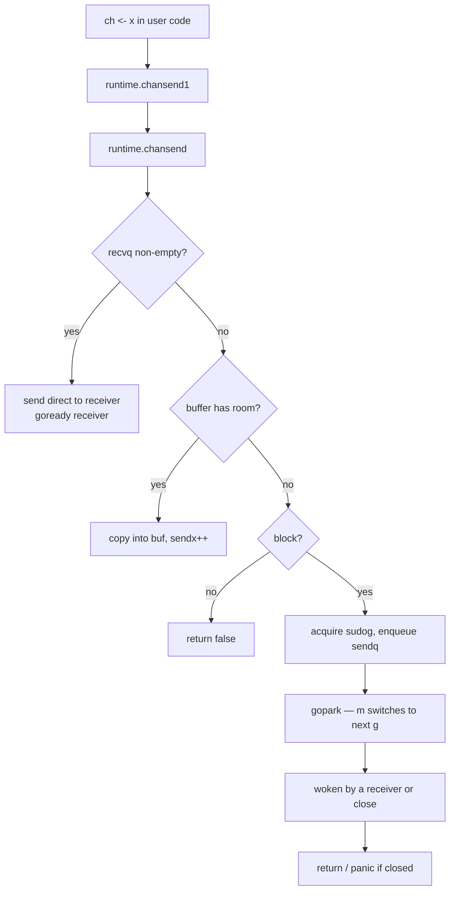

# Reading the `runtime` Package — Middle

## 1. From "what to open" to "how to read it"

The junior file argued that `runtime` is the hardest stdlib package and named three files worth opening: `runtime2.go`, `chan.go`, `panic.go`. This middle file does the actual reading. Each section walks one file end to end, the way you would on a Saturday afternoon with a coffee and `$GOROOT/src/runtime` open in a real editor.

The goal is not to memorize what `chansend` does. The goal is to internalize a reading rhythm — *find the struct, find the entry function, follow the state, name the dialect tricks as they appear* — so that next time you open `mgc.go` or `proc.go` you have a system instead of just willpower.

We assume you've read topic **`14-runtime-and-internals/01-runtime-source-dive`** for the system-level picture. Here we stay at the file level.

---

## 2. `runtime2.go` — read it like a glossary, not a program

`runtime2.go` declares the types. No functions, no logic — it is the dictionary every other runtime file spells against. If you try to read `proc.go` without knowing what `g`, `m`, `p` and `gobuf` are, every line throws a new acronym. Spend an hour here once and the rest of the runtime stops looking like Morse code.

The runtime uses lowercase, terse, often single-letter type names because these structs are *internal*. Nobody outside `runtime` is allowed to construct them — Go's exporter rules are exploited as access control.

| Type | Stands for | What it is |
|------|-----------|------------|
| `g` | goroutine | One goroutine's bookkeeping: stack, scheduler state, current `m` |
| `m` | machine | One OS thread; owns a `g0` (system stack), an optional `p`, and a current `g` |
| `p` | processor | A logical CPU; holds the local run queue, mcache, deferpool |
| `sched` | scheduler | The single global `schedt` struct: global run queue, idle lists, GOMAXPROCS |
| `gobuf` | goroutine buffer | Saved registers (`sp`, `pc`, `g`, `ret`) for context switch |
| `hchan` | "h" channel | Channel struct: ring buffer, send queue, recv queue, lock |
| `sudog` | pseudo-`g` | A goroutine *waiting* on something — channel, sync primitive |
| `_defer` | defer record | One deferred call; linked list per `g` |
| `_panic` | panic record | One in-flight panic; linked list per `g` |
| `mcache` | per-m cache | Lock-free allocator caches owned by a `p` |
| `mspan` | memory span | A run of contiguous pages of one size class |

State constants use the underscore prefix because they were converted from C `#define`s during the C-to-Go translation in 2014:

```go
const (
    _Gidle      = iota // 0
    _Grunnable         // 1 on a run queue
    _Grunning          // 2 has m, has p
    _Gsyscall          // 3 in a syscall
    _Gwaiting          // 4 parked
    _Gdead             // 6
    // ...
)
```

When you see `gp.atomicstatus.Store(_Grunning)` in `proc.go`, this is where those constants live — all at the top of `runtime2.go`.

Fields you'd expect to be plain `uint32` are often `atomic.Uint32`. That's a signal: this field is read or written from multiple `m`s concurrently, without a lock:

```go
type g struct {
    atomicstatus atomic.Uint32 // read by stack scanner, written by scheduler
    preempt      bool
    // ...
}
```

A field declared `atomic.Uint32` means "you must use `.Load()` / `.Store()` / `.CompareAndSwap()` to touch this." A plain `uint32` next to it (like `preempt`) is single-writer or protected by some other invariant. This distinction is *the* concurrency contract of the runtime, and `runtime2.go` is where it's spelled out.

Don't read top-to-bottom. Scan the type headings on a first pass, then come back random-access when another file references a field. The file is ~1400 lines — you will never read it sequentially, but you will revisit it for the rest of your life.

---

## 3. `chan.go` — the best teaching file in the runtime

`chan.go` is small (~850 lines), self-contained, and connected to code you write daily. Every `ch <- x` and `<-ch` lands in this file. Reading it end-to-end is the cheapest way to internalize how blocking, parking, and waking actually work.

**Step 1 — read `hchan` in `runtime2.go` first:**

```go
type hchan struct {
    qcount   uint           // items currently in the buffer
    dataqsiz uint           // size of the circular buffer
    buf      unsafe.Pointer // points to dataqsiz-sized array
    elemsize uint16
    closed   uint32
    elemtype *_type
    sendx    uint           // send index into buf
    recvx    uint           // recv index into buf
    recvq    waitq          // list of recv waiters
    sendq    waitq          // list of send waiters
    lock     mutex
}
```

Two queues (`sendq`, `recvq`), one ring buffer (`buf` + `sendx` + `recvx`), one mutex, one `closed` flag. That's the entire channel. Every behaviour comes from how `chansend`, `chanrecv`, `closechan` manipulate this state.

**Step 2 — `chansend` end to end.** Open `chan.go` and find:

```go
func chansend(c *hchan, ep unsafe.Pointer, block bool, callerpc uintptr) bool
```

`ep` is `unsafe.Pointer` because `chansend` doesn't know the element type; it copies `c.elemsize` bytes from `*ep` into the buffer. `block` distinguishes blocking send (`ch <- x`) from non-blocking (`select` with `default`).

The function has **three fast paths and one slow path**. Identify each:

| Branch | Trigger | Action |
|--------|---------|--------|
| Receiver waiting | `c.recvq.dequeue() != nil` | Hand element directly to the receiver, wake it |
| Buffer has room | `c.qcount < c.dataqsiz` | Copy element into `buf[sendx]`, advance `sendx` |
| Buffer full, blocking | none of the above, `block == true` | Enqueue a `sudog`, `gopark` the sender |
| Buffer full, non-blocking | `block == false` | Return `false` |

The first branch is the unbuffered/zero-copy fast path. The third is the slow path where the scheduler gets involved. Once you see this skeleton, the rest of `chansend` is corner cases: nil channel (parks forever), closed channel (panic), race-detector hooks, and the `unlockf` callback run after parking. Read the skeleton first, treat the corners as footnotes.

**Step 3 — `chanrecv` as a near-mirror.** Same shape as `chansend` but four branches because channel-closed is meaningful on receive:

```
1. sender waiting     → take its element (or buffer-head if buffered) and wake it
2. buffer non-empty   → take buf[recvx], advance recvx
3. closed             → return zero value, ok=false
4. block & park       → enqueue sudog on recvq, gopark
```

Read it after `chansend`. You'll mostly recognize the shape and just have to track the closed-channel branch.

**Step 4 — `closechan`.** Three things in order: set `c.closed = 1` under the lock; walk `c.recvq` waking every receiver with `ok=false`; walk `c.sendq` waking every parked sender to panic. Short and visual — and after reading it you understand exactly why "send on closed channel" panics and "receive on closed channel" returns the zero value.

The chansend call flow:



The whole "blocking on a full channel" story sits in the right column: enqueue a `sudog`, `gopark`, get woken later. That's it.

Four primitives appear constantly in `chan.go`:

| Primitive | What it does | When `chan.go` calls it |
|-----------|--------------|-------------------------|
| `gopark` | Suspend current `g`, run the scheduler | In `chansend` / `chanrecv` slow path when blocking |
| `goready` | Mark a parked `g` as runnable | When a sender wakes a receiver, or `closechan` wakes everyone |
| `acquireSudog` / `releaseSudog` | Pool of `sudog` records | Whenever a goroutine needs to wait on a channel |
| `mcall` | Switch off the goroutine stack onto `g0` | Around `gopark`, because parking can't be done from the goroutine's own stack |

When you can spot these four in any runtime file, you can guess the shape of any blocking primitive — `sync.Mutex.Lock`, `time.Sleep`, `sema.acquire` all use the same playbook.

---

## 4. `panic.go` — defer, panic, recover as data structures

`panic.go` is the file that demystifies `defer`. Most Go programmers carry a vague "defer is a stack" intuition. `panic.go` shows exactly what's on that stack, why `recover()` is restricted to deferred functions, and why `defer` in a tight loop used to be expensive (and isn't anymore, thanks to open-coded defers).

**Step 1 — `_defer` and `_panic` in `runtime2.go`:**

```go
type _defer struct {
    started   bool
    heap      bool
    openDefer bool
    sp        uintptr  // sp at time of defer
    pc        uintptr  // pc at time of defer
    fn        func()   // can be nil for open-coded defers
    link      *_defer  // next defer on the chain
    // ...
}

type _panic struct {
    argp      unsafe.Pointer // pointer to arguments of deferred call
    arg       any            // argument to panic
    link      *_panic        // next panic, in case of double panic
    recovered bool
    aborted   bool
    // ...
}
```

`_defer` is a linked-list node. `g._defer` is the head of the list. Every `defer f()` adds a node; the function epilogue walks the list. `_panic` is the same shape — when you call `panic(x)`, a `_panic` node is pushed onto `g._panic`.

**Step 2 — three flavours of defer.** Modern Go has three defer implementations, all visible in `panic.go`:

| Flavour | Trigger | Cost |
|---------|---------|------|
| **Heap-allocated defer** (`deferproc`) | Defer inside a loop or with too many in one frame | Allocation + linked-list insertion (~50ns) |
| **Stack-allocated defer** (`deferprocStack`) | Up to 8 defers in a regular frame | No allocation, still linked-list (~10ns) |
| **Open-coded defer** | Static count, no defers-in-loops | Just bit-flags + inlined cleanup (~1ns, near zero) |

The compiler picks per call site. `panic.go` handles all three: `deferproc` and `deferprocStack` push real `_defer` records; open-coded defers live as bitmasks in the function's stack frame on the happy path and only materialize when a panic walks the frame. Find the comment block in `panic.go` that distinguishes these — it's the key to understanding why your defer microbenchmark from 2018 no longer reflects reality.

**Step 3 — `gopanic`.** What the compiler emits for `panic(x)`:

```
1. push _panic onto g._panic
2. walk g._defer from head:
     a. mark defer "started"
     b. invoke the deferred function
     c. inside that call, if recover() is called and matches,
        the panic is marked recovered → unwind and return
3. if we exhaust the defer chain without recovery,
   call fatalpanic → print + crash
```

Two things become obvious: **`recover()` only makes sense inside a deferred function** — it looks at `g._panic`, and if you call it from `main` with no panic in flight, `g._panic == nil` and recover returns `nil`. **Double-panic is a real state** — if a deferred function panics during panic processing, a second `_panic` is pushed (see the `link` field on `_panic`).

**Step 4 — `gorecover`.** Tiny function, big consequences:

```go
func gorecover(argp uintptr) any {
    gp := getg()
    p := gp._panic
    if p != nil && !p.goexit && !p.recovered && argp == uintptr(p.argp) {
        p.recovered = true
        return p.arg
    }
    return nil
}
```

The crucial check is `argp == uintptr(p.argp)`. `argp` is the address of the deferred function's arguments. The runtime uses it to verify that `recover()` is being called *from the deferred function the panic is currently in*, not from a nested helper. This is why `func() { recover() }()` called inside a deferred function still works — but a `recover()` in a regular helper called from a deferred function does not. Read this function with a pen; it explains a Go quirk every programmer has bumped into.

**Step 5 — `Goexit`.** Also in `panic.go`. Runs all deferred functions on the current goroutine, then kills it. Reading the source clarifies the rule: `Goexit` from the main goroutine ends the program after running only the main goroutine's defers, and panics during `Goexit` are handled specially via the `goexit` field on `_panic`.

---

## 5. The pragma dialect

The runtime uses compiler pragmas as part of its dialect. Reading runtime source without knowing them is like reading C without knowing `volatile`. The five you'll see most:

| Pragma | Meaning | Why used |
|--------|---------|----------|
| `//go:nosplit` | Don't insert the stack-growth prologue. Function must use less stack than a small budget (~700 bytes). | Hot paths, signal handlers, anything called before the stack is set up |
| `//go:nowritebarrier` | Forbid pointer-to-heap writes that the GC would need to track. Compile error if the function writes a heap pointer. | Code that runs during GC marking, where write barriers would recurse |
| `//go:systemstack` | This function must execute on the system stack (`m.g0`), not a goroutine's stack. | Stack manipulation, deep operations that need a known stack |
| `//go:linkname localname remotepkg.RemoteName` | Make this Go name refer to a private symbol in another package. | Hack used by `time`, `sync`, `os` to call into `runtime` without exporting it |
| `//go:notinheap` | Pointers of this type cannot live on the GC heap. | Types like `sudog`, `mspan` that are managed by the runtime itself |

There are more — `//go:noescape`, `//go:noinline`, `//go:registerparams`, `//go:yeswritebarrierrec` — but the five above are the ones you need to recognize on day one. When you see `//go:nosplit` over a function, the message is: "this code is on a path where the runtime can't yet grow the stack — keep it small and don't call anything that allocates."

---

## 6. `getg()` and "where did `_g_` come from?"

The single most common confusion when reading runtime source is the appearance of `gp := getg()` or, in older code, `_g_ := getg()`. The variable seems to come from nowhere — but every runtime function gets it the same way.

`getg()` returns the current `*g`. The implementation is *not* in Go — the compiler intrinsics it to a single instruction that reads a fixed register (`R14` on amd64, `R28` on arm64). There's no parameter passing; the current goroutine pointer is always in that register because the runtime guarantees it.

So when you see:

```go
func chansend(c *hchan, ep unsafe.Pointer, block bool, callerpc uintptr) bool {
    if c == nil { /* ... */ }
    // ...
    gp := getg()
    mysg := acquireSudog()
    mysg.g = gp
    // ...
}
```

`gp` is just "the goroutine doing the send." Every runtime function in a normal context has access to it for free. This is the runtime's equivalent of `this` in OOP — implicit, always present, free to obtain.

A related confusion: `getg().m`, `getg().m.p.ptr()`. The chain `g → m → p` lets a function reach the current OS thread and processor. You'll see this pattern dozens of times. It's the runtime's "current context" idiom.

---

## 7. The four pillars of runtime control flow

If you can spot these four primitives in any runtime file, you can guess the shape of almost any code path:

| Primitive | What it does | Where defined |
|-----------|--------------|---------------|
| `mcall(fn)` | Switch off the current goroutine's stack onto the system stack (`m.g0`), call `fn` | `asm_*.s` (assembly trampoline) |
| `systemstack(fn)` | Run `fn` on the system stack, returning to the goroutine after | `asm_*.s` |
| `gopark(unlockf, ...)` | Block the current `g`; the scheduler picks the next one | `proc.go` |
| `goready(gp, ...)` | Mark `gp` as runnable so the scheduler will pick it up | `proc.go` |

The pattern most runtime code follows when a goroutine needs to wait:

```
1. set up the wait record (e.g., sudog) under a lock
2. release the lock
3. mcall(gopark) — switch to g0, park
... time passes ...
4. some other code calls goready on us
5. we resume in chanrecv/chansend right after the gopark call
```

Once this rhythm is in your ear, `sema.go`, `time.go`, `netpoll.go` all read the same way.

---

## 8. Common confusions, named

Things that stop you mid-file when reading runtime source:

| You see | What's actually happening |
|---------|---------------------------|
| `_g_ := getg()` with no parameter | Compiler intrinsic reads the goroutine register |
| `unsafe.Pointer` everywhere | The runtime is type-erased on its hot paths; the typesystem can't bootstrap itself |
| A function body that's empty or a single line | Either a compiler intrinsic or the real implementation is in `asm_*.s` |
| `//go:linkname` in another package | A non-runtime package is calling into `runtime` privately |
| `lock(&sched.lock)` | Acquiring the global scheduler lock — be wary of what's done while holding it |
| `noescape(unsafe.Pointer(x))` | Convincing the escape analyzer that `x` does not escape, even though syntactically it might |
| `KeepAlive(x)` at the end | Preventing the GC from collecting `x` before this line, because we passed an unsafe pointer into a syscall |
| A defer-free hot path | Defer needs heap allocation or open-coded support — neither is free; many runtime functions inline manually |

When you hit one of these and feel lost, name it from this table and move on. Coming back later with more context is the whole reading technique.

---

## 9. Verifying your reading with `runtime_test.go`

`$GOROOT/src/runtime/` ships with its own tests. Two files are particularly useful as a reader:

- `chan_test.go` — sends/receives under concurrency, close races, select corners. If you think you understand `chansend`, the tests in here are the spec you can run.
- `proc_test.go` — scheduler tests including parking and waking. Slow tests are gated by `-short`, but the fast ones run in under a second.
- `defer_test.go` — open-coded defer regressions; reading these tests teaches you which patterns the compiler does and doesn't open-code.

A productive loop:

```bash
cd $(go env GOROOT)/src/runtime
go test -run TestChan -v -count=1
```

Then change something small — add a print in `chan.go`, rebuild the toolchain (`./make.bash` from `src/`), rerun the test. Painful but illuminating. If that's too heavy, write your own equivalent test in a normal Go module that exercises the path you think you understand.

You don't have to do this often. Once or twice in your career to confirm "yes, the runtime really does X" is enough to anchor your reading.

---

## 10. A reading recipe that scales beyond `chan.go`

The pattern you used on `chan.go` generalizes to any runtime file:

1. Find the struct in `runtime2.go`. Read its fields and their atomic / lock annotations.
2. Find the entry function (the one the compiler emits a call to). Names usually match the source language: `chansend`, `deferproc`, `mallocgc`, `selectgo`.
3. Split the entry function into the fast path and the slow path. The fast path is the lockfree happy case; the slow path acquires locks, parks goroutines, or calls into the scheduler.
4. Trace the slow path through `gopark` / `goready` and note what wakes it up.
5. Read the corresponding test file in the same directory to confirm behaviour.

This recipe works for `chan.go`, `sema.go`, `time.go`, `select.go`, `panic.go`. It struggles on `proc.go` (too interconnected) and `mgc.go` (genuinely massive); for those, lean on topic 14-01 first.

---

## 11. Cross-link to 14-01 and 15-01/02

| Topic | What it gives you |
|-------|-------------------|
| `15-01 net/http source` | The general source-reading technique |
| `15-02 sync source` | The same technique on a synchronization-primitive package |
| `15-03 runtime source` (this) | The reading technique on the hardest stdlib package |
| `14-01 runtime source dive` | The *system view* — GMP, scheduler loop, allocator, GC, as a whole |

Read 15-01 and 15-02 first to internalize the technique. Read 14-01 to understand the runtime as a system. Use this file (15-03 middle) to learn how to actually *open* a runtime file without getting lost.

---

## 12. Summary

Middle-level runtime reading is about three concrete file walkthroughs and a small set of recurring patterns. `runtime2.go` is a glossary — random-access, read by need, never linear. `chan.go` is the best teaching file in the runtime: read `hchan` from `runtime2.go`, then `chansend`, then `chanrecv`, then `closechan`, and you've internalized the four pillars `gopark`, `goready`, `acquireSudog`, `mcall`. `panic.go` rewires defer from magic into a linked-list walk in the function epilogue, with three implementation flavours (heap, stack, open-coded) and a precise `argp` check that explains why `recover()` only works from a directly-deferred function. The pragma dialect (`//go:nosplit`, `//go:nowritebarrier`, `//go:systemstack`, `//go:linkname`, `//go:notinheap`) is part of the source — treat it as such. `getg()` is the implicit `this` of the runtime, fetched from a register, free at every call site. When you hit something confusing, name it from the table in section 8 and keep going. Verify with `chan_test.go`, `proc_test.go`, `defer_test.go` when you want to confirm a reading. Pair this file with topic 14-01 for the system view; use 15-01 and 15-02 to ground the reading technique itself.

---

## Further reading
- Topic **`14-runtime-and-internals/01-runtime-source-dive`** — the system-level dive
- Topic **`15-go-source-reading/01-net-http-source`** — reading technique on `net/http`
- Topic **`15-go-source-reading/02-sync-source`** — reading technique on `sync`
- Go source: `$GOROOT/src/runtime/runtime2.go`, `chan.go`, `panic.go`, `proc.go`
- Go source: `$GOROOT/src/runtime/chan_test.go`, `proc_test.go`, `defer_test.go`
- Kavya Joshi, "Understanding Channels" — GopherCon 2017
- Keith Randall, "Inside the Map Implementation" — GopherCon 2016 (same dialect, different file)
- `cmd/compile/internal/ssagen` — where the compiler emits the `runtime.chansend1` and `runtime.deferproc` calls
- `go/src/cmd/compile/internal/escape` — escape analysis, the reason for `noescape` and `KeepAlive`
- The Go runtime pragmas list: `go/src/cmd/compile/internal/ir/pragma.go`
