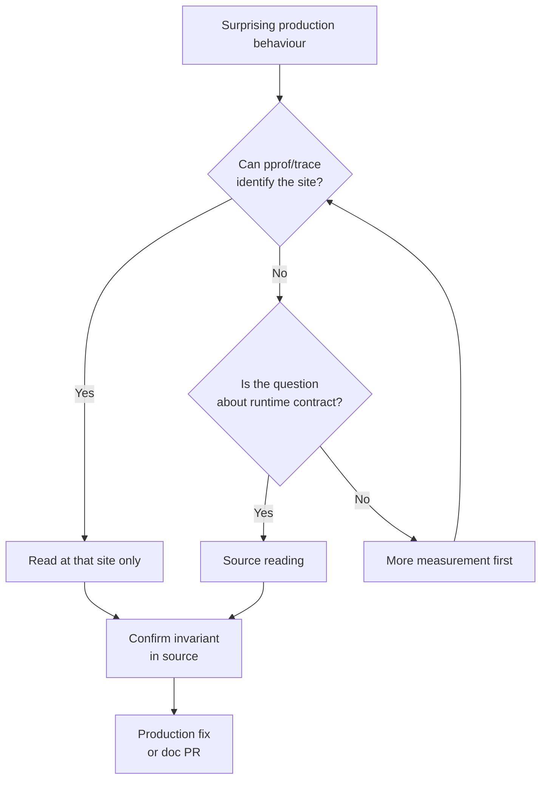

# Reading the `runtime` Package — Senior

## 1. Mental model — when runtime source becomes the answer

At senior level the question is no longer *how* to read `runtime/chan.go`; it is **when reading the runtime is the cheapest path to truth, and when it is procrastination**. The runtime is a library. Like any library, you read it when its observable behaviour stops matching your mental model and no amount of black-box experimentation closes the gap. The skill is recognizing that boundary fast.

Four bug-class signals that demand source reading:

| Signal | Why measurement is not enough | What the source clarifies |
|--------|------------------------------|---------------------------|
| Goroutine count climbs monotonically | `pprof` shows *where* they parked, not *why* they never wake | The wake path in `chansend` / `sema.go` shows the missing signaler |
| p99 latency spike correlated with GC | `gctrace` shows total STW time, not which assist starved you | `mgc.go::gcAssistAlloc` shows the mutator → assist debt loop |
| Surprising memory growth despite GOGC=100 | `runtime.MemStats` shows totals, not the policy that produced them | `mheap.go::scavenger` + `pacer.go` define the policy |
| `chan` panics or "fatal: all goroutines are asleep" | Stack trace points at user code; runtime decision is invisible | `runtime/proc.go::checkdead` defines the deadlock detector |

The complement matters just as much. **When not to read source**: any question shaped *"is my code slow because of X"*. `pprof`, `runtime/trace`, `GODEBUG=schedtrace=1000`, and `GOMEMLIMIT` experiments answer those in minutes. Source reading is for *"what does the runtime promise here"* questions, not *"what is happening in my process right now"* questions. Confusing the two burns days.

Senior heuristic: **measure first, read second**. If a measurement gives you a fact ("there are 200K goroutines blocked at line 414 of chan.go"), the source reading is targeted — you open `chan.go:414` and follow one path. If you start with source first you'll read a hundred pages of context you didn't need.



---

## 2. The runtime contract lens — invariants extracted from source

The Go specification is silent on a thousand operational details. The *runtime contract* — what `go f()` guarantees, what `ch <- x` guarantees, what `defer` guarantees — lives only in the source. Senior reading is contract extraction.

A contract is a sentence of the form **"under condition X, the runtime guarantees Y, and the cost is Z"**, anchored to a file:line. Examples that pay off in production:

| Behaviour | Source anchor | Contract |
|-----------|---------------|----------|
| Send on closed channel | `runtime/chan.go::chansend` (panic branch) | Always panics; never blocks; one-line check before the lock |
| Close of nil channel | `runtime/chan.go::closechan` | Panics; not the same panic value as send-on-closed |
| `select{}` empty | `runtime/select.go::block` | Parks forever; not equivalent to `<-make(chan struct{})` (different stack frame) |
| `time.Sleep(0)` | `runtime/time.go::timeSleep` | Calls `Gosched`, not a real timer; cheap |
| `runtime.Gosched()` | `runtime/proc.go::Gosched_m` | Yields P, requeues at *tail* of local runq, not head |
| `runtime.GC()` | `runtime/mgc.go::GC` | Blocks until current cycle ends *and* a new cycle completes |
| `runtime.LockOSThread` | `runtime/proc.go::lockOSThread` | Goroutine pinned until `UnlockOSThread`; if goroutine exits while locked, thread is destroyed |
| Defer in tight loop | `runtime/panic.go::deferproc` (open-coded vs heap) | Open-coded path is ~free; heap path is ~50ns per defer |

The discipline: **never quote a runtime behaviour from memory in a design doc or code review without a file:line citation**. The cost is one minute; the payoff is that everyone reading the doc can verify and the claim survives Go version upgrades.

---

## 3. Reading vs measuring — the decision in practice

A representative example. A service reports p99 latency of 800ms during deployment; baseline is 30ms.

| Step | Tool | What it tells you |
|------|------|-------------------|
| 1 | `GODEBUG=gctrace=1` | GC pauses are 4ms — not the cause |
| 2 | `GODEBUG=schedtrace=100` | Runnable goroutines spike to 5000 at deploy moment |
| 3 | `runtime/trace` | A single `gc.STW` event lines up with the spike |
| 4 | Read `runtime/proc.go::stopTheWorldWithSema` | STW waits for *every P* to reach a safepoint; one P running CGO can stall the rest |
| 5 | Check for `cgo` calls under load | Confirmed: `image/jpeg` decode in cgo land during request burst |
| 6 | Fix | Move decode to a worker pool with bounded concurrency |

Steps 1–3 are measurement and answer "where". Step 4 is source reading and answers "why a CGO call delays unrelated goroutines". Without step 4 the fix is guesswork — you might have rewritten the wrong subsystem. Without steps 1–3, step 4 is hopeless because you don't know which file to open.

**Wrong order is the senior failure mode**. Reading `runtime/mgc.go` from page one because "GC feels slow" wastes a day. Reading the 60 lines of `stopTheWorldWithSema` because a trace pointed there is fifteen minutes.

---

## 4. Tracing techniques — mapping trace events back to source

`runtime/trace` is the bridge between measurement and source. Every event the trace records corresponds to a function call inside `runtime/*.go`. Knowing the mapping makes a trace into a guided tour of the runtime.

| Trace event | Runtime call site | Senior use |
|-------------|-------------------|------------|
| `go.GoCreate` | `runtime/proc.go::newproc` | Count goroutine creation rate; find leaking goroutine factories |
| `go.GoStart` | `runtime/proc.go::execute` | Confirm a G actually got CPU after wake |
| `go.GoBlockSend` | `runtime/chan.go::chansend` (slow path) | Identify channels that are bottlenecks |
| `go.GoBlockRecv` | `runtime/chan.go::chanrecv` (slow path) | Empty channels with backed-up senders |
| `go.GoBlockSync` | `runtime/sema.go::semacquire` | `sync.Mutex` contention |
| `go.GoBlockNet` | `runtime/netpoll.go::netpollblock` | Network wait — usually fine, alarming if dominant |
| `go.GoSysCall` | `runtime/proc.go::entersyscall` | Cgo or blocking syscall; P released |
| `gc.Mark` | `runtime/mgc.go::gcDrain` | Mark phase work |
| `gc.MarkAssist` | `runtime/mgcmark.go::gcAssistAlloc` | Mutator paying mark debt — back-pressure signal |
| `gc.SweepEnd` | `runtime/mgcsweep.go::sweepone` | End of background sweep |
| `proc.Start` / `proc.Stop` | `runtime/proc.go::startm` / `stopm` | M creation; spikes indicate scheduler thrash |

Pattern in practice: open the trace in `go tool trace`, find the dominant block reason, jump to the matching file. If 60% of wall time is `go.GoBlockSend`, the bottleneck is producer-side and the source to read is the slow path of `chansend`. The "why parked" comment in the source tells you what condition wakes the G — usually a matching `chanrecv` or a `closechan`. That tells you whether your bug is "no reader" or "reader too slow", which are different fixes.

Two senior tactics built on the event-to-source mapping:

- **Differential reading.** Capture traces of two service versions (before/after a deploy). Diff the event mix — a 30% rise in `go.GoBlockSync` between v1 and v2 points at a new lock; you read the matching `sema.go` site once and confirm the regression.
- **Trace-driven hypothesis.** Before reading a runtime file, write down the event you expect to dominate. If the trace agrees, you have confirmation; if it disagrees, you save yourself from reading the wrong subsystem. The cost of being wrong about which file to read is hours; the cost of running a 5-second trace is seconds.

A further mapping worth memorizing — the synthetic `gc.STW` event is *not* one runtime function but a span bracket emitted by `runtime/proc.go::stopTheWorld` and `startTheWorld`. The span end timestamp minus start is the actual STW pause, which is often shorter than `gctrace=1` reports because the latter includes setup work outside the stop window.

---

## 5. Reading bug-fix commits as documentation

`git log src/runtime/` is the most underrated documentation in Go. Most subtle runtime behaviours have a commit explaining them better than any external article. Commit messages in `golang/go` are written for compiler engineers; they are dense, exact, and version-anchored.

Pattern:

```sh
cd $(go env GOROOT)/src
git log --oneline --follow runtime/chan.go | head -40
git show <hash>          # for any commit that looks relevant
git log --grep="chansend" -- runtime/chan.go
git log -S "raceacquire" -- runtime/chan.go   # commits that added/removed the symbol
```

Why this beats prose docs:

- **The diff is the truth.** Words explain intent; the diff shows the actual change. If the comment says "now uses a faster path" you can see whether the path is genuinely faster or just different.
- **Version-anchored.** Every behaviour described in a commit applies to a known release. Stack Overflow answers go stale silently; commits do not.
- **Cross-referenced.** Issue numbers, CL numbers, related commits — one bug expands into a small graph of context.
- **The reviewer thread is searchable.** `go-review.googlesource.com/c/go/+/<CL>` shows the discussion. Often the *rejected* alternatives explain the design better than the accepted change.

Concrete examples worth bookmarking:

- The `chan.go` "send to closed channel races" commit history — explains why `closechan` writes a flag before scanning waiters.
- The `mgc.go` pacer rewrite (Go 1.18, 1.19) — multiple commits explaining the move from heap-trigger to allocation-rate-based pacing.
- The `time.go` 4-heap → per-P timer refactor (Go 1.14) — explains why `time.Sleep` got cheaper.
- The `proc.go` async preemption (Go 1.14) — explains why tight loops without function calls no longer wedge the GC.

Reading these once gives a sense of which behaviours are stable, which are tuned every release, and which were considered and rejected.

---

## 6. Pinning your reading to a version

Runtime behaviour changes between minor releases. A claim valid in 1.20 may be wrong in 1.22. Every source-reading note must include a version.

Verification ritual:

```sh
go version                                    # toolchain in use
go env GOROOT                                 # source root
cd $(go env GOROOT)/src
git log --oneline runtime/proc.go | head -5   # confirms branch
git tag --contains HEAD | head -5             # which releases include this code
```

When taking notes:

```
// runtime/chan.go::chansend, Go 1.22.3, line 200 region
// On send to closed channel: panics with plainError("send on closed channel")
```

Without the version stamp, the note ages into a lie. With it, six months later you re-verify in seconds.

For library code that pins behaviour, encode the version too — `//go:build go1.22` build tags, `runtime.Version()` checks at startup, integration tests that fail loudly on unexpected version bumps. The runtime is stdlib; "we'll just upgrade Go" is the most common source of regressions in mature services.

Three habits make version-pinning stick:

- **Note a `go1.NN` tag in every comment that quotes the runtime.** `// per runtime/chan.go (go1.22.3): send on closed panics` — when the comment fails review six months later because 1.24 changed semantics, the version anchor makes the staleness visible.
- **Add a `TestRuntimeContract` integration test.** Empty-channel send, defer-in-loop allocation count, `time.Sleep(0)` cost — write a test that asserts each contract you depend on. The first failed run after a Go upgrade tells you exactly which assumption broke.
- **Track `runtime.Version()` in your structured logs.** Production telemetry that includes the toolchain version lets you correlate behaviour drift with toolchain changes without bisecting deployments.

---

## 7. Cross-version diffs — what fundamentally changed

Cross-version diffs make the implicit explicit. The same file across 1.20 → 1.22 → 1.24 tells the story of what the Go team considered worth changing.

```sh
cd $(go env GOROOT)/src
git log --oneline release-branch.go1.20..release-branch.go1.22 -- runtime/proc.go
git diff release-branch.go1.20 release-branch.go1.24 -- runtime/mgc.go | less
```

Patterns that recur:

| Change axis | Where you see it | Senior takeaway |
|-------------|-----------------|------------------|
| Scheduler fairness | `proc.go::findrunnable`, `runqsteal` | Steal heuristics shifted to reduce tail latency under load |
| GC pacer | `mgcpacer.go` (new in 1.18) | Heap-target → SetMemoryLimit-aware pacing |
| Timers | `time.go`, `runtime/timer.go` | Global 4-heap → per-P heaps (1.14) → integrated with netpoll (1.23) |
| Preemption | `preempt.go` (new in 1.14) | Cooperative → asynchronous (signal-based) |
| Stack scanning | `mgcmark.go::scanstack` | Conservative → precise; conservatively typed in pgo paths |
| Goroutine profile | `mprof.go::goroutineProfileWithLabels` | Snapshot semantics tightened for `pprof` correctness |
| Memory model | `internal/runtime/atomic` | Hardened around `atomic.Bool`/`Pointer`; old `unsafe.Pointer` casts removed |

What does not change: type layouts of `g`, `m`, `p` stay surprisingly stable; the public scheduler points (`newproc`, `schedule`, `gopark`, `goready`) keep their names. Internal helpers (`mcall`, `systemstack`) keep their semantics. This stability is *deliberate* — the compiler, debuggers, and PGO depend on it. Read the public points first; they will still be there in five years.

What does change a lot: anything in `mgc*.go`, anything labelled "pacer", anything that touches `netpoll` integration. Treat those as moving targets and re-read on every Go upgrade.

---

## 8. The "internals are not stable" rule

The runtime is stdlib; **the internals are not API**. `go/build` and the runtime team do not promise stability for any unexported symbol, any struct layout, or any pragma. Three escape hatches exist in practice:

1. **`//go:linkname` into runtime.** Letting an external package call an unexported runtime function. Used by `time`, `reflect`, `sync` themselves — and a handful of legitimate third-party libraries (e.g. earlier `gopsutil`, some tracing tooling).
2. **`unsafe.Pointer` into runtime structs.** Reading goroutine IDs, peeking at `g.stack`, reaching into `hchan` for queue length.
3. **Reflective access to runtime types** via `reflect` on `runtime` symbols re-exposed.

When is this justified?

| Case | Justified? | Alternative |
|------|-----------|-------------|
| Get current goroutine ID for thread-local-like logging | Almost never | Pass context.Context; `pprof.Do` + labels |
| Read goroutine count for autoscaling | No | `runtime.NumGoroutine()` is public |
| Implement a custom scheduler hint | No | `runtime.Gosched()` + `GOMAXPROCS` |
| Build a debugger or profiler | Yes, with a version pin and a CI matrix | None |
| Tracing library that must record `g` addresses | Yes, with extensive testing | None |

The 2024 `linkname` lockdown (Go 1.22+ blocks new `linkname` references to many runtime symbols not on an allowlist) made this concrete: the Go team will break your code on purpose if you reach into internals without justification. Senior judgment: **the cost of reaching in is a permanent CI dependency on the Go toolchain version**. Pay it only for tooling, never for application code.

When you do pay it, contain the blast radius:

- **Isolate the unsafe code in a single file** with a `runtime_linkname.go` filename and a top-of-file comment listing every symbol pulled in and the Go versions known to work.
- **Add a `runtime.Version()` allowlist check at init.** Refuse to start on an untested toolchain rather than silently mis-behaving.
- **Pair every linkname with a fallback.** If your tracer can degrade to public APIs on unknown versions, the upgrade story is "you lose detail" rather than "the binary crashes".
- **Run the toolchain matrix in CI.** Every supported Go minor version against the linkname code; the first failure is your warning.

The library's responsibility is to fail loudly on toolchain drift. Application code that depends on a library doing this should still log `runtime.Version()` at startup so operators can correlate.

---

## 9. Reading runtime tests and benchmarks

The most underused part of the runtime is its own test suite. `runtime/*_test.go` is written by the people who wrote the runtime, and it documents intent more precisely than any prose.

| Test file | What it teaches |
|-----------|-----------------|
| `runtime/proc_test.go` | Scheduler invariants under stress — `TestGoroutineParallelism`, `TestStealOrder` |
| `runtime/chan_test.go` | Channel correctness under contention; small fixed numbers used as oracles |
| `runtime/gc_test.go` | GC correctness; the `TestGCInfo` family confirms type information |
| `runtime/sema_test.go` | Semaphore wake fairness — `TestSemaphoreContention` is the canonical lock benchmark |
| `runtime/map_test.go` | Map iteration semantics, growth thresholds |
| `runtime/stack_test.go` | Stack growth, shrink thresholds, deep recursion |
| `runtime/defer_test.go` | Defer cost on open-coded vs heap paths |

Test reading is faster than source reading for one specific question: **"is X behaviour guaranteed or accidental?"** If a test asserts X with `t.Fatal` on failure, X is part of the contract. If no test exists, X may be implementation detail.

Benchmarks (`*_test.go::BenchmarkXxx`) are even better for performance questions:

```sh
cd $(go env GOROOT)/src/runtime
go test -bench=BenchmarkChanProdCons -benchmem -count=5
go test -bench=BenchmarkSelect -benchmem
go test -bench=BenchmarkDefer -benchmem
```

What you learn: the orders of magnitude the runtime considers "fast". A `BenchmarkChanProdCons10` of 60ns/op tells you that any wrapper layer adding 600ns/op is a 10x overhead — likely worth fixing. Without the runtime benchmark you would not know "60ns" is the floor.

Useful runtime benchmarks to bookmark and re-run on every Go release:

| Benchmark | Floor (approx) | What it bounds |
|-----------|----------------|----------------|
| `BenchmarkSelectUncontended` | ~25 ns/op | Per-`select` cost when the case is ready |
| `BenchmarkChanProdConsWork0` | ~70 ns/op | Unbuffered ping-pong; smallest plausible channel round-trip |
| `BenchmarkDefer` | ~2 ns/op (open-coded) | Defer cost when escape analysis succeeds |
| `BenchmarkDeferMany` | ~50 ns/op | Heap-allocated defer; the cost you pay in loops |
| `BenchmarkContended` (sync) | ~80 ns/op uncontended → microseconds contended | `Mutex` floor; anything higher is your queue depth |
| `BenchmarkGoroutineSelect` | ~600 ns/op | `go f()` + channel handshake; smallest goroutine workload that pays for itself |

If your service's request-handling cost is within 5x of these floors, you are at the runtime limit and further optimization means redesigning around the runtime (batching, pooling), not micro-tuning.

---

## 10. Production patterns rooted in runtime understanding

Three production patterns where reading the runtime changes the design.

### 10.1 Graceful shutdown via scheduler + netpoll knowledge

Graceful shutdown is "stop accepting work, drain in-flight, exit". Done naively, you `cancel(ctx)` and `os.Exit(0)` and lose in-flight requests. The senior version uses what `runtime/netpoll.go` and `runtime/proc.go` tell you:

- `net.Listener.Close()` unblocks `Accept` by closing the FD; `netpoll` wakes the goroutine with an error.
- Pending writes finish synchronously; pending reads return an error after `SetDeadline`.
- Goroutines blocked on `chan` do *not* wake on shutdown — you have to close the channel or signal explicitly.
- `runtime.NumGoroutine()` drops to baseline + 1 (the shutdown goroutine itself) when drain is complete.

Resulting pattern:

```go
func shutdown(ctx context.Context, srv *http.Server, workQueue chan Job) error {
    if err := srv.Shutdown(ctx); err != nil { return err }
    close(workQueue)             // wake consumers blocked in <-workQueue
    waitForGoroutines(baseline)  // poll runtime.NumGoroutine until baseline
    return nil
}
```

Without runtime knowledge you'd write the shutdown without `close(workQueue)` and consumers would block forever.

### 10.2 GOMEMLIMIT + GOGC dialog

Two knobs, one runtime. `GOGC` (default 100) sets heap growth target as ratio; `GOMEMLIMIT` (Go 1.19+) sets a soft byte ceiling. Reading `mgcpacer.go` tells you they interact: when the live heap approaches `GOMEMLIMIT`, the pacer ignores `GOGC` and triggers GC more aggressively, eventually paying with CPU instead of memory.

Senior dialog for production:

| Workload | Setting | Why (anchored in pacer.go) |
|----------|---------|---------------------------|
| Latency-sensitive, ample RAM | `GOGC=100`, no `GOMEMLIMIT` | Pacer keeps GC headroom; latency stable |
| Memory-constrained (container) | `GOMEMLIMIT=80% of cgroup`, `GOGC=off` recommended for spike workloads | Bound memory; pay CPU if needed |
| Throughput-batch | `GOGC=200` or higher | Fewer GC cycles; latency irrelevant |
| Spiky allocation | `GOMEMLIMIT` mandatory; `GOGC=100` | Pacer absorbs spike without OOM |

The interaction with cgroups: until Go 1.19 the runtime ignored container limits and OOM'd. Post-1.19, set `GOMEMLIMIT` slightly below the cgroup limit (90% is a safe rule) to give the runtime room to react before the kernel kills it. This is a single line of code; the design comes from reading `mgcpacer.go::gcControllerState.heapGoalInternal`.

### 10.3 Profile labels — context propagation into the profiler

`runtime/pprof.SetGoroutineLabels` and `pprof.Do` attach `(key,value)` labels to a goroutine; CPU profiles then group by label. Reading `runtime/mprof.go` shows the labels live on `g.labels`, copied to child goroutines on `newproc`. Implication: labels propagate across `go`-statements automatically.

Production use: tag every inbound request with `request_id`, `tenant`, `endpoint`. CPU profile then answers "which tenant burns CPU" with no extra instrumentation. Without runtime knowledge, teams rebuild this poorly with explicit context plumbing.

### 10.4 Worker pool sizing from scheduler reading

A common shape is "spawn N workers to process a queue". The default N is often `runtime.NumCPU()` or some round number. Reading `runtime/proc.go::findrunnable` and `runqsteal` reframes the choice: the scheduler steals work between Ps, so for CPU-bound workers, `GOMAXPROCS` workers is the right floor; more than that creates scheduling overhead without parallelism. For I/O-bound workers, since blocked goroutines hand back the P to the scheduler (`entersyscallblock`), a larger count is fine — the bound becomes file descriptor or downstream concurrency, not CPU.

Senior rule of thumb derived from runtime source:

- CPU-bound worker pool size = `GOMAXPROCS`, never more.
- I/O-bound worker pool size = bounded by downstream concurrency (DB pool, rate limit), not by `GOMAXPROCS`.
- Mixed workload: split into two pools with separate channels rather than one pool that does both — otherwise an I/O burst starves CPU work.

---

## 11. Code review checklist for runtime-adjacent code

Code that *uses* runtime primitives heavily — schedulers, worker pools, custom mutex wrappers, channel-heavy fan-out, profilers, debuggers — deserves runtime-aware review. Items, ordered by frequency of finding:

1. **Goroutine lifecycle is bounded.** Every `go f()` has a known terminator: context cancellation, channel close, explicit signal. No "background goroutine for the life of the process" without documentation.
2. **No naked `select{}` outside `main`.** It parks forever; in a library it is a leak.
3. **Channels closed by sender, not receiver.** Source: `runtime/chan.go` panics on send-to-closed.
4. **No double-close.** Same panic.
5. **No `runtime.Gosched()` in production code.** It is a hint to the scheduler that almost never helps; usually masks a real synchronization bug.
6. **`runtime.GOMAXPROCS` not set in library code.** Only main packages set it; libraries respect the environment.
7. **`runtime.LockOSThread` is paired with `UnlockOSThread` in `defer`.** Forgetting it destroys the OS thread when the goroutine exits.
8. **No `//go:linkname` into runtime.** Unless the package is a profiler or debugger with a version-pin CI matrix.
9. **`unsafe.Pointer` into runtime structs flagged.** Same justification bar.
10. **`runtime.SetFinalizer` understood as best-effort.** Source: `runtime/mfinal.go` — finalizers run on a separate goroutine, may not run at all on process exit.
11. **`sync.Pool` is not a cache.** Source: `runtime/mgc.go` clears pools at every GC cycle.
12. **`defer` not in tight loops without thought.** Open-coded path is free; the heap path is ~50ns and forces escape.
13. **`time.After` not used in `for { select { ... } }`** — it allocates a new timer every iteration that lives until firing. Use a reused `time.Timer`.
14. **Context cancellation actually unblocks the goroutine.** A goroutine in `<-ch` does not respond to `ctx.Done()` unless the select includes it.
15. **Profile labels propagated.** `pprof.Do(ctx, labels, func(ctx context.Context) { ... go ... })` so child goroutines inherit.

Each item maps to a runtime file. Reviewers who know the map review faster.

---

## 12. Postmortem — the 200ms p99 nobody could explain

A real shape, distilled. A payments service with otherwise textbook tuning showed p99 latency of 200ms for an endpoint that should have been 10ms. Cold startup p99 was fine; the spike appeared 15 minutes after deploy and never recovered.

**Day 1 — measurement only.**

- `pprof` CPU: nothing dominant, 60% application code spread evenly.
- `pprof` heap: stable, 1.2 GB resident, well under `GOMEMLIMIT` of 4 GB.
- `gctrace=1`: GC pauses 2ms — not the cause.
- `schedtrace=1000`: nothing alarming.
- Latency by endpoint: only this one endpoint spiked. Others fine.

Conclusion: no measurement tool was pointing at the cause. Without a target file, source reading would have been blind. Day ended with no fix.

**Day 2 — runtime/trace.**

- 10-second `runtime/trace`. Opened in `go tool trace`.
- Goroutine analysis showed the slow endpoint spent 180ms in `GoBlockSync`.
- Stack trace: `sync.RWMutex.RLock` inside a config-reload helper.

Now we had a target. The block was on an `RWMutex` taken read-only. Why was a read lock blocking?

**Day 2 afternoon — source reading.**

- Open `runtime/sema.go::semacquire1` and `sync/rwmutex.go::RLock`.
- Read the comment block at the top of `sync/rwmutex.go`:

  > To ensure that the lock eventually becomes available, a blocked Lock call excludes new readers from acquiring the lock.

- The contract: a pending writer blocks subsequent readers, even if no writer currently holds the lock.

Confirmed by reading `sync/rwmutex.go::Lock` — it increments `readerCount` by `-rwmutexMaxReaders`, so any new `RLock` sees a negative count and parks. The fix path was now obvious: there was a long-running `Lock()` in a config-reload goroutine that fired every 15 minutes (matched the symptom) and held the write lock for ~200ms while marshalling a large config blob. Every read during that window queued.

**Fix.**

- Replaced the `RWMutex` with `atomic.Pointer[Config]` — config-reload is a swap, readers do an atomic load.
- p99 dropped to 12ms.
- Total time: 6 hours of measurement, 30 minutes of source reading.

The senior lesson: the source reading was 5% of the elapsed time but 100% of what unblocked the fix. Measurement alone would have suggested "RWMutex is slow", which is wrong. The runtime contract — "pending writer blocks new readers" — was the actual answer, and it lives in `sync/rwmutex.go`, eight lines of comment most engineers never read.

```mermaid
sequenceDiagram
    participant R as Reader (request)
    participant W as Writer (config reload)
    participant L as sync.RWMutex
    W->>L: Lock()  starts; readerCount -= maxReaders
    R->>L: RLock() sees negative count, parks
    Note over L: Readers queued in sema.go
    W->>L: Unlock() restores count, wakes readers
    L->>R: Resume after 200ms
    R-->>R: Request completes p99=200ms
```

---

## 13. Closing principles

**Measure first, read second.** Source reading is targeted by a measurement, not a substitute for one. Reading without a file:line in mind is procrastination.

**Cite file:line in every claim.** "The runtime does X" is not a sentence until it is "`runtime/foo.go::bar` does X (Go 1.22.3, line 414)". Future-you and your team verify in seconds.

**Pin to a version.** Every behaviour note carries a Go version. Without it the note ages into folklore.

**Read tests for intent, benchmarks for floor.** Tests document what the runtime *promises*; benchmarks document what the runtime *achieves*. Both beat prose.

**Read commits for history.** `git log src/runtime/*.go` plus the linked CRs is the highest-density runtime documentation in existence. Read once for context; revisit on every Go upgrade.

**Internals are not API.** `linkname`, `unsafe` into runtime structs, struct-layout assumptions — all justified only for tooling, never for application code. The cost is a permanent CI dependency on the Go version.

**Trace events are runtime entry points.** Every event in `runtime/trace` corresponds to a function in `runtime/*.go`. Learn the mapping; the trace becomes a guided tour.

**The runtime contract is what you ship on.** "Send on closed channel panics", "pending writer blocks new readers", "sync.Pool is cleared at GC", "GOMEMLIMIT is soft" — these are the load-bearing facts. Source-anchor every one of them.

**Code review with the runtime in mind.** Fifteen checklist items prevent ninety percent of runtime-adjacent bugs. The cost is two minutes per review.

**A postmortem is incomplete without a source citation.** Every "we found that the runtime does X" claim in a postmortem needs the file:line. Otherwise the lesson does not survive the next outage.

**Build a personal runtime cheat sheet.** A single page of file:line citations for the dozen contracts you depend on — send-on-closed, RWMutex writer-blocks-readers, sync.Pool clear-at-GC, time.After leaks, LockOSThread destroys thread on exit, GOMEMLIMIT is soft, finalizers may not run. Update it on every Go upgrade. The cheat sheet is the senior's permanent investment in not re-reading the same files on every incident.

**Share the cheat sheet with the team.** A runtime contract you keep in your head is a single point of failure for the on-call rotation. Check it into the repo as `docs/runtime-contracts.md`, link it from on-call runbooks, and treat updates to it as part of any Go upgrade PR.

**Treat the runtime as a versioned dependency.** Major Go releases are dependency upgrades; pin them, test them, and read the release notes' runtime section the way you'd read a database changelog. Surprises in the runtime carry the same weight as surprises in your database — both can take down production.

Done well, runtime source reading turns a black-box runtime into a library you understand — surgical, version-anchored, fast. Done badly, it is days lost reading `mgc.go` while the wrong service slowly burns.

---

## Further reading

- `$(go env GOROOT)/src/runtime/HACKING.md` — official "how to read this code" notes from the runtime team
- `runtime/proc.go`, `runtime/chan.go`, `runtime/sema.go`, `runtime/mgc.go` — the four files worth re-reading at every Go release
- `runtime/trace` package doc + `go tool trace` — the bridge from measurement to source
- `GODEBUG` env-var documentation in `runtime/extern.go` — every undocumented knob the runtime exposes
- `golang/go` commit history filtered by `src/runtime/` — the highest-quality documentation
- Go release notes (1.20 → 1.24) — runtime changes section per release
- `pprof.Do`, `pprof.SetGoroutineLabels` — propagating profile context across goroutines
- `internal/runtime/atomic` (Go 1.19+) — the typed atomics the runtime itself uses
