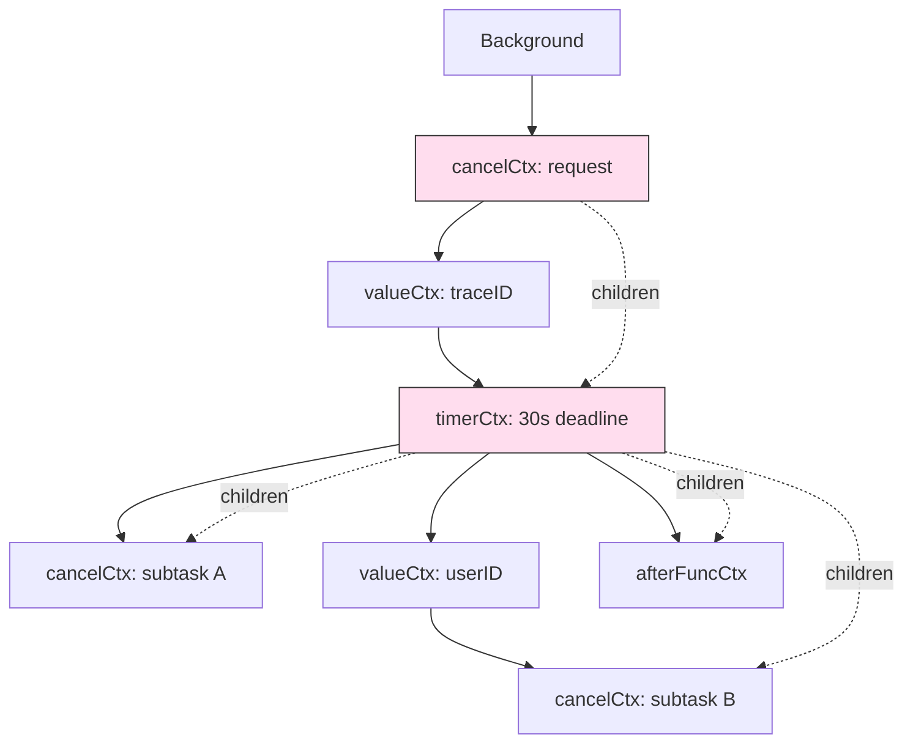

# context source — Middle

## 1. The internal type zoo

`context.go` is small (~700 lines) but dense. Once you can name the concrete types behind `Context`, the rest of the file falls into place.

| Type | Purpose | Returned by |
|------|---------|-------------|
| `emptyCtx` | The shared do-nothing root; never cancelled, has no values | `context.Background()`, `context.TODO()` |
| `cancelCtx` | Cancellable node; owns the `done` channel and a children set | `WithCancel`, `WithCancelCause` |
| `timerCtx` | Embeds `cancelCtx`, adds a `time.Timer` that auto-cancels | `WithDeadline`, `WithTimeout` |
| `valueCtx` | Carries one key/value pair, no cancellation of its own | `WithValue` |
| `withoutCancelCtx` (1.21+) | Inherits values from parent, drops cancellation | `WithoutCancel` |
| `afterFuncCtx` (1.21+) | Wraps a stop function for `AfterFunc` cleanup | internal, returned by `AfterFunc` |

The `Context` interface has four methods (`Deadline`, `Done`, `Err`, `Value`). Each concrete type implements them differently, but the cancellation story is centralised in `cancelCtx`.

---

## 2. `emptyCtx` — the shared root

```go
type emptyCtx struct{}

func (emptyCtx) Deadline() (time.Time, bool) { return }
func (emptyCtx) Done() <-chan struct{}       { return nil }
func (emptyCtx) Err() error                  { return nil }
func (emptyCtx) Value(any) any               { return nil }
```

Two named singletons exist: `backgroundCtx` and `todoCtx`, distinguished only by their `String()`. A `nil` `Done()` channel signals "this context will never be cancelled"; selecting on `nil` blocks forever, which is exactly correct. `Background` is "I have a top-level context", `TODO` is "I haven't decided yet". Production code should never ship `TODO`.

---

## 3. `cancelCtx` — the heart of the package

```go
type cancelCtx struct {
    Context                       // embedded parent
    mu       sync.Mutex
    done     atomic.Value          // chan struct{}, lazily created
    children map[canceler]struct{} // set of cancelable children
    err      error
    cause    error
}
```

A few subtle choices:

- **`done` is `atomic.Value`** — lock-free reads, channel allocated lazily on first `Done()`.
- **`children` is a set** — when this node is cancelled, every child is cancelled too.
- **`mu` protects `children`, `err`, `cause`** — `done` reads do not take the lock.
- **Parent is embedded**, so `Value` and `Deadline` fall through unless overridden.

The cancellation method:

```go
func (c *cancelCtx) cancel(removeFromParent bool, err, cause error) {
    c.mu.Lock()
    if c.err != nil {
        c.mu.Unlock()
        return // already cancelled
    }
    c.err = err
    c.cause = cause
    d, _ := c.done.Load().(chan struct{})
    if d == nil {
        c.done.Store(closedchan) // shared pre-closed channel
    } else {
        close(d)
    }
    for child := range c.children {
        child.cancel(false, err, cause) // false: don't remove from us; we're discarding the whole map
    }
    c.children = nil
    c.mu.Unlock()
    if removeFromParent {
        removeChild(c.Context, c)
    }
}
```

Note `closedchan`: a package-level pre-closed channel reused for contexts cancelled before anyone read `Done()`. Avoids the allocation.

---

## 4. `WithCancel` and `propagateCancel`

`WithCancel` builds a `cancelCtx`, sets its parent, then calls `propagateCancel(parent, c)` — where most of the cleverness lives:

```go
func propagateCancel(parent Context, child canceler) {
    done := parent.Done()
    if done == nil {
        return // parent never cancels (e.g. Background)
    }
    select {
    case <-done: // parent already cancelled
        child.cancel(false, parent.Err(), Cause(parent))
        return
    default:
    }
    if p, ok := parentCancelCtx(parent); ok {
        p.mu.Lock()
        if p.err != nil {
            child.cancel(false, p.err, p.cause)
        } else {
            if p.children == nil {
                p.children = make(map[canceler]struct{})
            }
            p.children[child] = struct{}{}
        }
        p.mu.Unlock()
        return
    }
    // parent is a custom Context — fall back to a watcher goroutine
    go func() {
        select {
        case <-parent.Done():
            child.cancel(false, parent.Err(), Cause(parent))
        case <-child.Done():
        }
    }()
}
```

Three branches:
1. **Parent never cancels** → no wiring needed.
2. **Parent is (or wraps) a `*cancelCtx`** → register child in parent's `children` map. Cheap, synchronous.
3. **Parent is a custom `Context`** → spawn a watcher goroutine.

Branch 3 is the price of letting users implement `Context`. `parentCancelCtx` peels back `valueCtx`/`timerCtx` wrappers to find the underlying `*cancelCtx`, so the cheap path covers all standard wrappers.

---

## 5. `WithDeadline` and `WithTimeout`

```go
type timerCtx struct {
    cancelCtx
    timer    *time.Timer
    deadline time.Time
}

func WithDeadline(parent Context, d time.Time) (Context, CancelFunc) {
    if cur, ok := parent.Deadline(); ok && cur.Before(d) {
        return WithCancel(parent) // parent already tighter
    }
    c := &timerCtx{cancelCtx: newCancelCtx(parent), deadline: d}
    propagateCancel(parent, c)
    if dur := time.Until(d); dur <= 0 {
        c.cancel(true, DeadlineExceeded, nil)
    } else {
        c.timer = time.AfterFunc(dur, func() {
            c.cancel(true, DeadlineExceeded, nil)
        })
    }
    return c, func() { c.cancel(true, Canceled, nil) }
}

func WithTimeout(p Context, d time.Duration) (Context, CancelFunc) {
    return WithDeadline(p, time.Now().Add(d))
}
```

Two observations:
- If the parent's deadline is already tighter, no `timerCtx` is created — no point arming two timers.
- The cancel func also stops the timer inside `timerCtx.cancel`. This is why **you must always call cancel on a `WithTimeout`** — to release the timer eagerly. `go vet` warns about lost cancels.

---

## 6. `WithValue` and the chain

```go
type valueCtx struct {
    Context
    key, val any
}

func (c *valueCtx) Value(key any) any {
    if c.key == key {
        return c.val
    }
    return value(c.Context, key) // walk up
}

func WithValue(parent Context, key, val any) Context {
    if key == nil { panic("nil key") }
    if !reflectlite.TypeOf(key).Comparable() { panic("key not comparable") }
    return &valueCtx{parent, key, val}
}
```

`value` is a small loop that climbs the chain:

```go
func value(c Context, key any) any {
    for {
        switch ctx := c.(type) {
        case *valueCtx:
            if key == ctx.key { return ctx.val }
            c = ctx.Context
        case *cancelCtx:       c = ctx.Context
        case *timerCtx:        c = ctx.cancelCtx.Context
        case *withoutCancelCtx: c = ctx.c
        case *emptyCtx:        return nil
        default:               return c.Value(key)
        }
    }
}
```

Implications:
- **`ctx.Value(k)` is O(depth)** — every wrap pushes one frame; lookups walk back. Six `WithValue`s = up to six comparisons per lookup.
- The type-switch is a fast-path optimisation; custom `Context` implementations fall to `default` and pay a virtual call.
- The *deepest* `WithValue` for a given key wins — the walk starts at the leaf.

---

## 7. The "unexported key type" rule

`WithValue` accepts `any` for both key and value. Two strangers can collide on a string key like `"user"`. The convention:

```go
package auth

type ctxKey int
const userKey ctxKey = 0

func WithUser(ctx context.Context, u *User) context.Context {
    return context.WithValue(ctx, userKey, u)
}
func UserFrom(ctx context.Context) (*User, bool) {
    u, ok := ctx.Value(userKey).(*User)
    return u, ok
}
```

Why it works: `ctxKey` is unexported, so no other package can construct one. Even if another package defines its own `type ctxKey int`, it's a *different* type — `==` on `any` compares both type and value. Only `auth` can read or write its key. `go vet` warns when you pass a built-in type like `string` or `int` as a context key.

---

## 8. `WithoutCancel` (Go 1.21+)

```go
type withoutCancelCtx struct {
    c Context
}

func (withoutCancelCtx) Deadline() (time.Time, bool) { return time.Time{}, false }
func (withoutCancelCtx) Done() <-chan struct{}       { return nil }
func (withoutCancelCtx) Err() error                  { return nil }
func (w withoutCancelCtx) Value(key any) any         { return w.c.Value(key) }
```

A wrapper that severs cancellation while preserving the value chain. Typical use: a request context is about to be cancelled (client disconnected, deadline passed) but you have follow-up work — metrics, audit log, async cleanup — that should keep the request's *identity* (user ID, trace ID) without inheriting the cancellation.

```go
func handler(ctx context.Context) {
    doRequest(ctx)
    cleanupCtx := context.WithoutCancel(ctx)
    go emitMetrics(cleanupCtx) // keeps trace ID, never cancelled
}
```

Before 1.21, the workaround was a fresh `Background()` with manually copied values — error-prone.

---

## 9. `AfterFunc` (Go 1.21+)

```go
func AfterFunc(ctx Context, f func()) (stop func() bool)
```

Runs `f` in its own goroutine when `ctx` is cancelled. Like `time.AfterFunc`, the returned `stop` cancels the registration if `f` hasn't fired yet.

Internally it registers an `afterFuncCtx` as a child of the nearest `cancelCtx`. When the parent cancels, the cancellation propagates in and spawns the goroutine that runs `f`. The advantage over `go func() { <-ctx.Done(); f() }()` is that you can `stop()` cleanly — no leaked goroutine if `f` is no longer needed. Common uses: closing a connection, emitting metrics, cancelling a downstream HTTP request.

---

## 10. Race-free cancel — who closes `done`, who reads

Reads of `Done()` are lock-free via `atomic.Value.Load`. The first reader allocates the channel:

```go
func (c *cancelCtx) Done() <-chan struct{} {
    d := c.done.Load()
    if d != nil { return d.(chan struct{}) }
    c.mu.Lock()
    d = c.done.Load()
    if d == nil {
        d = make(chan struct{})
        c.done.Store(d)
    }
    c.mu.Unlock()
    return d.(chan struct{})
}
```

A double-checked-lock pattern: fast path is the atomic load; slow path takes `mu` only on first allocation. Cancellers `close()` the same channel returned by `Load()`. The `closedchan` shortcut means contexts cancelled before anyone reads `Done()` never allocate. A rare stdlib site where `atomic.Value` and `sync.Mutex` collaborate on one field.

---

## 11. `cause` and `WithCancelCause` (Go 1.20+)

`Err()` only returns `Canceled` or `DeadlineExceeded` — useless when you need to know *why* a pipeline tore down. 1.20 added `WithCancelCause`:

```go
ctx, cancel := context.WithCancelCause(parent)
cancel(fmt.Errorf("user pressed Ctrl-C"))
// later:
ctx.Err()         // context.Canceled  (unchanged)
context.Cause(ctx) // user pressed Ctrl-C
```

`cancelCtx` had an unused `cause` field reserved for this. `Cause(ctx)` walks up looking for the nearest non-nil cause; if none, it falls back to `ctx.Err()` for backward compatibility. `WithDeadlineCause` and `WithTimeoutCause` followed in 1.21.

---

## 12. Cancellation propagation



Solid arrows = parent chain (used by `Value`). Dotted arrows = `children` map (used by `cancel`). When `T` fires its timer, it iterates `children` and cancels `C1`, `C2`, `AF` synchronously. `V1`/`V2` have no cancellation of their own; cancelling them is a no-op that climbs through to a real `cancelCtx`.

---

## 13. Common middle-level mistakes

- **Forgetting `defer cancel()`.** `WithTimeout` arms a timer that holds a goroutine reference. Skipping cancel works, but leaks the timer until it fires.
- **Context in a struct field.** The doc says "Do not store Contexts inside a struct type". A context's lifetime should match a call, not an object.
- **Passing `context.TODO` in production.** `TODO` is a placeholder. Shipping it means cancellation does nothing. Grep for it in CI.
- **String keys in `WithValue`.** Two unrelated packages both using `"userID"` will silently overwrite each other. Always use an unexported named type.
- **Goroutines waiting on a never-cancelled context.** `go func() { <-ctx.Done(); cleanup() }()` against `Background` leaks for the life of the program. Use `AfterFunc` or ensure cancellation.
- **Deep value chains.** Ten `WithValue` calls = ten frames per lookup. Bundle related values into one struct.
- **Custom `Context` wrappers.** They force `propagateCancel` into the goroutine fallback — one extra goroutine per `WithCancel`.
- **Reading `Err()` when you want `Cause`.** Post-1.20, `Cause(ctx)` is the diagnostic call. `Err()` is still right for "should I bail?".

---

## 14. Summary

Middle-level `context.go` rewards reading: a tiny interface backed by five concrete types, glued by a `children` map and a careful `propagateCancel` walk. Cancellation is fast (synchronous map iteration); `Value` is O(depth) (chain traversal); the 1.20/1.21 additions (`Cause`, `WithoutCancel`, `AfterFunc`) plug long-standing gaps. Once you have the type zoo and the propagation walk in your head, the rest of the file is annotation.

---

## Further reading
- `src/context/context.go` — the whole file is ~700 lines
- Proposal 40221 — `WithCancelCause`
- Proposal 40221 / 57928 — `WithoutCancel`, `AfterFunc`
- Sameer Ajmani's 2014 blog post — original design rationale
- `golang.org/x/net/context` — pre-1.7 standalone version, still illustrative
- `errgroup.Group` — canonical consumer of `WithCancel`
