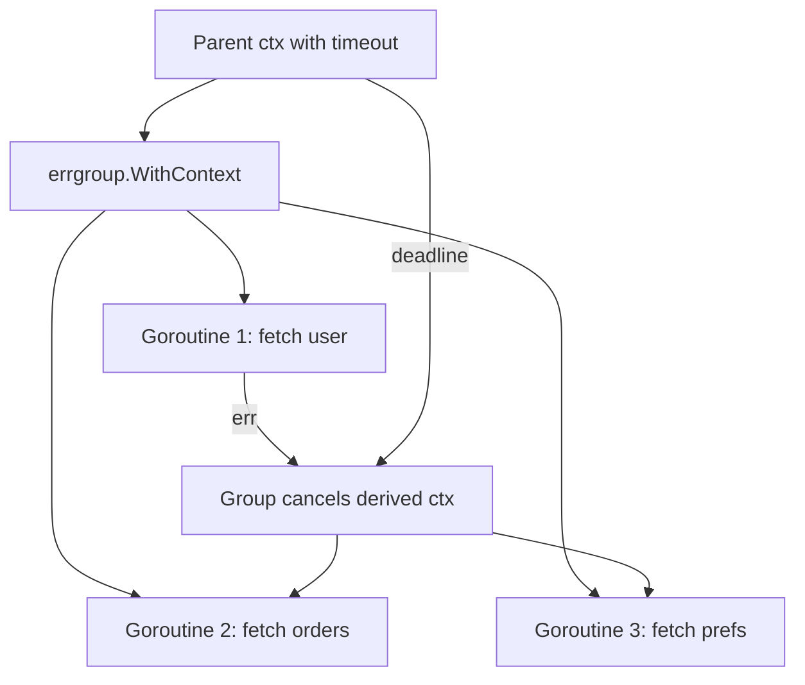
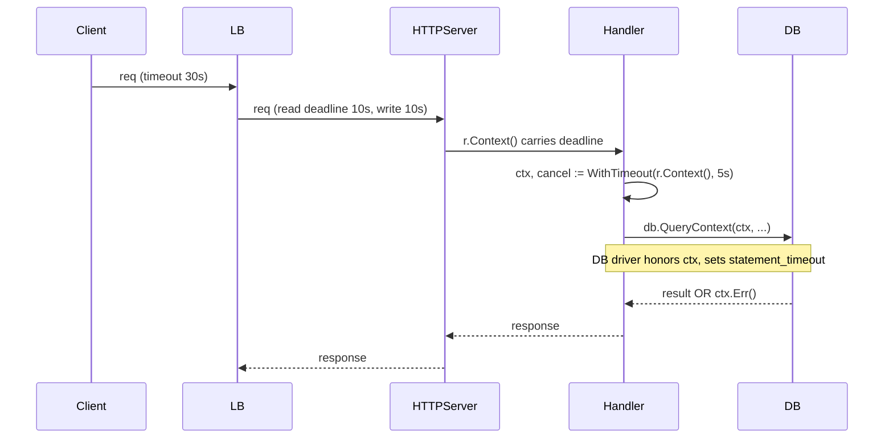

# `context` — Senior

## 1. Design philosophy — explicit propagation, no goroutine-local state

`context.Context` is the answer to a question Go refused to answer the way every other language did: *how does a downstream function know it should stop, or what request it belongs to?* The rejected answers were thread-locals, goroutine-locals, ambient request scopes, and implicit propagation through middleware magic. The chosen answer is **a value you pass as the first argument, every time, all the way down**. The cost is verbosity in every signature; the benefit is that *cancellation, deadline, and request-scoped data are visible in the type system and the call graph*.

The single mechanism unifies three concerns that other ecosystems handle with three different primitives:

| Concern | Other ecosystems | Go |
|---------|------------------|----|
| Cancellation | Thread interrupt, `CancellationToken`, `AbortController` | `ctx.Done()` |
| Deadline / timeout | Per-call timers, `Task.WithCancellation` | `ctx.Deadline()`, `WithTimeout` |
| Request-scoped data | Thread-local, `AsyncLocalStorage`, MDC | `ctx.Value()` |

Bundling these into one value is not because they are conceptually one thing — they are not — but because they share **the same propagation graph**: anything that needs cancellation needs request ID for logs needs the deadline. Passing three arguments where one suffices is the actual ergonomics win, and the type system enforces the propagation discipline at every layer.

Senior heuristic: **`Context` is the propagation envelope; what you put inside it is policy**. Cancellation and deadline are required content; values are optional and almost always abused.

The no-goroutine-local rule is load-bearing. A goroutine is a primitive without identity — `runtime.Goid()` exists for debugging and is explicitly *not* a stable handle. The language designers refused to give goroutines identity because identity invites ambient state, and ambient state is the source of every "works in dev, breaks in prod" cancellation bug. Every cancellation path is a graph in the source code, not a stack in the runtime.

---

## 2. The "context first parameter" convention — and the rare exceptions

The convention: if a function might block, do I/O, or call another function that does, **the first parameter is `ctx context.Context`**. Named exactly `ctx`. Not `c`, not `context`, not `requestCtx`. Linters (`revive`, `staticcheck` SA1029, `contextcheck`) enforce it.

```go
// Correct
func (s *Service) GetUser(ctx context.Context, id int64) (*User, error)

// Wrong — context not first
func (s *Service) GetUser(id int64, ctx context.Context) (*User, error)

// Wrong — context in a struct field
type Service struct {
    ctx context.Context  // see section 12 — code review red flag
    db  *sql.DB
}
```

When to violate, with eyes open:

| Case | Allowed | Why |
|------|---------|-----|
| `io.Reader.Read([]byte)` | No context | Interface predates `context`; use `(*http.Request).WithContext` or wrap |
| Constructors (`NewServer`, `NewPool`) | No context | Construction is synchronous, local; pass ctx to methods |
| Pure functions (`json.Marshal`, `regexp.Compile`) | No context | No I/O, no blocking, no propagation need |
| Type implementing a third-party interface | Context optional | Interface contract wins; consider wrapper that adds ctx |
| Test helpers | `t.Context()` (Go 1.24+) instead of `context.Background()` | Auto-cancels at test end |

The strictest senior rule: **`context.Context` belongs in function signatures, never in struct fields, never in package-level variables, never in `init()`**. A struct holding `ctx` is a struct holding a *time-bound capability* — its lifetime now silently depends on whoever constructed it. Callers cannot reason about cancellation by reading signatures. (`http.Request` violates this; the violation is grandfathered and documented; do not copy it.)

---

## 3. Cancellation propagation — errgroup, WaitGroup + ctx, channel + ctx

Three idiomatic patterns. Pick by *what you want when one branch fails*.



**`errgroup.Group` with `WithContext`** — fan-out fan-in where the first error cancels siblings:

```go
g, gctx := errgroup.WithContext(ctx)
var u *User; var o []Order; var p *Prefs
g.Go(func() error { var err error; u, err = userSvc.Get(gctx, id); return err })
g.Go(func() error { var err error; o, err = orderSvc.List(gctx, id); return err })
g.Go(func() error { var err error; p, err = prefSvc.Get(gctx, id); return err })
if err := g.Wait(); err != nil { return nil, err }
```

The derived `gctx` is cancelled when *any* goroutine returns non-nil error or when the parent `ctx` is cancelled. `Wait` returns the first non-nil error. This is the default for "I need all of these or none". `g.SetLimit(n)` adds bounded concurrency since Go 1.20+.

**`sync.WaitGroup` + ctx** — fan-out where partial success is acceptable:

```go
var wg sync.WaitGroup
results := make([]Result, len(ids))
for i, id := range ids {
    wg.Add(1)
    go func(i int, id int64) {
        defer wg.Done()
        if r, err := svc.Get(ctx, id); err == nil { results[i] = r }
    }(i, id)
}
wg.Wait()
```

No error propagation; siblings are not cancelled on one failure. Use when each branch is independent.

**Channel + ctx select** — for explicit cancellation in a producer/consumer:

```go
for {
    select {
    case <-ctx.Done():
        return ctx.Err()
    case work := <-in:
        if err := process(ctx, work); err != nil { return err }
    }
}
```

Every blocking receive pairs with `<-ctx.Done()`. Forget once and the goroutine leaks.

**The error contract**: when `ctx` is cancelled, return `ctx.Err()` (or wrap it with `fmt.Errorf("operation X: %w", ctx.Err())`). Returning a generic error throws away whether the caller cancelled vs the deadline fired — information the caller needs to decide on retry.

---

## 4. The cost of `ctx.Value` — O(depth) lookup, hot-path implications

`ctx.Value(k)` walks the parent chain linearly:

```go
func (c *valueCtx) Value(key any) any {
    if c.key == key { return c.val }
    return value(c.Context, key)  // recurses to parent
}
```

Each `WithValue` adds one node. Each `Value` lookup is O(depth). For a request that passes through 8 middleware layers each calling `WithValue`, every `ctx.Value` is 8 pointer chases.

Measured cost on Apple M-class:

```
BenchmarkValue_Depth1-10     250000000   4.8 ns/op
BenchmarkValue_Depth8-10      75000000  16.0 ns/op
BenchmarkValue_Depth32-10     20000000  58.0 ns/op
BenchmarkValue_Miss_D32-10    18000000  62.0 ns/op
```

16 ns sounds cheap. Multiply by 50 lookups per request handler (auth claims, request ID, tracing span, locale, feature flags, tenant ID, ...) at 100K req/s and that is 80 ms of CPU per core per second, before any actual work. **`ctx.Value` is not free, and on hot paths it is the entire CPU budget**.

Senior rules:

- **Hoist** — read once at the top of the handler into a typed local; pass the value down explicitly:

  ```go
  func Handler(ctx context.Context, ...) {
      rid := RequestID(ctx)  // one ctx.Value
      uid := UserID(ctx)     // one ctx.Value
      doWork(ctx, rid, uid, ...)  // pass as typed args
  }
  ```

- **Never `ctx.Value` inside a loop**.
- **Cache miss is the same cost as cache hit** — a missing key still walks the whole chain. Defensive `if v := ctx.Value(k); v != nil` does not save you.
- **Tracing libraries do this right by accident** — `trace.SpanFromContext` is called once per span, not per log line.

---

## 5. `WithValue` is for request-scoped data only

`ctx.Value` exists for data that crosses API boundaries and is genuinely scoped to *this request*. The canonical legitimate uses:

- Request ID / trace ID — written by a logging or tracing middleware, read by handlers and downstream RPC clients.
- Auth claims / user ID — written by an auth middleware, read by authorization checks.
- Tenant ID — multi-tenant routing.
- Locale / accept-language — i18n.
- Deadline-derived hints (rare).

What `ctx.Value` is **not** for:

- "Optional arguments" to functions — use functional options or struct config.
- Database handles, HTTP clients, loggers, config — these are *application* dependencies, not request data. Inject through constructors.
- Anything mutable. The value behind a key must be effectively immutable for the request's lifetime; otherwise you have invented goroutine-local mutable state through the back door.
- Anything required for correctness. If a function *needs* a value, it must take it as an explicit parameter; `ctx.Value` is for cross-cutting, optional data.

Senior test: **if you remove the `ctx.Value` call and the function still type-checks, is it still correct?** If not, the value should have been an explicit parameter.

---

## 6. The key-type pattern — collision-proof keys

`ctx.Value` keys are `any`. Two packages using the string `"user_id"` collide silently. The Go idiom isolates keys per package with an unexported type:

```go
package auth

type ctxKey int

const (
    userIDKey ctxKey = iota
    claimsKey
)

func WithUserID(ctx context.Context, id int64) context.Context {
    return context.WithValue(ctx, userIDKey, id)
}

func UserID(ctx context.Context) (int64, bool) {
    v, ok := ctx.Value(userIDKey).(int64)
    return v, ok
}
```

Why each piece matters:

- **`type ctxKey int`** — distinct type per package; two packages with the same `int` value cannot collide because the *types* differ.
- **Unexported (`ctxKey`, lowercase)** — only `auth` package can construct keys; external code cannot stuff a value under the same key.
- **Typed accessor (`UserID`)** — callers never call `ctx.Value` directly. Type assertion lives in one place; refactoring the value type touches one file.
- **`WithUserID` constructor** — symmetry with the accessor; the package owns both ends of the key.

Anti-patterns:

```go
const userIDKey = "user_id"             // collides across packages
const userIDKey = struct{}{}            // typed but exported via reflection accidents
type ctxKey string; const k ctxKey = "x" // strings allow accidental construction
```

`net/http` uses `type contextKey struct{ name string }` for the same reason — distinct type, value's `name` is documentation only.

---

## 7. Deadline propagation — HTTP, gRPC, downstream services

A deadline propagates *down* the call graph. An HTTP handler with a 5 s server deadline must not call a database with no deadline; if the database hangs, the request hangs past the deadline, the goroutine leaks, and connection pools saturate.

The chain in a typical request:



`net/http.Server` cancels `r.Context()` when the connection is closed or the write deadline fires. `database/sql` driver respects `ctx` and sends `cancel` to PostgreSQL/MySQL. `google.golang.org/grpc` propagates the deadline over the wire as a header (`grpc-timeout`), and the downstream server sets its own ctx with that deadline minus a small budget for network.

**The propagation rule**: every downstream call inherits the upstream deadline minus a *budget* for the remaining work. A handler with a 5 s deadline should not give its DB call 5 s — it should leave 200 ms for response serialization and network. `WithDeadline(ctx, time.Now().Add(remaining - budget))` makes the budget explicit.

**The downstream contract**: a service receiving a deadline header should honor it. A handler that ignores `ctx.Err()` after a slow query still completes the work, wastes the result, and saturates the DB pool — the request the caller already gave up on. Always pass `ctx` through; always check `ctx.Err()` after blocking calls.

---

## 8. `context.WithoutCancel` (Go 1.21+) — work that outlives the request

The default propagation is *too good*: if a request is cancelled, everything derived from it stops. Sometimes you *want* the parent's values (request ID, trace span, auth claims) but *not* the cancellation — analytics dispatch, audit logging, log shipping, fire-and-forget metrics.

Pre-1.21 pattern was manual: build a fresh `Background()` and re-inject every value by hand. Forget one, lose the trace.

1.21+:

```go
detached := context.WithoutCancel(ctx)
go shipMetrics(detached, payload)
```

Values propagate; cancellation does not. `detached.Done()` returns `nil`; `detached.Deadline()` returns zero. Use for: telemetry dispatch after response, audit log writes, saga compensation, cache warming. Do **not** use for anything that should be killable — a worker spawned with `WithoutCancel` leaks until natural completion.

Senior caveat: `WithoutCancel` still inherits values, which means **a 24-hour background job derived from `WithoutCancel` keeps the request's parent chain reachable** — every `WithValue` node in the parent stays alive for the job's lifetime. For long-lived background work, copy the specific values you need into a fresh `Background()` ctx.

---

## 9. `WithCancelCause` and `context.Cause` (Go 1.20+)

`ctx.Err()` returns one of two sentinels: `context.Canceled` or `context.DeadlineExceeded`. *Why* a context was cancelled is lost. For debugging "the request was cancelled" in production, that information is everything.

```go
ctx, cancel := context.WithCancelCause(parent)
defer cancel(nil)  // benign cleanup

go func() {
    if err := validateInput(input); err != nil {
        cancel(fmt.Errorf("invalid input: %w", err))
    }
}()

select {
case <-ctx.Done():
    // ctx.Err() == context.Canceled (still)
    // context.Cause(ctx) == "invalid input: ..."
    log.Error("cancelled", "cause", context.Cause(ctx))
}
```

`context.Cause(ctx)` walks up until it finds a context cancelled with a cause; if cancellation happened via plain `cancel()`/timeout, it returns `ctx.Err()`.

Production pattern: every business-logic cancellation passes a cause. Every middleware that cancels (rate limit, circuit breaker, auth failure) passes a cause. Logs include `context.Cause(ctx)` whenever a request fails with `ctx.Err() != nil`. Postmortems for "why did 8% of requests cancel" go from "no idea" to "rate limiter — see cause distribution".

`WithTimeoutCause` and `WithDeadlineCause` are the symmetric variants — when the timer fires, the supplied error becomes the cause:

```go
ctx, cancel := context.WithTimeoutCause(parent, 500*time.Millisecond,
    errors.New("db.QueryContext deadline"))
defer cancel()
```

Then `context.Cause` distinguishes "timed out waiting for the DB" from "timed out waiting for cache".

---

## 10. `context.AfterFunc` (Go 1.21+) — schedule cleanup on cancel

Pre-1.21 cleanup-on-cancel was a goroutine per registration:

```go
go func() { <-ctx.Done(); cleanup() }()
```

If the context is never cancelled, the goroutine leaks. `AfterFunc` replaces this with a callback registered against the context:

```go
stop := context.AfterFunc(ctx, func() {
    closeConn(); releasePort()
})
defer stop()  // returns true if the callback had not yet started
```

The callback fires once, in a goroutine spawned only when cancellation actually happens. If cancellation never comes, no goroutine is ever created. Use cases: release a connection on request cancel, cancel an in-flight retry timer, decrement a backpressure counter, tear down a per-request resource that does not implement `io.Closer`.

Senior trade: `AfterFunc` is **not** a guarantee — if the program exits between cancellation and callback invocation, the callback may not run. For correctness-critical cleanup (DB COMMIT/ROLLBACK), use `defer`; `AfterFunc` is for *opportunistic* cleanup tied to cancellation.

---

## 11. Goroutine leaks rooted in context misuse

Every Go production system that has run for more than six months has had a goroutine leak rooted in context misuse. The leak shapes:

**Leak 1 — `select` on a context that is never cancelled.**

```go
func startWorker(ctx context.Context, in <-chan Work) {
    go func() {
        for {
            select {
            case <-ctx.Done(): return
            case w := <-in: process(w)
            }
        }
    }()
}
// Caller:
startWorker(context.Background(), workCh)  // ctx never cancels; worker forever
```

`context.Background()` has no `Done()` channel that ever closes. The worker never exits. Discovered via `pprof.Lookup("goroutine")` showing N copies of the worker over time, or by `runtime.NumGoroutine()` climbing monotonically.

Fix: every long-running goroutine takes a *cancellable* ctx. The owner of the lifecycle holds the `cancel`. `Background()` is for *roots*, not for handing to spawned goroutines.

**Leak 2 — `WithCancel` returned but `cancel` never called.**

```go
func (s *Service) Process(req Req) error {
    ctx, _ := context.WithCancel(context.Background())  // cancel discarded
    return s.do(ctx, req)
}
```

`go vet` and `staticcheck` (SA1019, lostcancel) catch this. The leak: every `WithCancel` allocates a parent-child link. The parent (`Background()`) is never garbage-collected because it is a package-level sentinel; the child holds a back-reference. The child node itself accumulates until `cancel` is called. At 10K req/s with this bug, you leak ~1 MB/s of `cancelCtx` structs.

Fix: **every `WithCancel`/`WithTimeout`/`WithDeadline` returns a `cancel` that must be called**. `defer cancel()` immediately, even on the happy path.

**Leak 3 — channel send after context cancel.**

```go
go func() {
    result := doWork()
    out <- result  // blocks forever if reader exited on ctx.Done
}()
select {
case r := <-out: return r
case <-ctx.Done(): return ctx.Err()  // we exit; producer blocks on send
}
```

Fix: buffered channel of size 1 so the send always succeeds, *or* the producer also selects on `ctx.Done()`.

```go
select {
case out <- result:
case <-ctx.Done():
}
```

**Leak 4 — `time.After` in a select loop.** `time.After` allocates a new timer each iteration; the old timer is unreachable but holds a runtime timer slot until it fires. At one loop iteration per ms, you accumulate timers. Fix: `t := time.NewTimer(d); defer t.Stop()` and reset inside the loop.

---

## 12. Code review red flags

A senior reviewer scans Go diffs for context misuse with a fixed checklist. The high-signal ones:

| Smell | Why it is wrong | Fix |
|-------|-----------------|-----|
| `ctx` as struct field | Couples object lifetime to request lifetime; hides propagation | Pass `ctx` to methods |
| `context.TODO()` in production code | Marker for "I do not know how to plumb ctx here" — never resolved | Plumb the real `ctx` through |
| `context.Background()` mid-call-graph | Severs cancellation chain; deadline lost | Use the caller's `ctx`; `WithoutCancel` if detachment intended |
| `_ = cancel` or missing `defer cancel()` | Resource leak | `defer cancel()` immediately |
| `ctx context.Context` not first | Convention violation; linters catch | Move to first position |
| `ctx` named `c` or `context` | Conflicts with package name; shadows | Always `ctx` |
| Function takes `ctx` but never uses it | Either dead arg or unused cancellation | Pass to inner calls; remove if truly unused |
| `ctx.Value` with string key | Collides across packages | Unexported `type ctxKey` |
| `ctx.Value` in a tight loop | O(depth) per iteration | Hoist outside the loop |
| `cancel()` called multiple times | Not wrong (idempotent) but a smell | Single ownership |
| `context.WithValue(ctx, X, db)` | Application deps in ctx | Constructor injection |
| `ignored := ctx.Err()` | Silent cancellation | Return `ctx.Err()` or wrap |
| `go fn(ctx)` followed by no synchronization | Spawned goroutine with no lifecycle owner | Use errgroup or wait |
| Returning `nil` after `<-ctx.Done()` | Loses the cancellation reason | Return `ctx.Err()` |
| `time.Sleep` without `select` on `ctx.Done()` | Sleep ignores cancellation | `select { case <-ctx.Done(): case <-time.After(d): }` |
| `*Context` (pointer to interface) | Misunderstanding of Go interfaces | `context.Context` value |
| Cancellation via channel close instead of ctx | Reinvents context | Use `WithCancel` |
| `ctx.Value` cast without `, ok` | Panics on type mismatch from another package | Always two-value assertion |

The single most common production bug: **a struct holding a context constructed at object creation, then methods called minutes later**. The struct's `ctx` is the construction-time deadline, not the call-time deadline. Symptoms: requests fail immediately with `context.DeadlineExceeded` after the service has been up for N minutes (where N is the construction-time deadline).

---

## 13. Middleware patterns — request-ID, tracing, auth

HTTP middleware is the canonical `context.WithValue` writer. The pattern is symmetric: middleware writes; handlers read.

```go
func RequestID(next http.Handler) http.Handler {
    return http.HandlerFunc(func(w http.ResponseWriter, r *http.Request) {
        rid := r.Header.Get("X-Request-ID")
        if rid == "" { rid = uuid.NewString() }
        ctx := context.WithValue(r.Context(), requestIDKey, rid)
        w.Header().Set("X-Request-ID", rid)
        next.ServeHTTP(w, r.WithContext(ctx))
    })
}
```

The chain `RequestID → Tracing → Auth → Handler` builds a context with four nested `WithValue` nodes. Each is one allocation; each adds one level to the value-lookup chain. Middleware that adds 12 values for "convenience" turns every `ctx.Value` into a 12-step walk.

Senior consolidation: pack related values into one struct under one `WithValue` key. Trade: adding a field requires touching the struct, but the struct wins on lookup speed, allocation count, and readability. Tracing libraries (`go.opentelemetry.io/otel/trace`) put the span behind a single key and provide `SpanFromContext`/`ContextWithSpan` — exactly this pattern behind a typed API.

---

## 14. Production postmortems

**Postmortem 1 — the hang from missing deadline propagation.**

Service A calls service B via gRPC. Service B calls Postgres. Service A's handler sets a 2 s deadline; service B's gRPC server respects the propagated deadline (gRPC does this automatically). Service B's database call uses `db.Query` (no context variant). When Postgres slows down to 30 s/query, service B's goroutines hang in `db.Query` for 30 s each; service A's deadlines fire, but service B has no way to know — the goroutines pile up, the connection pool exhausts, every request 503s.

Fix: `db.QueryContext(ctx, ...)`. The driver sends `cancel` to Postgres when ctx fires. Recovery time goes from 30 s (waiting for Postgres) to <100 ms (cancel round-trip). Lesson: **`ctx.Err() == nil` does not mean the deadline propagated** — every blocking call must be the `Context` variant.

**Postmortem 2 — leaked cancellers in a worker pool.**

Background job processor spawns workers via `errgroup`. Each worker derives a per-job context: `jobCtx, cancel := context.WithTimeout(workerCtx, jobTimeout)`. On the happy path, `cancel` is called after `Wait`. On the panic path (a job panics in user code), the deferred `cancel` does run — but a refactor moved it into a function called *after* a possibly-blocking publish step. Publish blocks on backpressure; cancel never runs; the cancelCtx accumulates in the parent's children slice. After 24 hours, the parent has 80M children. `runtime.GC` becomes a 4-second pause every 30 seconds.

Fix: `defer cancel()` directly after `WithTimeout`, **same scope, same line discipline**. Never move cancellation to a later function. Pprof heap profile showed `context.cancelCtx` as 60% of heap — the smoking gun.

**Postmortem 3 — unintended cancellation cascade.**

A new feature adds a "fast path" optimization: if a single sub-request fails, cancel siblings to free resources. Implementation uses `errgroup.WithContext`. Works in dev. In production, one slow downstream service (rate-limited) starts returning errors. The errgroup cancels its derived ctx; the derived ctx is propagated to *unrelated* requests because the engineer reused the same root ctx for a connection pool. Every request connected to the same pool sees its ctx cancel within seconds. 100% error rate.

Fix: contexts derive in trees, not graphs. A request's ctx is for its own work; a pool's ctx is the pool's lifecycle, never derived from a single request. Lesson: **the parent of a derived ctx must outlive the child by definition** — if it cancels, every child cancels. Audit ctx parentage during code review.

---

## 15. Code review checklist

Every Go PR touching server, client, worker, or library code passes through this list:

1. Every function that does I/O or calls one that does takes `ctx context.Context` as its first parameter.
2. The parameter is named `ctx`, exactly.
3. No struct has a `ctx` field outside `http.Request`-shaped grandfathered cases.
4. Every `context.WithCancel`, `WithTimeout`, `WithDeadline`, `WithCancelCause` is followed by `defer cancel()` in the same scope.
5. `context.TODO()` and `context.Background()` appear only at process roots (main, tests, top-level goroutine spawn points).
6. Every `ctx.Value` uses an unexported `ctxKey`-typed constant from the same package.
7. Every `ctx.Value` is paired with a typed accessor function; raw `ctx.Value` calls do not leak across package boundaries.
8. No `ctx.Value` carries application dependencies (logger, DB, HTTP client, config).
9. Every blocking call inside a goroutine pairs with `<-ctx.Done()` in its `select`.
10. Every blocking operation (DB query, HTTP call, channel send/recv) uses the `Context` variant.
11. After a `<-ctx.Done()` branch, the function returns `ctx.Err()` (possibly wrapped) — never `nil`, never a generic error.
12. Channel sends in goroutines either use a buffered-1 channel or select on `<-ctx.Done()`.
13. `time.After` in select loops is replaced with `time.NewTimer` + `defer Stop()`.
14. Background work derived from a request uses `context.WithoutCancel` if and only if it must outlive request cancellation.
15. Background work that must run regardless of request cancellation copies needed values into a fresh `context.Background()`, not `WithoutCancel`, when the request chain is long-lived.
16. Cancellation with non-trivial cause uses `WithCancelCause`; logs include `context.Cause(ctx)` on cancellation failures.
17. Cleanup tied to cancellation uses `context.AfterFunc` instead of a goroutine spinning on `<-ctx.Done()`.
18. Tests use `t.Context()` (Go 1.24+) instead of `context.Background()` to inherit test-scoped cancellation.
19. Linters enabled: `staticcheck` (SA1019 lostcancel, SA1029 wrong key type, SA1012 nil ctx), `contextcheck`, `revive`'s `context-as-argument` and `context-keys-type`.
20. Profile checked: no `context.cancelCtx` or `context.valueCtx` in top heap consumers; goroutine count stable across load.

The checklist exists because every item on it has caused a postmortem.

---

## 16. Closing principles

**Propagate, do not store.** `Context` lives in arguments. The moment it lives in a field, you have re-invented thread-local state with worse ergonomics.

**Cancellation is information.** `ctx.Err()` answers two questions; `context.Cause(ctx)` answers the third. In production, the third question is the one you actually have.

**Deadlines are budgets, not promises.** Inherit from above, subtract your own work budget, pass the remainder down. Never give a downstream call more time than your own deadline minus a safety margin for serialization and network.

**Values are for crossing API boundaries.** A handler reading the request ID set by middleware is the prototypical use. Everything else is probably an explicit parameter waiting to be written.

**`Background()` is a root, `TODO()` is a debt.** Every `Background()` in middle code severs a cancellation chain. Every `TODO()` is a marker for incomplete plumbing.

**One owner per `cancel`.** The function that creates a cancellable context owns `cancel`. Hand the *context* to children; hand the *cancel* to no one.

**Profile the chain.** A request that walks 20 `WithValue` nodes per lookup is paying for middleware abstraction. Consolidate when the cost becomes visible.

**Read `ctx.Err()` after every blocking call.** The blocking call may have returned a real error *and* the context may have been cancelled. Check the context first; cancellation is the more informative answer.

**A `Context` you did not derive is a `Context` you do not own.** Do not call `cancel` on someone else's context. Wrap with `WithCancel`/`WithTimeout` and own the derived one.

Done well, `context` is the most useful single abstraction the standard library shipped after goroutines — one mechanism, three concerns, zero ambient state. Done badly, it is a struct field full of stale deadlines and a graveyard of leaked goroutines.

---

## Further reading

- `context` package documentation — design rationale and contract
- Sameer Ajmani, "Go Concurrency Patterns: Context" (Go blog, 2014) — original motivation
- Go 1.20 release notes — `WithCancelCause`, `context.Cause`
- Go 1.21 release notes — `WithoutCancel`, `AfterFunc`, `WithDeadlineCause`, `WithTimeoutCause`
- Go 1.24 release notes — `t.Context()` for test-scoped cancellation
- `golang.org/x/sync/errgroup` — group with shared cancellation and error
- `go.opentelemetry.io/otel/trace` — production example of context-carried span propagation
- `database/sql` `*Context` methods — driver-level deadline propagation
- `google.golang.org/grpc` — `grpc-timeout` header and deadline propagation across services
- staticcheck SA1012/SA1019/SA1029, `contextcheck`, `revive` `context-as-argument` and `context-keys-type` — enforcement
