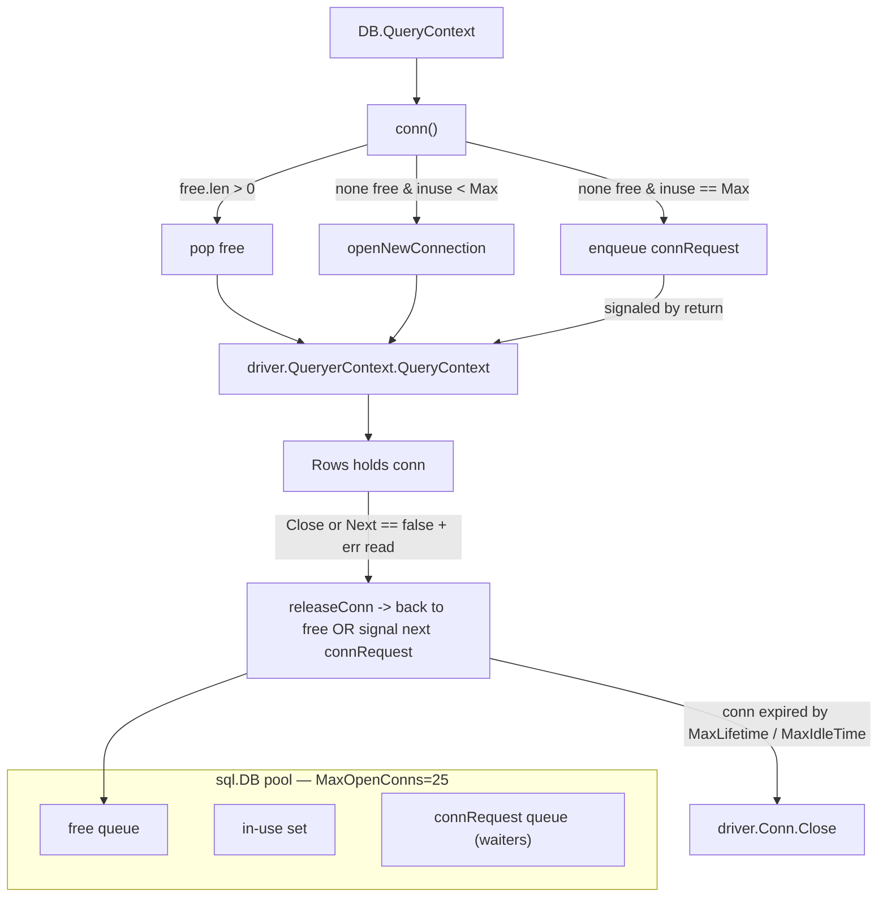
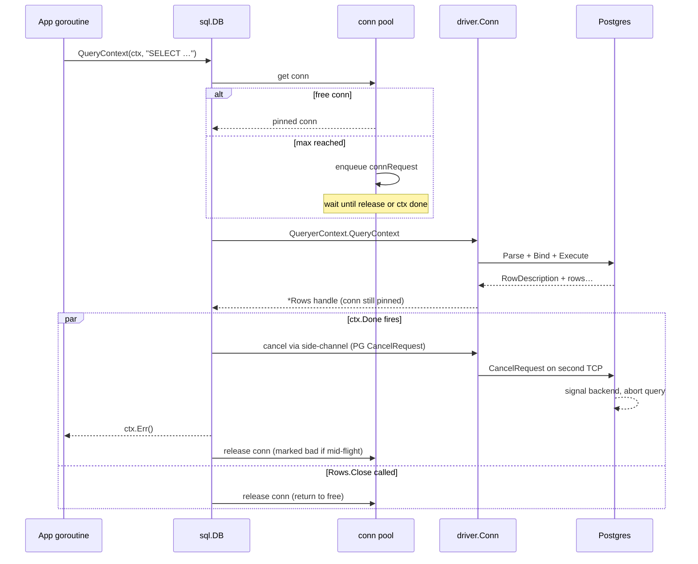

# `database/sql` — Senior

## 1. Mental model — `database/sql` is a connection pool with a thin SQL veneer

`database/sql` is **not** a database driver. It is a pool of `driver.Conn`s, a lifecycle manager for `Conn`/`Stmt`/`Tx`/`Rows`, and a context-aware dispatcher. Every senior bug in this package reduces to one of three failures: **the pool ran out of connections, a connection was leaked, or cancellation did not reach the wire**. Everything else is detail.

The package owns four objects with overlapping lifetimes:

| Object | Lifetime | Owns a conn? | Cleanup |
|--------|----------|--------------|---------|
| `*sql.DB` | Process | No (manages N) | `Close()` at shutdown |
| `*sql.Conn` | Caller scope | Yes (one, pinned) | `Conn.Close()` returns to pool |
| `*sql.Tx` | Until `Commit`/`Rollback` | Yes (one, pinned) | `Commit` or `Rollback` |
| `*sql.Rows` | Until exhausted or `Close()` | Yes (one, pinned) | `Rows.Close()` returns to pool |
| `*sql.Stmt` | Until `Close()` | No (re-prepares per conn) | `Stmt.Close()` releases all backing prepares |

The rule that breaks juniors: **`Rows` holds a connection until closed**, even if you stopped reading. A `for rows.Next() { if err { return }}` with the early-return path not calling `Close()` leaks one connection forever. Pool of 25 connections, 25 such bugs over a week of uptime → `connection refused`, latency cliff, on-call page.



Three knobs control the pool, four since Go 1.15. They are not independent.

---

## 2. Pool sizing — `MaxOpenConns`, `MaxIdleConns`, `ConnMaxLifetime`, `ConnMaxIdleTime`

Defaults are wrong for production. `MaxOpenConns = 0` (unlimited) is a denial-of-service against your database; `MaxIdleConns = 2` is too small for any real workload; no lifetime cap means a connection lives forever, defeating DNS failover and rolling deploys behind the database.

**Sizing rule of thumb:** `MaxOpenConns = min(db_max_connections / app_replicas, app_concurrency)`. Postgres ships with `max_connections=100`; PgBouncer typically 1000+. With 10 app replicas behind one PG, never exceed 10 each — leave headroom for `pg_basebackup`, `psql` sessions, monitoring. A typical web-app sizing:

| Workload | `MaxOpenConns` | `MaxIdleConns` | `ConnMaxLifetime` | `ConnMaxIdleTime` |
|----------|---------------:|---------------:|-------------------|-------------------|
| Postgres, web API behind PgBouncer | 25 | 25 | 30 min | 5 min |
| Postgres, web API direct (no bouncer) | 10 | 10 | 5 min | 1 min |
| MySQL, web API | 25 | 25 | 3 min | 1 min |
| Batch / ETL | 4-8 | 4-8 | 1 hour | 0 (never idle-close) |
| Read replica fanout | per-replica 10 | per-replica 10 | 3 min | 1 min |

**`MaxIdleConns == MaxOpenConns`** is the senior default. The historic guidance to keep idle small was about old MySQL with cheap connection setup. Modern Postgres + TLS makes connection setup expensive (30–80 ms). An idle pool the same size as the open pool means **zero cold-start under steady load** — every checkout hits a warm TCP+TLS+startup-message session. The price is N idle connections sitting on the database; with PgBouncer in transaction-pooling mode this is free.

**`ConnMaxLifetime`** is non-negotiable in production. Without it, connections live until the database kicks them. The reasons to rotate:

1. **DNS changes** — `sql.Open("postgres", "dsn-with-host=db.svc")` resolves the host *once* per connection. A failover repoints DNS; your old connections still talk to the dead primary until reconnected. With `ConnMaxLifetime=30m`, every connection re-dials within 30 minutes — failover automatically heals.
2. **Replica rotation** — Reading from a read-replica DNS round-robin (`db-ro.svc`) without lifetime means one connection sticks to one replica for hours. Newly-added replicas see no traffic; removed ones still get queries.
3. **Long-running statement metadata** — Postgres accumulates prepared statement plan caches per session. Sessions that live forever accumulate megabytes of plan cache (`pg_prepared_statements` × cache size).
4. **Kill-old-queries hygiene** — A stuck session from a leaked `Rows` or a forgotten `BEGIN` cannot live longer than `ConnMaxLifetime`.

**`ConnMaxIdleTime`** (Go 1.15+) closes connections idle longer than the threshold even if total lifetime has not elapsed. The use case: weekend traffic dip — pool stays at 25, but 20 of those sit idle for 6 hours and now the firewall (AWS NAT, Azure NLB, F5) has silently dropped the half-open TCP. First Monday-morning query: `EOF`. `ConnMaxIdleTime=5m` keeps the pool size dynamic to real load and avoids the firewall problem.

**Set both.** `ConnMaxLifetime` caps maximum age; `ConnMaxIdleTime` caps idle age. With both set, a connection dies when it hits **either** limit.

```go
db.SetMaxOpenConns(25)
db.SetMaxIdleConns(25)
db.SetConnMaxLifetime(30 * time.Minute)
db.SetConnMaxIdleTime(5 * time.Minute)
```

**Pool exhaustion symptoms — recognize early.** Before `connection refused` arrives, the pool advertises distress for minutes. Five canonical signs, in escalation order:

1. `WaitCount` climbs from 0; `WaitDuration / WaitCount` ratio measures the average wait per requester.
2. `Idle` collapses to 0 and stays there; every checkout dials or queues.
3. P99 latency rises uniformly across endpoints — the bottleneck is the pool, not the query.
4. Goroutines pile up in `runtime.gopark` on `(*sql.DB).conn` — visible in `/debug/pprof/goroutine?debug=2`.
5. The DB-side `pg_stat_activity` / MySQL `SHOW PROCESSLIST` shows the pool's pinned count = `MaxOpenConns`, all `idle in transaction` or stuck on long queries.

By the time `connection refused` appears (usually a misnomer — it is the *client-side* ctx timing out waiting for a pool slot), the pool has been wedged for the entire alert lead time. The right alert fires on signs 1 and 2; the page on sign 5.

---

## 3. Context cancellation — protocol-level kill, driver-dependent semantics

Every senior `database/sql` API takes `context.Context`. Cancellation works at **two layers** with different guarantees.

**Layer 1 — Go side.** When `ctx` is cancelled, `database/sql` stops waiting and returns `ctx.Err()` to the caller. The connection is marked bad and slated for return to the pool *or* closure. This is immediate.

**Layer 2 — wire side.** What happens to the query already running on the database? Driver-specific.

| Driver | Cancellation mechanism | Effect on in-flight query |
|--------|------------------------|---------------------------|
| `lib/pq` (Postgres) | Opens a *second* connection, sends `CancelRequest` (protocol PID + secret key) | PG signals the backend; query interrupts on next instruction check |
| `pgx/v5` (stdlib mode) | Same `CancelRequest` mechanism | Same |
| `go-sql-driver/mysql` | `KILL QUERY <conn_id>` over a side connection | MySQL kills the query thread |
| `mattn/go-sqlite3` | `sqlite3_interrupt` on C handle | Interrupts at next opcode |
| `denisenkom/go-mssqldb` | TDS attention packet | Server returns query with cancellation marker |

**The Postgres CancelRequest gotcha.** It opens a *new TCP connection* to send the cancel. If the network is broken (the very reason your query hangs), the cancel send hangs too. `database/sql` returns `ctx.Err()` to the caller, but the original connection may still be wedged. The connection is marked bad and closed when released — but for slow networks, "marked bad and closed" can take seconds.

**The Layer-1 / Layer-2 race.** `database/sql` returns to the caller as soon as ctx fires. The query may still be running on the DB for milliseconds-to-seconds. Two concurrent calls with the same key on a non-idempotent query → both can have wire-side effects even though the second "cancelled."

Senior implication: **cancellation is not a transaction abort**. To guarantee no DB effect on cancellation, wrap in an explicit `Tx`, defer `Rollback`, and rely on the server's transaction abort, not the wire-level cancel.

```go
tx, err := db.BeginTx(ctx, nil)
if err != nil { return err }
defer tx.Rollback() // no-op if Commit succeeded; aborts otherwise

if _, err := tx.ExecContext(ctx, "UPDATE …"); err != nil { return err }
return tx.Commit()
```

---

## 4. Prepared statements — per-connection cache, lazy re-prepare

`db.PrepareContext` returns `*sql.Stmt` that **does not** correspond to one prepared statement on the database. It is a handle that internally maintains a map of `driver.Conn → driver.Stmt`. Each time `stmt.QueryContext` runs, the pool picks a connection; if that connection has no underlying prepare for this `Stmt`, it lazily re-prepares.

Consequences:

1. **One `*sql.Stmt`, N actual prepares** — one per connection ever used. For `MaxOpenConns=25` you may have 25 underlying prepares per `*sql.Stmt`.
2. **Connection close evicts the prepare** — `ConnMaxLifetime` fires, conn dies, the next checkout of a different conn forces a re-prepare. Re-prepares are 1-2 RTTs; under high churn, the prepare cost can dominate.
3. **`*sql.Stmt.Close()` must run** — it releases all N underlying prepares. Forgetting closes leaks server-side prepared statements indefinitely; PG eventually OOMs from prepared statement metadata.
4. **`Tx.Stmt(stmt)`** — re-binds a `*sql.Stmt` to the transaction's pinned connection. Without it, calling `stmt.Exec` inside a transaction silently uses a different connection — the writes go outside the tx.

When to use `Prepare`:

- **Hot, parameterized, repeated** queries — prepare amortizes parse + plan cost.
- **Static SQL only** — `Prepare("SELECT * FROM users WHERE id = $1")`, not `Prepare(fmt.Sprintf("…WHERE id IN (%s)", placeholders))`.
- **Long-lived `Stmt`** held on the `*Service` struct, closed at shutdown.

When to skip `Prepare`:

- **One-off queries** — direct `Query`/`Exec` is shorter and the driver may auto-prepare.
- **pgx** in direct mode (not stdlib) — has its own statement cache, no need to use `database/sql.Prepare`.
- **Pooled bouncer in transaction mode** — PgBouncer in transaction mode does not share prepared statements across pool reassignments; a `Stmt` re-prepares on every checkout, defeating the cache. Use session mode or skip `Prepare`.

---

## 5. Transactions, isolation levels, and the `Tx` connection pin

`db.BeginTx(ctx, *sql.TxOptions)` pins a connection. The connection is unavailable to the pool until `Commit` or `Rollback`. **A leaked `*sql.Tx`** (the `defer tx.Rollback()` line missed) blocks one pool slot until `ConnMaxLifetime` rotates it out — minutes of degraded capacity per leak.

```go
type TxOptions struct {
    Isolation IsolationLevel
    ReadOnly  bool
}
```

Driver defaults:

| Driver | Default isolation | Notes |
|--------|-------------------|-------|
| Postgres | READ COMMITTED | PG default; sufficient for most apps |
| MySQL InnoDB | REPEATABLE READ | MySQL default; stricter than PG, can surprise |
| SQL Server | READ COMMITTED | With `READ_COMMITTED_SNAPSHOT=ON`, MVCC; otherwise locking |
| SQLite | SERIALIZABLE | SQLite serializes all writers |

**Use `LevelReadCommitted` explicitly** when porting code between Postgres and MySQL — the silent shift to `REPEATABLE READ` on MySQL produces phantom-write anomalies that did not exist on PG.

**Use `LevelSerializable` for money** — bank transfer, inventory decrement, counter increments — anywhere two concurrent transactions could double-spend. The cost is `serialization_failure` errors that must be retried; structure the code as a retry loop.

```go
func runSerializable(ctx context.Context, db *sql.DB, fn func(*sql.Tx) error) error {
    for i := 0; i < 3; i++ {
        tx, err := db.BeginTx(ctx, &sql.TxOptions{Isolation: sql.LevelSerializable})
        if err != nil { return err }
        if err := fn(tx); err != nil {
            tx.Rollback()
            if isSerializationFailure(err) { continue }
            return err
        }
        if err := tx.Commit(); err != nil {
            if isSerializationFailure(err) { continue }
            return err
        }
        return nil
    }
    return errors.New("tx: max retries exceeded")
}
```

**`ReadOnly=true`** is a hint. Postgres uses it to allow read-only replicas; some HA setups route read-only transactions to a replica. Set it for SELECT-only flows; the server can optimize.

---

## 6. The driver layer — `pq` vs `pgx`, the `interpolateParams` antipattern

`lib/pq` was the canonical Postgres driver until ~2019. Maintenance mode since. **`jackc/pgx`** is the modern replacement: faster, supports the binary protocol, native types (`pgtype.Numeric`, `pgtype.Range`), `COPY` protocol, `LISTEN/NOTIFY`, connection pooling that beats `database/sql`.

`pgx` has two modes:

1. **`stdlib`** — `pgx.OpenDB(cfg)` returns a `*sql.DB`. You keep the `database/sql` API; you get pgx's driver underneath.
2. **Direct** — `pgxpool.New(ctx, dsn)` returns a `*pgxpool.Pool`. You use pgx's own API; you lose `database/sql` compatibility.

| Choice | Use when |
|--------|----------|
| `lib/pq` | Legacy code, no will to migrate |
| `pgx` stdlib | New code wanting `database/sql` API, future-proofed |
| `pgx` direct (pgxpool) | Performance-critical, native types needed, `COPY` protocol, `LISTEN/NOTIFY` |

**The `interpolateParams` antipattern.** `go-sql-driver/mysql` has a flag `interpolateParams=true` that does *client-side* substitution: instead of binary protocol with placeholders, it `fmt.Sprintf`s the values into the SQL on the client. Reasons people enable it:

- Saves one round-trip (no prepare phase).
- Plays nicer with some proxies that mangle prepared statements.

Reasons not to:

- **SQL injection risk** — the driver does the escaping; bugs in the escaping have been published. Server-side parameters are bulletproof.
- **No prepared plan caching** — every query is a fresh parse and plan.
- **Type coercion surprises** — client-side stringification of `time.Time`, `[]byte`, NULLs may diverge from server-side binary parsing.

Default to off. If you measured the RTT win and accept the risk, document it.

---

## 7. Antipatterns — N+1, `Query` for single row, leaked `Rows`, `fmt.Sprintf` SQL

**N+1 queries.** Classic loop:

```go
rows, _ := db.QueryContext(ctx, "SELECT id FROM orders WHERE user_id=$1", uid)
for rows.Next() {
    var oid int64
    rows.Scan(&oid)
    // bad: one query per order
    db.QueryRowContext(ctx, "SELECT total FROM order_totals WHERE order_id=$1", oid).Scan(&total)
}
```

Fix: `IN (…)` batch or `JOIN`. Postgres handles `IN ($1, $2, … $N)` up to ~30K bound parameters; use `= ANY($1::int[])` to pass an array as a single parameter and dodge the limit:

```go
rows, _ := db.QueryContext(ctx,
    `SELECT order_id, total FROM order_totals WHERE order_id = ANY($1::bigint[])`,
    pq.Array(orderIDs)) // or pgx native
```

**`Query` for a single row.** `db.Query` returns `*Rows` and holds a connection until closed. For a single row, `db.QueryRowContext(...).Scan(...)` is idiomatic — it closes the row internally:

```go
// bad — leaks connection on early return
rows, err := db.QueryContext(ctx, "SELECT name FROM users WHERE id=$1", id)
if err != nil { return err }
rows.Next()
var name string
rows.Scan(&name)
return name // rows.Close() never called

// good
err := db.QueryRowContext(ctx, "SELECT name FROM users WHERE id=$1", id).Scan(&name)
```

**Leaked `Rows`.** The single most common production bug.

```go
rows, err := db.QueryContext(ctx, q)
if err != nil { return err }
defer rows.Close()           // mandatory
for rows.Next() {
    if err := rows.Scan(&x); err != nil { return err }
    if shouldStop(x) { return nil } // defer fires, connection returns
}
if err := rows.Err(); err != nil { return err } // mandatory
return nil
```

Forgetting `defer rows.Close()` leaks one connection on every error path. Forgetting `rows.Err()` swallows mid-stream errors (server disconnect, scan failure) and the caller thinks the result set was complete.

**Streaming large result sets.** Do not `SELECT *` into a slice. `Rows.Next + Scan` streams row-by-row at constant memory; the driver fetches in batches (PG default 0 = all, set with `cursor_tuple_fraction` or use server-side cursor via `DECLARE CURSOR`). For >100K rows, use server-side cursors or pgx's `CopyFrom` for ingest, `CopyTo` for egress.

**Hardcoded SQL with `fmt.Sprintf`.** Any time `fmt.Sprintf("... WHERE x = %s", userInput)` appears, treat it as SQL injection. The only legitimate `Sprintf` cases:

- Table or column names that cannot be parameters (whitelist against allowed identifiers).
- `LIMIT $1 OFFSET $2` placeholder count varies — still use parameters, never inject the number.
- Dynamic `IN` lists — use `= ANY($1)` with an array parameter instead.

```go
// allowed: validated identifier
if !validTableName(table) { return errBadTable }
q := fmt.Sprintf("SELECT * FROM %s WHERE id = $1", pq.QuoteIdentifier(table))
```

---

## 8. Observability — `DBStats()`, Prometheus exposition, what to alert on

`*sql.DB.Stats()` returns a snapshot of pool state. Export to Prometheus at scrape time.

```go
type DBStats struct {
    MaxOpenConnections int
    OpenConnections    int           // = InUse + Idle
    InUse              int
    Idle               int
    WaitCount          int64         // total Goroutines that waited
    WaitDuration       time.Duration // total time waited
    MaxIdleClosed      int64         // closed because of MaxIdleConns cap
    MaxIdleTimeClosed  int64         // closed by ConnMaxIdleTime
    MaxLifetimeClosed  int64         // closed by ConnMaxLifetime
}
```

Recommended metrics (Prometheus naming):

| Metric | Type | Source | Alert |
|--------|------|--------|-------|
| `db_pool_open_connections` | gauge | `OpenConnections` | sustained == `MaxOpenConns` |
| `db_pool_in_use` | gauge | `InUse` | p99 == `MaxOpenConns` |
| `db_pool_idle` | gauge | `Idle` | == 0 for sustained period |
| `db_pool_wait_count_total` | counter | `WaitCount` | rate > 0 |
| `db_pool_wait_seconds_total` | counter | `WaitDuration` (sec) | rate / wait_count > 10 ms |
| `db_pool_max_idle_closed_total` | counter | `MaxIdleClosed` | high churn → raise `MaxIdleConns` |
| `db_pool_max_lifetime_closed_total` | counter | `MaxLifetimeClosed` | informational; rotation health |
| `db_query_duration_seconds` | histogram | wrapping driver | p99 trend |
| `db_query_errors_total` | counter | wrapping driver | labelled by sqlstate/error class |

**Pool exhaustion alert.** `rate(db_pool_wait_count_total[1m]) > 0` AND `db_pool_in_use == max_open_conns` — every new request is queuing for a connection. Latency spike, then 5xx storm.

Wrap the driver with a small `sqlmw` or `ocsql` layer to get per-query metrics with method, table, error code. The native `database/sql` does not expose query duration; only the pool stats.



---

## 9. Failure modes and postmortems

**Postmortem 1 — Pool exhaustion from leaked `Rows`.**
*Symptom.* p99 latency cliff from 80 ms to 30 s over 6 hours. `db_pool_in_use` flat-lined at 25. `db_pool_wait_count_total` rate climbed from 0 to 200/s. App threads in `runtime.gopark` waiting on `connRequest`.
*Cause.* A new endpoint added `rows, err := db.Query(…)`; the `if err != nil { return }` path was correct, but the body had an early `if x { return nil }` without `rows.Close()`. Every 10th call leaked one connection. Pool drained in 6 hours.
*Fix.* `defer rows.Close()` on every path; lint rule (`sqlclosecheck`) added to CI; alert on `db_pool_idle == 0` for > 1 minute.

**Postmortem 2 — Cancellation not propagating.**
*Symptom.* Client request times out at 30 s; database still shows the query running in `pg_stat_activity` for another 90 s. Subsequent retries pile up the same query.
*Cause.* Code used `db.Query(...)` not `db.QueryContext(ctx, ...)`. Without context, cancellation cannot reach the driver, cannot reach the server.
*Fix.* Forbid context-less variants via lint (`noctx`); audit all `db.Query`, `db.Exec`, `db.QueryRow` → `*Context` versions; verify cancel arrives by checking `pg_stat_activity` after client timeout.

**Postmortem 3 — Replica lag bug.**
*Symptom.* User writes profile, redirects to view, sees the old profile. ~5% of writes affected.
*Cause.* Two `*sql.DB`s: primary (writes) and replicas (reads). Write → primary; immediate read → replica; replica lagged by 50-200 ms. User reads landed on a still-stale replica.
*Fix.* Two patterns layered. (a) Read-after-write routes to primary for N seconds keyed by user id. (b) Causal token (PG: `pg_current_wal_lsn()` on commit; check replica's `pg_last_wal_replay_lsn()` ≥ token before serving). Removed the silent "always-read-replica" path.

**Postmortem 4 — DNS failover hung pool.**
*Symptom.* Primary failed over to a new instance, DNS updated to new IP, but for 12 minutes the app still connected to dead primary, throwing `connection refused` or hanging on TLS.
*Cause.* `ConnMaxLifetime` was unset. Connections established before failover never rotated. Only restart healed.
*Fix.* `ConnMaxLifetime=5m` (was unset). Verified by killing connections in a chaos test and observing pool recovery within 5 minutes.

**Postmortem 5 — Prepared statement OOM on Postgres.**
*Symptom.* Postgres primary RSS climbed 200 MB/hour for a week, then OOM-killed. Restart cleared it; the climb resumed.
*Cause.* The app held a `*sql.Stmt` on a hot path but never called `Stmt.Close()` on graceful shutdown. Every connection rotation (`ConnMaxLifetime`) closed the underlying prepare on the dying connection, but a fresh prepare landed on the new connection — `*sql.Stmt`'s lazy re-prepare. Multiplied by 25 connections × 200 hot statements × graceful shutdown leak, the leaked prepare metadata never garbage-collected on the server.
*Fix.* Service shutdown explicitly calls `Close()` on every owned `*sql.Stmt` before `db.Close()`. Server-side: `pg_prepared_statements` view exposed as a Prometheus metric, alert on row count > 1000 per connection.

**Postmortem 6 — Cancellation race writing duplicates.**
*Symptom.* A retry-on-timeout path duplicated 0.3% of charges. Client cancelled after 5 s, retried; both attempts succeeded on the DB.
*Cause.* `INSERT INTO charges (idempotency_key, amount)` ran without an idempotency-key unique constraint. Client cancel cancelled the Go call; the PG `CancelRequest` arrived after the INSERT had already committed (last 50 ms of the 5 s window). Retry inserted a second row.
*Fix.* UNIQUE constraint on `idempotency_key`; retry now hits `sqlstate 23505` and treats it as success. Generalized rule: **cancellation does not undo writes; idempotency keys do**.

---

## 10. Code review checklist + closing principles

### 10.1 Review checklist

1. Every `Query`, `Exec`, `QueryRow`, `Begin`, `Prepare` is the `*Context` variant taking a real `ctx`.
2. Every `rows, err := db.Query…` has `defer rows.Close()` on the *next line*.
3. Every `for rows.Next()` block has `if err := rows.Err(); err != nil` after the loop.
4. Single-row queries use `QueryRowContext`, not `Query` + `Next` + `Scan`.
5. No SQL built with `fmt.Sprintf` containing variable user input; only static identifiers from a whitelist may be `Sprintf`-ed.
6. No `IN (…)` built by string concatenation — use `= ANY($1)` with an array parameter, or `pgx.Batch`.
7. `*sql.Tx` always has `defer tx.Rollback()` immediately after `BeginTx`; `Commit` overrides cleanly.
8. Transactions specify `sql.TxOptions{Isolation: …, ReadOnly: …}` when the default is wrong (money → `LevelSerializable`; reporting → `LevelRepeatableRead` + `ReadOnly`).
9. `*sql.Stmt` lifetime is documented; `Close()` happens at owner shutdown; tx-scoped uses go through `Tx.Stmt`.
10. Pool config explicit: `SetMaxOpenConns`, `SetMaxIdleConns` (= MaxOpen), `SetConnMaxLifetime` (≤ 30m), `SetConnMaxIdleTime`.
11. `DBStats()` is exported to Prometheus; alert on `WaitCount` rate > 0 and `Idle == 0`.
12. No `interpolateParams=true` unless justified in a comment with the measured RTT win and threat model.
13. Streaming endpoints use `Rows.Next` / `Scan`; no `SELECT *` into a `[]Row` for > 1 MB results.
14. Read replicas are only used for queries tolerant to staleness; read-after-write uses primary or causal token.
15. No `time.Time` written without an explicit `UTC()`; no `[]byte` written without a known column type (text vs bytea, varbinary vs text).
16. Driver is current — `pq` only on legacy code, new code uses `pgx` (stdlib or pool); `go-sql-driver/mysql` ≥ 1.8.
17. Errors are inspected for `sqlstate` codes (`23505` unique violation, `40001` serialization failure, `57014` query canceled) — not just the string message.
18. `Conn.Close()` (from `db.Conn`) is deferred when used; never assume `*sql.Conn` returns automatically.
19. CI runs `sqlclosecheck` (detects unclosed Rows), `rowserrcheck` (detects missing `rows.Err()`), `noctx` (detects context-less DB calls).
20. Load test confirms pool sizing under 2× expected concurrency; the WaitCount stays flat.

### 10.2 Closing principles

**`database/sql` is a pool first, an SQL API second.** Most bugs are pool bugs — connections leaked, exhausted, stale, mis-rotated. The SQL surface is so thin that the patterns are the same across drivers; the pool behavior is what differentiates production-grade code from a tutorial.

**Sized pools, rotated connections, observed stats.** The four-line pool config (`MaxOpen`, `MaxIdle`, `ConnMaxLifetime`, `ConnMaxIdleTime`) plus `DBStats()` export is the bare minimum. Anything less and you find out about pool problems on the user-facing latency graph, not the database one.

**Contexts are the kill switch.** Every database call must accept and respect a context. Without context propagation, a client cancellation is a server-side query that runs to completion and a goroutine that blocks on the read. With context, both unwind.

**Rows close, transactions roll back, statements close — by defer, every time.** Three `defer`s cover 95% of `database/sql` leaks. The remaining 5% are `*sql.Conn` checkouts and `Prepare` lifetimes; document them where they live.

**Parameters, never strings.** The first time someone calls `fmt.Sprintf("%s", userInput)` into a query is the first vulnerability. Whitelist identifiers, parameterize values, and treat the rare exception as a code-review red flag, not a shortcut.

**Driver choice matters.** `pq` is frozen; `pgx` is current and faster; the choice changes connection setup time, native type fidelity, and what bugs you debug. Pick deliberately, document the decision.

**Read replicas without causal tokens lie to your users.** The "always-read-replica" pattern is a foot-cannon. Either route the read-after-write to the primary, or pass a causal token (LSN, timestamp, or version) that the replica must catch up to before serving.

**Failures are observable before they hurt.** `WaitCount > 0`, `Idle == 0`, `WaitDuration / WaitCount > 10 ms` — each predicts a latency cliff with minutes-to-hours of lead time. Alert on the pool gauges, not on the latency they cause.

A senior reading `database/sql` sees three things at once: the pool with its four knobs, the connection-pinning lifecycle of `Rows`/`Tx`/`Stmt`/`Conn`, and the context-driven kill paths into the driver. Get those three right and the package is boring. Get any one wrong and it is the loudest incident in the channel.

---

## Further reading

- `database/sql` package source — `sql.go`, `convert.go`, `ctxutil.go` (Go 1.22+)
- `jackc/pgx` documentation — stdlib vs pgxpool, native types, `COPY` protocol
- `go-sql-driver/mysql` README — `interpolateParams`, `parseTime`, `multiStatements` flags
- `prometheus/client_golang` + `DBStats()` exporter examples
- `sqlclosecheck`, `rowserrcheck`, `noctx` linters
- PostgreSQL `pg_stat_activity`, `pg_stat_statements`, `pg_stat_database` — server-side companion to client metrics
- "Use Prepared Statements" and "Configure Pool Sizing" — Go database/sql tutorial, plus pgx wiki
- Brendan Gregg, "Latency: A Methodology" — applied to DB pool waits
