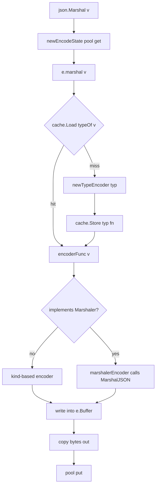

# encoding/json Source — Middle

## 1. The shape of the package

`encoding/json` is one of the most-read packages in the Go standard library because everyone hits it, and almost everyone hits a limitation. At middle depth the file map is what matters:

| File | Responsibility |
|------|----------------|
| `encode.go` | `Marshal`, `Encoder`, `encodeState`, the `typeEncoder` cache, per-kind encoders |
| `decode.go` | `Unmarshal`, `Decoder`, `decodeState`, value/object/array/literal dispatch |
| `scanner.go` | Incremental tokenizer — a small state machine over bytes |
| `stream.go` | `Encoder.Encode`, `Decoder.Decode`, buffered streaming |
| `tags.go` | `parseTag` — splits `"name,omitempty,string"` into name + options |
| `fold.go` | Case-insensitive ASCII field matching for `Unmarshal` |
| `indent.go` | `MarshalIndent`, `Indent`, `Compact` |

Marshal and Unmarshal are reflect-driven. The scanner is reflection-free. Performance reality lives at the seam between the two.

---

## 2. Marshal — the source flow

`json.Marshal(v)` does five things in order:

1. `e := newEncodeState()` — pulls an `encodeState` from a `sync.Pool`.
2. `err := e.marshal(v, encOpts{escapeHTML: true})` — top-level entry.
3. Inside `marshal`, a `defer/recover` catches `jsonError` panics from deep encoders.
4. `valueEncoder(rv)` returns a cached encoder function for the runtime type.
5. The encoder writes JSON bytes into `e.Buffer` (an embedded `bytes.Buffer`).

Sketch:

```go
func Marshal(v any) ([]byte, error) {
    e := newEncodeState()
    defer encodeStatePool.Put(e)

    err := e.marshal(v, encOpts{escapeHTML: true})
    if err != nil {
        return nil, err
    }
    buf := append([]byte(nil), e.Bytes()...)
    return buf, nil
}
```

The pool reuse is meaningful: every `Marshal` call avoids a fresh `bytes.Buffer` allocation. The returned slice is a *copy* of the buffer because the buffer goes back to the pool.

---

## 3. The `typeEncoder` cache

The core trick: reflect is expensive, so the package builds an encoder *function* per Go type once and caches it.

```go
var encoderCache sync.Map // map[reflect.Type]encoderFunc

type encoderFunc func(e *encodeState, v reflect.Value, opts encOpts)

func typeEncoder(t reflect.Type) encoderFunc {
    if fi, ok := encoderCache.Load(t); ok {
        return fi.(encoderFunc)
    }
    // ... build encoder, handle recursive types with a wait group,
    // then encoderCache.Store(t, f)
}
```

A recursive type (a linked list with a `Next *Node`) would deadlock during construction; the package handles this with an indirect pointer that's resolved once the encoder is built.

Net effect: the first marshal of a new type pays the reflect cost; subsequent marshals of the same type hit a `sync.Map.Load`.

---

## 4. The per-kind encoders

`newTypeEncoder` picks a function based on `reflect.Kind`:

| Kind | Encoder | Notes |
|------|---------|-------|
| `Bool` | `boolEncoder` | writes `true`/`false` literals |
| `Int*`, `Uint*` | `intEncoder`, `uintEncoder` | uses `strconv.AppendInt` |
| `Float32`, `Float64` | `floatEncoder` | rejects NaN/Inf with `UnsupportedValueError` |
| `String` | `stringEncoder` | runs `encodeString` with HTML-escape pass |
| `Slice` | `sliceEncoder` | nil slice → `null`; otherwise `[...]` |
| `Array` | `arrayEncoder` | fixed length, always `[...]` |
| `Map` | `mapEncoder` | sorts keys for deterministic output |
| `Struct` | `structEncoder` | uses precomputed field list |
| `Ptr` | `ptrEncoder` | dereferences; nil → `null` |
| `Interface` | `interfaceEncoder` | unwraps then re-dispatches |
| `Func`, `Chan`, `Complex*` | `unsupportedTypeEncoder` | returns `UnsupportedTypeError` |

Two pre-dispatch checks happen before kind-based dispatch:

1. Does the type implement `json.Marshaler`? Use `marshalerEncoder`.
2. Does it implement `encoding.TextMarshaler`? Use `textMarshalerEncoder`.

Both are checked on the value type *and* the pointer type, which is why `func (T) MarshalJSON()` and `func (*T) MarshalJSON()` behave differently for non-addressable values.

---

## 5. `structEncoder` — the busiest one

For a struct, the encoder is built once via `typeFields(t)`, which:

- Walks all fields (depth-first, respecting embedding).
- Parses each tag with `parseTag`.
- Skips unexported fields (`PkgPath != ""`).
- Resolves name conflicts using Go's dominant-field rules.
- Returns a sorted `[]field` with precomputed indexes, name bytes, and option flags.

The runtime encoder loop is roughly:

```go
func (se structEncoder) encode(e *encodeState, v reflect.Value, opts encOpts) {
    next := byte('{')
FieldLoop:
    for i := range se.fields.list {
        f := &se.fields.list[i]
        fv := fieldByIndex(v, f.index)
        if f.omitEmpty && isEmptyValue(fv) {
            continue FieldLoop
        }
        e.WriteByte(next)
        next = ','
        e.WriteString(f.nameNonEsc) // precomputed `"name":`
        opts.quoted = f.quoted
        f.encoder(e, fv, opts)
    }
    if next == '{' {
        e.WriteString("{}")
    } else {
        e.WriteByte('}')
    }
}
```

Notable details:

- The leading-byte trick (`next` starts as `{`, becomes `,`) avoids an `if first` check per field.
- `nameNonEsc` is precomputed once per type — the field name doesn't get re-quoted on every marshal.
- `isEmptyValue` for `omitempty` treats zero numbers, false bools, empty strings/slices/maps and nil pointers as empty. It does *not* treat zero structs as empty (a long-standing complaint).

---

## 6. `parseTag` in `tags.go`

The tag parser is tiny:

```go
type tagOptions string

func parseTag(tag string) (string, tagOptions) {
    tag, opt, _ := strings.Cut(tag, ",")
    return tag, tagOptions(opt)
}

func (o tagOptions) Contains(optionName string) bool {
    if len(o) == 0 { return false }
    s := string(o)
    for s != "" {
        var next string
        i := strings.Index(s, ",")
        if i >= 0 {
            s, next = s[:i], s[i+1:]
        }
        if s == optionName { return true }
        s = next
    }
    return false
}
```

That's the whole "tag system". Tags like `"id,omitempty,string"` become `("id", "omitempty,string")`, then `Contains("omitempty")` is called inside `typeFields`. The `,string` option forces numeric/bool values to be encoded as quoted strings — useful for JavaScript's bigint precision loss.

---

## 7. Unmarshal — the source flow

`json.Unmarshal(data, v)` is roughly:

1. `d := newDecodeState()` — pool-backed.
2. `d.init(data)` — copies/refers to the input bytes.
3. `checkValid(data, &d.scan)` — runs the scanner over the whole input *first* to validate JSON before mutating `v`.
4. `d.value(rv)` — walks the input, dispatching on the next token.

Inside `value`:

```go
switch d.opcode {
case scanBeginArray:
    d.array(v)
case scanBeginObject:
    d.object(v)
case scanBeginLiteral:
    d.literalStore(d.data[start:d.readIndex()], v, false)
}
```

Three buckets — array, object, literal — and that's the whole top-level dispatch. `literal` handles `true`, `false`, `null`, numbers, and strings.

The two-pass design (validate first, then decode) is why `Unmarshal` won't half-fill your struct on a syntax error: the scanner has already rejected the input before any reflect happens.

---

## 8. The scanner — `scanner.go`

The scanner is a small explicit state machine. Each call to `scan.step(c)` returns the next opcode (`scanContinue`, `scanBeginLiteral`, `scanBeginObject`, `scanEnd`, `scanError`, ...). State is held in a stack of "parse states" (`parseObjectKey`, `parseObjectValue`, `parseArrayValue`).

It is:

- **Byte-at-a-time.** No regex, no reflection.
- **Allocation-free for valid input.** All state lives on the `scanner` struct.
- **Streaming-capable.** `Decoder` calls into it incrementally, feeding bytes from its read buffer.

The scanner is the only piece of `encoding/json` that's actually fast on its own. Most of the package's overhead is the reflect layer above it.

---

## 9. `Encoder` and `Decoder` — stream.go

```go
type Encoder struct {
    w          io.Writer
    err        error
    escapeHTML bool
    indentBuf  []byte
    indentPrefix string
    indentValue  string
}

func (enc *Encoder) Encode(v any) error {
    e := newEncodeState()
    defer encodeStatePool.Put(e)
    err := e.marshal(v, encOpts{escapeHTML: enc.escapeHTML})
    if err != nil { return err }
    e.WriteByte('\n') // streaming form is newline-delimited
    _, err = enc.w.Write(e.Bytes())
    return err
}
```

`Encoder` reuses the `encodeState` pool too; each `Encode` call gets a fresh state (so concurrent `Encode` calls on different encoders are fine, but two goroutines on the *same* encoder are not).

`Decoder` keeps an internal buffer:

```go
type Decoder struct {
    r       io.Reader
    buf     []byte
    d       decodeState
    scanp   int    // next index in buf
    scan    scanner
    err     error
    ...
}

func (dec *Decoder) Decode(v any) error {
    // 1. refill buffer until one complete JSON value is present
    // 2. dec.d.init(dec.buf[dec.scanp:dec.scanp+n])
    // 3. dec.d.unmarshal(v)
    // 4. advance scanp past the consumed bytes
}
```

`Decode` returns one JSON value per call — exactly what you want for newline-delimited JSON or chunked streams.

---

## 10. `Marshaler` / `Unmarshaler` dispatch

Interface dispatch happens *before* the reflect fallback. The encoder build path looks like:

```go
func newTypeEncoder(t reflect.Type, allowAddr bool) encoderFunc {
    if t.Implements(marshalerType) {
        return marshalerEncoder
    }
    if t.Kind() != reflect.Pointer && allowAddr &&
        reflect.PointerTo(t).Implements(marshalerType) {
        return newCondAddrEncoder(addrMarshalerEncoder, newTypeEncoder(t, false))
    }
    if t.Implements(textMarshalerType) { return textMarshalerEncoder }
    // ... addressable text marshaler check ...
    switch t.Kind() {
    case reflect.Bool:   return boolEncoder
    case reflect.Int, ...: return intEncoder
    // etc.
    }
}
```

`condAddrEncoder` is interesting: when the value is addressable, it uses the pointer-receiver `MarshalJSON`; when not (e.g., a map value), it falls back to the field-by-field encoder. This is why `json.Marshal(myMap)` may *not* call `MarshalJSON` on map values whose receiver is `*T`.

---

## 11. `RawMessage` — the delayed-parse escape hatch

```go
type RawMessage []byte

func (m RawMessage) MarshalJSON() ([]byte, error) {
    if m == nil { return []byte("null"), nil }
    return m, nil
}

func (m *RawMessage) UnmarshalJSON(data []byte) error {
    if m == nil { return errors.New("json.RawMessage: UnmarshalJSON on nil pointer") }
    *m = append((*m)[0:0], data...)
    return nil
}
```

It implements both interfaces. On decode it captures raw bytes without parsing; on encode it emits them verbatim. Use cases: routing on a discriminator field then decoding the payload with the right concrete type, proxying unknown shapes, deferred validation.

---

## 12. Marshal flow at a glance



The branch you spend most of your CPU on is the green `kind-based encoder` path. The cache lookup is cheap; the reflect-driven field walk inside `structEncoder` is the real cost.

---

## 13. The performance reality

`encoding/json` is reflect-based. Benchmarks consistently show it's 2–4× slower than codegen alternatives for typical struct payloads.

| Library | Approach | Typical speedup over stdlib |
|---------|----------|------------------------------|
| `encoding/json` | reflect + cached encoders | 1× (baseline) |
| `json-iterator/go` | reflect + assembly + tighter loops | ~2× |
| `mailru/easyjson` | code generation (no reflect at runtime) | ~3–5× |
| `bytedance/sonic` | JIT + SIMD on amd64 | ~3–8× |
| `goccy/go-json` | reflect + opcode-VM precompile | ~2–3× |

The stdlib choice is fine for 99% of services. You only need an alternative when you're serializing tens of MB per second per core or hot-pathing many tiny objects. The downside of every alternative is a foreign API or a build step.

---

## 14. Common middle-level mistakes

- **Anonymous struct without tags.** `struct{ ID int }` serializes as `{"ID":1}`. Add `json:"id"` or your API contract is broken.
- **Decoding into `interface{}`.** You get `map[string]interface{}` and `[]interface{}` — every field then needs a type assertion. Use a concrete struct or `RawMessage`.
- **Missing pointer for nullable fields.** `int` can't distinguish "absent" from "zero". Use `*int` (or `sql.NullInt64`-style) and write a `MarshalJSON` if you need omit-on-null.
- **`omitempty` on a struct value.** It never matches; zero structs aren't "empty". Use a pointer to the struct.
- **Large payloads with `Unmarshal`.** It copies the whole input first for validation. For huge payloads, use `Decoder` and stream.
- **Calling `Marshal` in a hot loop with the same type.** That's fine — the cache helps. But marshalling many *different* types churns `sync.Map`. Pre-warm at startup if you care.
- **`MarshalJSON` on a value receiver but always passing the value through a map.** The pointer-method path won't be taken; you'll silently get default encoding.
- **Forgetting that `json.Number` exists.** Decoding numbers into `interface{}` loses precision (you get `float64`). `decoder.UseNumber()` gives you a `json.Number` instead.

---

## 15. Summary

`encoding/json` is a reflect-driven encoder/decoder with a per-type encoder cache (`typeEncoder`), kind-based dispatch (`intEncoder`, `structEncoder`, etc.), a small explicit-state-machine scanner, and a tiny tag parser. `Marshal` builds an encoder once per type and reuses it; `Unmarshal` validates the whole input via the scanner before mutating `v`. `Encoder`/`Decoder` stream by buffering bytes and dispatching one JSON value at a time. The package is correct, pleasant to use, and slow by modern standards — knowing where the reflect cost lives is what lets you decide when to reach for `easyjson` or `sonic`.

---

## Further reading
- `encoding/json/encode.go` — `Marshal`, `typeEncoder`, all per-kind encoders
- `encoding/json/decode.go` — `Unmarshal`, `value`/`object`/`array`/`literal`
- `encoding/json/scanner.go` — the state machine
- `encoding/json/stream.go` — `Encoder` and `Decoder` buffering
- `encoding/json/tags.go` — `parseTag`, `tagOptions.Contains`
- `mailru/easyjson` — codegen alternative
- `bytedance/sonic` — JIT/SIMD alternative
- proposal `encoding/json/v2` — discussion of stdlib evolution
