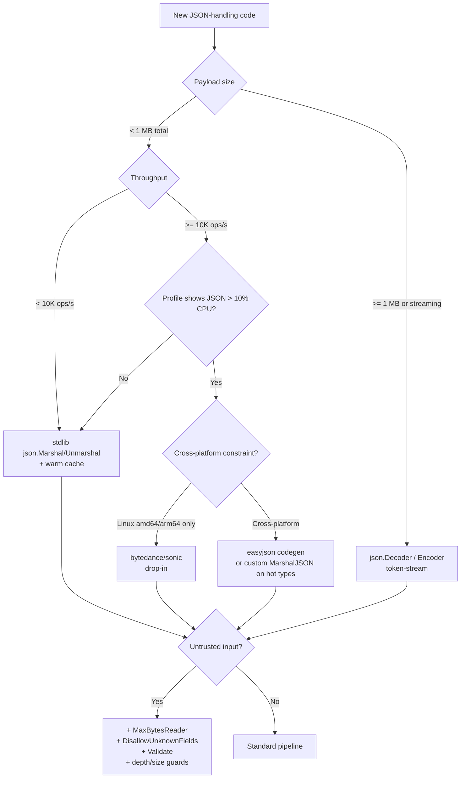
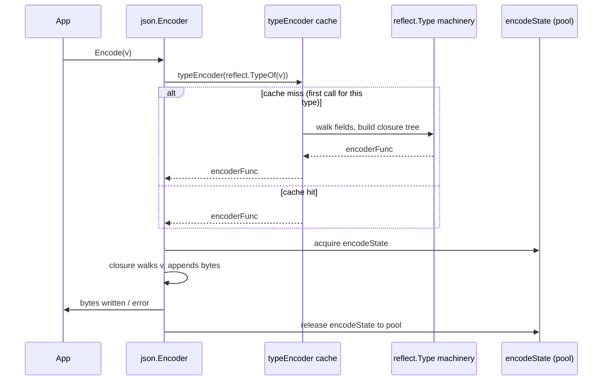

# `encoding/json` — Senior

## 1. Mental model — reflect cache, two-phase pipeline, where the cost lives

At senior level, `encoding/json` is not "the JSON library" — it is **a reflect-driven, cache-amortized, allocation-heavy codec** with one fast path (custom marshalers, primitive types) and one slow path (anything else). Every `json.Marshal` / `json.Unmarshal` call is a two-phase pipeline:

1. **Type compile** — for a given `reflect.Type`, build a tree of encoder/decoder closures keyed off the struct fields, tags, embedded types, and method set. This happens once per process per type and is cached in a `sync.Map` (`typeEncoder` / `typeFields`).
2. **Run** — execute the closures against the concrete value, producing or consuming bytes.

The phase-1 cost is the surprise: ~50–200 µs for a struct of 10 fields the first time it is marshalled, dropping to ~200 ns/field for steady state. Cold-path latency in tail-sensitive services is dominated by **first-encounter reflect compilation**, not steady-state encoding.

Cache key is `reflect.Type` — an interface value containing a `*runtime._type` pointer. Comparison is pointer equality. Two structurally identical types in different packages do **not** share a cache entry — they are different types. This bites code generators that emit anonymous structs per request: every request is a cache miss, and the cache grows without bound because `reflect.Type` is never released.

```
                  ┌──────────────────────────────────────┐
                  │  json.Marshal(v) / json.Unmarshal(b) │
                  └──────────────────┬───────────────────┘
                                     │
                       ┌─────────────▼─────────────┐
                       │  typeEncoder(reflect.Type)│   sync.Map cache
                       │  miss → compile, store    │   key: *rtype
                       │  hit  → return closure    │   value: encoderFunc
                       └─────────────┬─────────────┘
                                     │
                       ┌─────────────▼─────────────┐
                       │  encoder closure tree     │   structFieldEnc,
                       │  walks fields, calls      │   sliceEnc, mapEnc,
                       │  field-level encoders,    │   marshalerEnc, ...
                       │  writes to encodeState    │
                       └─────────────┬─────────────┘
                                     │
                       ┌─────────────▼─────────────┐
                       │  encodeState → []byte     │   bytes.Buffer + scratch
                       └───────────────────────────┘
```

Where time goes on a marshal of a 10-field struct, second call onward: ~30% field iteration via reflect, ~25% `appendString` for keys, ~20% string escaping, ~15% per-field type dispatch, ~10% buffer growth. Where allocations come from on the same call: one `*encodeState` from the pool (zero if pooled), one `[]byte` for the result (always heap), zero per field for primitives, **one per `interface{}` boxed value**. The senior heuristic — *the cost of `encoding/json` is the cost of the dynamic dispatch you forced it to do*. Concrete types, no `interface{}`, no `map[string]any` → 5×–10× faster than the same data shaped as `any`.

Senior framing: **`encoding/json` is correctness-first, performance-second by design**. The Go team has resisted breaking changes for a decade. When you need more, the answer is rarely "configure it harder" — it is either custom `MarshalJSON`, codegen, or a drop-in replacement.

---

## 2. The reflect cache — `typeEncoder`, `typeFields`, what gets cached, what leaks

Inside `encoding/json/encode.go`:

```go
var encoderCache sync.Map // map[reflect.Type]encoderFunc

func typeEncoder(t reflect.Type) encoderFunc {
    if fi, ok := encoderCache.Load(t); ok { return fi.(encoderFunc) }
    // ... compile, store, return
}
```

`typeFields` does the same for struct field metadata: name, tag, index path, omitempty flag, quoted flag. Compilation walks the type recursively — embedded structs, anonymous fields, pointer chases — and emits a flat `[]field` sorted by Go's name-resolution rules (shallowest wins, tags beat names). The `typeFields` cache is keyed by `reflect.Type` and is the single largest stdlib cache that most services never inspect.

**What gets cached**: encoder closures, decoder closures, `[]field` field plans, name-to-field maps used by the decoder. **What does not**: the actual `[]byte` output. **What leaks**: any `reflect.Type` you generate dynamically — anonymous structs in handler functions, types built via `reflect.StructOf`, types from plugins. Each unique `reflect.Type` adds one entry that lives for the lifetime of the process.

Audit a service for cache health by running with `GODEBUG=allocfreetrace=1` on the suspect path, or by instrumenting with `runtime.NumGoroutine`-style counters around a pprof heap snapshot. A cache with 50 entries is healthy. 50,000 entries means something is generating types at request time.

**Pre-warming the cache** is the cheapest production win. At startup, marshal one zero-value of every known DTO:

```go
func warmJSON(types ...any) {
    for _, t := range types {
        if _, err := json.Marshal(t); err != nil { panic(err) }
    }
}

func init() {
    warmJSON(
        UserDTO{}, OrderDTO{}, PaymentDTO{},
        ErrorResponse{}, HealthCheck{},
    )
}
```

The first request now hits a hot cache. P99 latency on cold endpoints drops by the compile cost — often 30–80 µs per first encode. For autoscaled fleets that churn instances, this is not micro-optimization — it is the difference between green and red dashboards during a deploy.

---

## 3. `Encoder` / `Decoder` — streaming, reuse, and what they actually save

`json.Marshal(v)` is `json.NewEncoder(&buf).Encode(v)` plus convenience. The reusable form is the `Encoder`:

```go
enc := json.NewEncoder(w)
enc.SetEscapeHTML(false)
enc.SetIndent("", "")
for _, item := range stream { _ = enc.Encode(item) }
```

What reuse buys: the internal `encodeState` (a `bytes.Buffer` + scratch) is held across `Encode` calls, halving allocations on hot loops. What it does **not** buy: skipping the reflect cache lookup — that is per-type, not per-call. Reuse `Encoder` when (a) writing many values to one stream, (b) the writer is a network connection where flushing matters, (c) you want to flip `SetEscapeHTML(false)` once.

`Decoder` is the dual and has one critical property `Unmarshal` lacks: **incremental token-stream parsing**. `Unmarshal` allocates a slice large enough to hold the whole document tokenized in memory. For a 500 MB JSON array, that is 500 MB of token storage on top of the destination value. `Decoder` reads token-by-token; with `Decode` per element of an array, peak memory is O(one-element).

```go
dec := json.NewDecoder(r)
dec.UseNumber()                  // arbitrary-precision numbers as json.Number
dec.DisallowUnknownFields()      // strict schema
if _, err := dec.Token(); err != nil { return err } // consume '['
for dec.More() {
    var item Item
    if err := dec.Decode(&item); err != nil { return err }
    process(item)
}
```

This is the **only correct way to read large JSON arrays** in stdlib. Senior teams enforce it via lint: any `json.Unmarshal` on a request body without a max-size guard is a review block.

`SetEscapeHTML(false)` matters: by default, `<`, `>`, `&` are escaped to `<` etc. for safety in HTML contexts. For pure API JSON, this is wasted bytes and CPU. Disable on every non-HTML codepath and benchmark — 5–15% wire size reduction on payloads with URLs or markup.

---

## 4. Numbers — the precision trap

JSON has one numeric type. Go has many. The default decode of a JSON number into `interface{}` is `float64`. That is a footgun:

- `9007199254740993` (2^53 + 1) decodes to `9007199254740992.0` — silent precision loss.
- `1.7976931348623157e308` is at the float64 limit; one more zero is `+Inf`.
- Integer comparison after decode is float comparison — `==` works only inside the safe-integer range.

Three fixes, ordered by rigour:

1. **Strong-typed structs** — decode into `int64`, `uint64`, `float64` as appropriate. Compiler enforces the precision contract.
2. **`UseNumber()`** — preserves the lexical form as `json.Number` (`type Number string`); call `.Int64()` or `.Float64()` explicitly at the consumer.
3. **String-tagged fields** — `json:"id,string"` requires the wire form to be `"42"` and decodes into the Go integer type without going through float. This is the only way to safely cross a JavaScript boundary with 64-bit IDs.

JavaScript's `Number` is IEEE 754 double. IDs greater than `Number.MAX_SAFE_INTEGER` (2^53 − 1) corrupt in JS. Postmortems for "user X was charged twice" frequently end at "the JS client rounded the 19-digit transaction ID to a neighbour". The fix is wire-format: serialize big integers as **strings**, document the contract, and use `json:"id,string"` on the Go side.

```go
type Tx struct {
    ID     int64  `json:"id,string"`        // safe across JS
    Amount string `json:"amount"`           // money is never a float
    Fee    json.Number `json:"fee"`         // preserve precision until applied
}
```

Money is the special case of numbers: never use `float64` for currency. Either a fixed-point integer (cents) or a decimal string. JSON's lack of a decimal type means the wire form is either string or integer; the application converts to `shopspring/decimal` or equivalent inside the boundary.

---

## 5. Custom marshalers — when reflect is the bottleneck

`json.Marshaler` / `json.Unmarshaler` short-circuit the reflect path for one type:

```go
type Timestamp time.Time

func (t Timestamp) MarshalJSON() ([]byte, error) {
    return []byte(strconv.Quote(time.Time(t).UTC().Format(time.RFC3339Nano))), nil
}

func (t *Timestamp) UnmarshalJSON(b []byte) error {
    s, err := strconv.Unquote(string(b))
    if err != nil { return err }
    parsed, err := time.Parse(time.RFC3339Nano, s)
    if err != nil { return err }
    *t = Timestamp(parsed)
    return nil
}
```

Custom marshalers are 5–20× faster than the reflect path for the affected type because they skip field iteration, tag parsing, and dispatch. They also let you encode types with no exported fields (a UUID stored as `[16]byte`), enforce invariants (reject negative durations), and normalize representation (always UTC, always lowercase).

Cost: every custom marshaler is hand-written code that can drift from the type. Test invariants: round-trip (`Unmarshal(Marshal(x)) == x`), boundary values, error paths. **`encoding.TextMarshaler` is preferred for scalars** — it composes with map keys, URL queries, and other codecs. `json.Marshaler` takes precedence over `TextMarshaler`; implement both only when JSON needs a different shape from text.

When to write a custom marshaler:

- The type is on a hot path (>10K marshals/sec).
- The default representation is wrong (durations as nanoseconds vs. RFC3339).
- The type wraps something the reflect path cannot handle (UUID, decimal, enum-as-string).
- Validation must happen at decode time (rejecting NaN, enforcing a regex).

When not: a one-off DTO that marshals at request rate. The reflect path is fast enough.

---

## 6. Codegen and drop-in replacements — `easyjson`, `jsoniter`, `sonic`, `go-json`

The reflect tax is real, and four mature alternatives exist. Each trades something:

| Library | Approach | Speed (vs stdlib) | Allocations | Compat | Cost |
|---------|----------|-------------------|-------------|--------|------|
| `easyjson` (mailru) | Codegen via `go generate` | 4–10× | Near zero | Drop-in via generated `Marshal*` methods | Build step; generated files |
| `ffjson` | Codegen, older | 2–4× | Low | Drop-in | Unmaintained — avoid |
| `jsoniter` | Reflect + lazy parsing | 1.5–3× | Lower | API-compat with stdlib | Subtle behaviour diffs (tag parsing) |
| `bytedance/sonic` | JIT + SIMD (amd64/arm64) | 3–8× | Low | API-compat | Heavy runtime; amd64/arm64 only |
| `goccy/go-json` | Codegen-like (compiled per type at first use) | 2–5× | Lower | Drop-in | Memory cost of compiled encoders |

**When stdlib is enough**: handler that marshals <1K req/s of <10 KB payloads → stdlib, with `Encoder` reuse and warming. CPU profile shows JSON <2% of time → stdlib. Streaming → stdlib `Decoder`.

**When stdlib is not**: JSON is >10% of CPU in profile; payloads are >100 KB; >50K marshals/sec sustained; the service is a JSON proxy where bytes-in equals bytes-out. The first switch is usually `sonic` (zero code change on amd64) or `easyjson` (codegen, predictable). Both should be benchmarked on your real payload — synthetic benchmarks lie.

**Why not always use `sonic`?** Heavy runtime (init time, binary size), platform restrictions, slightly different error messages that break tests asserting on error strings, and the JIT increases first-call latency on tiny payloads. For the common case — moderate throughput, mixed payload sizes — stdlib + warm cache + `Encoder` reuse + selective custom marshalers reaches 80% of the throughput at 20% of the operational risk.

---

## 7. Struct tags — `omitempty`, `string`, named tags, and the zero-value problem

Tags drive the field plan. The five forms that matter:

```go
type User struct {
    ID        int64     `json:"id,string"`             // wire as string
    Email     string    `json:"email"`                 // rename
    Age       *int      `json:"age,omitempty"`         // omit if nil
    Tags      []string  `json:"tags,omitempty"`        // omit if nil OR empty
    LastLogin time.Time `json:"last_login,omitempty"`  // BUG: never empty
    Internal  string    `json:"-"`                     // never serialize
    Computed  string    `json:"-,"`                    // literal field name "-"
}
```

`omitempty` semantics are exact and surprising:

- **Empty** = the type's zero value: `0`, `0.0`, `""`, `false`, nil pointer/map/slice/interface, length-0 slice/map/string.
- **`time.Time` is never empty** by `omitempty` because the zero `time.Time` is a non-zero struct value. Wrap in `*time.Time` or write a custom marshaler.
- `omitempty` on a struct field never omits — there is no "zero struct" check. Use pointer-to-struct.
- The **explicit zero vs. omitted** distinction is not representable for value types — both look like the zero value to `omitempty`. Use pointers or a `optional[T]` wrapper when the API contract distinguishes "not provided" from "provided as zero".

```go
// Wrong — cannot distinguish "user did not set credit" from "user set it to 0".
type Patch struct { Credit float64 `json:"credit,omitempty"` }

// Right — nil means "not provided".
type Patch struct { Credit *float64 `json:"credit,omitempty"` }
```

This is the bug behind ~30% of "PATCH endpoint silently ignored my zero" tickets. Senior policy: **for PATCH/PUT DTOs distinguishing absence, use pointers everywhere**.

The `,string` tag is the JS-precision fix from section 4 — apply on every 64-bit numeric field that crosses to JS or to any client whose JSON parser uses double-precision.

Snake_case via named tags is non-negotiable for any external API. Convention check at review: every exported field on a wire DTO has an explicit `json:` tag, even when the default name happens to match — explicit beats fragile.

---

## 8. Strict decoding — `DisallowUnknownFields`, `UseNumber`, schema validation

`encoding/json` is lenient by default: unknown fields are silently dropped, type mismatches that can be coerced are coerced, duplicates take the last value. For an internal service consuming untrusted input — a webhook, a public API — that is the wrong default.

```go
dec := json.NewDecoder(r.Body)
dec.DisallowUnknownFields()
if err := dec.Decode(&req); err != nil {
    return apierr.BadRequest("invalid JSON: %v", err)
}
```

`DisallowUnknownFields` catches schema drift — a client sending `email_address` to a `email` field gets a clear error instead of silently losing data. It is also a versioning signal: if you ever need to evolve the schema by adding fields and accepting old clients, you cannot use strict decoding on the old endpoint. Strict decoding belongs on **typed internal APIs**, lenient decoding on **public/external APIs**.

`UseNumber` is the precision guard. Combined with `DisallowUnknownFields`, it gives strict-typed, precision-safe decoding — the closest stdlib has to schema enforcement.

`encoding/json` does **not** validate schemas — no required-field enforcement (`omitempty` is encode-side only), no enum checking, no regex constraints, no range bounds. Pair with:

- `github.com/go-playground/validator` for struct-tag declarative validation;
- `github.com/xeipuuv/gojsonschema` or `github.com/santhosh-tekuri/jsonschema` for JSON Schema enforcement;
- Hand-rolled `Validate()` methods on DTOs for domain invariants.

The senior pattern is **layered**: stdlib `Decode` for shape, validator for declarative constraints, `Validate()` for invariants the type system cannot express. Errors at each layer have distinct HTTP responses (400 vs 422 vs 409).

---

## 9. `json.RawMessage` — delayed parsing, proxies, polymorphism

`json.RawMessage` is `type RawMessage []byte` that implements both `Marshaler` and `Unmarshaler` as identity — the bytes go through unmodified. It is the escape hatch for three production patterns:

**Polymorphic decode by discriminator**:

```go
type Envelope struct {
    Type    string          `json:"type"`
    Payload json.RawMessage `json:"payload"`
}

func Dispatch(b []byte) error {
    var env Envelope
    if err := json.Unmarshal(b, &env); err != nil { return err }
    switch env.Type {
    case "user.created":
        var p UserCreated
        if err := json.Unmarshal(env.Payload, &p); err != nil { return err }
        return handleUserCreated(p)
    case "order.placed":
        var p OrderPlaced
        if err := json.Unmarshal(env.Payload, &p); err != nil { return err }
        return handleOrderPlaced(p)
    }
    return fmt.Errorf("unknown event type: %s", env.Type)
}
```

Two-pass decode — outer for discriminator, inner for typed payload. No `interface{}`, no second wire format.

**Proxy / passthrough services**: a gateway that adds a header but should not re-encode the payload. `RawMessage` preserves byte-exactness (including key order, whitespace, number representation) which `interface{}` round-tripping destroys.

**Wrapper types** that combine static fields with arbitrary user data:

```go
type Audit struct {
    Actor     string          `json:"actor"`
    Action    string          `json:"action"`
    Timestamp time.Time       `json:"ts"`
    Details   json.RawMessage `json:"details,omitempty"` // domain-specific
}
```

`Details` is opaque at the audit layer; consumers decode it per-actor.

Pre-allocate `RawMessage` to skip the slice-header allocation on the encode side. On the decode side, the bytes are copied — never returned to the caller's buffer — so the slice is safe to retain.

---

## 10. Security — JSON DoS, depth, size, billion laughs

Untrusted JSON is hostile until proven otherwise. The attack surface:

- **Unbounded body size** — a 10 GB request body crashes the process before parsing fails. Always `http.MaxBytesReader(w, r.Body, maxJSONSize)` (8–64 KB for typical APIs, higher for known upload paths).
- **Deep nesting** — `[[[[[...]]]]]` blows the parser stack on recursive descent. Stdlib `encoding/json` has no public depth cap (unlike `encoding/xml`'s `MaxDepth`); the parser is iterative for objects/arrays but recursive for `Unmarshal` into nested struct types. A nesting depth of ~10,000 is the practical limit before goroutine stack growth becomes pathological.
- **Huge strings** — a 1 GB string field consumes 1 GB of heap regardless of struct shape. Cap field-level size by reading into `json.RawMessage` first, checking length, then decoding.
- **Wide objects** — 1M keys in one object exercise the field-name lookup and allocate one map entry each. With `DisallowUnknownFields`, the lookup is O(field count); without, it is still O(keys logged in the document).
- **Billion-laughs equivalent** — JSON has no entity expansion, but pointer/reference shenanigans via `$ref` (JSON Schema, JSON Pointer) can simulate it in libraries that resolve refs. Stdlib does not, but downstream resolvers might.
- **Number-of-tokens explosion** — a 1 MB document of `[1,1,1,1,...]` produces N float64 allocations. Cap by total size and by `Decoder` token count if streaming.

The defensive stack for an HTTP handler:

```go
const maxJSONBody = 1 << 20 // 1 MiB

r.Body = http.MaxBytesReader(w, r.Body, maxJSONBody)
dec := json.NewDecoder(r.Body)
dec.DisallowUnknownFields()
var req CreateUserRequest
if err := dec.Decode(&req); err != nil {
    return apierr.BadRequest("invalid request: %v", err)
}
if dec.More() {
    return apierr.BadRequest("trailing data after JSON document")
}
if err := req.Validate(); err != nil {
    return apierr.Unprocessable(err)
}
```

`dec.More()` after `Decode` catches the "two JSON documents concatenated" attack — a parser bug surface in many proxies. Size cap, strict fields, validation, no trailing data — four cheap controls that close most JSON-DoS reports.

---

## 11. `encoding/json/v2` — proposal 71497, what changes, what to do today

The Go team has accepted (as experimental) `encoding/json/v2` (proposal #71497), targeting Go 1.25+ behind a build tag. The motivation is a decade of accumulated correctness and performance debt that cannot be fixed without breaking v1 callers:

- **Streaming-first design** — `v2.Marshal` is built on the streaming encoder, eliminating the `[]byte` allocation for the common case of writing to a writer.
- **`omitzero`** — the missing semantic from section 7. Omits if the value equals the type's zero value, correctly handling `time.Time{}`, custom types via `IsZero()`, and structs.
- **Configurable behaviour via options** — `json.WithIndent`, `json.WithEscapeHTML(false)`, `json.AllowDuplicateNames(false)`, `json.PreserveRawNumbers` as values passed to `Marshal`/`Unmarshal` rather than encoder methods.
- **Faster reflect path** — redesigned encoder cache, fewer allocations, ~2× steady-state speedup on the benchmark suite without codegen.
- **Better error messages** — typed errors with field path, line/column, expected/actual.
- **Strict by default** — duplicate keys are an error; unknown fields error toggle is the default opposite of v1.
- **`MarshalerTo` / `UnmarshalerFrom`** — streaming marshaler interfaces taking an `*Encoder` / `*Decoder` directly, avoiding the `[]byte` round-trip in custom marshalers.

Today's actions: do not bet production on v2 yet — it is experimental, the API will move. Do design new code so the migration is one-line: keep tags simple, avoid relying on v1 quirks (silent unknown fields, `omitempty` on time.Time), keep custom marshalers small. When v2 stabilizes, the common path will be a search-and-replace from `encoding/json` to `encoding/json/v2`.

---

## 12. Architecture and decision flow





---

## 13. Code review red flags

| Smell | Why it bites | Fix |
|-------|--------------|-----|
| `var x interface{}; json.Unmarshal(b, &x)` for a known shape | Forces map[string]any, loses types, 5× slower | Decode into a concrete struct |
| `json.Unmarshal` on `r.Body` with no `MaxBytesReader` | OOM on adversarial input | Wrap body with size cap |
| Missing `json:` tag on exported field crossing the wire | Field name leaks Go identifier conventions | Add explicit tag on every wire DTO field |
| `omitempty` on `time.Time` | Never omits — zero is non-empty struct | Use `*time.Time` or wait for `omitzero` |
| 64-bit `int64` field with no `,string` tag for JS client | Silent precision loss above 2^53 | `json:"id,string"` |
| `_ = json.Marshal(v)` — error ignored | `Marshal` can fail on cycles, unsupported types | Handle error; log + fallback |
| `json.Unmarshal` inside a loop with no profile | Cold cache hit each type, hot CPU | Profile; switch to `Decoder` reuse or codegen |
| `Decode` without `DisallowUnknownFields` on internal API | Schema drift goes silent | Strict decode on internal APIs |
| `Decode` without `UseNumber` on financial data | Float coerces 64-bit IDs | `UseNumber` or `json.Number` typed field |
| Same `json.NewDecoder` not reused across stream elements | Re-allocates state per element | Reuse `Decoder` for entire stream |
| Anonymous struct in handler function | One reflect-cache entry per request | Hoist to package-level type |
| Custom `MarshalJSON` returning unstable output | Round-trip test fails | Lock format; round-trip test in unit tests |
| `json.Marshal(map[string]any{...})` for known shape | Allocates map + boxes values | Define a struct |
| Returning raw `error.Error()` from `json.Unmarshal` to client | Leaks internal field names, struct layout | Map to sanitized API error |
| `r.Header.Get("Content-Type")` not checked before decode | Accepts non-JSON, decodes garbage | Enforce `application/json` |
| No body close: `r.Body` left open | FD leak under load | `defer r.Body.Close()` (or rely on `http.Server`) |
| `json:",inline"` (does not exist in stdlib) | YAML-ism leaking | Use embedded struct without tag |

---

## 14. Postmortems

**P1: schema drift silent data loss.** Mobile client v2.4 starts sending `email_address` to an endpoint expecting `email`. Server uses non-strict decode, field is dropped silently. Users sign up without emails for nine days before a CS ticket surfaces. Fix: `DisallowUnknownFields` on all internal-typed endpoints; contract tests against the OpenAPI spec; alert on count of records with empty critical fields. Cost: 22K user re-engagement campaign.

**P2: nested-payload OOM in webhook handler.** Partner integration starts sending 8 MB JSON with 12-deep nested arrays and a 6 MB embedded base64 string. `json.Unmarshal` allocates ~80 MB peak per request; under burst load the pod OOMs at 30 concurrent requests. Fix: `http.MaxBytesReader(_, r.Body, 256 KiB)` per partner; switch payload-bearing field to `json.RawMessage` and stream-decode the base64 separately. Cost: 14-minute degraded ingestion window.

**P3: precision loss on a billing ID.** Internal Go services pass `int64` order IDs as numbers in JSON. A new dashboard built in TypeScript consumes the same JSON; React Query infers `number`; IDs above 2^53 round to even values. Two unrelated orders deduplicate; one gets two charge attempts; refunds go out for the wrong customer. Fix: `json:"id,string"` on every cross-language ID field; lint rule rejecting `int64`/`uint64` without `,string` tag in DTOs; documentation in the API style guide. Cost: refund operations + audit.

**P4: cold-start latency on a JIT-autoscaled fleet.** Lambda-style autoscaling spins up instances on traffic spikes. P99 latency on the first 1000 requests per instance is 8× steady-state; investigation finds 6 ms in `typeEncoder` compilation for the 40 DTOs touched by the homepage. Fix: warm cache via `init()` marshalling every DTO zero value. P99 cold-start latency normalized to within 15% of warm. Cost: one afternoon of analysis, eight lines of code.

**P5: `interface{}` everywhere.** A search service decodes Elasticsearch responses into `map[string]interface{}` and walks them with type assertions. CPU profile shows 35% time in `mapassign_faststr` and `runtime.convT2E`. Refactor to typed `SearchHit[T]` with generics; CPU on the path drops 60%; allocations drop 75%. Cost: two weeks; budget approved against infrastructure savings.

**P6: duplicate-key acceptance.** A misbehaving client sends two `"amount"` keys per object; stdlib accepts the last. Two clients disagree about the value, both observe a successful 200 OK, ledger ends up inconsistent. Fix: switch to `jsoniter` configured to reject duplicates (stdlib has no toggle pre-v2); add canonical-form validation; v2 fixes this by default.

---

## 15. Senior code-review checklist

- [ ] Every exported field on a wire DTO has an explicit `json:` tag.
- [ ] 64-bit numeric IDs crossing to a JS or untyped client use `,string`.
- [ ] PATCH/PUT DTOs that distinguish absence from zero use pointer fields.
- [ ] `omitempty` is not used on `time.Time` value fields — pointer or custom marshaler.
- [ ] `http.MaxBytesReader` wraps every request body before decode.
- [ ] Internal endpoints use `DisallowUnknownFields`; public endpoints intentionally do not.
- [ ] Streaming payloads use `Decoder` token-by-token, not `Unmarshal` of the full slice.
- [ ] Long-lived streams reuse one `Encoder` / `Decoder`.
- [ ] Hot-path DTOs are pre-warmed in `init` via zero-value `json.Marshal`.
- [ ] No anonymous structs at request-handler scope — types are package-level.
- [ ] Custom `MarshalJSON`/`UnmarshalJSON` have round-trip unit tests and boundary tests.
- [ ] Errors from `Marshal`/`Unmarshal` are never silently discarded.
- [ ] Errors returned to clients are sanitized — internal field names not leaked.
- [ ] Financial values are integer minor units or decimal strings, never `float64`.
- [ ] `json.RawMessage` is used at all polymorphic decode boundaries (discriminator + payload).
- [ ] `dec.More()` is checked after `Decode` to reject trailing data.
- [ ] No `map[string]interface{}` decode for a known schema.
- [ ] `SetEscapeHTML(false)` on non-HTML output paths.
- [ ] Profiling has confirmed JSON cost before adopting a non-stdlib codec.
- [ ] If using `sonic`, build-tag fallback to stdlib exists for other platforms.
- [ ] Schema validation (validator or JSON Schema) runs after `Decode`.
- [ ] Depth guard exists — explicit cap or a parser that enforces one.
- [ ] No type-switch ladder on `interface{}` where a typed struct would do.

---

## 16. Closing principles

**The cost of `encoding/json` is the cost of the dynamic dispatch you forced.** Concrete types beat `interface{}` by an order of magnitude. Every `map[string]any` is a deliberate choice to pay reflect tax per field, per call, forever.

**Cache hot, cache warm, cache once.** Pre-warm at `init`. Reuse `Encoder`/`Decoder`. Hoist anonymous structs to package scope. The reflect cache is the single biggest steady-state win and the cheapest one.

**Strict by default on internal APIs, lenient by default on public APIs.** Schema drift kills internally where typing should catch it. External clients evolve; you cannot break them. The boundary between strict and lenient is the API boundary, not the codebase.

**Bound every input.** Body size, depth (where the parser allows), field size, total tokens. Untrusted JSON without bounds is one curl away from an OOM postmortem.

**Numbers cross language boundaries as strings.** 64-bit IDs, money, anything precision-sensitive. JS will round, Python's `json` will keep precision and silently disagree with JS, every audit will reconcile against the wrong source.

**Custom marshalers are surgical, not general.** Write them for hot types and types whose wire form differs from their Go form. Do not custom-marshal every DTO — the maintenance cost dwarfs the speed gain.

**Codegen is the answer when reflect is the bottleneck, not before.** Most services that adopt `easyjson`/`sonic` could have stayed on stdlib if they pre-warmed the cache, reused encoders, and removed `interface{}`. Profile first; switch second.

**`json.RawMessage` is the polymorphism primitive.** Two-pass decode with a discriminator beats every alternative — `interface{}`, type assertions, custom unmarshalers — for clarity and performance.

**`v2` is the future; v1 is the present.** Write code that will migrate cleanly: simple tags, small custom marshalers, no reliance on v1 quirks. The moment v2 stabilizes the cost of staying on v1 begins to compound.

**Observe what JSON costs you.** Marshal/Unmarshal duration by endpoint, allocations per request, reflect-cache size. Without metrics, JSON degradation hides inside generic "latency went up" tickets and is the last thing investigated.

Done well, stdlib `encoding/json` is enough for 95% of Go services indefinitely. Done badly, it is the slowest, most allocation-heavy, most error-prone subsystem in the binary — and the alternatives only paper over the design choices that put it there.

---

## Further reading

- `encoding/json` source — `encode.go` (typeEncoder cache), `decode.go` (token scanner), `stream.go` (Encoder/Decoder).
- Go proposal #71497 — `encoding/json/v2` design doc and discussion.
- `mailru/easyjson`, `bytedance/sonic`, `goccy/go-json`, `json-iterator/go` — benchmark on your real payloads.
- `github.com/go-playground/validator` — declarative struct validation.
- `santhosh-tekuri/jsonschema` — JSON Schema enforcement in Go.
- `golang/go` issue #5901 — the original `omitempty` semantics discussion.
- `Russ Cox` — "JSON and Go" Go blog post; foundational.
- `encoding/xml` `MaxDepth` (Go 1.21+) — the depth-cap pattern that `encoding/json` lacks.
