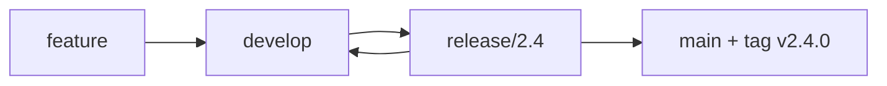

# Release Branching & Trains — Junior Level

> **Roadmap:** [Release Engineering](../README.md) → Release Branching & Trains

*How code travels from "merged" to "shipped" — and the branches and schedules that carry it there.*

---

## Table of Contents

1. [Introduction](#introduction)
2. [Prerequisites](#prerequisites)
3. [Glossary](#glossary)
4. [Core Concept 1 — What a release branch is](#core-concept-1--what-a-release-branch-is)
5. [Core Concept 2 — Two common strategies: GitFlow vs trunk-based](#core-concept-2--two-common-strategies-gitflow-vs-trunk-based)
6. [Core Concept 3 — Tags and release candidates](#core-concept-3--tags-and-release-candidates)
7. [Core Concept 4 — Cherry-picking a fix onto a release](#core-concept-4--cherry-picking-a-fix-onto-a-release)
8. [Core Concept 5 — Release trains and cadence](#core-concept-5--release-trains-and-cadence)
9. [Real-World Examples](#real-world-examples)
10. [Mental Models](#mental-models)
11. [Common Mistakes](#common-mistakes)
12. [Test Yourself](#test-yourself)
13. [Cheat Sheet](#cheat-sheet)
14. [Summary](#summary)
15. [Further Reading](#further-reading)
16. [Related Topics](#related-topics)

---

## Introduction

When you merge a pull request, your code is *integrated* — but it is not yet *released*. Something still has to decide: which exact set of commits goes out the door, when, and how it gets blessed as "ready for users." That decision is made through **release branching** (where code is staged and frozen) and **release trains** (the schedule on which it ships).

This file is your first contact with those ideas. By the end you will understand what a release branch is, the two dominant ways teams use branches to ship, and why so many fast-moving teams ship on a fixed schedule called a "train."

> Focus: **A release is a deliberate, named slice of your codebase — not just "whatever is on the default branch right now."**

---

## Prerequisites

- You can create branches, merge, and read a commit history (`git log`).
- You know what a pull request / merge request is.
- You understand the idea of a "default branch" (usually `main`).
- Helpful: skim [Versioning & SemVer](../01-versioning-and-semver/) so version numbers like `v2.4.0` make sense.

---

## Glossary

| Term | Meaning |
|------|---------|
| **main / trunk** | The default branch where day-to-day work integrates. |
| **Release branch** | A branch cut from `main` to stabilize and ship a specific version. |
| **Tag** | An immutable label on one commit, e.g. `v2.4.0`, marking exactly what shipped. |
| **Release candidate (RC)** | A build that *might* become the release, pending testing, e.g. `v2.4.0-rc.1`. |
| **GA** | "General Availability" — the version everyone gets. |
| **Cherry-pick** | Copying one commit onto another branch with `git cherry-pick`. |
| **Hotfix** | An urgent fix applied directly to a released version. |
| **Release train** | A fixed schedule on which releases ship, regardless of feature readiness. |
| **Feature freeze** | A date after which no new features are added to the upcoming release. |
| **Soak / bake time** | A waiting period where a candidate runs in staging before promotion. |

---

## Core Concept 1 — What a release branch is

A **release branch** is a branch you create from `main` to prepare one specific version for shipping. Once it exists, you stop adding new features to it — you only allow stabilizing changes (bug fixes). Meanwhile, `main` keeps moving forward with new feature work.

```
main:    A───B───C───D───E───F      (new features keep landing)
                  \
release/2.4:       C───C1───C2       (only fixes for 2.4)
```

Why bother? Because you need a *stable target* to test and ship. If the release were just "whatever is on `main` today," every new merge could break your release at the worst moment. The release branch **freezes** the feature set so testers and users get a moving-but-controlled target.

```bash
# Cut a release branch from main at the current commit
git switch main
git pull
git switch -c release/2.4
git push -u origin release/2.4
```

---

## Core Concept 2 — Two common strategies: GitFlow vs trunk-based

There are two families of branching strategies you will hear about constantly.

**GitFlow** (older, heavier): long-lived branches for everything. There is `main`, a permanent `develop` branch, plus `feature/*`, `release/*`, and `hotfix/*` branches. Features merge into `develop`; when ready, a `release/*` branch is cut; when shipped, it merges into both `main` and `develop`.



**Trunk-based development** (modern, lightweight): everyone integrates into `main` with very short-lived branches. A release is usually just a **tag on `main`**, or a short-lived `release/*` branch cut from `main` right before shipping. There is no permanent `develop`.

```
trunk-based:   main ──●──●──●──●──●──●   (tag v2.4.0 here)
```

**Why most high-velocity teams moved to trunk-based:** long-lived branches drift apart from `main`, and merging them back becomes painful and risky ("merge debt"). Trunk-based keeps everyone on one line, catches integration problems early, and pairs naturally with continuous delivery. You will go deeper into the trade-offs in the middle tier.

---

## Core Concept 3 — Tags and release candidates

A **tag** is a permanent, human-readable label pinned to one exact commit. It answers "what code is `v2.4.0`?" forever.

```bash
# Annotated tag (preferred — carries author, date, message)
git tag -a v2.4.0 -m "Release 2.4.0"
git push origin v2.4.0
```

Before a final release, teams cut **release candidates**: builds that are *proposed* releases. They get tested; if a candidate is clean, it becomes GA. If not, you fix and cut the next candidate.

```bash
git tag -a v2.4.0-rc.1 -m "Release candidate 1 for 2.4.0"
# ... testing finds a bug, fix it, then:
git tag -a v2.4.0-rc.2 -m "Release candidate 2 for 2.4.0"
# ... rc.2 is clean -> it becomes 2.4.0
```

**The golden rule you'll meet later:** *promote the exact artifact you tested — don't rebuild it.* The binary that passed RC testing is the binary you ship. Rebuilding risks shipping something subtly different from what you verified.

---

## Core Concept 4 — Cherry-picking a fix onto a release

Suppose `release/2.4` is frozen, but a tester finds a real bug. You fix it on `main` first (so future versions also get the fix), then **cherry-pick** that one commit onto the release branch.

```bash
# 1. Fix on main, get the commit hash
git switch main
# ... commit the fix ...   -> commit abc123

# 2. Bring just that commit onto the release branch
git switch release/2.4
git cherry-pick abc123
git push
```

The rule of thumb: **only fixes go onto a release branch after it's cut — never new features.** New features wait for the next release. The reason is simple: each new change is risk, and a release branch's whole job is to *reduce* risk before shipping.

---

## Core Concept 5 — Release trains and cadence

A **release train** is the idea that releases leave the station **on a fixed schedule**, like a train timetable. If your feature is ready, it's on the train. If it's not ready, it waits for the next one — the train doesn't wait for you.

```
Train every 4 weeks:
  ┌────────┐   ┌────────┐   ┌────────┐
  │  v120  │   │  v121  │   │  v122  │
  └────────┘   └────────┘   └────────┘
   Week 0       Week 4       Week 8
```

This sounds rigid, but it's freeing: nobody has to negotiate "should we hold the release for feature X?" The calendar decides. "Miss the train, catch the next one" removes pressure to rush half-finished work into a release.

Two key dates define a train:
- **Feature freeze** — stop merging *new features* for this release; only polish and fixes.
- **Code freeze** — stop merging *anything* except critical fixes; the build is locked for final testing.

---

## Real-World Examples

- **Google Chrome** ships on a roughly **4-week release train**. Each cycle a release branch (a "milestone") is cut from trunk; if a feature isn't stable by branch point, it simply rides the next milestone.
- **Ubuntu Linux** ships on a **6-month cadence** (April and October), with a feature-freeze date weeks before release. Long-Term Support (LTS) versions come every 2 years.
- **Kubernetes** releases roughly **3 times a year**, with a published schedule: enhancement freeze, code freeze, then RC builds, then GA.
- A typical web startup: no release branch at all — every merge to `main` that passes CI deploys to production (trunk-based continuous deployment). The "release" is just a deploy.

---

## Mental Models

- **The branch is a freezer.** `main` is the kitchen — busy, changing. A release branch is the freezer where you put a finished dish so it stops changing while you taste-test it.
- **The train timetable.** The calendar ships the release; features earn a seat by being ready on time.
- **RC = dress rehearsal.** A release candidate is the full performance with no audience yet. If it goes well, you open the doors (GA).
- **Cherry-pick = surgical transplant.** You move *one* commit deliberately, not a whole branch.

---

## Common Mistakes

- **Treating "merged to main" as "released."** Merging is integration; releasing is a separate, deliberate step.
- **Adding new features to a frozen release branch.** This defeats the purpose of freezing and reintroduces risk.
- **Rebuilding the artifact between RC and GA.** Ship the exact thing you tested.
- **Forgetting to put the fix on `main` too.** If you only fix the release branch, the bug comes back in the next version (a "regression").
- **Letting a release branch live forever.** The longer it lives apart from `main`, the harder the next merge gets.

---

## Test Yourself

1. What is the difference between *merging* a PR and *releasing* the code?
2. Why does a release branch only accept fixes, not new features, after it's cut?
3. What does "miss the train, catch the next one" mean, and why is it healthy?
4. Give the git commands to cherry-pick commit `def456` onto `release/3.1`.
5. Why should you promote the tested artifact instead of rebuilding it for GA?

---

## Cheat Sheet

```bash
# Cut a release branch
git switch -c release/2.4 main && git push -u origin release/2.4

# Tag a release candidate, then GA
git tag -a v2.4.0-rc.1 -m "RC 1"
git tag -a v2.4.0 -m "Release 2.4.0"
git push origin --tags

# Cherry-pick a fix onto the release branch
git switch release/2.4
git cherry-pick <commit>
git push
```

| Want to... | Use |
|------------|-----|
| Stabilize a specific version | Release branch |
| Mark exactly what shipped | Annotated tag |
| Propose a release for testing | Release candidate (`-rc.N`) |
| Move one fix to a release | `git cherry-pick` |
| Ship on a schedule | Release train + freeze dates |

---

## Summary

A release is a deliberate slice of your code, not "whatever is on `main`." Teams stage that slice using either heavy **GitFlow** branches or lightweight **trunk-based** tags/short branches — and most fast teams have moved to trunk-based to avoid merge debt. **Release candidates** let you test a proposed release before it becomes **GA**, and you ship the exact artifact you tested. After a release branch is cut, only **fixes** flow onto it, usually via **cherry-pick**. Many teams ship on a fixed **train** schedule with **feature freeze** and **code freeze** dates, so the calendar — not endless negotiation — decides what ships.

---

## Further Reading

- Martin Fowler, "Patterns for Managing Source Code Branches"
- Vincent Driessen, "A successful Git branching model" (the original GitFlow post — read it, then read the author's later caveats)
- The Chrome and Ubuntu public release schedules
- The `git-advanced` skill for cherry-pick and branch mechanics

---

## Related Topics

- [Versioning & SemVer](../01-versioning-and-semver/)
- [Changelogs & Release Notes](../02-changelogs-and-release-notes/)
- [Feature Flags & Progressive Delivery](../06-feature-flags-and-progressive-delivery/)
- [Rollback & Roll-Forward](../07-rollback-and-roll-forward/)
- [Release Automation](../08-release-automation/)
