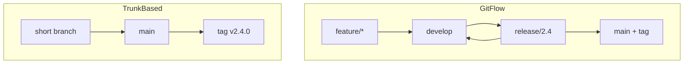

# Release Branching & Trains — Middle Level

> **Roadmap:** [Release Engineering](../README.md) → Release Branching & Trains

*From "I can cut a branch" to "I can run a release policy that doesn't drift, doesn't rebuild, and ships on time."*

---

## Table of Contents

1. [Introduction](#introduction)
2. [Prerequisites](#prerequisites)
3. [Glossary](#glossary)
4. [Core Concept 1 — GitFlow vs trunk-based, with the real trade-offs](#core-concept-1--gitflow-vs-trunk-based-with-the-real-trade-offs)
5. [Core Concept 2 — Cutting and stabilizing a release branch](#core-concept-2--cutting-and-stabilizing-a-release-branch)
6. [Core Concept 3 — RC, soak time, and promotion gates](#core-concept-3--rc-soak-time-and-promotion-gates)
7. [Core Concept 4 — Cherry-pick policy and avoiding divergence](#core-concept-4--cherry-pick-policy-and-avoiding-divergence)
8. [Core Concept 5 — Running a release train](#core-concept-5--running-a-release-train)
9. [Core Concept 6 — LTS branches and backporting](#core-concept-6--lts-branches-and-backporting)
10. [Real-World Examples](#real-world-examples)
11. [Mental Models](#mental-models)
12. [Common Mistakes](#common-mistakes)
13. [Test Yourself](#test-yourself)
14. [Cheat Sheet](#cheat-sheet)
15. [Summary](#summary)
16. [Further Reading](#further-reading)
17. [Related Topics](#related-topics)

---

## Introduction

You can already cut a branch and tag a release. The middle-tier job is to run a **policy**: decide which strategy fits your deploy frequency, stabilize a release branch without it drifting away from `main`, build a promotion pipeline where you ship the exact artifact you tested, and keep older release lines alive for security backports.

> Focus: **A working release process is a set of explicit rules — what's allowed on the branch, how a candidate gets promoted, and how branches stay in sync — not ad-hoc heroics at ship time.**

---

## Prerequisites

- Comfortable with `git cherry-pick`, `git tag -a`, `git merge`, and reading history.
- You understand CI: a pipeline builds, tests, and produces an artifact. (See the `ci-cd-pipeline-design` skill.)
- You've read the [junior tier](./junior.md) of this topic.
- Familiarity with [Versioning & SemVer](../01-versioning-and-semver/).

---

## Glossary

| Term | Meaning |
|------|---------|
| **Trunk-based development (TBD)** | Everyone commits to `main` with short-lived branches; releases are tags or short release branches. |
| **GitFlow** | Multi-branch model with permanent `develop`, plus `release/*`, `hotfix/*`, `feature/*`. |
| **Branch point / cut** | The commit where a release branch diverges from `main`. |
| **Promotion** | Moving a build from one environment/stage to the next without rebuilding. |
| **Soak / bake** | Time a candidate runs under realistic load before promotion. |
| **Divergence** | When a release branch and `main` accumulate different commits and drift apart. |
| **Backport** | Applying a fix made on a newer line back to an older supported line. |
| **LTS** | Long-Term Support release line, maintained for an extended window. |
| **Merge debt** | Accumulated cost/risk of merging a long-lived branch back to `main`. |
| **Forward-port** | Applying a fix made on an old line forward to `main`/newer lines. |

---

## Core Concept 1 — GitFlow vs trunk-based, with the real trade-offs

The choice is not fashion — it's a function of how often you deploy and how much parallel in-flight work you carry.

| Dimension | GitFlow | Trunk-based |
|-----------|---------|-------------|
| Long-lived branches | Many (`develop`, `release/*`) | None (or very short `release/*`) |
| Integration timing | Late (merge at release) | Continuous (every commit) |
| Merge debt | High | Low |
| Suits | Versioned products, infrequent releases, multiple supported versions | SaaS, continuous delivery, one production version |
| Release = | Merge `release` → `main` + tag | Tag on `main` (or short branch cut from `main`) |
| Hidden cost | Painful integration, stale branches | Requires discipline + feature flags for incomplete work |

**Why high-velocity teams left GitFlow:** GitFlow optimizes for *isolating* parallel work, which means problems are discovered *late*, at merge time, when many changes collide. Trunk-based optimizes for *integrating early*, so conflicts and broken assumptions surface within hours, not weeks. The price of trunk-based is discipline: incomplete work must hide behind **feature flags** rather than long-lived branches (see [Feature Flags & Progressive Delivery](../06-feature-flags-and-progressive-delivery/)).



---

## Core Concept 2 — Cutting and stabilizing a release branch

Even trunk-based teams that ship a *versioned* product often cut a short-lived release branch so that `main` can keep moving while the release stabilizes.

```bash
# Cut at a known-good commit on main (not blindly "HEAD")
git switch main && git pull
git switch -c release/2.4 v2.4.0-rc-base   # or a specific reviewed SHA
git push -u origin release/2.4
```

After the cut, you **stabilize**: run the full test suite, fix what's broken on `main`, cherry-pick those fixes in, and re-test. Lock the branch down so only the release team can push and only fixes land:

```bash
# Example: GitHub branch protection enforces review + green CI on release/*
# (configured in repo settings or branch-protection rules)
```

A stabilization window has a clear end: the branch becomes the GA tag, and you stop touching it except for hotfixes.

---

## Core Concept 3 — RC, soak time, and promotion gates

A mature pipeline doesn't jump from "built" to "shipped." It **promotes** an artifact through stages, each with a gate.

```
build ──► RC artifact ──► staging (soak) ──► canary ──► GA
            │  same bytes promoted at every arrow — never rebuilt  │
```

```bash
# Tag the candidate; CI builds ONE artifact and stores it by digest
git tag -a v2.4.0-rc.1 -m "RC 1"
git push origin v2.4.0-rc.1
# CI publishes e.g. myapp@sha256:abc...  -> this digest is what gets promoted
```

**Soak/bake time** is the deliberate period where the RC runs in staging (or a canary slice) under realistic traffic so latent issues — memory leaks, slow queries, config drift — have time to appear. A clean soak is a **promotion gate**: only after it passes does RC become GA.

**The promote-don't-rebuild rule:** promotion moves the *same artifact* (by content digest) forward; it never recompiles. Rebuilding could pull a newer dependency, a different compiler, or a changed base image — meaning you'd ship something you never tested. Promote by digest, not by re-running the build.

---

## Core Concept 4 — Cherry-pick policy and avoiding divergence

Once a release branch exists, it and `main` start to drift. Your cherry-pick policy is what keeps them honest.

**Policy (typical):**
1. **Fix on `main` first.** This guarantees the fix exists in all future versions.
2. **Cherry-pick to the release branch**, not the reverse.
3. **Only qualifying changes**: crash/security/data-loss/regression fixes — never features or refactors.
4. **Track every cherry-pick** so you can audit what diverged from the cut.

```bash
git switch main
# ... fix lands as commit abc123 ...
git switch release/2.4
git cherry-pick -x abc123      # -x records "(cherry picked from abc123)"
git push
```

The `-x` flag is important: it stamps the original SHA into the message, so anyone can trace the release-branch commit back to its `main` origin. **The danger of divergence:** if a fix lands *only* on the release branch and is never forward-ported to `main`, the next release reintroduces the bug (a regression). Always ask: "does this fix also exist on `main`?"

---

## Core Concept 5 — Running a release train

A release train turns shipping from an event into a rhythm. The schedule has named milestones:

```
Week 0          Week 2           Week 3          Week 4
  │ branch point   │ feature freeze  │ code freeze     │ GA
  │ (cut release/) │ (no new feats)  │ (fixes only)    │ ship tag
```

- **Branch point:** cut the release branch from `main`. Everything merged before this rides this train; everything after rides the next.
- **Feature freeze:** new features stop; only stabilization continues.
- **Code freeze:** even fixes need approval; the build is locked for final validation.
- **GA:** tag and ship.

The cadence is a **forcing function**: instead of arguing whether to hold for feature X, the rule is "if it's not ready at branch point, it catches the next train." This removes a whole category of release-day brinkmanship and makes delivery predictable for everyone downstream (docs, marketing, support).

---

## Core Concept 6 — LTS branches and backporting

Products with many users on different versions maintain several **release lines** at once: the current line plus N-1, N-2, and often a **Long-Term Support (LTS)** line that gets fixes for years.

```
main ───────────────────────────────► (3.x development)
   \                          \
    release/2.x (maintenance)  release/1.x-lts (security only)
```

When a security fix lands on `main`, you **backport** it to every supported line:

```bash
# Fix on main -> commit sec999
git switch release/2.x && git cherry-pick -x sec999 && git push
git switch release/1.x-lts && git cherry-pick -x sec999 && git push
```

Backporting gets harder the older the line, because the surrounding code has changed — the cherry-pick may conflict and need a hand-adapted version. This is the real, recurring cost of supporting old versions, and it's a major reason teams limit how many lines they keep alive.

---

## Real-World Examples

- **Chrome's 4-week train:** a milestone branch is cut from trunk; features not stable by branch point ride the next milestone behind flags. Stable, Beta, and Dev channels are different points on the train.
- **Ubuntu:** 6-month cadence with a public feature-freeze date; LTS releases every 2 years get 5 years of maintenance — a textbook long-lived maintenance line.
- **Kubernetes:** ~3 releases/year with a published schedule (enhancement freeze → code freeze → RCs → GA); maintains the latest 3 minor versions, backporting fixes to all three.
- **Node.js:** even-numbered majors become LTS lines maintained for ~3 years; security fixes are backported across active LTS lines.

---

## Mental Models

- **Promotion is a relay race, not a rebuild.** The same baton (artifact) is handed from stage to stage; you never grab a fresh baton mid-race.
- **`-x` is breadcrumbs.** Every cherry-pick should leave a trail back to its origin commit.
- **The train timetable governs, not the feature owner.** Readiness buys a seat; it doesn't move the departure.
- **Each LTS line is a maintenance tax.** You pay it in backport conflicts for as long as the line lives.

---

## Common Mistakes

- **Rebuilding between RC and GA.** You then ship an unverified artifact. Promote by digest.
- **Cherry-picking *from* the release branch to `main`** as the default flow. Fix on `main` first; pick *to* the release branch.
- **Skipping `-x`.** You lose traceability of what diverged.
- **No soak time.** Promoting straight to GA hides leaks and slow regressions until users find them.
- **Unbounded LTS lines.** Supporting every old version forever turns backporting into a full-time job.
- **Letting the release branch live for weeks "just in case."** Long life = merge debt and forgotten fixes.

---

## Test Yourself

1. Give two concrete reasons high-velocity teams prefer trunk-based over GitFlow.
2. What does "promote, don't rebuild" protect you from? How do you implement it?
3. Why fix on `main` *before* cherry-picking to a release branch?
4. What does `git cherry-pick -x` add, and why does it matter for audits?
5. List the four train milestones in order and what each one freezes.
6. Why does backporting to an old LTS line get harder over time?

---

## Cheat Sheet

```bash
# Cut + protect a release branch
git switch -c release/2.4 <reviewed-sha> && git push -u origin release/2.4

# Candidate -> promote by digest (never rebuild)
git tag -a v2.4.0-rc.1 -m "RC 1" && git push origin v2.4.0-rc.1
#   CI: promote myapp@sha256:<digest> staging -> canary -> GA

# Fix-first cherry-pick with traceability
git switch main           # land fix -> abc123
git switch release/2.4 && git cherry-pick -x abc123 && git push

# Backport across lines
for line in release/2.x release/1.x-lts; do
  git switch "$line" && git cherry-pick -x <sec-fix> && git push
done
```

| Decision | Rule of thumb |
|----------|---------------|
| Deploy many times/day, one prod version | Trunk-based, release = tag |
| Versioned product, several supported versions | Short release branches + LTS lines |
| Incomplete feature at branch point | Flag it off, ship dark; don't hold the train |
| Fix needed on shipped version | Fix `main`, cherry-pick `-x` to each line |

---

## Summary

The middle-tier skill is running a release *policy*, not improvising. Pick a strategy by deploy frequency: trunk-based for continuous delivery, short release branches plus LTS lines for versioned products with multiple supported versions. Stabilize a release branch and lock it to fixes only. Build a promotion pipeline that moves the **exact tested artifact** forward through soak/gates — never rebuilding. Keep `main` and release branches in sync by **fixing on `main` first** and cherry-picking with `-x`, and accept that each LTS line costs you backport effort for its whole life. The train's calendar — branch point, feature freeze, code freeze, GA — is the forcing function that makes all of this predictable.

---

## Further Reading

- Paul Hammant, "Trunk Based Development" (trunkbaseddevelopment.com)
- Martin Fowler, "Patterns for Managing Source Code Branches"
- Kubernetes release process documentation
- Node.js release working group LTS schedule
- The `ci-cd-pipeline-design` and `git-advanced` skills

---

## Related Topics

- [Versioning & SemVer](../01-versioning-and-semver/)
- [Changelogs & Release Notes](../02-changelogs-and-release-notes/)
- [Artifact Signing & Provenance](../04-artifact-signing-and-provenance/)
- [Feature Flags & Progressive Delivery](../06-feature-flags-and-progressive-delivery/)
- [Rollback & Roll-Forward](../07-rollback-and-roll-forward/)
- [Release Automation](../08-release-automation/)
