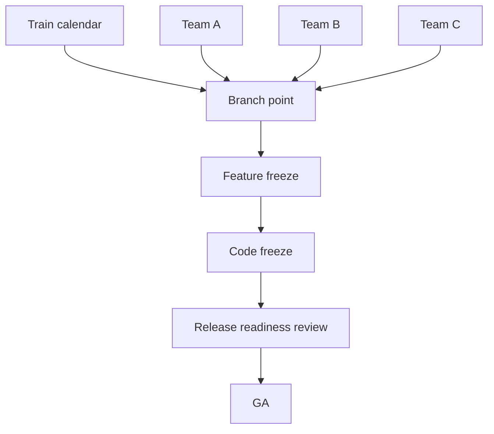

# Release Branching & Trains — Professional Level

> **Roadmap:** [Release Engineering](../README.md) → Release Branching & Trains

*Coordinating a release train across many teams and services: governance, calendars, exception authority, and the organizational machinery that makes shipping boring.*

---

## Table of Contents

1. [Introduction](#introduction)
2. [Prerequisites](#prerequisites)
3. [Glossary](#glossary)
4. [Core Concept 1 — The org-level model decision and its blast radius](#core-concept-1--the-org-level-model-decision-and-its-blast-radius)
5. [Core Concept 2 — Coordinating one train across many teams](#core-concept-2--coordinating-one-train-across-many-teams)
6. [Core Concept 3 — Branching across many services and repos](#core-concept-3--branching-across-many-services-and-repos)
7. [Core Concept 4 — Freeze governance and the exception org chart](#core-concept-4--freeze-governance-and-the-exception-org-chart)
8. [Core Concept 5 — The release manager role and runbook](#core-concept-5--the-release-manager-role-and-runbook)
9. [Core Concept 6 — Support matrix as a business commitment](#core-concept-6--support-matrix-as-a-business-commitment)
10. [Core Concept 7 — Flags as org policy, not a team hack](#core-concept-7--flags-as-org-policy-not-a-team-hack)
11. [Core Concept 8 — Measuring and evolving the model](#core-concept-8--measuring-and-evolving-the-model)
12. [Real-World Examples](#real-world-examples)
13. [Mental Models](#mental-models)
14. [Common Mistakes](#common-mistakes)
15. [Test Yourself](#test-yourself)
16. [Cheat Sheet](#cheat-sheet)
17. [Summary](#summary)
18. [Further Reading](#further-reading)
19. [Related Topics](#related-topics)

---

## Introduction

At the professional level you are not running *a* release — you are running the *system* that lets dozens of teams release predictably without colliding. The technical mechanics (branch, RC, promote, cherry-pick) are assumed; the hard part is **coordination and governance**: a shared calendar many teams trust, freeze authority that's clear under pressure, an exception process that survives an outage at 3 a.m., a support matrix that finance and legal have signed off on, and the org-wide policies (flags, automation, audit) that make all of it repeatable.

> Focus: **A release model is an organizational contract. Your job is to design the contract, the calendar, the authority, and the escape hatches so that shipping is predictable, auditable, and rarely heroic — at the scale of the whole company.**

---

## Prerequisites

- You've mastered the [senior tier](./senior.md): model selection, promotion pipelines, cherry-pick governance, freeze design.
- You've coordinated at least one cross-team release and felt where it broke.
- You understand progressive delivery and flags as org capabilities ([06](../06-feature-flags-and-progressive-delivery/)).
- You're comfortable owning a published support/EOL policy.

---

## Glossary

| Term | Meaning |
|------|---------|
| **Release train coordinator / RM** | Accountable owner for a given train shipping on schedule. |
| **Train calendar** | The shared, published schedule of branch points, freezes, RCs, and GA dates. |
| **Blast radius** | The set of teams/services affected by a model, freeze, or exception decision. |
| **Atomic vs independent release** | Whether services ship together as one version or each on its own cadence. |
| **Freeze authority** | The named role empowered to declare/lift freezes and grant exceptions. |
| **Break-glass** | Pre-authorized emergency override, fully logged. |
| **Support matrix** | Published table of which versions get which fixes, until when. |
| **EOL** | End-of-life date after which a version receives no fixes. |
| **Release readiness review (RRR)** | Cross-functional go/no-go checkpoint before GA. |
| **Train slip** | Moving a scheduled GA date — expensive, tracked, and rare. |

---

## Core Concept 1 — The org-level model decision and its blast radius

A branching model chosen for one team becomes an *organizational standard* with blast radius across every team that integrates with it. Professionals decide deliberately whether the org runs:

- **One uniform model** (everyone trunk-based + flags): maximal consistency, simplest mental model, but forces it onto teams whose constraints differ (e.g., the on-prem-shipping team).
- **Federated models** (each domain picks within guardrails): respects real differences, but raises integration and audit complexity, and you must define the seams between models.

The professional artifact is a **written branching standard**: the default model, the allowed exceptions, who approves a deviation, and the non-negotiables (e.g., "all production artifacts are immutable and signed regardless of model"). Without it, every team reinvents the policy, and cross-team releases become negotiation rather than process.

Decide explicitly: are releases **atomic** (the whole platform ships as one version — heavy coordination, simple reasoning) or **independent** (each service ships on its own train — high autonomy, hard to reason about combined state)? Most large orgs land on *independent services with contract/version compatibility guarantees*, because atomic release of many services doesn't scale.

---

## Core Concept 2 — Coordinating one train across many teams

When many teams contribute to one train (e.g., a quarterly platform release, a mobile app with many feature teams), coordination *is* the work.



Mechanisms that make this work:
- **A single source-of-truth calendar** with branch point, freeze dates, RC dates, RRR, GA — published far enough ahead that every team plans around it. The calendar is a *commitment*, not a suggestion.
- **A train manifest**: what each team is committing to this train, with an explicit "ready / behind flag / catching next train" status per item by branch point.
- **"Miss the train, catch the next one" enforced uniformly.** The moment one team's incomplete feature can slip the whole GA, the train stops being a forcing function. Incomplete work ships dark behind flags; it does not slip the date.
- **A release readiness review** before GA: cross-functional go/no-go (eng, QA, security, support, docs) against a checklist, with the decision and owner recorded.

The cultural win: predictability. Downstream functions (support, marketing, sales, docs) can plan against the calendar because the date holds and the *content* flexes.

---

## Core Concept 3 — Branching across many services and repos

In a microservices/multi-repo world, "the release branch" multiplies. Two viable patterns:

**Per-service independent trains.** Each service owns its branch model, cadence, and versioning; compatibility is guaranteed by API/contract versioning, not by shipping together. This is the default at scale — it preserves team autonomy and avoids a global freeze. The cost is that "what's in production" is a *set* of versions, requiring strong observability and contract testing (see the `api-versioning` and `ci-cd-pipeline-design` skills, and contract testing under integration testing).

**Coordinated platform train.** A subset of services that must ship together (a tightly coupled platform release) shares a synchronized branch point and freeze. Reserve this for genuinely coupled components — it's expensive and should be the exception.

```
Independent (default):  svc-a v3.2   svc-b v1.9   svc-c v5.0   (contracts hold)
Coordinated (rare):     platform-2024.Q3 = {svc-x, svc-y, svc-z} branched together
```

Professional guidance: **minimize coordinated trains**. Each one couples teams' schedules and reintroduces the global-freeze pain trunk-based was meant to escape. Push compatibility into contracts and flags so services can ship independently; coordinate only the irreducibly coupled core.

---

## Core Concept 4 — Freeze governance and the exception org chart

At org scale, a freeze affects many teams, so its governance must be unambiguous *before* the pressure hits.

| Question | Must be answered in advance |
|----------|----------------------------|
| Who can declare a freeze? | Named role (RM / release council) |
| Who can grant an exception? | Same or escalation chain, by severity |
| What evidence is required? | Severity, blast radius, rollback plan, tests |
| What does an exception cost? | Re-soak, extra review, recorded justification |
| How is break-glass logged? | Auto-ticketed, post-incident review mandatory |

The principle: **freeze friction proportional to risk, authority proportional to blast radius.** A one-line typo fix during code freeze needs a light, fast exception; a schema change needs the full council. A **deploy freeze** during a peak business window (Black Friday, tax deadline) may have *higher* authority than a normal code freeze because the blast radius is revenue.

**Break-glass** is the non-negotiable escape hatch: a pre-authorized emergency path that lets the right person ship a critical fix during any freeze, while *automatically* recording who, what, when, and why for mandatory post-hoc review. Safety and auditability must survive the emergency — speed cannot delete the paper trail. This mirrors break-glass in quality gates: the override exists, but it is loud and logged.

---

## Core Concept 5 — The release manager role and runbook

Predictable trains need an accountable owner. The **release manager (RM)** — often a rotation, not a person — owns one train end to end.

RM responsibilities:
- Owns the calendar and communicates branch point / freeze / GA to all teams.
- Maintains the train manifest and chases "ready" status before branch point.
- Chairs the release readiness review and records the go/no-go.
- Holds (or escalates) freeze-exception authority.
- Owns the rollback decision if GA goes wrong (with [Rollback & Roll-Forward](../07-rollback-and-roll-forward/) procedures).
- Runs the post-release retro feeding back into the model.

The **runbook** turns the RM role into something a rotation can execute without tribal knowledge: a step-by-step for cutting the branch, building/promoting RCs, the RRR checklist, the exception procedure, the GA steps, and the rollback procedure. A good runbook means a new RM can run a train competently from the document — which is the whole point of professionalizing release engineering. Automate every step the runbook describes that doesn't require judgment ([Release Automation](../08-release-automation/)).

---

## Core Concept 6 — Support matrix as a business commitment

How many versions you support is not an engineering preference at this level — it's a **business and legal commitment** with cost, and you own publishing and honoring it.

```
Version   Status        Fixes provided        EOL
4.x       Current       all qualifying        active
3.x       Maintenance   security + critical   2025-12-31
2.x       LTS           security only         2026-06-30
1.x       EOL           none                  (ended)
```

Professional considerations:
- **The matrix is a contract.** Enterprise customers buy against it; legal and finance must approve the window because backport effort is real, ongoing cost.
- **Budget the backport burden explicitly.** Each security advisory must be applied to *every* in-support line; older lines mean conflicting, hand-adapted backports. Model the engineering headcount this consumes when committing to a window.
- **EOL is a process, not a date.** Customers need lead time, migration paths, and sometimes paid extended support. Communicate EOL far ahead.
- **Fewer, longer LTS lines** beat many short ones; per-line fixed cost (CI, security triage, release machinery) dominates.

Study published matrices (Ubuntu LTS 5-year support, Node.js active/maintenance LTS, Kubernetes latest-3-minors) as templates, then size yours to your actual backport capacity — overcommitting here is a slow, compounding tax.

---

## Core Concept 7 — Flags as org policy, not a team hack

Once the org standardizes on trunk-based, **feature flags become infrastructure with policy**, because they now carry the decoupling that branches used to.

Org-level policy elements:
- **A standard flag platform** with audit, targeting, and kill-switch — not per-team ad-hoc booleans. Flag changes are production changes and must be observable.
- **A flag lifecycle mandate.** Flags are debt; require an owner and a removal date at creation, and report on stale flags. Unmanaged flags become a worse mess than the branches they replaced.
- **Flags as the rollback primitive.** Org-wide, "disable the feature" should be a flag flip (instant, no redeploy) rather than a revert-and-ship. This makes the release model and the rollback model one system.
- **Clear boundary between flags and config.** Release flags (temporary, decouple deploy from release) differ from ops flags (permanent, operational levers); conflating them rots both.

The strategic point: in a mature org the *long-lived release branch is largely replaced by runtime flag control*, which is why flag governance is now part of release engineering, not a separate concern. (See [Feature Flags & Progressive Delivery](../06-feature-flags-and-progressive-delivery/).)

---

## Core Concept 8 — Measuring and evolving the model

A professional treats the release model as a product to be measured and improved, not a fixed ritual.

Signals to track:
- **Train adherence:** % of trains that ship on the scheduled GA date (slips are expensive and should be rare and explained).
- **Integration latency / merge debt:** time from merge to integration; rising values predict painful releases and warn that branches are living too long.
- **Cherry-pick / backport volume and conflict rate:** high or rising = divergence problems or too many supported lines.
- **Exception frequency:** many freeze exceptions means the freeze is mistimed or the date unrealistic — fix the calendar, not the people.
- **Lead time for changes and change-failure rate** (DORA): the ultimate test of whether the model serves delivery or obstructs it.

Run a **retro after each major train** and feed findings back: shorten a freeze that's too long, drop an LTS line you can't afford, automate a step that caused a slip. The model that fit at 5 teams will not fit at 50; evolving it deliberately is the job.

---

## Real-World Examples

- **Chrome at scale:** a fully automated 4-week train across thousands of engineers; the date is sacrosanct, content flexes via flags, channels (Canary/Dev/Beta/Stable) are promotion stages, and a release-management function owns the calendar and exceptions. The org-level lesson: make the date immovable and the content negotiable.
- **Kubernetes:** a release team (a rotating, documented role set — release lead, enhancements, CI signal, docs, comms) runs each cycle from a public runbook with a published calendar and support matrix — a textbook professional release-engineering org for a multi-org project.
- **Ubuntu:** a 6-month train with a strict, publicly governed freeze schedule and a 5-year LTS support commitment — the support matrix as a business contract.
- **A large bank:** independent per-service trains with a coordinated quarterly platform train for the irreducibly coupled core, deploy freezes around financial close, and a fully logged break-glass path approved by an SRE/compliance pair.

---

## Mental Models

- **The calendar is the contract.** Make the date immovable and let content flex; the whole org plans against the date.
- **Authority must match blast radius.** Bigger impact, higher approval; build the chain before the emergency.
- **Coordinate only what's coupled.** Every coordinated train recouples schedules — keep the coupled core tiny.
- **The runbook is the role.** If a rotation can't run the train from the document, you haven't professionalized it.
- **The model is a product.** Measure it, retro it, evolve it as the org grows.

---

## Common Mistakes

- **No written branching standard**, so every team's model is different and cross-team releases are negotiations.
- **Letting one team's slip slip the whole train**, destroying the train as a forcing function — flag it, ship dark, hold the date.
- **Over-coordinating** — synchronizing services that aren't actually coupled, reimporting global-freeze pain.
- **Freeze authority undefined under pressure**, so emergencies become chaos or paralysis.
- **Break-glass without logging**, trading auditability for speed — the worst trade in regulated contexts.
- **Overcommitting the support matrix** to versions you can't afford to backport to.
- **Flags without governance**, replacing branch debt with worse, invisible flag debt.
- **Treating the model as immutable** while the org grows past it.

---

## Test Yourself

1. When should an org run independent per-service trains vs a coordinated platform train? What's the cost of each?
2. Design a train calendar for a 30-team mobile release. How do you prevent one team from slipping GA?
3. Define the freeze-exception authority chain for: a typo fix in code freeze, a schema change in code freeze, an emergency security fix during a holiday deploy freeze.
4. What must break-glass guarantee even at 3 a.m. during an outage?
5. Write the RM responsibilities and the top-level runbook outline for one train.
6. How do you size a support matrix against backport capacity, and why is it a legal/finance concern?
7. Which metrics tell you the release model is starting to fail, and how do you respond to each?

---

## Cheat Sheet

```
Train calendar:   branch point ─ feature freeze ─ code freeze ─ RRR ─ GA
Forcing function: date is fixed; content flexes (flags, catch next train)
Coordinate:       only the irreducibly coupled core; default = independent trains
Authority:        proportional to blast radius; chain defined BEFORE pressure
Break-glass:      pre-authorized + auto-logged + mandatory post-review
Support matrix:   published, costed, legal-approved, fewer/longer LTS lines
Flags:            standard platform + lifecycle mandate + rollback primitive
Measure:          train adherence, merge debt, backport conflicts, exception rate, DORA
```

| Symptom | Likely cause | Fix |
|---------|--------------|-----|
| Trains keep slipping | Date gates on feature completion | Flag incomplete work; hold the date |
| Many freeze exceptions | Freeze mistimed / date unrealistic | Move the freeze / fix the calendar |
| Backport conflicts rising | Too many / too-old support lines | Trim the matrix; publish EOLs |
| Cross-team release is a negotiation | No written standard | Publish branching standard + calendar |

---

## Summary

Professional release engineering is the design of an organizational contract for shipping. Decide the org's branching standard and whether releases are atomic or independent (default: independent services held together by contracts and flags). Coordinate trains via a published calendar that everyone trusts — the date is fixed, content flexes, and "miss the train, catch the next one" is enforced uniformly so no single team can slip GA. Govern freezes with authority proportional to blast radius and a break-glass path that stays loud and logged. Professionalize the release-manager role with a runbook a rotation can execute, and automate every step that isn't judgment. Treat the support matrix as a costed business commitment, make feature flags governed infrastructure (and your rollback primitive), and measure the model — adherence, merge debt, backport conflicts, exception rate, DORA — so you can evolve it as the organization outgrows each version of itself.

---

## Further Reading

- *The Kubernetes Release Process* and the release-team role docs — a public, professional release org
- Forsgren, Humble, Kim, *Accelerate* — delivery performance vs branching/integration choices
- Google SRE Book / SRE Workbook — release engineering, freezes, and break-glass practices
- Paul Hammant, "Trunk Based Development" — org-scale flags and branch-by-abstraction
- Ubuntu and Node.js published support/EOL matrices as contract templates
- The `ci-cd-pipeline-design`, `api-versioning`, and `git-advanced` skills

---

## Related Topics

- [Versioning & SemVer](../01-versioning-and-semver/)
- [Changelogs & Release Notes](../02-changelogs-and-release-notes/)
- [Artifact Signing & Provenance](../04-artifact-signing-and-provenance/)
- [Registries & Distribution](../05-registries-and-distribution/)
- [Feature Flags & Progressive Delivery](../06-feature-flags-and-progressive-delivery/)
- [Rollback & Roll-Forward](../07-rollback-and-roll-forward/)
- [Release Automation](../08-release-automation/)
- [Supply Chain Security](../09-supply-chain-security/)
