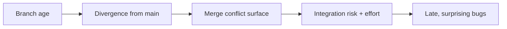

# Release Branching & Trains — Senior Level

> **Roadmap:** [Release Engineering](../README.md) → Release Branching & Trains

*Choosing and defending a branching model under real constraints — velocity, regulation, team size — and paying down the costs it creates.*

---

## Table of Contents

1. [Introduction](#introduction)
2. [Prerequisites](#prerequisites)
3. [Glossary](#glossary)
4. [Core Concept 1 — Picking a model from first principles](#core-concept-1--picking-a-model-from-first-principles)
5. [Core Concept 2 — The true cost of long-lived branches](#core-concept-2--the-true-cost-of-long-lived-branches)
6. [Core Concept 3 — Feature flags as a branch replacement](#core-concept-3--feature-flags-as-a-branch-replacement)
7. [Core Concept 4 — Designing the promotion pipeline](#core-concept-4--designing-the-promotion-pipeline)
8. [Core Concept 5 — Cherry-pick governance at scale](#core-concept-5--cherry-pick-governance-at-scale)
9. [Core Concept 6 — Supporting many release lines](#core-concept-6--supporting-many-release-lines)
10. [Core Concept 7 — Freeze policy and the exception process](#core-concept-7--freeze-policy-and-the-exception-process)
11. [Core Concept 8 — Automating the release branch](#core-concept-8--automating-the-release-branch)
12. [Real-World Examples](#real-world-examples)
13. [Mental Models](#mental-models)
14. [Common Mistakes](#common-mistakes)
15. [Test Yourself](#test-yourself)
16. [Cheat Sheet](#cheat-sheet)
17. [Summary](#summary)
18. [Further Reading](#further-reading)
19. [Related Topics](#related-topics)

---

## Introduction

At senior level the question is no longer "how do I cut a branch" but "which branching model should *this* organization run, and what does it cost?" Branching is a trade between **isolation** (keep risky work apart) and **integration** (find conflicts early). The right answer depends on deploy frequency, team size, how many versions you support, and your regulatory environment. You also own the second-order costs: merge debt, backport burden, freeze friction, and the automation that keeps the whole thing from depending on one person's memory.

> Focus: **Branching strategy is an optimization problem with org-specific constraints — there is no universally correct model, only a defensible fit and an explicit cost you've chosen to pay.**

---

## Prerequisites

- You've internalized the [middle tier](./middle.md): RC promotion, cherry-pick policy, LTS lines.
- You understand feature flags and progressive delivery conceptually ([06](../06-feature-flags-and-progressive-delivery/)).
- You can reason about CI/CD pipeline stages and gates (the `ci-cd-pipeline-design` skill).
- You've felt the pain of at least one ugly long-lived-branch merge.

---

## Glossary

| Term | Meaning |
|------|---------|
| **Integration latency** | Time between writing a change and integrating it with everyone else's. |
| **Merge debt** | Compounding risk/effort of integrating a divergent branch. |
| **Branch by abstraction** | Hiding incomplete work behind an interface on `main` instead of a branch. |
| **Dark launch** | Shipping code to production disabled, enabling it later via flag. |
| **Promotion pipeline** | Staged path (build → test → soak → canary → GA) moving one artifact by digest. |
| **Freeze** | A window where merges are restricted (feature freeze, code freeze, deploy freeze). |
| **Exception / break-glass** | A controlled override of a freeze for a justified emergency. |
| **Backport burden** | Cumulative cost of applying fixes across all supported lines. |
| **Release manager** | The role (or rotation) accountable for a given train shipping. |

---

## Core Concept 1 — Picking a model from first principles

Don't start from "GitFlow vs trunk-based." Start from constraints and derive the model.

| Constraint | Pushes you toward |
|------------|-------------------|
| Deploy many times/day | Trunk-based, release = tag; flags for incomplete work |
| One production version (SaaS) | Trunk-based; little or no release branch |
| Many customer-installed versions | Per-version maintenance branches + LTS |
| Strong regulatory/audit needs | Explicit release branch + signed artifacts + change records |
| Large team, high parallel WIP | Trunk-based + flags (NOT more long-lived branches) |
| Hardware/firmware long cycle | Longer-lived stabilization branches are acceptable |

The single best predictor is **deploy frequency relative to how long features take**. If you deploy faster than features complete, you *cannot* gate releases on feature completion — you must decouple deploy from release using flags, and your branch model collapses toward trunk-based. If you ship infrequently to many fixed installations, isolation matters more and explicit release/maintenance branches earn their keep.

A common senior mistake is importing a model from a previous company whose constraints differed. Re-derive it.

---

## Core Concept 2 — The true cost of long-lived branches

Long-lived branches are seductive — they feel like clean isolation — but their cost is **non-linear in branch lifetime**.



The mechanism: while the branch lives, `main` changes underneath it. Every change on either side is a potential conflict at merge time — semantic, not just textual (the famous case where neither side conflicts in `git` but the combined behavior is wrong). Worse, the *testing* you did on the branch was against a stale `main`, so you re-test from scratch after merge. This is **merge debt**, and like financial debt it compounds.

Concrete senior heuristics:
- **Cap branch lifetime.** A release branch should live from branch point to GA + hotfix window — weeks, not quarters.
- **Measure integration latency** as a release-health metric; rising latency predicts painful merges.
- **Prefer many small integrations** over one big one. The cost of `N` small merges is far below one merge of `N` changes.

---

## Core Concept 3 — Feature flags as a branch replacement

The reason trunk-based works at scale is that **feature flags replace long-lived feature branches**. Instead of isolating incomplete work on a branch, you merge it to `main` *disabled* and integrate continuously.

```
Old way:  feature/big-thing lives 6 weeks ──► giant risky merge
Flag way: merge daily to main, code OFF behind flag, flip on when ready
```

This converts a *branch-management* problem (divergence, merge debt) into a *runtime-configuration* problem (flag lifecycle, flag debt) — generally a better trade because flags are observable, reversible at runtime, and don't block others' integration. Key senior considerations:

- **Branch by abstraction** for changes too invasive for a simple boolean: introduce an interface, build the new implementation behind it on `main`, switch over, delete the old path.
- **Dark launches**: ship code to production off, then enable per-cohort — this is also your rollback mechanism (flip the flag, not the deploy).
- **Flags are debt too.** Stale flags rot; you need a flag-retirement discipline. (See [Feature Flags & Progressive Delivery](../06-feature-flags-and-progressive-delivery/).)

The strategic insight: in a flag-driven org, the *release branch shrinks or disappears*, because the thing it used to provide — a way to ship a stable subset while risky work continues elsewhere — is now provided at runtime by flags.

---

## Core Concept 4 — Designing the promotion pipeline

The promotion pipeline is where "the exact artifact" rule becomes architecture. Design it so rebuilding is *impossible by construction*.

```
   ┌────────┐   gate    ┌─────────┐  gate   ┌────────┐  gate  ┌─────┐
   │ build  │ ───────►  │ staging │ ──────► │ canary │ ─────► │ GA  │
   │ once   │  by digest │ (soak)  │ by dig. │ (1-5%) │ by dig.│     │
   └────────┘            └─────────┘         └────────┘        └─────┘
```

Principles:
- **Immutable, content-addressed artifacts.** Promote `app@sha256:...`, never a mutable tag like `:latest`. The digest *is* the identity.
- **Gates are evidence, not vibes.** A gate passes on signals: soak error rate, canary SLO compliance, manual sign-off recorded with who/when. (See [Quality Gates] concepts and the `ci-cd-pipeline-design` skill.)
- **Environments differ only in config, not in build.** If staging and prod run different binaries, your soak validated nothing.
- **Promotion is auditable.** Each transition records the digest, the gate evidence, and the approver — this is also your provenance trail ([Artifact Signing & Provenance](../04-artifact-signing-and-provenance/)).

The payoff: GA is "flip the pointer to the already-soaked digest," a near-zero-risk operation, instead of "build the release," a high-variance one.

---

## Core Concept 5 — Cherry-pick governance at scale

On a small repo, cherry-pick policy is a convention. On a large/regulated repo it's **governance**: a documented, enforced, auditable process.

```bash
# Common pattern: PRs labeled for backport, automation opens the cherry-pick PR
git switch main
# fix merges to main as abc123, PR labeled "cherry-pick/release-2.4"
# bot creates branch + PR:
git switch -c cp-2.4-abc123 release/2.4
git cherry-pick -x abc123     # bot resolves trivial cases, escalates conflicts
```

Governance elements a senior should put in place:
- **An eligibility rule, written down:** what may be cherry-picked (sev1/2, security, data-loss, regressions) and what may not (features, dependency bumps, refactors).
- **Direction is enforced:** fix lands on `main` first; backport PRs are generated *from* the `main` commit. Reverse flow (release-only fix) requires an explicit forward-port ticket so `main` never silently lacks a fix.
- **Every release-branch commit traces to a `main` SHA** (the `-x` trail), so an auditor can answer "is this fix in the next version?" mechanically.
- **A divergence report**: periodically diff `release/X` against its branch point and flag any commit with no `main` ancestor — those are your regression risks.

---

## Core Concept 6 — Supporting many release lines

Deciding *how many* lines to support is a strategic, costed decision — each line is recurring backport burden plus CI cost plus cognitive load.

```
main (4.x) ──────────────────────────────►
   \           \              \
    3.x (full)  2.x (security) 1.x-LTS (security, sunset Q4)
```

Senior framing:
- **Define a support matrix and publish it.** Customers and your team must know which versions get fixes and for how long.
- **Tier the support level.** Newest line: all qualifying fixes. Older lines: security/data-loss only. LTS: security only, with a published end-of-life date.
- **Budget the backport burden.** Each security advisory must be applied to *every* in-support line; the older the line, the likelier a conflicting, hand-adapted backport. Model this as ongoing engineering cost when you commit to a support window.
- **Prefer fewer, longer LTS lines** over many short ones; the per-line fixed cost dominates.

Kubernetes (latest 3 minors) and Node.js (active + maintenance LTS) are good reference matrices to study and adapt.

---

## Core Concept 7 — Freeze policy and the exception process

A freeze is a deliberate restriction on what can change, and a senior owns both the freeze *and* the escape hatch.

| Freeze type | Restricts | Typical trigger |
|-------------|-----------|-----------------|
| Feature freeze | New features into the release | Branch point reached |
| Code freeze | All but critical fixes | Final validation window |
| Deploy freeze | Production deploys | High-risk window (peak sales, holidays) |

A freeze without an **exception process** is either ignored or paralyzing. Design the exception path explicitly:
- **Who can grant an exception** (release manager / on-call lead), and on what evidence (severity, blast radius, rollback plan).
- **What an exception costs**: extra review, re-soak, a recorded justification — friction proportional to risk, so exceptions stay rare.
- **Break-glass** for emergencies: a pre-authorized fast path that *still* logs everything, so safety and auditability survive even when speed is essential. (This mirrors break-glass in quality gates — the override must be observable.)

The goal is a freeze that's a real constraint but not a brick wall: predictable by default, overridable with accountability.

---

## Core Concept 8 — Automating the release branch

Manual release branching is where tribal knowledge and 2 a.m. mistakes live. Senior teams automate the mechanics so humans only make *decisions*.

```yaml
# Conceptual: a scheduled job cuts the train branch every cadence
on:
  schedule: [cron: "0 9 */28 * *"]   # every 4 weeks
jobs:
  cut-release:
    steps:
      - cut release/$(next_version) from main at last-green SHA
      - open the "RC tracking" issue with the milestone checklist
      - notify all contributing teams of branch point + freeze dates
```

What to automate:
- **Branch cut at last-known-green**, not blind HEAD.
- **RC tagging and artifact build** triggered by the tag; digest recorded.
- **Backport PR creation** from labeled `main` PRs.
- **Changelog/release-note assembly** from merged PRs ([02](../02-changelogs-and-release-notes/)).
- **Freeze enforcement** as branch-protection rules, not Slack reminders.

Leave to humans: go/no-go on gates, exception decisions, and "is this the release we want to ship." Automate the toil, not the judgment. (See [Release Automation](../08-release-automation/) and the `ci-cd-pipeline-design` skill.)

---

## Real-World Examples

- **Chrome:** a milestone branch is cut from trunk on the 4-week beat; the cut is automated, features not green by branch point ride the next milestone, and most risky work lives behind flags rather than branches — a near-pure trunk-based-plus-flags model at enormous scale.
- **Kubernetes:** explicit support matrix (latest 3 minors), a published freeze calendar, and a documented cherry-pick approval process with shepherds — governance, not convention.
- **A regulated fintech:** keeps an explicit release branch and signed artifacts because auditors need a frozen, attributable artifact per release; here the "heavier" model is a feature, not a smell.
- **A high-growth SaaS:** no release branch at all — trunk-based, deploy-on-merge, everything risky behind flags; "release" and "deploy" are decoupled entirely, and rollback is a flag flip.

---

## Mental Models

- **Isolation vs integration is a dial, not a switch.** Every model is a position on that dial chosen for your constraints.
- **Merge debt is compound interest.** The longer a branch lives, the more you pay, faster.
- **Flags move complexity from `git` to runtime** — usually a better place to manage it, but it's still complexity.
- **A freeze is a valve, not a wall.** Build the exception path before you need it.
- **Automate the toil, gate the judgment.** Machines cut branches; humans decide to ship.

---

## Common Mistakes

- **Cargo-culting GitFlow** into a deploy-many-times-a-day SaaS, manufacturing merge debt for isolation you don't need.
- **Trunk-based without flags or discipline**, so `main` is frequently un-releasable.
- **Letting release branches outlive their purpose**, turning each into a divergence liability.
- **Freeze with no exception process** — teams route around it, killing its credibility.
- **Unbounded support matrix** — committing to versions you can't afford to backport to.
- **Rebuildable promotion** — any pipeline step that can recompile breaks the "exact artifact" guarantee.
- **Automating judgment** (auto-promoting to GA with no human go/no-go) before the gates are trustworthy.

---

## Test Yourself

1. From constraints alone, derive the branching model for: (a) a 12-deploys/day SaaS, (b) an on-prem product with 4 supported versions, (c) a regulated payments system.
2. Explain why merge debt grows non-linearly with branch lifetime.
3. How do feature flags let you delete long-lived feature branches, and what new debt do they create?
4. Design a promotion pipeline where rebuilding the artifact is impossible by construction.
5. What four governance elements turn a cherry-pick *convention* into a cherry-pick *process*?
6. Design a code-freeze exception process that stays rare but isn't a brick wall.
7. Which release-branch tasks should be automated, and which must stay human?

---

## Cheat Sheet

```bash
# Cut at last-green, not blind HEAD
LAST_GREEN=$(ci last-green main)
git switch -c release/2.4 "$LAST_GREEN" && git push -u origin release/2.4

# Promote by immutable digest (never rebuild)
promote app@sha256:<digest> staging   # soak
promote app@sha256:<digest> canary    # SLO gate
promote app@sha256:<digest> ga        # human go/no-go

# Divergence audit: release-branch commits with no main ancestor
git log --cherry-pick --right-only --no-merges <branch-point>...release/2.4
```

| Constraint | Model | Main cost you accept |
|------------|-------|----------------------|
| Continuous delivery SaaS | Trunk-based + flags | Flag lifecycle debt |
| Versioned/installed product | Release + LTS branches | Backport burden |
| Regulated | Explicit signed release branch | Process overhead |
| Long hardware cycle | Long-ish stabilization branch | Some merge debt |

---

## Summary

Senior-level branching is constraint-driven model selection, not dogma. Derive the model from deploy frequency, supported-version count, team size, and regulation — then own the cost you chose: merge debt for long-lived branches, backport burden for many release lines, flag debt for trunk-based-plus-flags. Make the promotion pipeline rebuild-proof by promoting immutable digests through evidence-based gates. Turn cherry-picking and support into governed, auditable processes, not conventions. Give freezes a real exception/break-glass path so they're constraints with accountability rather than walls. Automate the mechanics — branch cuts, RC builds, backport PRs, freeze enforcement — and keep human judgment for the go/no-go that actually ships the release.

---

## Further Reading

- Paul Hammant, "Trunk Based Development" — especially "branch by abstraction" and flag patterns
- Martin Fowler, "Feature Toggles (aka Feature Flags)" and "Patterns for Managing Source Code Branches"
- Forsgren, Humble, Kim, *Accelerate* — branching and integration latency vs delivery performance
- Kubernetes patch-release and cherry-pick documentation
- The `ci-cd-pipeline-design` and `git-advanced` skills

---

## Related Topics

- [Versioning & SemVer](../01-versioning-and-semver/)
- [Changelogs & Release Notes](../02-changelogs-and-release-notes/)
- [Artifact Signing & Provenance](../04-artifact-signing-and-provenance/)
- [Feature Flags & Progressive Delivery](../06-feature-flags-and-progressive-delivery/)
- [Rollback & Roll-Forward](../07-rollback-and-roll-forward/)
- [Release Automation](../08-release-automation/)
- [Supply Chain Security](../09-supply-chain-security/)
