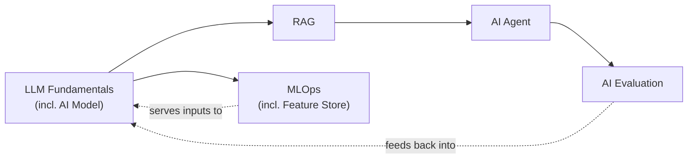

# AI Engineering

> Build grounded, tool-using AI systems whose behavior can be understood, evaluated, secured, and operated — from how the model itself works to how an agent built on top of it is tested in production.

This domain follows the natural build order of an LLM-based product: understand the model's fundamentals (including how to choose and adapt the right model), ground it in your own data with RAG, wrap it in agentic behavior, and evaluate the result before and after it ships.

## Sections

| # | Section | Focus |
|---|---|---|
| 01 | [LLM Fundamentals](llm-fundamentals/README.md) | Transformer architecture, tokenization, context window, decoding/sampling, prompt engineering, context engineering, and AI Model selection/fine-tuning/reasoning. |
| 02 | [RAG](rag/README.md) | Retrieval techniques, embeddings and vector databases, and knowledge base design. |
| 03 | [AI Agent](ai-agent/README.md) | Agent architectures (including memory), agentic techniques, and tools/MCP. |
| 04 | [AI Evaluation](ai-evaluation/README.md) | Observability, testing, and evaluation for LLM and agentic systems. |
| 05 | [MLOps](mlops/README.md) | Feature store, experiment tracking, training pipelines, deployment/serving, and monitoring/drift. |

## How to use this domain

Each topic follows this site's junior, middle, senior, and professional progression. Start with LLM Fundamentals if you're new to how these systems actually work — everything downstream (model choice, RAG, agents, evaluation) assumes you understand tokens, context windows, and decoding. If you already have that foundation, jump straight to the section matching your current problem: choosing a model, grounding it in your data, making it act autonomously, or proving it works before and after you ship a change.

---

*Part of [Engineer Knowledge](../README.md).*
