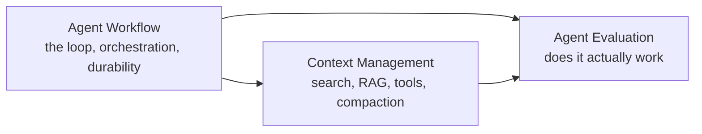

# AI Agent

> Build systems where an LLM doesn't just answer — it observes, decides, acts, and revises across a loop, choosing what belongs in its context window and calling tools that reach into the real world.

An agent is only as good as the loop it runs (workflow), what it knows at the moment it decides (context), and whether either of those actually holds up when measured (evaluation). The three topics build on each other in that order — you can't reason about what belongs in a step's context until you know what a workflow step is, and you can't evaluate an agent meaningfully until you know both what it's supposed to do and what it was allowed to see when it did it.

## Topics

| # | Topic | What you'll learn |
|---|-------|-------------------|
| 01 | [Agent Workflow](agent-workflow/README.md) | The observe-reason-act loop, orchestration and delegation between agents, state/memory/durability, reliability and recovery, and scaling to fleet volume. |
| 02 | [Context Management](context-management/README.md) | What occupies the context window, grep/BM25/agentic search, when RAG earns its cost, MCP vs. CLI tool interfaces, and compaction/long-horizon memory. |
| 03 | [Agent Evaluation](agent-evaluation/README.md) | What "correct" means, tracing every step, golden sets and graders, debugging a bad run, and pricing what it costs. |

## How to use this section

Each topic has multiple subtopics, each with four depth levels — **junior → middle → senior → professional**. Start at your level. Agent Workflow is the foundation: it defines what a step, a loop, and an agent-to-agent handoff are, which every other topic assumes you already recognize. Context Management is what feeds each step — the search, retrieval, tool, and memory decisions that determine what the model actually sees when it's asked to decide. Agent Evaluation is how you know whether the first two topics' choices actually produced a correct, reliable system instead of a plausible-looking one.

A running scenario threads through Agent Workflow and Agent Evaluation: an agent that handles inbound customer-support tickets — looking up orders, drafting replies, and issuing refunds. It gets debugged, cost-priced, and eval-gated in Agent Evaluation. Context Management uses a parallel scenario — an internal data-analyst agent querying a data warehouse and a documentation corpus — chosen because it exercises search, RAG, and the MCP-vs-CLI tool decision more naturally than a support-ticket flow does.

For prompt design itself (how to phrase instructions, few-shot examples, structured output), see [Prompt Engineering](../llm-fundamentals/prompt-engineering/) in the LLM Fundamentals domain.

---

> Part of the [Engineer Knowledge](../../README.md) roadmap.
