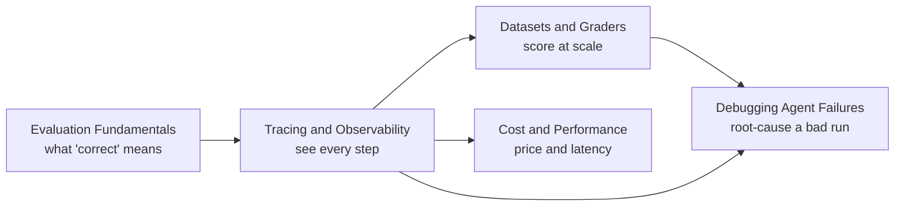

# Agent Evaluation

> Know whether an agent actually works — see what it did, score its output against a baseline, find the exact step that broke, and know what it cost.

You cannot score, debug, or price a system you cannot see. Tracing comes right after Fundamentals because Datasets and Graders, Debugging, and Cost all consume the same traces — a golden-set grader reads a trace's final output, a debugger reads its step-by-step spans, a cost report reads its token counts. The five subtopics below build in that order.

## Subtopics

| # | Subtopic | What you'll learn |
|---|----------|-------------------|
| 01 | [Evaluation Fundamentals](evaluation-fundamentals/junior.md) | What a correct run looks like, which metrics map to the job, and where evals sit in the ship lifecycle. |
| 02 | [Tracing and Observability](tracing-and-observability/junior.md) | Recording a run as a tree of spans, what to capture per step, and turning traces into production monitors. |
| 03 | [Datasets and Graders](datasets-and-graders/junior.md) | Building golden sets, grading open-ended output without exact-match, and gating CI on a real improvement instead of noise. |
| 04 | [Debugging Agent Failures](debugging-agent-failures/junior.md) | Finding the first wrong step in a trace, fixing the biggest failure bucket, and root-causing cascading multi-step errors. |
| 05 | [Cost and Performance](cost-and-performance/junior.md) | Pricing a single run, measuring cost per resolved task instead of per call, and making budget a design constraint. |

## How to use this section

Each subtopic has four levels — **junior → middle → senior → professional**. Start at your level. Evaluation Fundamentals is the foundation: it defines what you're even trying to measure, which the other four subtopics assume. Tracing and Observability is the substrate everything else reads from. Datasets and Graders and Cost and Performance can be read in either order once tracing is in place. Debugging Agent Failures leans on both the traces and the golden sets the earlier subtopics produce.

The same support-ticket agent from [Agent Workflow](../agent-workflow/README.md) threads through this section — looking up orders, drafting replies, issuing refunds. It gets a golden set and a judge in Datasets and Graders, a root-caused production incident in Debugging, and a cost-per-resolved-ticket target in Cost and Performance.

For the workflow-level retry and gate logic a debugged failure often leads back to, see [Reliability and Recovery](../agent-workflow/reliability-and-recovery/). For the context-size decisions that are usually the biggest cost lever, see [Compaction and Memory](../context-management/compaction-and-memory/).

---

> Part of the [AI Agent](../README.md) domain.
