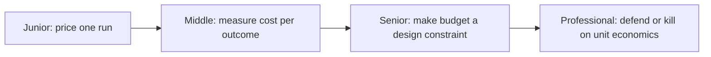

# Cost and Performance

> Every model call has a token cost and a latency cost. This subtopic is how you price a single run, measure cost per outcome instead of per call, and make budget a constraint you design against instead of a monthly surprise.

## Levels

| Level | Guide | You are done when |
|---|---|---|
| Junior | [Price one run](junior.md) | You can compute a single run's cost and latency breakdown from its trace. |
| Middle | [Measure cost per outcome](middle.md) | You can compute cost per resolved task and name the biggest lever to reduce it. |
| Senior | [Make budget a design constraint](senior.md) | You can set per-run cost/latency caps and a model-routing cascade validated against evals. |
| Professional | [Defend or kill on unit economics](professional.md) | You can run chargeback, forecast cost, and decide whether an agent's economics justify keeping it. |

## Practice rule

Measure cost per resolved task, not cost per API call. A cheaper model that needs three retries to succeed can cost more per outcome than an expensive model that succeeds first try.

## Related

- [Tracing and Observability](../tracing-and-observability/) — the token and latency numbers this subtopic prices.
- [Compaction and Memory](../../context-management/compaction-and-memory/) — context size, usually the single biggest cost lever.
- [Scaling Workflows](../../agent-workflow/scaling-workflows/) — caching and backpressure, the fleet-level version of this subtopic.
