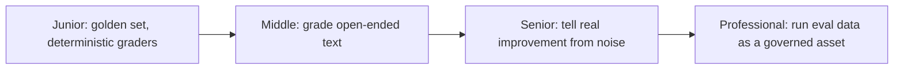

# Datasets and Graders

> Most agent output is open-ended text or a sequence of tool calls, not a value you can exact-match. This subtopic is how you build a set of cases and a grader that scores them without fooling yourself.

## Levels

| Level | Guide | You are done when |
|---|---|---|
| Junior | [Golden set, deterministic graders](junior.md) | You can build a 30-case golden set and grade it with schema/regex/exact-match rules where they apply. |
| Middle | [Grade open-ended text](middle.md) | You can build and calibrate an LLM-as-judge rubric against human labels and know its common biases. |
| Senior | [Tell real improvement from noise](senior.md) | You can compute variance across repeats and decide what regression suite blocks a deploy. |
| Professional | [Run eval data as a governed asset](professional.md) | You can version datasets, own labeling quality, and defend a benchmark against Goodhart drift. |

## Practice rule

Never tune a prompt against the same cases you'll use to claim it improved. Freeze a held-out slice before you start iterating, and only score against it once you're done.

## Related

- [Evaluation Fundamentals](../evaluation-fundamentals/) — the metrics these graders operationalize.
- [Tracing and Observability](../tracing-and-observability/) — the source of prod-failure cases that grow the dataset.
