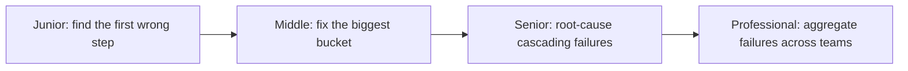

# Debugging Agent Failures

> A bad final answer is a symptom. This subtopic is how you find the actual step that went wrong, fix the failure bucket that matters most, and stop a fix from being one-off.

## Levels

| Level | Guide | You are done when |
|---|---|---|
| Junior | [Find the first wrong step](junior.md) | You can read a trace and name the exact step where the run first went wrong, not just where it ended up wrong. |
| Middle | [Fix the biggest bucket](middle.md) | You can run an error-analysis loop that finds and fixes the largest failure category instead of the loudest bug report. |
| Senior | [Root-cause cascading failures](senior.md) | You can debug a failure that only appears across multiple steps, and tell a model regression from your own. |
| Professional | [Aggregate failures across teams](professional.md) | You can run a shared failure taxonomy and feedback loop from prod incident to dataset to release gate. |

## Practice rule

Before fixing anything, find the earliest step in the trace where the agent's state diverged from correct. Fixing step 5 when step 1 was the actual cause just moves where the same bug resurfaces.

## Related

- [Tracing and Observability](../tracing-and-observability/) — the spans a debugging session reads.
- [Datasets and Graders](../datasets-and-graders/) — every confirmed bug becomes a new golden-set case here.
- [Reliability and Recovery](../../agent-workflow/reliability-and-recovery/) — the retry and gate logic a debugged failure often needs.
