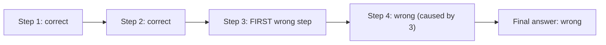

# Debugging Agent Failures — Junior

<!-- level-focus -->
At junior level, focus on this question:

> Can you read a trace and find the exact step where the run first went wrong, instead of stopping at "the final answer was wrong"?

---

## Failure taxonomy

- **Bad input/context**: the agent was given wrong or missing information to start with.
- **Wrong tool selected**: the model chose a tool that doesn't fit the situation.
- **Malformed tool arguments**: the right tool was called, but with a wrong or invalid argument.
- **Tool returned wrong or empty result**: the tool call itself succeeded but the data it returned was incorrect or missing.
- **Model misread the observation**: the tool result was correct, but the model's next step drew the wrong conclusion from it.
- **Schema violation**: output didn't match a required structure (missing field, wrong type).
- **Non-terminating loop**: the agent kept taking steps without converging on an answer.
- **Hallucinated fact**: the model stated something as true that wasn't in its context or tool results at all.

## Reproducing with recorded inputs

- Use the exact rendered prompt, tool arguments, and tool results from the trace (see [Tracing and Observability — Junior](../../tracing-and-observability/junior.md)) to reproduce the failure deterministically, instead of re-running the live agent against possibly-changed live data.
- If the failure doesn't reproduce with recorded inputs, the cause may be non-determinism (temperature) rather than a fixable bug — note it and move to a different case rather than chasing a one-off.

## Finding the first wrong step

- Walk the trace from the start, not from the end. Check each step against what a correct step would look like at that point. The first step that diverges is the actual cause — every step after it is a downstream symptom.
- Example: a refund agent gives the wrong refund amount. Walking from the end, "wrong amount" looks like the bug. Walking from the start reveals the tool call that looked up the order actually returned the wrong order's data (bad tool result) — the amount was "correctly" computed from wrong input.

## Common Mistakes

- **Debugging only the final output.** A wrong final answer computed correctly from wrong input looks like a math bug when the real bug is upstream.
- **Re-running against live data instead of recorded inputs.** Live data may have changed since the failure, making the failure non-reproducible for the wrong reason (data drift, not fixed).
- **Stopping at the first *visible* wrong-looking step instead of the first *actual* one.** A step can look fine in isolation but be wrong because of what fed into it.

## Apply It

1. Take one failing trace. List every step in order with a one-line correct/incorrect judgment for each.
2. Identify the first incorrect step, and classify it using the failure taxonomy above.
3. Reproduce it using only the recorded prompt/arguments/results from the trace, confirming the same failure occurs.

## Verify Your Work

- The named failure step is the *first* one that diverged, not just the most visibly wrong one.
- The failure is classified using a specific taxonomy category, not a vague "something went wrong."
- The failure reproduces using recorded inputs, not a fresh run against possibly-changed live data.

## Review Questions

- Why is the first wrong step the actual cause, and later wrong steps usually symptoms?
- Why reproduce with recorded inputs instead of re-running against live data?
- Give an example where the final answer looks like the bug but the real cause is upstream.
