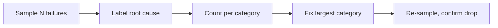

# Debugging Agent Failures — Middle

<!-- level-focus -->
At middle level, focus on this question:

> Can you run an error-analysis loop that fixes the largest failure bucket in your traffic, instead of whichever single bug report is loudest right now?

---

## The error-analysis loop

1. Sample N recent failures (from prod traces or a failing eval run) — enough to be representative, not just the one someone complained about.
2. Label each with its root-cause category, using the taxonomy from [Junior](junior.md) or one refined for your agent.
3. Count failures per category.
4. Fix the largest category first — the one affecting the most cases, not the one that generated the most recent complaint.
5. Re-sample after the fix to confirm the category's count actually dropped, not just that the one reported case is now fixed.

## Why the loudest bug isn't always the biggest problem

- One customer's escalated complaint about a specific failure feels urgent, but if error analysis shows it's 1 of 40 failures this week and a different category (e.g., "tool returned empty result") accounts for 25 of them, fixing the loud one leaves the bigger problem untouched.
- This doesn't mean ignore urgent individual cases — it means track both: fix what's urgent, but let the counted categories drive what gets prioritized for the next engineering cycle.

## Minimal repro

- Strip a failing case down to the smallest input that still reproduces the failure — remove unrelated context, shorten the conversation history, simplify the tool fixtures — until you have the minimal version that still fails the same way.
- A minimal repro is faster to iterate on and makes the actual cause obvious once noise is removed; a 40-turn conversation with the bug buried in turn 12 is much harder to reason about than the 3-turn version that still reproduces it.

## Deterministic replay with recorded tool responses

- Replay the failing case with the tool calls mocked to return the exact recorded results from the trace, rather than calling live tools — isolates whether the bug is in the model's reasoning given that tool result, versus in the tool or the data it returned.

## Bisecting across dimensions

- When a failure appeared recently but wasn't always there, bisect across the plausible changed dimensions one at a time: prompt version, model version, tool/API version, or the shape of the input data.
- Example: if a regression appeared this week, check what changed this week — a prompt edit, a model version bump, a tool's API contract changing — before assuming a novel bug in unrelated code.

## Every confirmed bug becomes a golden-set case

- Once a root cause is confirmed and fixed, add the minimal-repro version as a new case in the golden set (see [Datasets and Graders — Middle](../../datasets-and-graders/middle.md)) so a regression on this exact failure mode is caught automatically going forward, instead of relying on someone noticing it again in prod.

## Common Mistakes

- **Prioritizing by whichever complaint is loudest instead of counted category size.** Fixes a visible but small problem while a bigger, quieter one continues at volume.
- **Debugging directly on a large, noisy real case instead of a minimal repro.** Wastes time on irrelevant details that have nothing to do with the actual bug.
- **Not confirming the fix by re-sampling the category.** A fix that resolves the one reported instance can miss that the category still occurs under slightly different conditions.
- **Fixing a bug without adding it to the golden set.** The exact same failure mode can silently regress again with no test to catch it.

## Apply It

1. Sample at least 15 recent failures for one agent and label each with a root-cause category.
2. Count failures per category and identify the largest one.
3. Build a minimal repro for one case in that category and confirm the fix using deterministic replay (mocked tool responses).
4. Add the minimal repro to the golden set as a new regression case.

## Verify Your Work

- Prioritization is based on counted category size, not the single most recent or loudest complaint.
- The repro used to debug is minimal — stripped of irrelevant context.
- The fix is confirmed via re-sampling the category, not just the one originally reported case.
- The confirmed bug now has a corresponding golden-set case.

## Review Questions

- Why can fixing the loudest complaint leave the biggest problem unaddressed?
- Why does a minimal repro make debugging faster than working directly on the full original case?
- Why does a confirmed bug need to become a golden-set case, not just a one-time fix?
