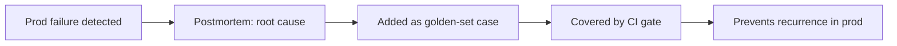

# Debugging Agent Failures — Professional

<!-- level-focus -->
At professional level, focus on this question:

> Can multiple teams aggregate what they learn from failures into a shared feedback loop, instead of each team's debugging knowledge staying siloed and rediscovered independently?

---

## Postmortems for agent behavior

- Run a postmortem for a significant agent failure the same way you would for a service outage: what happened, what was the first wrong step (root cause, not just symptom), what was the customer impact, what's the fix, and what's the systemic change that prevents the same category from recurring.
- Include the specific trace(s) and the failure-taxonomy category (see [Junior](junior.md)) in the postmortem so the record is queryable later, not just a prose narrative that's hard to aggregate across incidents.

## A shared failure taxonomy across teams

- If every team invents its own failure categories, counts don't aggregate — "wrong tool selected" in one team's language might be the same underlying issue as "incorrect action chosen" in another's, but you can't tell without a shared vocabulary.
- Publish one taxonomy (extending the categories in [Junior](junior.md) as needed for org-specific failure modes) that every team's error analysis and postmortems use, so failure counts can be aggregated and compared across the fleet of agents.

## The prod-failure → dataset → gate feedback loop

- This loop only works end-to-end if each step is someone's actual job, not an optional nice-to-have — a postmortem that never produces a golden-set case has broken the loop at that link, and the next occurrence of the same failure won't be caught before it reaches customers again.

## On-call ownership of a non-deterministic system

- On-call for an agent system differs from on-call for a deterministic service: a page might be "loop-length drift trending up" rather than "service down," and the fix might be "roll back a prompt" rather than "restart a pod."
- Define what pages, what the on-call engineer is expected to be able to do without waking up a specialist (rollback a prompt version, disable a specific tool, invoke the kill switch — see [Senior](senior.md)), and what genuinely needs escalation.

## Escalation when an agent harms a customer

- Define, in advance, the escalation path for when an agent's failure causes real customer harm (a wrong refund, a wrong medical or financial statement, a policy violation) — who's notified, what's the SLA for customer-facing communication, and what's the criteria for immediately disabling the agent versus monitoring closely.
- Deciding this during the incident, under pressure, produces worse and slower decisions than having the path defined beforehand.

## Common Mistakes

- **No shared failure taxonomy across teams.** Failure counts can't be aggregated or compared, and each team re-learns the same lessons independently.
- **Postmortems that don't produce a golden-set case.** Breaks the feedback loop — the same failure mode isn't caught by any gate before it recurs.
- **On-call runbooks written for deterministic services, unchanged for agent systems.** On-call engineers don't know what to do when the page is about drift or hallucination rather than downtime.
- **No pre-defined escalation path for customer harm.** Forces ad-hoc decisions during the worst possible moment to be making them.

## Apply It

1. Adopt or publish one shared failure taxonomy across every team building agents in your organization.
2. Confirm your last three agent postmortems each produced a corresponding golden-set case — identify any that didn't and close the gap.
3. Write an on-call runbook section specific to agent failure modes (drift, hallucination, tool-error spike) with the exact actions an on-call engineer can take without escalating.
4. Define the customer-harm escalation path in writing before an incident requires it.

## Verify Your Work

- Failure categories are consistent across every team's postmortems and error analyses.
- Every postmortem in the last quarter has a linked golden-set case, or a documented reason it doesn't apply.
- An on-call runbook exists with agent-specific actions, not only generic service-outage steps.
- A written customer-harm escalation path exists and is known to on-call engineers before an incident.

## Review Questions

- Why does a shared failure taxonomy matter for aggregating counts across teams?
- What breaks in the feedback loop if a postmortem never produces a golden-set case?
- Why does on-call for an agent system need different runbook actions than on-call for a deterministic service?
