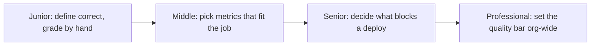

# Evaluation Fundamentals

> Before you measure anything, you need to say what a correct run looks like — and which of the many things you could measure actually maps to the job the agent is supposed to do.

## Levels

| Level | Guide | You are done when |
|---|---|---|
| Junior | [Define correct, grade by hand](junior.md) | You can write 20 cases with a stated expected outcome and grade them without an exact-match assertion. |
| Middle | [Pick metrics that fit the job](middle.md) | You can choose outcome, trajectory, and process metrics for a specific agent instead of one generic score. |
| Senior | [Decide what blocks a deploy](senior.md) | You can place evals in the dev/CI/canary/prod lifecycle and defend which metric gates a release. |
| Professional | [Set the quality bar org-wide](professional.md) | You can define a shared quality bar per risk tier that other teams are held to. |

## Practice rule

Before running any eval, write the expected outcome for each case down first, in words, before you look at what the agent actually produced. Grading against a memory of "what seemed reasonable" after the fact is not evaluation — it's rationalization.

## Related

- [Tracing and Observability](../tracing-and-observability/) — the trace data every metric here is computed from.
- [Datasets and Graders](../datasets-and-graders/) — the golden sets and judges that operationalize the metrics chosen here.
