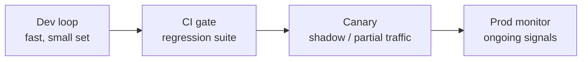

# Evaluation Fundamentals — Senior

<!-- level-focus -->
At senior level, focus on this question:

> Can you place evaluation at the right points in the ship lifecycle, and decide which metric actually blocks a deploy versus which one only gets watched?

---

## Evals across the lifecycle

- **Dev loop**: a small, fast set (10–30 cases) run on every prompt or code change, seconds to minutes. Wrong tool here: a slow, expensive, exhaustive suite that discourages iteration.
- **CI gate**: the regression suite that blocks a merge or deploy — see [Datasets and Graders — Senior](../../datasets-and-graders/senior.md) for what earns a spot here.
- **Canary**: a subset of real traffic (or a shadow run against real traffic without acting on the result) before full rollout.
- **Prod monitor**: ongoing signals on 100% of traffic after ship — tool-error rate, refusal rate, escalation rate — that catch drift the offline suite didn't cover.

## Gate vs. observe

- **Gate**: a metric with a hard threshold that blocks the deploy if crossed. Reserve for metrics where a regression is unambiguous and costly — a safety violation, a schema-validation failure rate above a fixed bound.
- **Observe**: a metric that's tracked and reviewed but doesn't automatically block anything — useful for metrics that are noisy, slow to compute, or where "worse" isn't always wrong (e.g., average response length changing because the agent got more thorough).
- Every metric should be explicitly assigned to one category. An unlabeled metric that "everyone just checks sometimes" gets ignored under deadline pressure.

## Eval-set overfitting and leakage

- **Overfitting**: iterating a prompt directly against the same cases used to claim improvement. The prompt learns to pass those specific cases, not to generalize.
- **Leakage**: a case that's supposed to be held-out has actually been seen during development (e.g., it was copy-pasted from a bug report someone already looked at while tuning).
- Fix: freeze a held-out slice before iteration starts, and only score against it at the end, not during.

## Held-out slices and stratification

- Split the golden set: a **dev slice** you can look at freely, and a **held-out slice** you score against only at decision points (before merging, before shipping).
- Stratify both by segment (e.g., refund vs. lookup vs. escalation cases) and by difficulty (easy/ambiguous/adversarial), so an aggregate pass rate can't hide a subgroup that's failing.

## Measurement cadence vs. cost

- Running the full suite on every commit is expensive if the suite is large or uses an LLM judge. Options: run a fast subset per-commit, full suite per-release; cache judge scores for unchanged cases; sample a percentage of prod traffic for the ongoing monitor instead of scoring all of it.

## Common Mistakes

- **No explicit gate/observe assignment.** Metrics get checked inconsistently, and a regression on an "observe" metric quietly ships because no one owned catching it.
- **Iterating directly against the held-out slice.** Silently converts it into a dev slice — you lose your only unbiased signal.
- **One aggregate pass rate with no stratification.** A 95% pass rate can hide a segment (e.g., non-English tickets) failing at 40%.

## Apply It

1. For your current metrics, assign each to gate or observe, with the specific threshold for any gate.
2. Split your golden set into a dev slice and a frozen held-out slice; write down the date it was frozen.
3. Stratify the held-out slice by at least one dimension relevant to your agent (segment, difficulty, or language) and report pass rate per stratum, not just in aggregate.

## Verify Your Work

- Every metric has an explicit gate/observe label with a stated threshold if it gates.
- The held-out slice has a frozen date and has not been used to tune anything since.
- Pass rate is reported per stratum, not only as one aggregate number.

## Review Questions

- Why does a metric need to be explicitly labeled gate vs. observe instead of "checked when convenient"?
- What's the difference between eval-set overfitting and eval-set leakage, and how does freezing a held-out slice prevent both?
- Why can a high aggregate pass rate hide a failing subgroup, and what's the fix?
