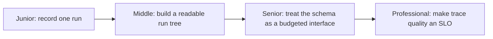

# Tracing and Observability

> Every prompt, tool call, and model response an agent makes is invisible unless you record it. This subtopic is how you make a run reconstructable after the fact — and how those recordings become production monitors.

## Levels

| Level | Guide | You are done when |
|---|---|---|
| Junior | [Record one run](junior.md) | You can reconstruct a single run — every prompt, tool call, and response — from what you captured. |
| Middle | [Build a readable run tree](middle.md) | You can instrument a multi-step agent as parent/child spans a teammate can read without you. |
| Senior | [Treat the schema as a budgeted interface](senior.md) | You can design sampling and prod monitors that catch drift without capturing everything at full fidelity forever. |
| Professional | [Make trace quality an SLO](professional.md) | You can set an org-wide trace standard with a retention and compliance policy teams don't each reinvent. |

## Practice rule

If you can't answer "what was the exact prompt sent to the model on this run" from your logs, you don't have observability — you have print statements. Record the rendered prompt, not the template.

## Related

- [Evaluation Fundamentals](../evaluation-fundamentals/) — the metrics computed from what gets traced here.
- [Debugging Agent Failures](../debugging-agent-failures/) — the discipline of reading a trace to find the first wrong step.
- [Cost and Performance](../cost-and-performance/) — token and latency numbers pulled directly from spans.
