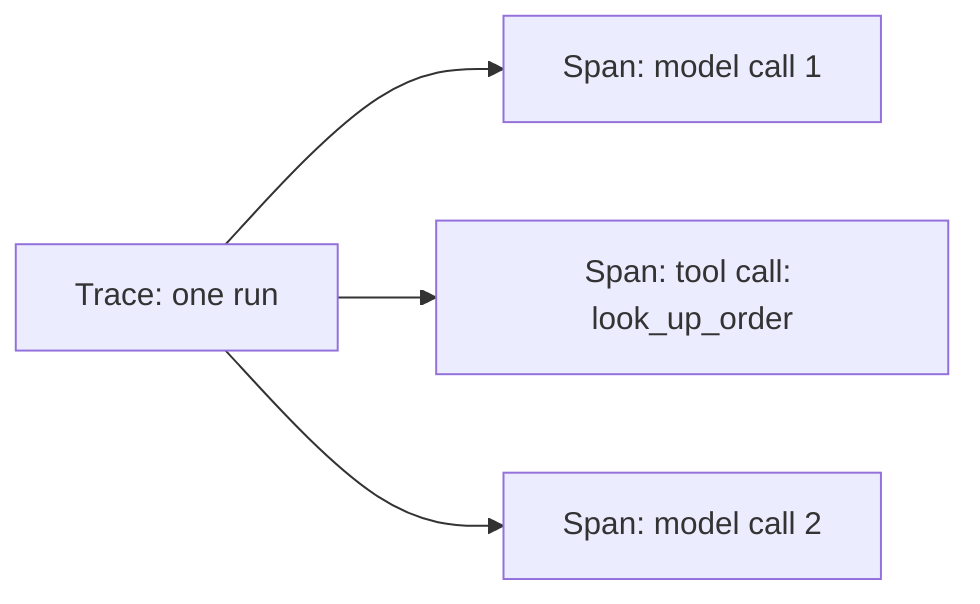

# Tracing and Observability — Junior

<!-- level-focus -->
At junior level, focus on this question:

> Can you reconstruct exactly what a single run did — every prompt, tool call, and response — from what you recorded, without re-running it?

---

## Trace and span

- **Trace**: the full record of one run, start to finish.
- **Span**: the record of one step inside that run (one model call, one tool call).
- A multi-step agent produces one trace containing multiple spans, in the order they executed.

## What to record per span

- The **rendered prompt** actually sent to the model — not the template with placeholders, the final text after variables were filled in. The template tells you nothing about what the model actually saw.
- Model name and version, and the parameters used (temperature, max tokens).
- The full response, including any reasoning/thinking content if the model produces it.
- Token counts: input, output, and cached-input tokens if applicable.
- Latency for that span.
- For a tool call: the tool name, the exact arguments, and the exact result returned (or the error).
- A single **correlation ID** shared by every span in the same run, so you can filter to just that run's spans.

## Why unstructured logs aren't enough

- A log line like `"Tool call failed"` tells you something failed but not which tool, with what arguments, on which run, or what the model did next. You can't answer "which step went wrong" from that.
- Structured spans with a correlation ID let you pull every span for one run and read it as an ordered sequence — the difference between a log stream and a debuggable trace.

## Example

- A customer asks about order #4521. The trace has: span 1 (model call: decide which tool to use), span 2 (tool call: `look_up_order(order_id="4521")` → result), span 3 (model call: draft the reply using the tool result). All three spans share correlation ID `run-88213`.

## Common Mistakes

- **Recording the prompt template instead of the rendered prompt.** You can't tell what the model actually saw, only what it was supposed to see.
- **No correlation ID across spans.** You can't reconstruct which spans belong to the same run once you have more than one run's logs mixed together.
- **Skipping tool call arguments and results.** A tool-call failure without its arguments is undebuggable — you don't know what input caused it.

## Apply It

1. Pick one multi-step agent run. Record every span with: rendered prompt, model/params, full response, tool name/args/result, latency, and a shared correlation ID.
2. Without looking at the live system, reconstruct what happened using only the recorded spans.
3. Confirm you can answer "what was the exact prompt on step 2" and "what did the tool return" from the record alone.

## Verify Your Work

- Every span has the rendered prompt, not the template.
- Every span in the same run shares one correlation ID.
- Tool call spans include both arguments and result (or error).

## Review Questions

- Why is the rendered prompt more useful to record than the template?
- What does a correlation ID let you do that separate, uncorrelated log lines don't?
- What information does a tool-call span need at minimum to be debuggable later?
