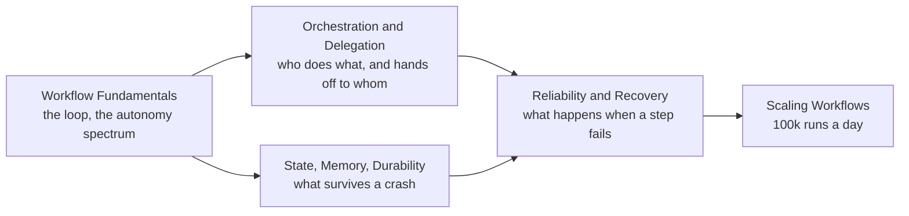

# Agent Workflow

> A single agent is a loop. A workflow is what you get when you connect loops, steps, and humans together and have to keep the whole thing running for months, not minutes.

Building one agent that works once is easy. Building a workflow that composes many steps and agents, survives a process restart mid-run, recovers from a bad tool call without a human babysitting it, and still holds up at 100,000 runs a day is a different discipline entirely. This section is that discipline — the five subtopics build on each other in the order above.

## Subtopics

| # | Subtopic | What you'll learn |
|---|----------|-------------------|
| 01 | [Workflow Fundamentals](workflow-fundamentals/junior.md) | Step vs. loop vs. workflow, the five canonical patterns, and how much autonomy a task actually needs. |
| 02 | [Orchestration and Delegation](orchestration-and-delegation/junior.md) | How steps and sub-agents hand work to each other, and when splitting into multiple agents earns its cost. |
| 03 | [State, Memory, and Durability](state-memory-and-durability/junior.md) | What a workflow must remember, where that lives, and how it resumes without redoing work after a crash. |
| 04 | [Reliability and Recovery](reliability-and-recovery/junior.md) | Reflection, retries, human-approval gates, and loop-termination safeguards — the discipline that keeps a workflow from silently doing the wrong thing. |
| 05 | [Scaling Workflows](scaling-workflows/junior.md) | Concurrency, backpressure, isolation, and cost control once one workflow becomes a fleet. |

## How to use this section

Each subtopic has four levels — **junior → middle → senior → professional**. Start at your level. Workflow Fundamentals is the foundation: it defines what a step is and the autonomy spectrum every other subtopic assumes you already recognize. Orchestration and Delegation is how you compose steps and agents once one is not enough. State, Memory, and Durability is what makes a workflow survive real infrastructure — restarts, timeouts, days-long pauses. Reliability and Recovery is the discipline layered on top so failures are handled instead of ignored. Scaling Workflows is what changes when one correct workflow has to run at fleet scale.

A single scenario threads through every subtopic: an agent that handles inbound customer-support tickets — looking up orders, drafting replies, and issuing refunds. It starts as one prompt in Fundamentals, becomes a routed multi-step pipeline, gains a specialist sub-agent for policy lookups in Orchestration, gets a durable checkpoint and a resumable refund gate in State, gains a reflection step and an approval gate in Reliability, and finally has to run for 100,000 tickets a day in Scaling.

For the loop internals of a single agent (memory within one run, stopping conditions for one iteration), see the junior/middle levels of Workflow Fundamentals below — this section replaces the former standalone Agent Architectures and Agentic Techniques topics, folding their content into the workflow lens. For tool calling, MCP, and everything that competes for space in an agent's context window, see [Context Management](../context-management/). For measuring whether a workflow works, see [Agent Evaluation](../agent-evaluation/).

---

> Part of the [AI Agent](../README.md) domain.
