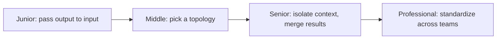

# Orchestration and Delegation

> The moment a workflow needs more than one agent, a new problem appears: who decides what work goes to whom, and how does the result get back together correctly?

## Levels

| Level | Guide | You are done when |
|---|---|---|
| Junior | [Hand off a single output](junior.md) | You can wire one step's output into the next step's input with an explicit contract, sequential or parallel. |
| Middle | [Pick a topology](middle.md) | You can choose between orchestrator-workers, hierarchical, and peer handoff, and justify the cost of adding a sub-agent. |
| Senior | [Isolate context, merge results](senior.md) | You can scope what each sub-agent sees, and design how conflicting results from parallel workers get resolved. |
| Professional | [Standardize delegation across teams](professional.md) | You can define shared interface contracts and a deprecation process for sub-agents owned by different teams. |

## Practice rule

Before adding a sub-agent, write down the specific piece of work it does that the calling step could not do itself in a single step. If the answer is "it's cleaner," that's a code-organization reason, not a delegation reason — a well-organized single step is fine.

## Related

- [Workflow Fundamentals](../workflow-fundamentals/) — the patterns (orchestrator-workers, parallelization) this subtopic goes deeper on.
- [State, Memory, and Durability](../state-memory-and-durability/) — what a sub-agent's own state looks like, and what survives across a handoff.
- [Reliability and Recovery](../reliability-and-recovery/) — what happens when one worker in a fan-out fails.
