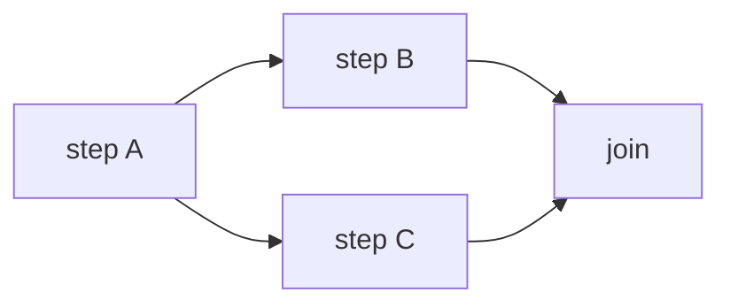

# Orchestration and Delegation — Junior

<!-- level-focus -->
At junior level, focus on this question:

> For two steps where one's output feeds the other, can you write the exact handoff contract — which fields cross the boundary — instead of just passing "everything so far" and hoping it works?

---

## A handoff is a contract, not a dump

- Every handoff between steps names the exact fields crossing the boundary: what goes in, what comes out.
- Passing the entire conversation history or entire raw record "just in case the next step needs it" is the default failure mode — it bloats context, adds cost, and hides which fields actually matter.
- Write the contract as a short list before wiring the steps together:
  - Step A output: `{order_id, customer_name, issue_summary}`
  - Step B input: same three fields, nothing else

## Sequential vs. parallel handoff

- **Sequential**: step B can't start until step A finishes, because B needs A's output. Most handoffs are this.
- **Parallel**: two steps don't depend on each other's output and can run at the same time, with a join step afterward that waits for both and combines results.

- Use parallel only when the steps are genuinely independent — if step C secretly needs something step B produces, it's sequential, and running it in parallel will read stale or missing data.

## The "context blob" antipattern

- Symptom: every step receives the full accumulated history of everything that happened so far, "to be safe."
- Cost: the model has to re-read growing irrelevant context on every step, and it becomes unclear which parts of that blob actually influenced the step's decision.
- Fix: each step gets exactly what its stated contract says it needs — if step B turns out to need something not in the contract, add that specific field, don't widen to "everything."

## Conditional branch as a lightweight handoff

- A step's output can include a field that decides which of several fixed next steps to run — this is routing (from Workflow Fundamentals), and it's still a contract: the branch field's possible values are enumerated in advance.
- Example: `{intent: "refund" | "billing" | "technical"}` — three known values, three known next steps.

## Common Mistakes

- **Passing the whole conversation instead of the named contract fields.** Makes it impossible to tell what a step actually depends on, and it costs more in tokens every step.
- **Running two steps in parallel that secretly depend on each other.** Produces a race condition where the result depends on which step happened to finish reading data first.
- **A branch field with no enumerated set of values.** If the routing field can be anything, downstream steps can't handle every case — enumerate the values and give every one a defined path.

## Apply It

1. Take two steps from a workflow you're building (or the support-ticket routing from Workflow Fundamentals). Write the exact handoff contract — named fields only.
2. Identify one place you're tempted to pass "everything so far," and write the specific fields that are actually needed instead.
3. Decide whether two steps in your workflow could run in parallel, and confirm neither secretly depends on the other's output.

## Verify Your Work

- Every handoff you've designed names specific fields, not "the conversation" or "the record."
- Any parallel steps are confirmed independent — you checked, not assumed.
- Any branch field has an enumerated, finite set of values with a defined path for each.

## Review Questions

- Why is a named field contract better than passing the full accumulated context?
- What distinguishes a handoff that's safe to parallelize from one that isn't?
- What makes a branch field a good routing contract, and what makes a bad one?
