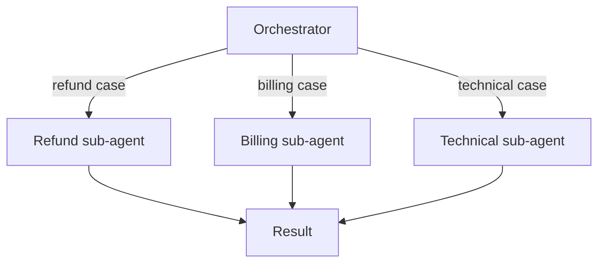

# Orchestration and Delegation — Middle

<!-- level-focus -->
At middle level, focus on this question:

> When a single agent's scope grows — more tools, more distinct domains of work — how do you decide whether to keep it as one agent or split it into an orchestrator with specialized sub-agents, and justify that against complexity, cost, and reliability, not preference?

---

## What breaks down as a single agent grows

- **Tool selection confusion**: past roughly a dozen tools covering unrelated domains, the model starts picking the wrong tool for a given task more often, because the tool list itself is ambiguous to choose from.
- **Prompt bloat**: instructions for every domain (refunds, billing, technical troubleshooting) stacked into one system prompt dilute the guidance for any single domain.
- **Unrelated failure coupling**: a bug in the technical-troubleshooting instructions can degrade billing-question handling too, because they share one prompt and one context.

## The orchestrator/sub-agent pattern

- One **orchestrator** step reads the incoming task and decides which specialist sub-agent(s) to invoke — this is the orchestrator-workers pattern from Workflow Fundamentals, applied specifically to full agents rather than simple steps.
- Each **sub-agent** has a narrow, well-defined scope: its own smaller tool list, its own focused instructions, its own domain.
- The orchestrator collects each sub-agent's result and either returns it directly or combines multiple results into one final answer.

## The real cost of splitting

- Every sub-agent boundary adds: a serialization/deserialization hop, latency (an extra model call), and a new place a handoff contract can be wrong.
- Splitting is not free — it trades single-agent prompt bloat for orchestration complexity. Both have a cost; the question is which cost is smaller for your specific scale of tools and domains.

## A decision rule, not a preference

| Signal | Points toward splitting | Points toward staying single |
|---|---|---|
| Number of tools | >10-15, spanning unrelated domains | Small list, related domains |
| Domain overlap | Domains rarely need each other's context | Domains constantly reference each other |
| Failure isolation needed | A bug in one domain shouldn't affect another | Domains are simple enough that shared failure risk is low |
| Team ownership | Different teams own different domains | One team owns everything |

- Don't split because "sub-agents feel more sophisticated" — split because a specific, named problem (tool confusion, prompt bloat, cross-team ownership) is actually occurring.

## Cross-Component Scenario: Expanding the Support Agent

The routed support workflow now needs a specialist for policy lookups (checking whether a stated refund reason matches an exception clause — the load-bearing model step from Workflow Fundamentals senior level).

1. Keep the top-level routing step as the orchestrator: it still decides billing vs. refund vs. technical.
2. Within the refund path, delegate the policy-matching sub-task to a **policy sub-agent** with its own narrow tool (search policy documents) and its own focused instructions — because that tool and that instruction set are genuinely unrelated to billing or technical handling.
3. The orchestrator passes only `{stated_reason, order_category}` to the sub-agent (the handoff contract from junior level) and receives back `{matches_policy: bool, matched_clause: str}`.

## Verification at two levels

- **Per sub-agent**: test it in isolation with its own narrow tool list and inputs — does it correctly answer its specific domain question?
- **At the orchestrator**: test that routing correctly dispatches to the right sub-agent for a range of inputs, and that the final combined answer is coherent even when a sub-agent's result is unexpected.

## Common Mistakes

- **Splitting before hitting an actual problem.** A single agent with 4 tools in one coherent domain doesn't need an orchestrator — the split adds latency and complexity for no measurable benefit.
- **Sub-agents that still share one giant tool list.** If every sub-agent can call every tool, you've added orchestration overhead without the tool-selection benefit that motivated the split.
- **No isolation testing.** Testing only the full multi-agent flow end-to-end makes it hard to tell whether a bug is in the orchestrator's routing or a specific sub-agent's logic.

## Apply It

1. List the tools and domains your current (or planned) agent handles. Run them through the decision-rule table.
2. If the table points toward splitting, draw the orchestrator/sub-agent diagram with narrow tool lists per sub-agent.
3. Write the handoff contract (named fields) between orchestrator and each sub-agent.
4. Write one isolation test per sub-agent and one routing test for the orchestrator.

## Verify Your Work

- The split decision cites a specific signal from the table (tool count, domain overlap, ownership) — not "it seemed cleaner."
- Each sub-agent's tool list is narrower than the original single agent's full list.
- Isolation tests exist for each sub-agent independent of the orchestrator.

## Review Questions

- What specifically breaks down as a single agent's tool list and domain scope grow?
- What's the actual cost of splitting into an orchestrator and sub-agents, and what does it trade against?
- Why should splitting be justified by a named signal, not a preference for "cleaner" architecture?
- Why test sub-agents in isolation in addition to testing the full orchestrated flow?
