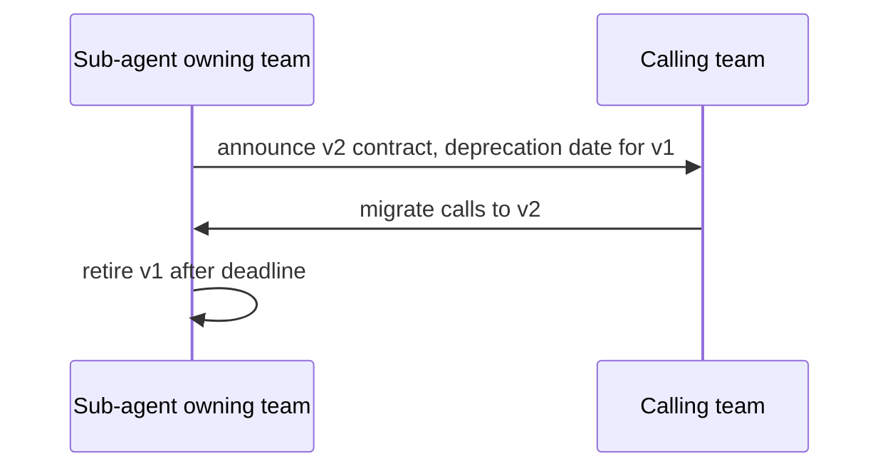

# Orchestration and Delegation — Professional

<!-- level-focus -->
At professional level, focus on this question:

> When sub-agents are owned by different teams, how do you run a rubric for when multi-agent orchestration is justified versus overengineering, and set up interface contracts and a deprecation process so teams can depend on each other's sub-agents without a central team brokering every change?

---

## A rubric for multi-agent, not a vibe

- Extend the middle-level decision-rule table with an org-wide bar: a new sub-agent boundary must name which specific problem (tool confusion, prompt bloat, cross-team ownership, failure isolation) it solves, reviewed the same way a new microservice boundary would be.
- The default answer to "should this be a new sub-agent" is no — the burden of proof is on the split, not on staying a single step or single agent, because every boundary is a maintenance and latency cost paid indefinitely.

## Cross-team contracts for shared sub-agents

- A sub-agent called by another team's workflow is an API: its input/output contract (from junior and senior levels) is documented, versioned, and changed under the same discipline as any other service contract.
- Breaking changes to a shared sub-agent's contract follow a deprecation window: announce the new contract version, run both versions in parallel, give calling teams a migration deadline, then retire the old version — never a silent breaking change that surfaces as another team's production incident.

## Ownership aligned to cognitive load

- The team that understands a sub-agent's domain deeply enough to maintain its prompt, tools, and failure modes should own it — not whichever team happened to build the orchestrator that calls it first.
- An orchestrator calling into another team's sub-agent should treat it as a black box with a contract, not something it reaches in and modifies directly.

## Shared scaffolding as a paved road

- Common orchestration mechanics — dispatch, context scoping, join/fan-in, delegation-depth capping (from senior level) — belong in a shared library every team's orchestrator uses, not reimplemented per team with subtly different bugs.
- The paved road should make correct fan-in behavior (explicit partial-completion handling) the default, not something each team has to remember to add.

## Rollout decomposition for a new sub-agent boundary

1. **Shadow**: run the proposed sub-agent split alongside the existing single-agent path; compare outputs without acting on the new path yet.
2. **Partial**: route a small percentage of real traffic through the new orchestrator/sub-agent split; keep the rollback path live.
3. **Full**: complete the migration once the shadow and partial stages show the split's outcome metrics meet or beat the single-agent baseline.

## Outcome measures and exit conditions

- Before splitting, define the metric that justifies keeping the split (e.g., reduced tool-selection error rate, reduced prompt-maintenance burden measured by review time) and the metric that would trigger reverting to a single agent (added latency without a matching reliability gain).
- Set a review date for every multi-agent boundary — team ownership, tool lists, and domain lines shift as the business changes, and a boundary that made sense a year ago may no longer.

## Cross-Team Contracts and Sustained Delivery

- Publish a registry of sub-agents available for other teams to call, each with its contract, owning team, and current version — the multi-agent equivalent of a service catalog.
- Require an owning team's sign-off before another team builds a new dependency on their sub-agent, so the owning team isn't surprised by call volume or usage patterns it didn't plan for.

## Common Mistakes

- **Splitting into sub-agents to mirror an org chart rather than an actual failure mode.** A sub-agent boundary that exists only because two teams happen to be separate, with no tool-confusion or prompt-bloat problem being solved, is pure overhead.
- **No contract versioning for a shared sub-agent.** A breaking prompt or tool-schema change to a sub-agent that other teams depend on, shipped without a deprecation window, turns an internal refactor into a cross-team incident.
- **No review date on multi-agent boundaries.** Org structure and domain lines change; a boundary drawn for a reason that no longer applies still costs latency and maintenance every day it stays in place.

## Real-World Examples

- **A shared fan-in library prevents a recurring partial-failure bug.** Multiple teams had each hand-rolled join-step logic with inconsistent partial-completion handling; a shared library with a single, well-tested partial-completion behavior eliminates a class of bug that had previously recurred independently across teams.
- **A deprecation window avoids a cross-team incident.** A team updating their policy sub-agent's output schema announces the change with a 6-week dual-run window; calling teams migrate on their own schedule within the window, and no downstream workflow breaks on the cutover date.

## Apply It

1. Write the rubric your org should apply before approving a new sub-agent boundary owned by a different team than the caller.
2. Design the contract-versioning and deprecation process for a sub-agent your team owns that other teams might call.
3. Write the outcome metric and exit condition for a multi-agent split you're considering, with a review date.
4. Identify one piece of orchestration mechanics (fan-in, context scoping, delegation-depth capping) that should move into shared scaffolding rather than being reimplemented per team.

## Verify Your Work

- The rubric requires naming a specific problem solved by the split, not organizational convenience.
- The contract has an explicit version, an owning team, and a stated deprecation process for breaking changes.
- The exit condition and review date are concrete (metric, threshold, date), not open-ended.
- At least one piece of cross-team orchestration mechanics is identified as a candidate for shared scaffolding.

## Review Questions

- Why should the default answer to "should this be a new sub-agent boundary" be no?
- What makes a sub-agent's contract equivalent to a service API contract, and what does that imply for change management?
- Why does ownership belong with the team that understands a sub-agent's domain, rather than whichever team built the calling orchestrator first?
- What risk does a missing review date create for a multi-agent boundary that made sense when it was drawn?
