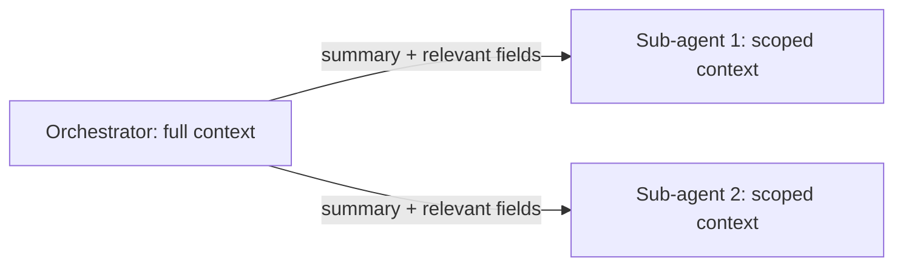

# Orchestration and Delegation — Senior

<!-- level-focus -->
At senior level, focus on this question:

> For a workflow with several sub-agents running in parallel, how do you keep each one's context from ballooning, and how do you resolve it when their results genuinely disagree?

---

## Context isolation per sub-agent

- Each sub-agent should receive only what its own task needs — not the full orchestrator context, and not the outputs of sibling sub-agents it doesn't depend on.
- Context isolation is the multi-agent version of the handoff contract from junior level: it bounds what crosses into a sub-agent's own context window, keeping that window small and relevant instead of growing with every hop through the orchestrator.
- Summarize at the boundary: if a sub-agent needs "what's happened so far" rather than one specific field, pass a short summary of the relevant history, not the raw accumulated log.

## Fan-out / fan-in with a join step

- Fan-out: the orchestrator dispatches the same or related work to multiple sub-agents in parallel (from Workflow Fundamentals' parallelization pattern, applied to full agents).
- Fan-in / join: an explicit step waits for all dispatched sub-agents to return, then combines their results — this join step is itself deterministic code whenever possible (see the determinism boundary from Workflow Fundamentals senior level), not another model call, unless combining genuinely requires judgment.
- The join step must have a defined behavior for partial completion: what happens if one of three sub-agents times out or fails while the other two succeed?

## Result aggregation and conflict resolution

- **Independent results (no conflict possible)**: e.g., one sub-agent checks policy, another checks inventory — their outputs answer different questions, so the join step just combines both into the final answer.
- **Overlapping results (conflict possible)**: e.g., two sub-agents both estimate whether a refund should be approved, and disagree. Define the resolution rule explicitly in advance:
  - Deterministic tie-break (e.g., the stricter answer wins for a risk-sensitive decision).
  - Escalate to a human when sub-agents disagree, rather than silently picking one.
  - Never resolve silently by picking whichever result arrived first — that's a race condition disguised as a decision.

## Loop and recursion limits in multi-agent graphs

- An orchestrator that can re-invoke a sub-agent (e.g., "policy sub-agent, try again with this new information") needs the same stopping conditions as a single-agent loop (from Workflow Fundamentals junior level) — a max re-invocation count and a cost budget, tracked per sub-agent and for the whole graph.
- Watch specifically for **circular delegation**: sub-agent A calls back into the orchestrator, which re-invokes sub-agent A with slightly different framing, forever. Cap the depth of the delegation chain explicitly, not just the iteration count within one agent.

## Cross-Component Scenario: Resolving a Disagreement

The refund workflow now fans out to two sub-agents at once: a **policy sub-agent** (does the stated reason match an exception clause?) and a **fraud-signal sub-agent** (does this order/customer pattern look anomalous?).

1. Both receive only the fields they need — the policy sub-agent gets `{stated_reason, order_category}`; the fraud sub-agent gets `{order_id, customer_history_summary}` — not each other's inputs or a shared blob.
2. Both run in parallel (independent — neither needs the other's output to start).
3. The join step combines results: policy says "matches," fraud says "anomalous" — this is a genuine conflict. The defined rule: any fraud-anomaly flag overrides a policy match and routes to a human review gate (see Reliability and Recovery), rather than the orchestrator guessing which sub-agent to trust.

## Common Mistakes

- **Passing the orchestrator's full context to every sub-agent "to be safe."** Defeats the purpose of isolation and reintroduces the context-blob problem at the multi-agent scale, where it's more expensive because it's duplicated across every sub-agent.
- **No defined behavior for partial fan-in completion.** If the join step just hangs or errors unpredictably when one of three sub-agents times out, the whole workflow is fragile against a single slow dependency.
- **Silent conflict resolution by call order.** Picking whichever sub-agent's result arrived first when they disagree is not a designed rule — it's a race condition, and it will pick differently on a re-run of the same input.
- **No cap on delegation depth.** A re-invocation loop between orchestrator and sub-agent can burn cost and time long past any single-agent iteration cap, because the cap was only ever set per-agent, not for the whole graph.

## Apply It

1. For a multi-sub-agent workflow you're designing, write the scoped context (named fields, not "everything") for each sub-agent.
2. Design the join step's behavior for the case where one of N dispatched sub-agents fails or times out.
3. Identify one place where two sub-agents' results could conflict, and write the explicit resolution rule (tie-break, escalate, or other) — not "we'll figure it out."
4. Set a cap on delegation depth for the whole graph, not just per-agent iteration count.

## Verify Your Work

- Every sub-agent's context is a stated, scoped list — not the full orchestrator context.
- The join step has an explicit, tested behavior for partial completion (not-all-sub-agents-returned).
- Any possible conflict between sub-agent results has a written resolution rule, and it isn't "first result wins."
- The whole graph has a delegation-depth cap, separate from any single agent's iteration cap.

## Review Questions

- Why does context isolation matter more, and cost more if ignored, at the multi-agent scale than within a single agent?
- What's the difference between independent and overlapping sub-agent results, and why does only one of them need a conflict-resolution rule?
- What specifically can go wrong if a join step has no defined behavior for partial completion?
- Why is "first result wins" not a real conflict-resolution rule?
