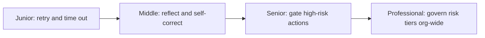

# Reliability and Recovery

> Every workflow will eventually fail a step, hit an ambiguous situation, or need to take an action too risky to run unsupervised. This subtopic is the discipline that turns those moments into handled cases instead of silent bugs.

## Levels

| Level | Guide | You are done when |
|---|---|---|
| Junior | [Retry and time out correctly](junior.md) | You can distinguish a retryable failure from a fatal one and set a basic timeout. |
| Middle | [Reflect and self-correct](middle.md) | You can add a reflection step that checks output against an objective signal, cap retries, and measure whether it helped. |
| Senior | [Gate high-risk actions](senior.md) | You can design a human-approval gate with explicit risk tiers, a timeout, and evidence-based autonomy widening. |
| Professional | [Govern risk tiers org-wide](professional.md) | You can define a shared risk-tier framework and a periodic review process across teams. |

## Practice rule

Before treating any failure as "just retry it," write down whether the failure is transient (the same input might succeed on a second try) or logical (retrying with the same input will fail identically). Retrying a logical failure just wastes time and cost.

## Related

- [Workflow Fundamentals](../workflow-fundamentals/) — the stopping conditions this subtopic extends with retry and gate logic.
- [State, Memory, and Durability](../state-memory-and-durability/) — the checkpoint and compensation mechanics a failed or gated step relies on.
- [Scaling Workflows](../scaling-workflows/) — circuit breakers and graceful degradation once failures happen at fleet volume.
