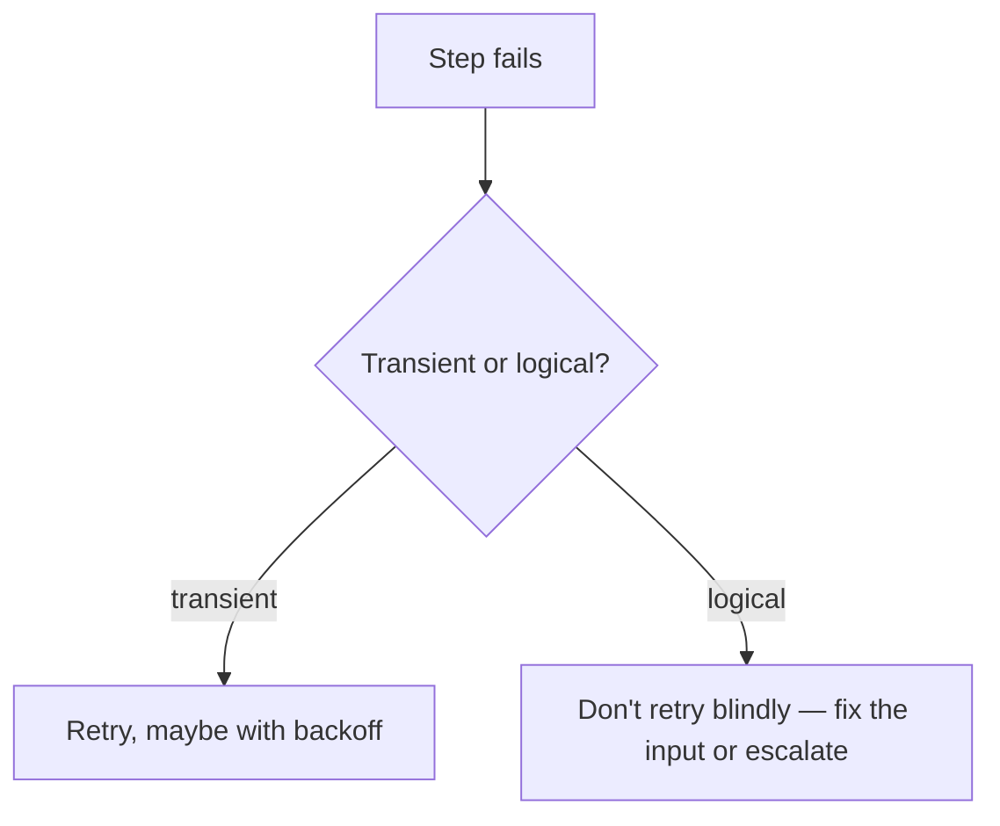

# Reliability and Recovery — Junior

<!-- level-focus -->
At junior level, focus on this question:

> When a step in your workflow fails, can you tell whether retrying is likely to help, set a timeout so a hung step doesn't block forever, and feed the failure back into the workflow as useful information instead of a silent crash?

---

## Transient vs. logical failure

- **Transient failure**: caused by something temporary — a network blip, a rate limit, a momentary service outage. The same input, retried a moment later, has a real chance of succeeding.
- **Logical failure**: caused by the input or the request itself being wrong — a malformed argument, a tool call to an order ID that doesn't exist, a policy violation. Retrying with the exact same input will fail identically every time.

- Rule: only retry transient failures automatically. A logical failure needs either a corrected input (e.g., re-derive the order ID) or an explicit escalation — retrying the identical call is wasted cost.

## Setting a basic timeout

- Every external call (a tool, a model call) needs a timeout — an explicit limit on how long the workflow waits before deciding the call has failed.
- Without a timeout, a hung call can block a step indefinitely, and the whole run appears "stuck" with no error to act on.
- Pick a timeout based on the call's normal latency plus margin (e.g., if a lookup normally takes 2 seconds, a 30-second timeout catches a genuine hang without being triggered by normal variance).

## Feeding a failure back into the loop

- A failed tool call should become a new observation for the next reasoning step (in an agent loop) or a defined branch (in a fixed chain) — not a silent exception that crashes the whole run.
- Example: `{tool: "look_up_order", error: "order_id not found", order_id: "4521"}` fed back lets the model or the next step decide to ask the customer to confirm the order number, rather than the workflow just dying.

## Common Mistakes

- **Retrying a logical failure with the identical input.** Wastes time and cost on a call that's guaranteed to fail the same way again.
- **No timeout on an external call.** A single hung dependency can block an entire run indefinitely with no visible error.
- **Letting a failure crash the run instead of feeding it back.** Throws away information the model or next step could have used to recover, and turns a recoverable situation into a hard failure.

## Apply It

1. List the external calls your workflow makes (tools, model calls). For each, decide whether a failure is more likely transient or logical, and write the retry policy for each case.
2. Set an explicit timeout for each external call, with the number written down (not "reasonable").
3. Write the exact observation/data a failed call should produce, and confirm the next step actually reads and reacts to it.

## Verify Your Work

- Every external call has a stated timeout with a specific number.
- Retry policy differs for transient vs. logical failures — logical failures are not blindly retried.
- A failed call produces a defined result that the workflow's next step can react to, rather than an unhandled crash.

## Review Questions

- What distinguishes a transient failure from a logical one, and why does that distinction change the retry decision?
- What happens to a workflow run if an external call has no timeout and hangs?
- Why does feeding a failure back as an observation matter more than just logging it and stopping?
